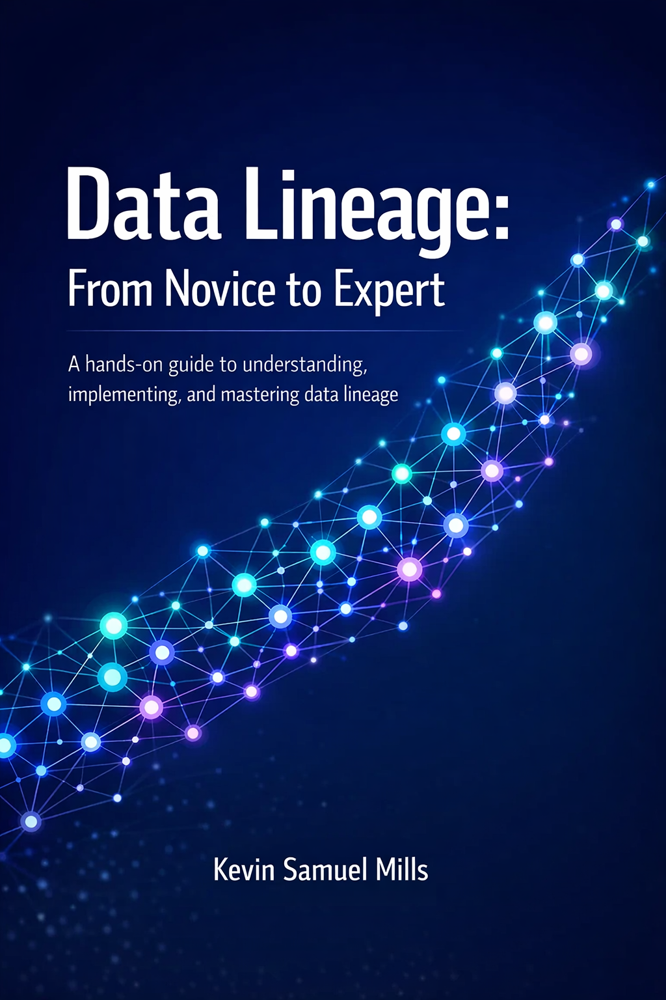

# Data Lineage: From Novice to Expert

A hands-on guide to understanding, implementing, and mastering data lineage — from foundational concepts through production-grade systems, governance, and AI.

---

## About This Book

This book is structured as a progressive learning path across **21 chapters** organized in six parts. It begins with first principles (what data lineage is, why it matters, and the metadata that underpins it) and builds toward expert-level topics like column-level lineage, graph databases, streaming pipelines, regulatory compliance, and lineage in AI/ML systems.

Each chapter includes explanatory text, architectural diagrams, and references to runnable Python exercises.

## Start Reading

**[📖 Read the Book — Table of Contents](index.md)**

## Exercises

All exercises live in the [`exercises/`](exercises/) directory with setup instructions in the [Exercises README](exercises/README.md). Each exercise file is self-contained with `# TODO:` markers where you write code and solution hints as comments.

## Prerequisites

- **Python 3.10+** (3.12 recommended)
- **Basic SQL** knowledge
- Familiarity with at least one data processing tool (Spark, Airflow, dbt, or similar)
- [**pixi**](https://pixi.sh) package manager (v0.20.0+) for environment management
- **Docker** for exercises requiring Marquez, Neo4j, or Kafka

## Book Structure

| Part | Chapters | Topics |
|------|----------|--------|
| **I — Foundations** | 1–4 | Definitions, metadata, data models, first lineage graph |
| **II — Open-Source Tooling** | 5–9 | OpenLineage, SQL parsing, Airflow, Spark, dbt |
| **III — Advanced Techniques** | 10–12 | Column-level lineage, graph databases, Lineage API |
| **IV — Governance & Quality** | 13–17 | Data quality, observability, streaming, compliance, data mesh |
| **V — AI & Data Lineage** | 18–19 | ML/MLOps lineage, GenAI & LLM lineage |
| **VI — Putting It All Together** | 20–21 | Lineage at scale, capstone project |

## License

- **Book content** (all `.md` files) is licensed under the [Creative Commons Attribution 4.0 International License (CC BY 4.0)](LICENSE).
- **Exercise code** (all files under `exercises/`) is licensed under the [MIT License](LICENSE-CODE).

You are free to share and adapt this material for any purpose, including commercially, as long as you give appropriate credit.