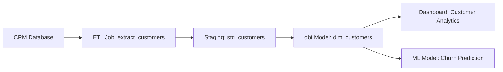
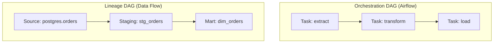
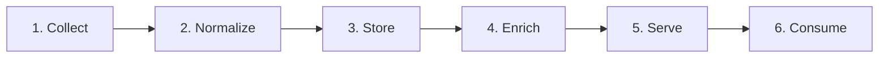

# Chapter 1: What Is Data Lineage?

[&larr; Back to Index](../index.md)

---

## Chapter Contents

- [1.1 Defining Data Lineage](#11-defining-data-lineage)
- [1.2 A Real-World Analogy: The Supply Chain](#12-a-real-world-analogy-the-supply-chain)
- [1.3 Why Data Lineage Matters](#13-why-data-lineage-matters)
- [1.4 Types of Data Lineage](#14-types-of-data-lineage)
- [1.5 Lineage vs. Related Concepts](#15-lineage-vs-related-concepts)
- [1.6 The Lineage Lifecycle](#16-the-lineage-lifecycle)
- [1.7 Who Uses Data Lineage?](#17-who-uses-data-lineage)
- [1.8 A Brief History of Data Lineage](#18-a-brief-history-of-data-lineage)
- [1.9 Summary](#19-summary)

---

## 1.1 Defining Data Lineage

**Data lineage** is the record of how data moves, transforms, and evolves as it flows through systems. It answers the fundamental questions:

- **Where did this data come from?** (provenance)
- **What happened to it along the way?** (transformations)
- **Where does it go next?** (downstream consumption)
- **Who or what touched it?** (ownership and accountability)

Think of data lineage as the "family tree" or "audit trail" of your data. Just as you can trace a person's ancestry through their family tree, data lineage lets you trace a specific data point from its origin through every transformation, join, filter, and aggregation to the final report, dashboard, or ML model that consumes it.

### Formal Definition

> **Data lineage** describes the life cycle of data: its origin, what happens to
> it over time, and where it moves within an organization's data ecosystem. It
> includes transformations applied to the data, the systems involved, and the
> relationships between datasets.

### What Lineage Looks Like

At its simplest, lineage is a **directed graph** where:

- **Nodes** represent data assets (tables, files, topics, models) and processing steps (ETL jobs, SQL queries, API calls)
- **Edges** represent the flow of data from one node to another

In this diagram, you can trace the Customer Analytics dashboard all the way back to the CRM Database. If the CRM schema changes, lineage tells you exactly what will break downstream.

---

## 1.2 A Real-World Analogy: The Supply Chain

The most intuitive way to understand data lineage is by comparing it to a physical **supply chain**.

| Supply Chain Concept | Data Lineage Equivalent |
|---------------------|------------------------|
| Raw materials (cotton, ore) | Source data (databases, APIs, files) |
| Factory / processing plant | ETL/ELT jobs, SQL transformations |
| Quality inspection checkpoint | Data quality tests, schema validation |
| Warehouse / distribution center | Data warehouse, data lake |
| Retail store / end customer | Dashboards, reports, ML models, APIs |
| Bill of materials (BOM) | Lineage graph |
| Lot number / batch tracking | Run-level lineage (specific execution) |
| FDA recall trace | Impact analysis |

Just as a food manufacturer needs to trace contaminated ingredients back to the farm (and forward to every product on store shelves), a data team needs to trace a data quality issue back to its source and forward to every downstream consumer.

### The Coffee Cup Example

Imagine you're holding a cup of coffee. Its "lineage" might look like:

1. **Origin**: Coffee beans grown in Colombia (raw data source)
2. **Transport**: Shipped to a roaster in Portland (data ingestion)
3. **Processing**: Roasted, ground, blended (data transformations)
4. **Quality Check**: Cupping test for flavor profile (data validation)
5. **Distribution**: Sent to a café (data warehouse)
6. **Final Form**: Brewed and served to you (dashboard / report)

If the coffee tastes off, you can trace back through the lineage to find where things went wrong. Was it the beans, the roasting process, or the brewing?

---

## 1.3 Why Data Lineage Matters

Data lineage is not just a nice-to-have. It is a critical capability for modern data organizations. Here's why:

### 1.3.1 Impact Analysis

> "If I change this table's schema, what breaks?"

Impact analysis is the **#1 use case** for data lineage. Before modifying a source system, migrating a database, or deprecating a table, you must understand every downstream dependency. Without lineage, this is guesswork.

**Example**: You need to rename a column `customer_id` to `cust_id` in a source table. Lineage reveals that:

- 3 ETL jobs read this column
- 7 dbt models reference it
- 2 dashboards display it
- 1 ML feature pipeline depends on it

Now you can plan the migration, notify owners, and update consumers in the right order.

### 1.3.2 Root Cause Analysis

> "Why does this dashboard show wrong numbers?"

When data looks wrong in a report, lineage lets you trace **upstream** through every transformation to identify where the problem was introduced. Instead of searching through hundreds of jobs and tables, you follow the graph directly to the root cause.

### 1.3.3 Trust and Transparency

Data consumers (analysts, executives, data scientists) need to **trust** the data they're using. Lineage provides transparency into:

- What source systems feed the data
- What transformations were applied
- How fresh the data is
- Who owns and maintains each component

### 1.3.4 Regulatory Compliance

Regulations like **GDPR**, **CCPA**, **SOX**, and **HIPAA** require organizations to:

- Know where personal data is stored (data mapping)
- Prove how data flows through systems (audit trails)
- Demonstrate that data hasn't been tampered with (integrity)
- Delete personal data upon request across all systems (right to erasure)

Lineage makes compliance demonstrable rather than aspirational. We cover this in depth in [Chapter 16](16-compliance-governance-privacy.md).

### 1.3.5 Data Quality Propagation

Once you know the lineage graph, you can propagate quality signals through it. If an upstream source fails a quality check, you can automatically flag or pause all downstream consumers. This is explored in [Chapter 13](13-data-quality-lineage.md).

### 1.3.6 Migration and Modernization

When migrating from legacy systems to cloud platforms, lineage answers several questions:

- What data actually flows from the old system
- Which downstream processes depend on it
- The order in which things should be migrated
- What can be safely decommissioned

### 1.3.7 Cost Optimization

Lineage reveals unused or redundant data pipelines. If a table has no downstream consumers, you may be able to stop producing it, saving compute, storage, and maintenance effort.

---

## 1.4 Types of Data Lineage

Not all lineage is created equal. Understanding the different dimensions helps you choose the right approach for your needs.

### By Granularity

| Level | What It Tracks | Example |
|-------|---------------|---------|
| **System-level** | Data flow between systems | "Salesforce → Snowflake → Tableau" |
| **Table-level** | Data flow between tables/datasets | "raw.orders → stg_orders → dim_orders" |
| **Column-level** | Data flow between specific fields | "orders.total_price → dim_orders.revenue" |
| **Row-level** | Which specific rows contributed | "Row 42 in source → Row 17 in target" |
| **Cell-level** | Individual value provenance | "This specific $500 came from invoice #1234" |

Most organizations operate at **table-level** lineage and aspire to **column-level**. Row-level and cell-level are rare and typically only used in auditing or highly regulated environments. Column-level lineage is the focus of [Chapter 10](10-column-level-lineage.md).

### By Collection Method

| Method | Description | Pros | Cons |
|--------|-------------|------|------|
| **Design-time (static)** | Parsed from code, SQL, configs | No runtime overhead, works before deployment | May miss dynamic SQL, runtime logic |
| **Runtime (dynamic)** | Captured during actual execution | Accurate: records what actually happened | Adds overhead, only captures what runs |
| **Manual** | Curated by humans in a catalog | Can capture business context | Doesn't scale, quickly stale |
| **Hybrid** | Combination of static + runtime | Best coverage | More complex to implement |

### By Direction

- **Forward lineage** (downstream): "Where does this data go?" Used for impact analysis.
- **Backward lineage** (upstream): "Where did this data come from?" Used for root cause analysis.
- **End-to-end lineage**: Complete picture from source to consumer in both directions.

### By Temporality

- **Current-state lineage**: The graph as it exists now, showing which jobs and tables exist today.
- **Historical lineage**: How the graph looked at a point in the past, useful for auditing.
- **Run-level lineage**: Lineage for a specific execution. For example: "What happened in yesterday's 2 AM batch?"

---

## 1.5 Lineage vs. Related Concepts

Data lineage is often confused with several adjacent concepts. Understanding the boundaries helps clarify what lineage is and what it isn't.

### Lineage vs. Data Provenance

**Data provenance** is the broader concept of data's origin and history. Lineage is a specific aspect of provenance focused on **movement and transformation**. Provenance may also include who created the data, why it was created, and how reliable it is.

> *All lineage is provenance, but not all provenance is lineage.*

### Lineage vs. Data Catalog

A **data catalog** is an inventory of data assets with search and discovery capabilities. Lineage is one dimension of catalog metadata, but a catalog also includes:

- Business descriptions and glossaries
- Ownership and stewardship information
- Tags, classifications, and access policies
- Usage statistics and popularity

Lineage enriches a catalog by showing how assets are connected. A catalog without lineage is a phone book; a catalog with lineage is a map.

### Lineage vs. Data Pipeline Orchestration

**Orchestration tools** (Airflow, Dagster, Prefect) manage the execution order of data tasks. They define the **operational DAG**, which determines which jobs run before which other jobs. Lineage captures the **data DAG**, which tracks which datasets flow into which other datasets.

These often overlap but are not the same:

A single orchestration task may read from 5 tables and write to 3, so the lineage is richer than the task dependency graph.

### Lineage vs. Version Control

**Version control** (Git) tracks changes to *code over time*. Lineage tracks the flow of *data across systems*. They complement each other: Git tells you who changed the transformation logic, and lineage tells you which data was affected by that change.

---

## 1.6 The Lineage Lifecycle

Data lineage itself has a lifecycle: it needs to be collected, stored, maintained, and consumed. Here is the typical flow:

### Step 1: Collect

Lineage events are captured from various sources:

- **Orchestrators**: Airflow, Dagster, Prefect emit lineage events
- **Query engines**: Spark, Trino, BigQuery expose query plans
- **Transformation tools**: dbt, Dataform export dependency graphs
- **SQL parsers**: Static analysis extracts lineage from SQL code
- **Custom instrumentation**: Your own code emits lineage events via APIs

### Step 2: Normalize

Different sources produce lineage in different formats. Normalization maps them to a common model (for example, the OpenLineage standard; see [Chapter 5](05-openlineage-standard.md)).

### Step 3: Store

Normalized lineage is stored in a backend:

- **Graph databases** (Neo4j, Neptune) for native graph traversal
- **Relational databases** with adjacency lists or recursive CTEs
- **Purpose-built lineage servers** (Marquez, DataHub, OpenMetadata)

### Step 4: Enrich

Raw lineage is enriched with additional metadata:

- Business descriptions from data catalogs
- Data quality scores from testing frameworks
- Ownership and contact information
- Classification tags (PII, sensitive, public)

### Step 5: Serve

Lineage is exposed via APIs and UIs for consumption:

- REST/GraphQL APIs for programmatic access
- Visual graph explorers for interactive navigation
- Embedded panels in existing tools (catalog, BI tool)

### Step 6: Consume

End users consume lineage for their specific needs:

- **Engineers**: Impact analysis before making changes
- **Analysts**: Understanding data sources for their reports
- **Compliance**: Generating audit documentation
- **Platform**: Automating quality gates and alerts

---

## 1.7 Who Uses Data Lineage?

Data lineage has different value propositions for different personas:

| Persona | Key Question | Lineage Use |
|---------|-------------|-------------|
| **Data Engineer** | "What will break if I change this?" | Impact analysis, migration planning |
| **Analytics Engineer** | "Where does this metric come from?" | Source tracing, validation |
| **Data Analyst** | "Can I trust this number?" | Provenance, freshness checks |
| **Data Scientist** | "What data feeds my model?" | Feature lineage, reproducibility |
| **Data Product Manager** | "Who uses this dataset?" | Usage understanding, deprecation planning |
| **Compliance Officer** | "Where does PII flow?" | Data mapping, audit trails |
| **Executive / CDO** | "What's the state of our data ecosystem?" | Governance dashboards, risk assessment |
| **Platform Engineer** | "How do I automate lineage collection?" | Instrumentation, integration |

---

## 1.8 A Brief History of Data Lineage

Understanding how lineage evolved helps contextualize where we are today.

### The Pre-History: Manual Documentation (1990s–2000s)

In the early days of data warehousing, "lineage" meant:

- Spreadsheets documenting source-to-target mappings
- Informatica or DataStage mapping specifications
- Tribal knowledge held by senior ETL developers
- Visio diagrams that were outdated within weeks

This approach was manual, fragile, and impossible to maintain at scale.

### The Catalog Era (2010s)

Data catalogs (Alation, Collibra, Apache Atlas) introduced **automated lineage** as a feature:

- SQL log parsing for query-level lineage
- ETL tool integrations for job-level lineage
- Visual lineage graphs in catalog UIs
- Still largely vendor-specific and siloed

### The Open Standard Era (2020s)

The emergence of **OpenLineage** (2021) marked a turning point:

- A vendor-neutral, open standard for lineage events
- Ecosystem of integrations (Airflow, Spark, dbt, Flink)
- Separation of lineage *collection* from lineage *storage*
- Rise of composable data platforms where lineage flows across tools

### The AI-Driven Era (2024+)

The latest evolution ties lineage to AI/ML:

- **ML lineage**: Tracking data from source → features → model → predictions
- **GenAI lineage**: Tracing documents → embeddings → retrieval → generation
- **Automated lineage enrichment**: Using LLMs to generate descriptions from lineage graphs
- **Lineage as a service**: Cloud-native lineage infrastructure

We explore the AI dimension in [Chapter 18](18-ml-lineage.md) and [Chapter 19](19-genai-llm-lineage.md).

---

## 1.9 Summary

In this chapter, you learned:

- **Data lineage** records how data moves, transforms, and evolves across systems
- It is analogous to a physical supply chain, tracking materials from source to consumer
- The primary use cases are **impact analysis**, **root cause analysis**, **compliance**, and **trust**
- Lineage varies by **granularity** (table vs. column vs. row), **collection method** (static vs. runtime), and **direction** (forward vs. backward)
- Lineage is distinct from (but complementary to) data catalogs, orchestration, and version control
- The lineage lifecycle spans collection, normalization, storage, enrichment, serving, and consumption
- The field has evolved from manual spreadsheets to open standards like OpenLineage

### Key Takeaway

> Data lineage is not optional for modern data teams. It's the foundational
> capability that enables impact analysis, root cause debugging, regulatory
> compliance, and data trust. Without it, you're flying blind.

---

### What's Next

[Chapter 2: Metadata Fundamentals](02-metadata-fundamentals.md) examines the metadata that underpins lineage, covering the different types of metadata, standards like Dublin Core and OpenLineage, and how to inspect metadata programmatically with Python.

---

[&larr; Back to Index](../index.md) | [Next: Chapter 2 &rarr;](02-metadata-fundamentals.md)
