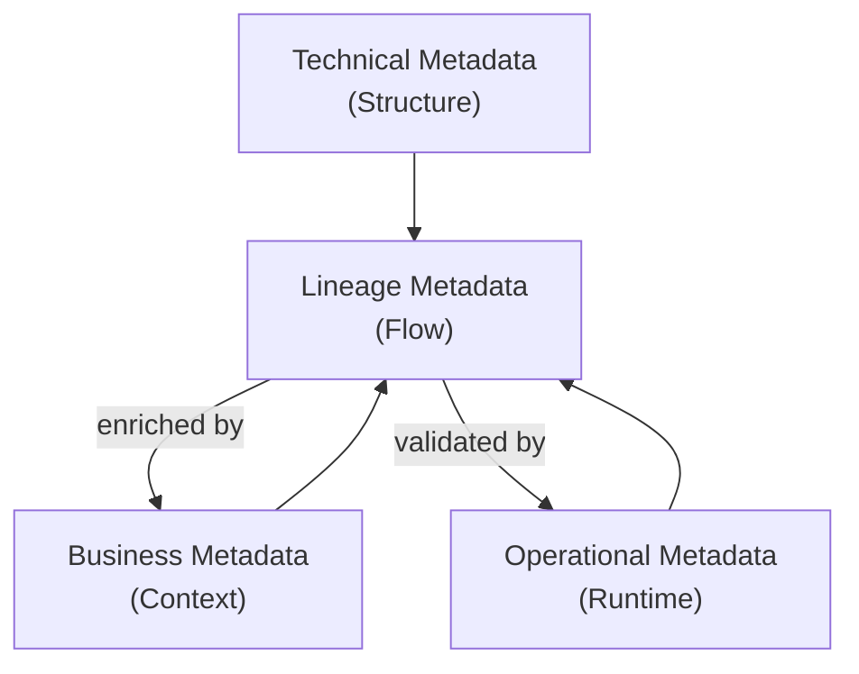
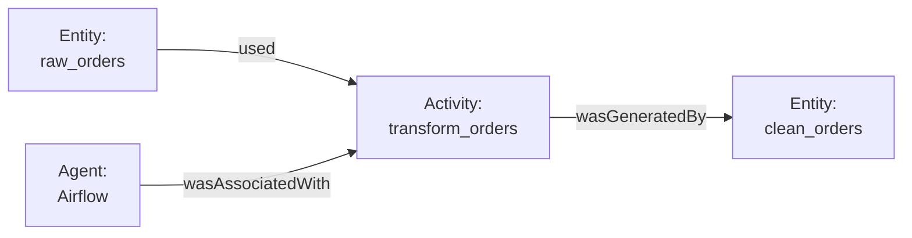
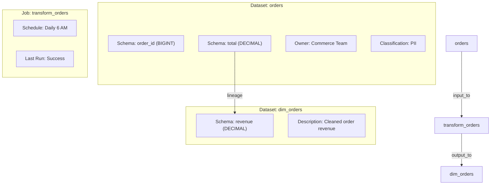
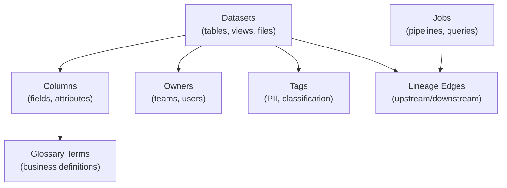

# Chapter 2: Metadata Fundamentals

[&larr; Back to Index](../index.md) | [Previous: Chapter 1](01-what-is-data-lineage.md)

---

## Chapter Contents

- [2.1 What Is Metadata?](#21-what-is-metadata)
- [2.2 Types of Metadata](#22-types-of-metadata)
- [2.3 Metadata Standards](#23-metadata-standards)
- [2.4 The Relationship Between Metadata and Lineage](#24-the-relationship-between-metadata-and-lineage)
- [2.5 Metadata in the Wild: File Formats](#25-metadata-in-the-wild-file-formats)
- [2.6 Metadata in Databases](#26-metadata-in-databases)
- [2.7 Metadata Catalogs and Repositories](#27-metadata-catalogs-and-repositories)
- [2.8 Hands-On: Inspecting Metadata with Python](#28-hands-on-inspecting-metadata-with-python)
- [2.9 Metadata Quality and Governance](#29-metadata-quality-and-governance)
- [2.10 Summary](#210-summary)

---

## 2.1 What Is Metadata?

**Metadata** is data about data. While this definition is concise, it undersells the concept. Metadata is the context that makes data understandable, discoverable, and trustworthy.

Consider a CSV file sitting on a shared drive. The raw bytes are data. But to make it useful, you need to know:

- **What** does each column mean? (schema, descriptions)
- **When** was it last updated? (freshness)
- **Where** did it come from? (provenance)
- **Who** created or owns it? (stewardship)
- **How** was it produced? (transformation logic)
- **Why** does it exist? (business purpose)

All of those answers are metadata. And data lineage is one specific type of metadata, specifically the kind that answers "where" and "how."

### The Metadata Iceberg

Most organizations vastly underestimate the volume and importance of metadata:

```
                    ┌─────────────────┐
                    │   Visible Data  │  ← What users see in dashboards
                    │   (the report)  │
                ┌───┴─────────────────┴───┐
                │    Schema Metadata      │  ← Column names, types, constraints
            ┌───┴─────────────────────────┴───┐
            │   Operational Metadata          │  ← Load times, row counts, job status
        ┌───┴─────────────────────────────────┴───┐
        │     Lineage Metadata                    │  ← How data flowed and transformed
    ┌───┴─────────────────────────────────────────┴───┐
    │       Business Metadata                         │  ← Definitions, owners, policies
┌───┴─────────────────────────────────────────────────┴───┐
│         Social / Usage Metadata                         │  ← Who queries it, popularity
└─────────────────────────────────────────────────────────┘
```

---

## 2.2 Types of Metadata

Metadata is typically categorized into three major families:

### 2.2.1 Technical Metadata

Technical metadata describes the **structure and mechanics** of data:

| Category | Examples |
|----------|---------|
| **Schema** | Column names, data types, nullable flags, primary keys |
| **Storage** | File format (Parquet, CSV, JSON), compression, partitioning |
| **System** | Database engine, table DDL, indexes, views |
| **Connectivity** | Connection strings, API endpoints, authentication methods |
| **Statistics** | Row count, data distribution, min/max values, null percentages |

Technical metadata is typically **machine-generated** and automatable.

```python
# Example: Technical metadata for a database table
technical_metadata = {
    "table_name": "orders",
    "schema": "public",
    "database": "analytics",
    "columns": [
        {"name": "order_id",    "type": "BIGINT",    "nullable": False, "primary_key": True},
        {"name": "customer_id", "type": "BIGINT",    "nullable": False},
        {"name": "total",       "type": "DECIMAL",   "nullable": True},
        {"name": "created_at",  "type": "TIMESTAMP", "nullable": False},
    ],
    "row_count": 1_250_000,
    "size_bytes": 450_000_000,
    "engine": "PostgreSQL 16",
}
```

### 2.2.2 Business Metadata

Business metadata provides **human-readable context** that makes data meaningful:

| Category | Examples |
|----------|---------|
| **Descriptions** | "This table contains all customer orders since 2020" |
| **Glossary terms** | "Revenue = total - discounts - refunds" |
| **Ownership** | "Owned by the Commerce Data team (commerce-data@company.com)" |
| **Classification** | "Contains PII (customer email, phone number)" |
| **Data quality SLAs** | "Updated daily by 6 AM UTC; 99.5% freshness target" |
| **Business rules** | "Orders with status='cancelled' are excluded from revenue" |

Business metadata is typically **human-curated** and maintained in data catalogs.

```python
# Example: Business metadata for the same table
business_metadata = {
    "table_name": "orders",
    "description": "All customer orders placed through web and mobile channels since Jan 2020.",
    "owner": "Commerce Data Team",
    "owner_email": "commerce-data@company.com",
    "domain": "Commerce",
    "classification": ["PII", "Financial"],
    "glossary_terms": {
        "total": "Gross order value including tax, before discounts and refunds",
        "customer_id": "Foreign key to dim_customers.customer_id",
    },
    "sla": {
        "freshness": "Updated daily by 06:00 UTC",
        "completeness": "Null rate for total < 0.1%",
    },
}
```

### 2.2.3 Operational Metadata

Operational metadata describes **what happened at runtime**: the execution history of data processes:

| Category | Examples |
|----------|---------|
| **Job execution** | Start time, end time, duration, status (success/fail) |
| **Data movement** | Rows read, rows written, bytes transferred |
| **Error logs** | Stack traces, failed record counts, retry attempts |
| **Freshness** | Last successful update timestamp |
| **Resource usage** | CPU, memory, Spark executors, cost |
| **Lineage events** | Which inputs were read, which outputs were written, for a specific run |

Operational metadata is **machine-generated at runtime** and forms the basis of data observability (see [Chapter 14](14-data-observability.md)).

```python
# Example: Operational metadata for an ETL job run
operational_metadata = {
    "job_name": "load_orders",
    "run_id": "run-2025-03-14-060000",
    "status": "SUCCESS",
    "started_at": "2025-03-14T06:00:00Z",
    "ended_at": "2025-03-14T06:12:34Z",
    "duration_seconds": 754,
    "inputs": [
        {"dataset": "postgres.public.orders", "rows_read": 15_420},
    ],
    "outputs": [
        {"dataset": "snowflake.raw.orders", "rows_written": 15_420},
    ],
    "metrics": {
        "bytes_transferred": 12_500_000,
        "peak_memory_mb": 2048,
    },
}
```

### How the Three Types Relate



Lineage is the **connective tissue** that ties all three types together. Technical metadata tells you what the schema looks like. Business metadata tells you what it means. Operational metadata tells you what happened. Lineage tells you how they all connect.

---

## 2.3 Metadata Standards

Several standards exist for structuring and exchanging metadata. Understanding them provides vocabulary and interoperability.

### 2.3.1 Dublin Core

The [Dublin Core Metadata Initiative](https://www.dublincore.org/) defines 15 core properties for describing any resource:

| Element | Lineage Relevance |
|---------|------------------|
| `dc:title` | Dataset or table name |
| `dc:creator` | Data producer or pipeline owner |
| `dc:date` | Last updated timestamp |
| `dc:source` | Upstream data source |
| `dc:format` | File format (Parquet, CSV, JSON) |
| `dc:relation` | Related datasets (lineage edges) |

Dublin Core is generic but foundational; many domain-specific standards build on it.

### 2.3.2 ISO 11179: Metadata Registries

ISO 11179 provides a framework for describing **data elements** in a registry:

- **Conceptual domain**: Abstract meaning (e.g., "currency amount")
- **Value domain**: Allowed values (e.g., "decimal with 2 decimal places")
- **Data element**: A specific column binding concept to value (e.g., `order_total`)

This standard is especially relevant for data governance and glossary management.

### 2.3.3 W3C PROV: Provenance

The [W3C PROV](https://www.w3.org/TR/prov-overview/) family of specifications defines a generic provenance model:

- **Entity**: A thing that was produced (a dataset)
- **Activity**: Something that happened (an ETL job)
- **Agent**: Someone/something responsible (a user, a system)
- **Relations**: `wasGeneratedBy`, `used`, `wasAssociatedWith`, `wasDerivedFrom`



The W3C PROV model is the conceptual ancestor of modern lineage systems like OpenLineage.

### 2.3.4 OpenLineage

[OpenLineage](https://openlineage.io) is the modern, purpose-built standard for data lineage. It extends the W3C PROV concepts with data-specific primitives:

- **Job**: A process that transforms data (maps to PROV Activity)
- **Dataset**: An input or output (maps to PROV Entity)
- **Run**: A specific execution of a Job
- **Facets**: Extensible metadata attached to Jobs, Datasets, and Runs

We explore OpenLineage in detail in [Chapter 5](05-openlineage-standard.md).

### 2.3.5 Schema.org and DCAT

- **Schema.org**: Vocabulary for structured data on the web; includes `Dataset`, `DataCatalog`, and `DataDownload` types
- **DCAT (Data Catalog Vocabulary)**: W3C standard for describing catalogs and datasets, widely used in open data portals

These are less focused on lineage but important for data discovery and interoperability.

---

## 2.4 The Relationship Between Metadata and Lineage

Metadata and lineage have a symbiotic relationship:

### Lineage IS Metadata

Lineage is a specific type of metadata. It describes relationships and data flow between assets. When you say "table A feeds into table B via job C," that's lineage metadata.

### Lineage NEEDS Metadata

To be useful, lineage must be enriched with other metadata:

- **Schema metadata** tells you what columns exist in each dataset
- **Business metadata** tells you what those datasets mean
- **Operational metadata** tells you when the lineage was last exercised

### Lineage ENABLES Metadata

Lineage makes other metadata more powerful:

- **Schema change propagation**: Lineage shows which downstream schemas are affected
- **Business context inheritance**: A table can inherit descriptions from its upstream source
- **Quality signal propagation**: If an upstream source fails a quality check, lineage identifies what to flag downstream

### The Metadata Graph

When you combine all types of metadata with lineage, you get a rich **metadata graph**:



This metadata graph is the foundation of modern data platforms.

---

## 2.5 Metadata in the Wild: File Formats

Different file formats carry different amounts of embedded metadata. Understanding this helps you appreciate what lineage systems can automatically extract.

### CSV (Comma-Separated Values)

CSV is metadata-poor:

- Column names only if there's a header row
- No data types: everything is a string
- No schema evolution support
- No embedded statistics

```csv
order_id,customer_id,total,created_at
1001,42,99.99,2025-03-14T10:00:00Z
1002,17,149.50,2025-03-14T10:05:00Z
```

### JSON / JSONL

JSON carries structure but limited metadata:

- Implicit types (string, number, boolean, null, array, object)
- No schema enforcement (keys can vary between records)
- Self-describing but verbose

```json
{
  "order_id": 1001,
  "customer_id": 42,
  "total": 99.99,
  "created_at": "2025-03-14T10:00:00Z"
}
```

### Apache Parquet

Parquet is **metadata-rich**:

- Full schema with data types, nullability, and nesting
- Column-level statistics (min, max, null count, distinct count)
- Row group metadata for predicate pushdown
- Key-value metadata for custom annotations
- Created-by information (which tool wrote it)

```python
import pyarrow.parquet as pq

# Read Parquet metadata without reading the data
metadata = pq.read_metadata("orders.parquet")
print(f"Rows: {metadata.num_rows}")
print(f"Row groups: {metadata.num_row_groups}")
print(f"Columns: {metadata.num_columns}")
print(f"Created by: {metadata.created_by}")
print(f"Schema:\n{metadata.schema}")
```

### Apache Avro

Avro includes its schema in every file:

- JSON-based schema definition
- Schema evolution with compatibility modes (backward, forward, full)
- Reader/writer schema resolution
- Often used with schema registries (e.g., Confluent Schema Registry)

### Apache Iceberg / Delta Lake / Hudi

Modern table formats are **metadata-first**:

- Full schema with evolution history
- Partition specs and statistics
- Snapshot history (time travel)
- **Manifest files that effectively record lineage**: which files were added/removed by which operation

```python
# Iceberg metadata example (conceptual)
iceberg_metadata = {
    "format-version": 2,
    "table-uuid": "abc123",
    "schema": {...},
    "current-snapshot-id": 42,
    "snapshots": [
        {
            "snapshot-id": 42,
            "timestamp-ms": 1710403200000,
            "operation": "append",
            "summary": {
                "added-data-files": "3",
                "added-records": "15420",
            },
        }
    ],
}
```

---

## 2.6 Metadata in Databases

Relational databases provide rich metadata through their **information schema** and **system catalogs**.

### INFORMATION_SCHEMA (SQL Standard)

Every SQL-compliant database exposes metadata through standardized views:

```sql
-- List all tables in a schema
SELECT table_name, table_type
FROM information_schema.tables
WHERE table_schema = 'public';

-- Get column details for a specific table
SELECT column_name, data_type, is_nullable, column_default
FROM information_schema.columns
WHERE table_name = 'orders'
ORDER BY ordinal_position;

-- Find foreign key relationships (a form of structural lineage)
SELECT
    tc.table_name AS source_table,
    kcu.column_name AS source_column,
    ccu.table_name AS target_table,
    ccu.column_name AS target_column
FROM information_schema.table_constraints tc
JOIN information_schema.key_column_usage kcu
    ON tc.constraint_name = kcu.constraint_name
JOIN information_schema.constraint_column_usage ccu
    ON tc.constraint_name = ccu.constraint_name
WHERE tc.constraint_type = 'FOREIGN KEY';
```

### System Catalogs (Database-Specific)

Each database has its own system catalog with deeper metadata:

- **PostgreSQL**: `pg_catalog` tables (`pg_stat_user_tables`, `pg_stat_activity`)
- **Snowflake**: `ACCOUNT_USAGE` schema (query history, access history)
- **BigQuery**: `INFORMATION_SCHEMA.JOBS`, `INFORMATION_SCHEMA.COLUMN_FIELD_PATHS`
- **Databricks**: Unity Catalog with built-in lineage tracking

### Query Logs as Lineage Sources

Database query logs are a rich (if noisy) source of lineage information:

```sql
-- PostgreSQL: recent queries from pg_stat_statements
SELECT query, calls, total_exec_time
FROM pg_stat_statements
WHERE query LIKE '%INSERT INTO%'
ORDER BY total_exec_time DESC
LIMIT 10;

-- Snowflake: query history with table access
SELECT query_text, start_time, tables_accessed
FROM snowflake.account_usage.query_history
WHERE start_time > DATEADD(day, -1, CURRENT_TIMESTAMP())
AND query_type = 'INSERT';
```

Parsing these logs to extract lineage is exactly what tools like SQLLineage do (see [Chapter 6](06-sql-lineage-parsing.md)).

---

## 2.7 Metadata Catalogs and Repositories

Metadata catalogs aggregate metadata from across the data ecosystem into a searchable, browsable repository.

### Open-Source Catalogs

| Tool | Description | Lineage Support |
|------|-------------|-----------------|
| **Apache Atlas** | Hadoop ecosystem catalog | Built-in lineage graph |
| **DataHub** | LinkedIn's metadata platform | Rich lineage via ingestion |
| **OpenMetadata** | Modern open-source catalog | Native lineage + OpenLineage integration |
| **Marquez** | OpenLineage reference server | Lineage-first design |
| **Amundsen** | Lyft's data discovery tool | Basic lineage |

### Commercial Catalogs

| Tool | Notable Lineage Features |
|------|-------------------------|
| **Alation** | Automated SQL lineage parsing |
| **Collibra** | Governance-focused with lineage |
| **Atlan** | Active metadata with lineage |
| **Monte Carlo** | Observability + lineage |

### What Catalogs Store

A metadata catalog typically stores and relates:



---

## 2.8 Hands-On: Inspecting Metadata with Python

Let's get practical. In this section, we'll inspect metadata from common data formats using Python.

> **Exercise**: See [`exercises/ch04_first_graph.py`](../exercises/ch04_first_graph.py) for the full hands-on exercise. The snippets below illustrate key concepts.

### Inspecting CSV Metadata

```python
import csv
from pathlib import Path

def inspect_csv(filepath: str) -> dict:
    """Extract whatever metadata we can from a CSV file."""
    path = Path(filepath)
    with open(path) as f:
        reader = csv.reader(f)
        header = next(reader)
        row_count = sum(1 for _ in reader)

    stat = path.stat()
    return {
        "filename": path.name,
        "size_bytes": stat.st_size,
        "modified_at": stat.st_mtime,
        "columns": header,
        "row_count": row_count,
        # Note: No data types: CSV doesn't carry them
    }
```

### Inspecting Parquet Metadata

```python
import pyarrow.parquet as pq

def inspect_parquet(filepath: str) -> dict:
    """Extract rich metadata from a Parquet file."""
    pf = pq.ParquetFile(filepath)
    metadata = pf.metadata
    schema = pf.schema_arrow

    columns = []
    for i in range(schema.__len__()):
        field = schema.field(i)
        columns.append({
            "name": field.name,
            "type": str(field.type),
            "nullable": field.nullable,
        })

    # Column-level statistics from row groups
    stats = {}
    for col_idx in range(metadata.num_columns):
        rg = metadata.row_group(0)
        col = rg.column(col_idx)
        if col.statistics:
            stats[col.path_in_schema] = {
                "min": col.statistics.min,
                "max": col.statistics.max,
                "null_count": col.statistics.null_count,
                "num_values": col.statistics.num_values,
            }

    return {
        "num_rows": metadata.num_rows,
        "num_row_groups": metadata.num_row_groups,
        "created_by": metadata.created_by,
        "columns": columns,
        "column_statistics": stats,
        "key_value_metadata": metadata.metadata,
    }
```

### Inspecting Database Metadata via SQLAlchemy

```python
from sqlalchemy import create_engine, inspect

def inspect_database(connection_url: str, table_name: str) -> dict:
    """Extract metadata from a database table using SQLAlchemy's inspector."""
    engine = create_engine(connection_url)
    inspector = inspect(engine)

    columns = inspector.get_columns(table_name)
    pk = inspector.get_pk_constraint(table_name)
    fks = inspector.get_foreign_keys(table_name)
    indexes = inspector.get_indexes(table_name)

    return {
        "table_name": table_name,
        "columns": [
            {
                "name": col["name"],
                "type": str(col["type"]),
                "nullable": col["nullable"],
                "default": col.get("default"),
            }
            for col in columns
        ],
        "primary_key": pk,
        "foreign_keys": [
            {
                "constrained_columns": fk["constrained_columns"],
                "referred_table": fk["referred_table"],
                "referred_columns": fk["referred_columns"],
            }
            for fk in fks
        ],
        "indexes": indexes,
    }
```

### Extracting Schema from JSON

```python
import json
from collections import defaultdict

def infer_json_schema(filepath: str, sample_size: int = 100) -> dict:
    """Infer a rough schema from a JSONL file by sampling records."""
    type_map = defaultdict(set)

    with open(filepath) as f:
        for i, line in enumerate(f):
            if i >= sample_size:
                break
            record = json.loads(line)
            for key, value in record.items():
                type_map[key].add(type(value).__name__)

    return {
        "fields": {
            key: list(types) for key, types in type_map.items()
        },
        "sample_size": min(i + 1, sample_size),
    }
```

---

## 2.9 Metadata Quality and Governance

Metadata itself needs governance. Without it, metadata becomes unreliable and lineage graphs become misleading.

### Common Metadata Quality Issues

| Issue | Impact on Lineage |
|-------|------------------|
| **Stale descriptions** | Business context is wrong |
| **Missing owners** | No one to contact for lineage questions |
| **Inconsistent naming** | Same table appears as different nodes in lineage |
| **Orphaned entries** | Deleted tables still show in lineage graphs |
| **Duplicated metadata** | Multiple conflicting lineage paths |
| **Incorrect classifications** | PII data not tracked through lineage correctly |

### Metadata Governance Best Practices

1. **Automate what you can**: Technical and operational metadata should be collected automatically, never manually maintained
2. **Assign ownership**: Every dataset and pipeline should have a documented owner
3. **Version your metadata**: Schema changes should be versioned (migrations), lineage should be temporal
4. **Validate freshness**: Alert when metadata hasn't been updated within its expected cadence
5. **Establish naming conventions**: Consistent naming (`schema.table_name`) prevents lineage fragmentation
6. **Audit regularly**: Periodically review lineage graphs for orphaned nodes and stale edges

### The Metadata Maturity Model

| Level | Characteristics |
|-------|----------------|
| **Level 0: Ad Hoc** | No systematic metadata management; tribal knowledge only |
| **Level 1: Reactive** | Metadata captured in spreadsheets when problems arise |
| **Level 2: Active** | Automated metadata collection; basic catalog in use |
| **Level 3: Managed** | Full catalog with lineage; governance policies in place |
| **Level 4: Optimized** | Metadata drives automation (auto-quality gates, auto-access controls, lineage-based impact analysis in CI/CD) |

---

## 2.10 Summary

In this chapter, you learned:

- **Metadata** is the context that makes data understandable; it is far more than column names
- Three families of metadata: **technical** (structure), **business** (meaning), **operational** (runtime)
- Standards like **Dublin Core**, **W3C PROV**, **ISO 11179**, and **OpenLineage** provide vocabulary and interoperability
- Lineage is both a type of metadata and the connective tissue between other metadata types
- File formats vary widely in metadata richness: Parquet and Iceberg are metadata-rich, CSV is metadata-poor
- Databases expose metadata via `INFORMATION_SCHEMA` and system catalogs
- **Metadata catalogs** (DataHub, OpenMetadata, Marquez) aggregate and serve metadata
- Python tools (PyArrow, SQLAlchemy, standard library) make metadata inspection straightforward
- Metadata itself needs governance to remain accurate and useful

### Key Takeaway

> Accurate metadata is a prerequisite for useful lineage. Invest in metadata
> quality first.

---

### What's Next

In [Chapter 3: Lineage Data Models](03-lineage-data-models.md), we formalize these concepts into concrete data models. You will work with graphs, nodes, edges, and the data structures that represent lineage.

---

[&larr; Back to Index](../index.md) | [Previous: Chapter 1](01-what-is-data-lineage.md) | [Next: Chapter 3 &rarr;](03-lineage-data-models.md)
