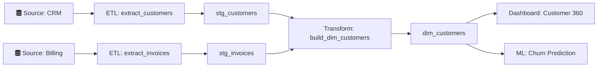
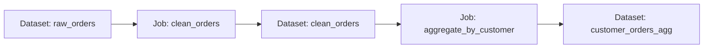
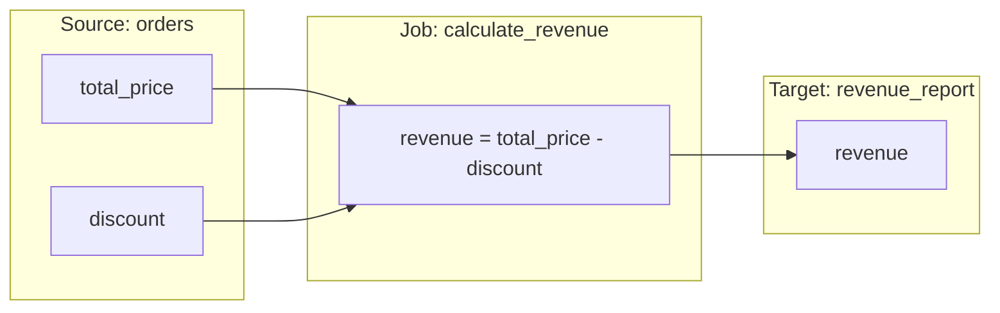
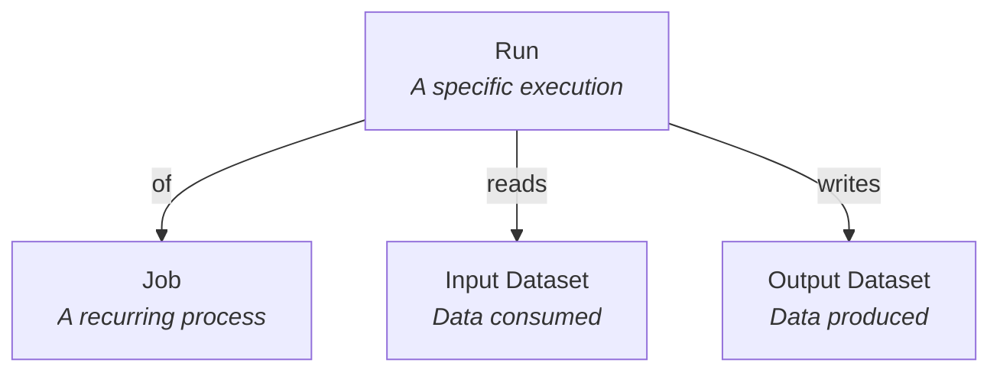
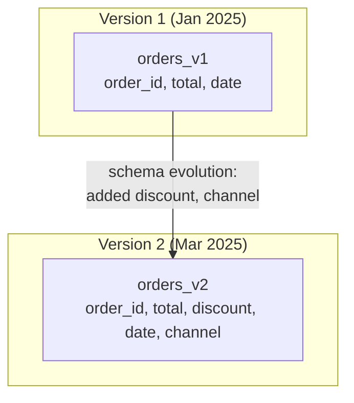

# Chapter 3: Lineage Data Models

[&larr; Back to Index](../index.md) | [Previous: Chapter 2](02-metadata-fundamentals.md)

---

## Chapter Contents

- [3.1 Graphs: The Natural Language of Lineage](#31-graphs-the-natural-language-of-lineage)
- [3.2 Directed Acyclic Graphs (DAGs)](#32-directed-acyclic-graphs-dags)
- [3.3 Node Types in Lineage Graphs](#33-node-types-in-lineage-graphs)
- [3.4 Edge Types and Semantics](#34-edge-types-and-semantics)
- [3.5 The OpenLineage Data Model](#35-the-openlineage-data-model)
- [3.6 Schema Representation in Lineage](#36-schema-representation-in-lineage)
- [3.7 Modeling Lineage in Python](#37-modeling-lineage-in-python)
- [3.8 Entity-Relationship Patterns](#38-entity-relationship-patterns)
- [3.9 Graph Storage Approaches](#39-graph-storage-approaches)
- [3.10 Design Considerations and Trade-offs](#310-design-considerations-and-trade-offs)
- [3.11 Summary](#311-summary)

---

## 3.1 Graphs: The Natural Language of Lineage

Data lineage is inherently a **graph problem**. Data flows from sources through transformations to destinations, forming a network of interconnected nodes. Trying to represent lineage in a flat table or a tree is like trying to draw a river system on a single line; you lose the branching, merging, and interconnectedness that makes it meaningful.

### Why Graphs?

- **Datasets have multiple inputs and outputs**: A table can be fed by many sources and consumed by many targets
- **Traversal in both directions**: You need to navigate upstream (root cause) and downstream (impact)
- **Paths matter**: The route data takes through transformations is as important as the endpoints
- **Subgraphs are useful**: You often want to inspect a neighborhood of the graph rather than the whole thing
- **Cycles can occur**: Although most pipelines are acyclic, some systems (feedback loops, reprocessing) introduce cycles

### Graph Theory Refresher

A **graph** $G = (V, E)$ consists of:

- **Vertices (nodes)** $V$: The entities in the graph. In lineage, these are datasets and jobs.
- **Edges** $E$: The connections between vertices. In lineage, these represent data flow.

Key properties:

- **Directed**: Edges have a direction (data flows *from* source *to* target)
- **Weighted** (optional): Edges can carry metadata (row count, byte volume)
- **Labeled**: Both nodes and edges can have types and properties

---

## 3.2 Directed Acyclic Graphs (DAGs)

Most lineage graphs are modeled as **Directed Acyclic Graphs (DAGs)**: graphs where edges have direction and there are no cycles.

### Properties of DAGs

| Property | Meaning | Lineage Implication |
|----------|---------|-------------------|
| **Directed** | Edges go from A → B, not both ways | Data flows in a specific direction |
| **Acyclic** | No path leads back to its start | No infinite loops in data flow |
| **Topological ordering** | Nodes can be sorted so that for every edge A → B, A comes before B | Processing order for migrations and impact analysis |
| **Multiple roots** | Can have multiple source nodes | Multiple independent source systems |
| **Multiple sinks** | Can have multiple terminal nodes | Multiple dashboards, reports, models |

### DAG Example



### When Lineage Isn't a DAG

In some cases, lineage graphs contain **cycles**:

- **Feedback loops**: An ML model's predictions are written back to a table that feeds the model's training
- **Reprocessing**: A table is read, transformed, and written back to itself
- **Circular dependencies**: Two jobs that each depend on the other's output (usually a design flaw)

When cycles exist, you need to handle them explicitly: either by breaking cycles at run boundaries (each execution is a DAG) or by supporting general directed graphs.

---

## 3.3 Node Types in Lineage Graphs

Lineage graphs typically contain two fundamental node types:

### Datasets

A **dataset** is any named collection of data:

| Dataset Type | Examples |
|-------------|---------|
| Database table | `postgres.public.orders` |
| Database view | `snowflake.analytics.v_monthly_revenue` |
| File | `s3://bucket/data/orders/2025-03-14.parquet` |
| Kafka topic | `kafka://cluster/orders-events` |
| API endpoint | `https://api.example.com/v1/customers` |
| Feature table | `feature_store.customer_features` |
| ML model artifact | `mlflow://models/churn_predictor/v3` |

Datasets are the "nouns" of lineage.

### Jobs

A **job** is any process that reads from or writes to datasets:

| Job Type | Examples |
|----------|---------|
| ETL/ELT pipeline | Airflow DAG task, Spark job, Glue job |
| SQL query | `CREATE TABLE AS SELECT ...` |
| dbt model | `dbt run --select dim_customers` |
| Streaming job | Flink application, Kafka Streams topology |
| ML training | `mlflow.sklearn.fit()` |
| Report refresh | Tableau extract refresh, Looker PDT build |

Jobs are the "verbs" of lineage. They connect datasets.

### The Bipartite Graph Pattern

A well-modeled lineage graph is **bipartite** (that is, it has exactly two node types that alternate): datasets and jobs never appear back-to-back:

```
Dataset → Job → Dataset → Job → Dataset
```

Datasets never directly connect to other datasets. There is always a job in between that explains *how* data moved.



> **Why bipartite?** Because the job node carries critical metadata: *who* ran it,
> *when* it ran, *what logic* it applied. Without the job node, you'd have
> a mysterious arrow from one table to another with no explanation of the
> transformation that occurred.

---

## 3.4 Edge Types and Semantics

Edges in a lineage graph carry meaning beyond simple connectivity.

### Core Edge Types

| Edge | Direction | Meaning |
|------|-----------|---------|
| `Dataset → Job` | Input | "This job reads from this dataset" |
| `Job → Dataset` | Output | "This job writes to this dataset" |

### Edge Metadata

Each edge can carry additional properties:

```python
# Example edge metadata
edge_properties = {
    "source": "raw_orders",
    "target": "clean_orders_job",
    "edge_type": "input",
    "metadata": {
        "columns_used": ["order_id", "total", "created_at"],
        "access_pattern": "full_scan",
        "rows_read": 1_500_000,
        "bytes_read": 450_000_000,
    },
}
```

### Column-Level Edges

At column granularity, edges become more specific:



Column-level edges detail is explored in depth in [Chapter 10](10-column-level-lineage.md).

### Transformation Semantics

Edges can also describe the *type* of transformation:

| Transformation | Description | Example |
|---------------|-------------|---------|
| **Identity** | Column passed through unchanged | `SELECT order_id FROM ...` |
| **Rename** | Column renamed | `SELECT order_id AS id FROM ...` |
| **Derivation** | New value computed from inputs | `SELECT price * qty AS total FROM ...` |
| **Aggregation** | Values reduced | `SELECT SUM(total) FROM ... GROUP BY ...` |
| **Filter** | Rows removed by predicate | `WHERE status = 'active'` |
| **Join** | Data combined from multiple sources | `FROM orders JOIN customers ON ...` |
| **Union** | Data appended from multiple sources | `SELECT ... UNION ALL SELECT ...` |

---

## 3.5 The OpenLineage Data Model

OpenLineage provides the most widely adopted data model for lineage. Understanding it is essential for working with any modern lineage system.

### Core Entities



### Run Events

The central primitive in OpenLineage is the **RunEvent**: a timestamped record of something happening:

```json
{
  "eventType": "COMPLETE",
  "eventTime": "2025-03-14T06:12:34.000Z",
  "run": {
    "runId": "d46e465b-d358-4d32-83d4-df660ff614dd"
  },
  "job": {
    "namespace": "my-scheduler",
    "name": "etl.load_orders"
  },
  "inputs": [
    {
      "namespace": "postgres://analytics",
      "name": "public.raw_orders"
    }
  ],
  "outputs": [
    {
      "namespace": "snowflake://warehouse",
      "name": "staging.stg_orders"
    }
  ],
  "producer": "https://github.com/OpenLineage/OpenLineage/tree/0.30.0/integration/airflow"
}
```

### Event Types

| Event Type | When | Purpose |
|-----------|------|---------|
| `START` | Job begins execution | Record start time, initial inputs |
| `RUNNING` | Periodically during execution | Progress updates, partial metrics |
| `COMPLETE` | Job finishes successfully | Final inputs, outputs, metrics |
| `FAIL` | Job finishes with error | Error details, partial outputs |
| `ABORT` | Job is cancelled | Partial state at cancellation |

### Facets: Extensible Metadata

**Facets** are the mechanism for attaching rich metadata to any entity:

```json
{
  "job": {
    "namespace": "my-scheduler",
    "name": "etl.load_orders",
    "facets": {
      "sql": {
        "query": "INSERT INTO stg_orders SELECT * FROM raw_orders WHERE date = '2025-03-14'"
      },
      "sourceCode": {
        "type": "SQL",
        "language": "SQL",
        "sourceCode": "..."
      }
    }
  },
  "inputs": [
    {
      "namespace": "postgres://analytics",
      "name": "public.raw_orders",
      "facets": {
        "schema": {
          "fields": [
            {"name": "order_id", "type": "BIGINT"},
            {"name": "total", "type": "DECIMAL(10,2)"}
          ]
        },
        "dataSource": {
          "name": "analytics",
          "uri": "postgres://analytics:5432/analytics"
        }
      }
    }
  ]
}
```

Common facet types:

| Facet | Attached To | Contains |
|-------|-----------|----------|
| `SchemaDatasetFacet` | Dataset | Column names, types, descriptions |
| `DataSourceDatasetFacet` | Dataset | Connection URI, database name |
| `ColumnLineageDatasetFacet` | Output Dataset | Column-level lineage mappings |
| `SQLJobFacet` | Job | The SQL query executed |
| `SourceCodeJobFacet` | Job | Source code of the transformation |
| `ParentRunFacet` | Run | Parent run (for sub-jobs / task groups) |
| `ErrorMessageRunFacet` | Run | Error details on failure |
| `ProcessingEngineRunFacet` | Run | Spark version, Airflow version, etc. |

We explore OpenLineage in detail in [Chapter 5](05-openlineage-standard.md).

---

## 3.6 Schema Representation in Lineage

Schema metadata is tightly coupled with lineage. As data flows through transformations, its schema evolves.

### Schema as a First-Class Lineage Citizen

Consider a simple transformation:

```sql
CREATE TABLE dim_customers AS
SELECT
    c.customer_id,
    c.first_name || ' ' || c.last_name AS full_name,
    COALESCE(SUM(o.total), 0) AS lifetime_value,
    COUNT(o.order_id) AS order_count
FROM raw_customers c
LEFT JOIN raw_orders o ON c.customer_id = o.customer_id
GROUP BY c.customer_id, c.first_name, c.last_name;
```

The **schema lineage** for `dim_customers` looks like:

| Target Column | Source Table(s) | Source Column(s) | Transformation |
|--------------|----------------|-----------------|----------------|
| `customer_id` | `raw_customers` | `customer_id` | Identity (pass-through) |
| `full_name` | `raw_customers` | `first_name`, `last_name` | Concatenation |
| `lifetime_value` | `raw_orders` | `total` | Aggregation (SUM) with COALESCE |
| `order_count` | `raw_orders` | `order_id` | Aggregation (COUNT) |

### Schema Evolution

Schemas change over time, and lineage must account for this:



Lineage systems must handle:

- **Column additions**: New columns appear in outputs
- **Column removals**: Columns disappear (breaking downstream)
- **Type changes**: Data types change (e.g., INT → BIGINT)
- **Renames**: Columns change names (breaking or non-breaking)

---

## 3.7 Modeling Lineage in Python

Let's build a simple lineage data model in Python using dataclasses. This gives you a concrete feel for the structures involved.

```python
from dataclasses import dataclass, field
from datetime import datetime
from enum import Enum
from uuid import UUID, uuid4


class NodeType(Enum):
    """The two fundamental node types in a lineage graph."""
    DATASET = "dataset"
    JOB = "job"


class EventType(Enum):
    """OpenLineage-compatible event types."""
    START = "START"
    RUNNING = "RUNNING"
    COMPLETE = "COMPLETE"
    FAIL = "FAIL"
    ABORT = "ABORT"


@dataclass
class Column:
    """A single column in a dataset's schema."""
    name: str
    data_type: str
    nullable: bool = True
    description: str = ""


@dataclass
class Dataset:
    """A data asset (table, file, topic, etc.)."""
    namespace: str  # e.g., "postgres://analytics"
    name: str       # e.g., "public.orders"
    schema: list[Column] = field(default_factory=list)
    description: str = ""
    owner: str = ""
    tags: list[str] = field(default_factory=list)

    @property
    def qualified_name(self) -> str:
        return f"{self.namespace}/{self.name}"


@dataclass
class Job:
    """A process that transforms data."""
    namespace: str  # e.g., "airflow://prod"
    name: str       # e.g., "etl.load_orders"
    description: str = ""
    sql: str = ""
    owner: str = ""

    @property
    def qualified_name(self) -> str:
        return f"{self.namespace}/{self.name}"


@dataclass
class Run:
    """A specific execution of a Job."""
    run_id: UUID = field(default_factory=uuid4)
    job: Job | None = None
    event_type: EventType = EventType.START
    event_time: datetime = field(default_factory=datetime.now)
    inputs: list[Dataset] = field(default_factory=list)
    outputs: list[Dataset] = field(default_factory=list)
    metrics: dict = field(default_factory=dict)
    error: str | None = None


@dataclass
class LineageEdge:
    """An edge in the lineage graph."""
    source: str       # qualified name of source node
    target: str       # qualified name of target node
    edge_type: str    # "input" or "output"
    columns: list[str] = field(default_factory=list)  # columns involved
    metadata: dict = field(default_factory=dict)


@dataclass
class LineageGraph:
    """A complete lineage graph."""
    datasets: dict[str, Dataset] = field(default_factory=dict)
    jobs: dict[str, Job] = field(default_factory=dict)
    edges: list[LineageEdge] = field(default_factory=list)
    runs: list[Run] = field(default_factory=list)

    def add_dataset(self, dataset: Dataset) -> None:
        self.datasets[dataset.qualified_name] = dataset

    def add_job(self, job: Job) -> None:
        self.jobs[job.qualified_name] = job

    def add_edge(self, source: str, target: str, edge_type: str) -> None:
        self.edges.append(LineageEdge(source=source, target=target, edge_type=edge_type))

    def get_upstream(self, node_name: str, depth: int = -1) -> set[str]:
        """Get all upstream nodes (backward lineage)."""
        visited: set[str] = set()
        queue = [node_name]
        current_depth = 0

        while queue and (depth == -1 or current_depth < depth):
            next_queue = []
            for node in queue:
                for edge in self.edges:
                    if edge.target == node and edge.source not in visited:
                        visited.add(edge.source)
                        next_queue.append(edge.source)
            queue = next_queue
            current_depth += 1

        return visited

    def get_downstream(self, node_name: str, depth: int = -1) -> set[str]:
        """Get all downstream nodes (forward lineage)."""
        visited: set[str] = set()
        queue = [node_name]
        current_depth = 0

        while queue and (depth == -1 or current_depth < depth):
            next_queue = []
            for node in queue:
                for edge in self.edges:
                    if edge.source == node and edge.target not in visited:
                        visited.add(edge.target)
                        next_queue.append(edge.target)
            queue = next_queue
            current_depth += 1

        return visited
```

This model is intentionally simple; production systems use more sophisticated representations. In [Chapter 4](04-your-first-lineage-graph.md), we'll use NetworkX to build and visualize a graph with these concepts.

---

## 3.8 Entity-Relationship Patterns

When storing lineage in a relational database, several patterns are common.

### Adjacency List Pattern

The simplest relational representation:

```sql
CREATE TABLE lineage_nodes (
    id          SERIAL PRIMARY KEY,
    node_type   VARCHAR(20) NOT NULL,  -- 'dataset' or 'job'
    namespace   VARCHAR(500) NOT NULL,
    name        VARCHAR(500) NOT NULL,
    metadata    JSONB DEFAULT '{}',
    created_at  TIMESTAMP DEFAULT NOW(),
    UNIQUE (namespace, name)
);

CREATE TABLE lineage_edges (
    id          SERIAL PRIMARY KEY,
    source_id   INTEGER REFERENCES lineage_nodes(id),
    target_id   INTEGER REFERENCES lineage_nodes(id),
    edge_type   VARCHAR(20) NOT NULL,  -- 'input' or 'output'
    metadata    JSONB DEFAULT '{}',
    created_at  TIMESTAMP DEFAULT NOW()
);
```

Traversal requires recursive queries:

```sql
-- Find all upstream nodes (recursive CTE)
WITH RECURSIVE upstream AS (
    -- Base case: direct inputs
    SELECT source_id AS node_id, 1 AS depth
    FROM lineage_edges
    WHERE target_id = :start_node_id

    UNION ALL

    -- Recursive case: follow edges backward
    SELECT e.source_id, u.depth + 1
    FROM lineage_edges e
    JOIN upstream u ON e.target_id = u.node_id
    WHERE u.depth < :max_depth
)
SELECT DISTINCT n.*
FROM upstream u
JOIN lineage_nodes n ON n.id = u.node_id;
```

### Closure Table Pattern

Pre-computes all ancestor-descendant relationships for faster reads:

```sql
CREATE TABLE lineage_closure (
    ancestor_id     INTEGER REFERENCES lineage_nodes(id),
    descendant_id   INTEGER REFERENCES lineage_nodes(id),
    depth           INTEGER NOT NULL,
    PRIMARY KEY (ancestor_id, descendant_id)
);
```

The closure table makes "give me all upstream/downstream nodes" a simple query:

```sql
-- All upstream nodes of a given node
SELECT n.*
FROM lineage_closure c
JOIN lineage_nodes n ON n.id = c.ancestor_id
WHERE c.descendant_id = :node_id;
```

Trade-off: Faster reads, more complex writes (must update closure table on every edge change).

### Property Graph Pattern (for Graph Databases)

In a graph database like Neo4j, the model maps directly:

```cypher
// Create dataset nodes
CREATE (:Dataset {namespace: 'postgres://analytics', name: 'public.orders'})
CREATE (:Dataset {namespace: 'snowflake://warehouse', name: 'staging.stg_orders'})

// Create job nodes
CREATE (:Job {namespace: 'airflow://prod', name: 'etl.load_orders'})

// Create edges
MATCH (d:Dataset {name: 'public.orders'}), (j:Job {name: 'etl.load_orders'})
CREATE (d)-[:INPUT_TO]->(j)

MATCH (j:Job {name: 'etl.load_orders'}), (d:Dataset {name: 'staging.stg_orders'})
CREATE (j)-[:PRODUCES]->(d)
```

We explore graph databases for lineage in [Chapter 11](11-graph-databases-lineage.md).

---

## 3.9 Graph Storage Approaches

Different storage backends have different trade-offs:

| Approach | Read Performance | Write Performance | Query Flexibility | Operational Complexity |
|----------|-----------------|-------------------|-------------------|----------------------|
| **Relational (adjacency list)** | Moderate (recursive CTEs) | Good | SQL (familiar) | Low |
| **Relational (closure table)** | Excellent | Moderate (closure maintenance) | SQL | Low-Medium |
| **Graph DB (Neo4j)** | Excellent (native graph traversal) | Good | Cypher (learning curve) | Medium |
| **Document store** | Paper for flat reads | Good | Limited graph queries | Low |
| **Purpose-built (Marquez)** | Good (optimized queries) | Good (event-driven) | REST API | Medium |
| **In-memory (NetworkX)** | Excellent | Excellent | Python API | None (not persistent) |

### Choosing a Storage Backend

- **Small-medium graphs (< 100K nodes)**: Relational DB or NetworkX in-memory works fine
- **Large graphs (100K–10M nodes)**: Graph database or purpose-built lineage server
- **Very large graphs (> 10M nodes)**: Partitioned graph database or distributed graph processing

---

## 3.10 Design Considerations and Trade-offs

When designing a lineage data model, consider these trade-offs:

### Granularity vs. Complexity

- More granular lineage (column-level vs. table-level) provides more value but is harder to capture and store
- Start with table-level; add column-level incrementally

### Freshness vs. Completeness

- Real-time lineage capture gives the most current graph but may miss batch operations
- Periodic lineage scanning (e.g., parsing SQL logs nightly) catches everything but introduces delay

### Static vs. Dynamic Lineage

- Static (design-time) lineage from code analysis is available before deployment
- Dynamic (runtime) lineage captures what actually happens but only after execution
- Best practice: use both and reconcile

### Namespace Design

Choosing a consistent namespace scheme is critical for avoiding duplicate nodes:

```
# Good: Consistent, hierarchical namespace
postgres://prod-cluster/public.orders
snowflake://my-account/analytics.staging.stg_orders
s3://my-bucket/data/orders/2025-03-14.parquet
airflow://prod/etl.load_orders

# Bad: Inconsistent naming leads to graph fragmentation
orders                     # Too vague — which database?
public.orders              # Missing server/cluster context
prod.public.orders         # Missing connection type
```

### Temporal Modeling

Should your lineage graph represent the current state or the complete history?

| Approach | Use Case | Trade-off |
|----------|---------|-----------|
| **Current-state only** | Impact analysis, exploration | Simple but loses history |
| **Snapshot-based** | Audit, compliance | Storage grows linearly |
| **Event-sourced** | Full reconstruction at any point in time | Most flexible, most complex |

OpenLineage's event model naturally supports event-sourcing: you can replay events to reconstruct the graph at any point in time.

---

## 3.11 Summary

In this chapter, you learned:

- Lineage is fundamentally a **graph problem** best modeled as a directed graph
- Most lineage graphs are **DAGs**, though cycles may exist in special cases
- Two node types dominate: **Datasets** (nouns) and **Jobs** (verbs)
- Well-modeled lineage graphs are **bipartite**: datasets and jobs alternate
- Edges carry metadata including **columns used**, **transformation type**, and **row counts**
- The **OpenLineage data model** provides the standard: Jobs, Datasets, Runs, and Facets
- **Schema representation** is tightly coupled with lineage and must handle schema evolution
- Relational storage uses **adjacency lists** or **closure tables**; graph databases model lineage natively
- Key design decisions include **granularity**, **namespace conventions**, and **temporal modeling**

### Key Takeaway

> Choose a data model that matches your lineage maturity. Start with a simple
> bipartite graph using Datasets and Jobs with table-level granularity. As your
> needs grow, add column-level detail, facets, and temporal history.

---

### What's Next

In [Chapter 4: Your First Lineage Graph](04-your-first-lineage-graph.md), we put these ideas into practice by building and traversing a lineage graph with Python and NetworkX.

---

[&larr; Back to Index](../index.md) | [Previous: Chapter 2](02-metadata-fundamentals.md) | [Next: Chapter 4 &rarr;](04-your-first-lineage-graph.md)
