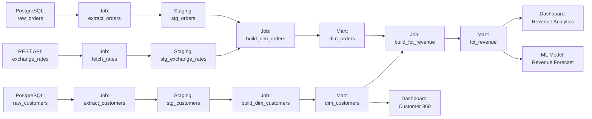

# Chapter 4: Your First Lineage Graph

[&larr; Back to Index](../index.md) | [Previous: Chapter 3](03-lineage-data-models.md)

---

## Chapter Contents

- [4.1 What We'll Build](#41-what-well-build)
- [4.2 Setting Up NetworkX](#42-setting-up-networkx)
- [4.3 Modeling Datasets and Jobs as Nodes](#43-modeling-datasets-and-jobs-as-nodes)
- [4.4 Building the Graph](#44-building-the-graph)
- [4.5 Visualizing the Graph](#45-visualizing-the-graph)
- [4.6 Traversing Upstream (Root Cause Analysis)](#46-traversing-upstream-root-cause-analysis)
- [4.7 Traversing Downstream (Impact Analysis)](#47-traversing-downstream-impact-analysis)
- [4.8 Finding All Paths Between Two Nodes](#48-finding-all-paths-between-two-nodes)
- [4.9 Identifying Critical Nodes](#49-identifying-critical-nodes)
- [4.10 Adding Schema Metadata to Nodes](#410-adding-schema-metadata-to-nodes)
- [4.11 Exporting and Sharing Lineage Graphs](#411-exporting-and-sharing-lineage-graphs)
- [4.12 Exercise](#412-exercise)
- [4.13 Summary](#413-summary)

---

## 4.1 What We'll Build

In this chapter, we'll build a complete lineage graph for a realistic (but simplified) e-commerce data pipeline:



By the end of this chapter you'll be able to:

- Build this graph programmatically in Python
- Visualize it with matplotlib
- Traverse it upstream and downstream
- Perform impact analysis and root cause analysis
- Identify critical (high-centrality) nodes
- Export the graph to JSON for sharing

---

## 4.2 Setting Up NetworkX

[NetworkX](https://networkx.org/) is the standard Python library for graph manipulation. It's pure Python, has no external dependencies beyond the standard library (matplotlib is optional for visualization), and is perfect for learning lineage graph concepts.

```bash
# Install via pixi (conda-forge)
pixi add networkx matplotlib
```

```python
import networkx as nx
import matplotlib.pyplot as plt

# Verify installation
print(f"NetworkX version: {nx.__version__}")
```

### Why NetworkX for Learning?

| Feature | Benefit for Lineage Learning |
|---------|----------------------------|
| In-memory | No external services to set up |
| Rich API | Built-in traversal, path-finding, centrality algorithms |
| Attribute support | Nodes and edges can carry arbitrary metadata |
| Visualization | Built-in matplotlib integration |
| Serialization | Export to JSON, GraphML, GML, etc. |

> **Note**: NetworkX is great for learning and small-to-medium graphs. For
> production systems with millions of nodes, consider Neo4j
> ([Chapter 12](12-graph-databases-lineage.md)) or a purpose-built lineage
> server like Marquez ([Chapter 8](08-airflow-and-marquez.md)).

---

## 4.3 Modeling Datasets and Jobs as Nodes

We'll represent our lineage graph as a **directed graph** (`nx.DiGraph`) where each node has a `node_type` attribute of either `"dataset"` or `"job"`.

```python
import networkx as nx


def create_lineage_graph() -> nx.DiGraph:
    """Create an empty lineage graph."""
    return nx.DiGraph()


def add_dataset(
    graph: nx.DiGraph,
    name: str,
    namespace: str = "default",
    description: str = "",
    owner: str = "",
    schema: list[dict] | None = None,
) -> None:
    """Add a dataset node to the lineage graph."""
    graph.add_node(
        name,
        node_type="dataset",
        namespace=namespace,
        description=description,
        owner=owner,
        schema=schema or [],
    )


def add_job(
    graph: nx.DiGraph,
    name: str,
    namespace: str = "default",
    description: str = "",
    owner: str = "",
    sql: str = "",
) -> None:
    """Add a job node to the lineage graph."""
    graph.add_node(
        name,
        node_type="job",
        namespace=namespace,
        description=description,
        owner=owner,
        sql=sql,
    )


def add_lineage_edge(
    graph: nx.DiGraph,
    source: str,
    target: str,
    edge_type: str = "dataflow",
) -> None:
    """Add a directed edge (data flow) between two nodes."""
    graph.add_edge(source, target, edge_type=edge_type)
```

---

## 4.4 Building the Graph

Now let's build the e-commerce lineage graph from our diagram:

```python
def build_ecommerce_lineage() -> nx.DiGraph:
    """Build a sample e-commerce data pipeline lineage graph."""
    g = create_lineage_graph()

    # --- Source datasets ---
    add_dataset(g, "raw_orders", namespace="postgres://prod",
                description="Raw order transactions from the e-commerce platform",
                owner="Commerce Team")
    add_dataset(g, "raw_customers", namespace="postgres://prod",
                description="Raw customer records including PII",
                owner="Commerce Team")
    add_dataset(g, "exchange_rates", namespace="api://forex",
                description="Daily currency exchange rates from external API",
                owner="Finance Team")

    # --- Extract jobs ---
    add_job(g, "extract_orders", namespace="airflow://prod",
            description="Extract orders from PostgreSQL to staging")
    add_job(g, "extract_customers", namespace="airflow://prod",
            description="Extract customers from PostgreSQL to staging")
    add_job(g, "fetch_rates", namespace="airflow://prod",
            description="Fetch exchange rates from forex API")

    # --- Staging datasets ---
    add_dataset(g, "stg_orders", namespace="snowflake://warehouse",
                description="Staged orders with basic type casting",
                owner="Data Engineering")
    add_dataset(g, "stg_customers", namespace="snowflake://warehouse",
                description="Staged customers with PII masking",
                owner="Data Engineering")
    add_dataset(g, "stg_exchange_rates", namespace="snowflake://warehouse",
                description="Staged exchange rates by date and currency pair",
                owner="Data Engineering")

    # --- Transform jobs ---
    add_job(g, "build_dim_orders", namespace="dbt://prod",
            description="Build dimension table for orders with currency conversion",
            sql="SELECT o.*, o.total * r.rate AS total_usd FROM stg_orders o JOIN stg_exchange_rates r ...")
    add_job(g, "build_dim_customers", namespace="dbt://prod",
            description="Build dimension table for customers with enrichment")
    add_job(g, "build_fct_revenue", namespace="dbt://prod",
            description="Build revenue fact table joining orders and customers")

    # --- Mart datasets ---
    add_dataset(g, "dim_orders", namespace="snowflake://warehouse",
                description="Dimension table: orders with USD conversion",
                owner="Analytics Engineering")
    add_dataset(g, "dim_customers", namespace="snowflake://warehouse",
                description="Dimension table: enriched customer profiles",
                owner="Analytics Engineering")
    add_dataset(g, "fct_revenue", namespace="snowflake://warehouse",
                description="Fact table: revenue by customer and order",
                owner="Analytics Engineering")

    # --- Consumer nodes ---
    add_dataset(g, "Revenue Analytics Dashboard", namespace="tableau://prod",
                description="Executive revenue dashboard",
                owner="BI Team")
    add_dataset(g, "Customer 360 Dashboard", namespace="tableau://prod",
                description="Customer overview dashboard",
                owner="BI Team")
    add_job(g, "Revenue Forecast Model", namespace="mlflow://prod",
            description="XGBoost model predicting next-quarter revenue",
            owner="Data Science")

    # --- Edges: Source → Extract ---
    add_lineage_edge(g, "raw_orders", "extract_orders")
    add_lineage_edge(g, "raw_customers", "extract_customers")
    add_lineage_edge(g, "exchange_rates", "fetch_rates")

    # --- Edges: Extract → Staging ---
    add_lineage_edge(g, "extract_orders", "stg_orders")
    add_lineage_edge(g, "extract_customers", "stg_customers")
    add_lineage_edge(g, "fetch_rates", "stg_exchange_rates")

    # --- Edges: Staging → Transform ---
    add_lineage_edge(g, "stg_orders", "build_dim_orders")
    add_lineage_edge(g, "stg_exchange_rates", "build_dim_orders")
    add_lineage_edge(g, "stg_customers", "build_dim_customers")

    # --- Edges: Transform → Mart ---
    add_lineage_edge(g, "build_dim_orders", "dim_orders")
    add_lineage_edge(g, "build_dim_customers", "dim_customers")

    # --- Edges: Mart → Fact ---
    add_lineage_edge(g, "dim_orders", "build_fct_revenue")
    add_lineage_edge(g, "dim_customers", "build_fct_revenue")
    add_lineage_edge(g, "build_fct_revenue", "fct_revenue")

    # --- Edges: Mart/Fact → Consumers ---
    add_lineage_edge(g, "fct_revenue", "Revenue Analytics Dashboard")
    add_lineage_edge(g, "fct_revenue", "Revenue Forecast Model")
    add_lineage_edge(g, "dim_customers", "Customer 360 Dashboard")

    return g


# Build it
graph = build_ecommerce_lineage()
print(f"Nodes: {graph.number_of_nodes()}")
print(f"Edges: {graph.number_of_edges()}")
print(f"Is DAG: {nx.is_directed_acyclic_graph(graph)}")
```

Expected output:

```
Nodes: 18
Edges: 18
Is DAG: True
```

---

## 4.5 Visualizing the Graph

Let's visualize the lineage graph with color-coded node types:

```python
def visualize_lineage(graph: nx.DiGraph, title: str = "Data Lineage Graph") -> None:
    """Visualize a lineage graph with color-coded node types."""
    # Assign colors by node type
    color_map = {
        "dataset": "#4A90D9",   # Blue for datasets
        "job": "#E6A23C",       # Orange for jobs
    }
    node_colors = [
        color_map.get(graph.nodes[n].get("node_type", "dataset"), "#999999")
        for n in graph.nodes()
    ]

    # Assign shapes via node size (jobs are slightly smaller)
    node_sizes = [
        2000 if graph.nodes[n].get("node_type") == "dataset" else 1500
        for n in graph.nodes()
    ]

    # Use a layered layout for DAGs
    if nx.is_directed_acyclic_graph(graph):
        # Topological generations give us layers
        for layer, nodes in enumerate(nx.topological_generations(graph)):
            for node in nodes:
                graph.nodes[node]["layer"] = layer
        pos = nx.multipartite_layout(graph, subset_key="layer")
    else:
        pos = nx.spring_layout(graph, k=2, iterations=50, seed=42)

    plt.figure(figsize=(18, 10))
    plt.title(title, fontsize=16, fontweight="bold")

    # Draw edges
    nx.draw_networkx_edges(
        graph, pos,
        edge_color="#CCCCCC",
        arrows=True,
        arrowsize=20,
        arrowstyle="-|>",
        connectionstyle="arc3,rad=0.1",
    )

    # Draw nodes
    nx.draw_networkx_nodes(
        graph, pos,
        node_color=node_colors,
        node_size=node_sizes,
        edgecolors="white",
        linewidths=2,
    )

    # Draw labels (shortened for readability)
    labels = {n: n.replace("_", "\n") for n in graph.nodes()}
    nx.draw_networkx_labels(
        graph, pos,
        labels=labels,
        font_size=7,
        font_weight="bold",
    )

    # Add legend
    from matplotlib.patches import Patch
    legend_elements = [
        Patch(facecolor="#4A90D9", label="Dataset"),
        Patch(facecolor="#E6A23C", label="Job"),
    ]
    plt.legend(handles=legend_elements, loc="upper left", fontsize=10)

    plt.axis("off")
    plt.tight_layout()
    plt.savefig("lineage_graph.png", dpi=150, bbox_inches="tight")
    plt.show()
    print("Graph saved to lineage_graph.png")


# Visualize
visualize_lineage(graph)
```

This produces a layered graph where data flows left-to-right, with blue nodes for datasets and orange nodes for jobs.

---

## 4.6 Traversing Upstream (Root Cause Analysis)

**Upstream traversal** answers: "Where did this data come from?"

This is essential for **root cause analysis**: when a number looks wrong in a dashboard, you trace the data backward through every transformation to the original source.

```python
def get_upstream(graph: nx.DiGraph, node: str, max_depth: int | None = None) -> list[str]:
    """Get all upstream nodes of a given node.

    Args:
        graph: The lineage DiGraph.
        node: The node to start from.
        max_depth: Maximum traversal depth (None for unlimited).

    Returns:
        List of upstream node names, ordered by distance (closest first).
    """
    if node not in graph:
        raise ValueError(f"Node '{node}' not found in graph")

    # nx.ancestors gives all reachable predecessors
    if max_depth is None:
        return list(nx.ancestors(graph, node))

    # BFS with depth limit
    upstream = []
    visited = {node}
    queue = [(node, 0)]

    while queue:
        current, depth = queue.pop(0)
        if depth >= max_depth:
            continue
        for predecessor in graph.predecessors(current):
            if predecessor not in visited:
                visited.add(predecessor)
                upstream.append(predecessor)
                queue.append((predecessor, depth + 1))

    return upstream


# Example: What feeds the Revenue Analytics Dashboard?
upstream = get_upstream(graph, "Revenue Analytics Dashboard")
print("Upstream of Revenue Analytics Dashboard:")
for node in upstream:
    node_type = graph.nodes[node].get("node_type", "unknown")
    print(f"  [{node_type}] {node}")
```

Expected output:

```
Upstream of Revenue Analytics Dashboard:
  [dataset] fct_revenue
  [job] build_fct_revenue
  [dataset] dim_orders
  [dataset] dim_customers
  [job] build_dim_orders
  [job] build_dim_customers
  [dataset] stg_orders
  [dataset] stg_exchange_rates
  [dataset] stg_customers
  [job] extract_orders
  [job] fetch_rates
  [job] extract_customers
  [dataset] raw_orders
  [dataset] exchange_rates
  [dataset] raw_customers
```

---

## 4.7 Traversing Downstream (Impact Analysis)

**Downstream traversal** answers: "What will be affected if this changes?"

This is essential for **impact analysis**: before changing a source table, you need to know every downstream consumer.

```python
def get_downstream(graph: nx.DiGraph, node: str, max_depth: int | None = None) -> list[str]:
    """Get all downstream nodes of a given node.

    Args:
        graph: The lineage DiGraph.
        node: The node to start from.
        max_depth: Maximum traversal depth (None for unlimited).

    Returns:
        List of downstream node names, ordered by distance (closest first).
    """
    if node not in graph:
        raise ValueError(f"Node '{node}' not found in graph")

    if max_depth is None:
        return list(nx.descendants(graph, node))

    downstream = []
    visited = {node}
    queue = [(node, 0)]

    while queue:
        current, depth = queue.pop(0)
        if depth >= max_depth:
            continue
        for successor in graph.successors(current):
            if successor not in visited:
                visited.add(successor)
                downstream.append(successor)
                queue.append((successor, depth + 1))

    return downstream


# Example: What breaks if raw_orders changes?
downstream = get_downstream(graph, "raw_orders")
print("Impact of changing raw_orders:")
for node in downstream:
    node_type = graph.nodes[node].get("node_type", "unknown")
    print(f"  [{node_type}] {node}")
```

Expected output:

```
Impact of changing raw_orders:
  [job] extract_orders
  [dataset] stg_orders
  [job] build_dim_orders
  [dataset] dim_orders
  [job] build_fct_revenue
  [dataset] fct_revenue
  [dataset] Revenue Analytics Dashboard
  [job] Revenue Forecast Model
```

This tells you that changing `raw_orders` will potentially affect 8 downstream nodes, including a dashboard and an ML model.

---

## 4.8 Finding All Paths Between Two Nodes

Sometimes you need to see **how** data flows from point A to point B, not just that it does.

```python
def find_all_paths(graph: nx.DiGraph, source: str, target: str) -> list[list[str]]:
    """Find all paths from source to target in the lineage graph."""
    return list(nx.all_simple_paths(graph, source, target))


# How does data flow from raw_orders to Revenue Analytics Dashboard?
paths = find_all_paths(graph, "raw_orders", "Revenue Analytics Dashboard")
print(f"Found {len(paths)} path(s) from raw_orders to Revenue Analytics Dashboard:\n")

for i, path in enumerate(paths, 1):
    print(f"Path {i}:")
    for j, node in enumerate(path):
        node_type = graph.nodes[node].get("node_type", "unknown")
        prefix = "  └── " if j == len(path) - 1 else "  ├── "
        if j == 0:
            prefix = "  "
        print(f"{prefix}[{node_type}] {node}")
    print()
```

Expected output:

```
Found 1 path(s) from raw_orders to Revenue Analytics Dashboard:

Path 1:
  [dataset] raw_orders
  ├── [job] extract_orders
  ├── [dataset] stg_orders
  ├── [job] build_dim_orders
  ├── [dataset] dim_orders
  ├── [job] build_fct_revenue
  ├── [dataset] fct_revenue
  └── [dataset] Revenue Analytics Dashboard
```

---

## 4.9 Identifying Critical Nodes

Some nodes in a lineage graph are more critical than others. Graph centrality metrics help identify them.

```python
def identify_critical_nodes(graph: nx.DiGraph, top_n: int = 5) -> dict:
    """Identify the most critical nodes in the lineage graph using multiple metrics."""

    # Betweenness centrality: nodes that sit on many shortest paths
    betweenness = nx.betweenness_centrality(graph)

    # In-degree: nodes with many inputs (complex joins/merges)
    in_degree = dict(graph.in_degree())

    # Out-degree: nodes with many outputs (widely consumed)
    out_degree = dict(graph.out_degree())

    # PageRank: overall importance considering graph structure
    pagerank = nx.pagerank(graph)

    print(f"{'Node':<30} {'Type':<10} {'Betweenness':<14} {'In-Deg':<8} {'Out-Deg':<8} {'PageRank':<10}")
    print("-" * 85)

    # Sort by betweenness centrality
    sorted_nodes = sorted(betweenness.items(), key=lambda x: x[1], reverse=True)
    for node, bc in sorted_nodes[:top_n]:
        node_type = graph.nodes[node].get("node_type", "unknown")
        print(
            f"{node:<30} {node_type:<10} {bc:<14.4f} {in_degree[node]:<8} "
            f"{out_degree[node]:<8} {pagerank[node]:<10.4f}"
        )

    return {
        "betweenness": betweenness,
        "in_degree": in_degree,
        "out_degree": out_degree,
        "pagerank": pagerank,
    }


metrics = identify_critical_nodes(graph)
```

Nodes with high betweenness centrality are **bottlenecks**: if they fail, many paths through the graph break. These are your highest-priority nodes for monitoring and quality checks.

---

## 4.10 Adding Schema Metadata to Nodes

Let's enrich our graph with column-level schema information:

```python
# Add schemas to key datasets
schemas = {
    "raw_orders": [
        {"name": "order_id", "type": "BIGINT", "nullable": False},
        {"name": "customer_id", "type": "BIGINT", "nullable": False},
        {"name": "total", "type": "DECIMAL(10,2)", "nullable": False},
        {"name": "currency", "type": "VARCHAR(3)", "nullable": False},
        {"name": "created_at", "type": "TIMESTAMP", "nullable": False},
    ],
    "dim_orders": [
        {"name": "order_id", "type": "BIGINT", "nullable": False},
        {"name": "customer_id", "type": "BIGINT", "nullable": False},
        {"name": "total_original", "type": "DECIMAL(10,2)", "nullable": False},
        {"name": "total_usd", "type": "DECIMAL(10,2)", "nullable": False},
        {"name": "currency", "type": "VARCHAR(3)", "nullable": False},
        {"name": "exchange_rate", "type": "DECIMAL(8,4)", "nullable": True},
        {"name": "created_at", "type": "TIMESTAMP", "nullable": False},
    ],
    "fct_revenue": [
        {"name": "customer_id", "type": "BIGINT", "nullable": False},
        {"name": "customer_name", "type": "VARCHAR(200)", "nullable": True},
        {"name": "order_count", "type": "INTEGER", "nullable": False},
        {"name": "total_revenue_usd", "type": "DECIMAL(12,2)", "nullable": False},
        {"name": "first_order_date", "type": "DATE", "nullable": False},
        {"name": "last_order_date", "type": "DATE", "nullable": False},
    ],
}

for dataset_name, schema in schemas.items():
    if dataset_name in graph.nodes:
        graph.nodes[dataset_name]["schema"] = schema

# Print a dataset's schema
def print_schema(graph: nx.DiGraph, dataset: str) -> None:
    """Print the schema of a dataset node."""
    schema = graph.nodes[dataset].get("schema", [])
    if not schema:
        print(f"  No schema available for {dataset}")
        return

    print(f"\nSchema for {dataset}:")
    print(f"  {'Column':<25} {'Type':<20} {'Nullable'}")
    print(f"  {'-'*25} {'-'*20} {'-'*8}")
    for col in schema:
        print(f"  {col['name']:<25} {col['type']:<20} {col['nullable']}")


print_schema(graph, "fct_revenue")
```

---

## 4.11 Exporting and Sharing Lineage Graphs

NetworkX graphs can be serialized to multiple formats:

### Export to JSON

```python
import json
from networkx.readwrite import json_graph


def export_lineage_json(graph: nx.DiGraph, filepath: str = "lineage.json") -> None:
    """Export lineage graph to a JSON file."""
    data = json_graph.node_link_data(graph)
    with open(filepath, "w") as f:
        json.dump(data, f, indent=2, default=str)
    print(f"Exported {graph.number_of_nodes()} nodes and {graph.number_of_edges()} edges to {filepath}")


def import_lineage_json(filepath: str = "lineage.json") -> nx.DiGraph:
    """Import lineage graph from a JSON file."""
    with open(filepath) as f:
        data = json.load(f)
    return json_graph.node_link_graph(data, directed=True)


# Export
export_lineage_json(graph, "ecommerce_lineage.json")

# Re-import
restored = import_lineage_json("ecommerce_lineage.json")
print(f"Restored graph: {restored.number_of_nodes()} nodes, {restored.number_of_edges()} edges")
```

### Export to GraphML (for import into Neo4j, Gephi, etc.)

```python
def export_lineage_graphml(graph: nx.DiGraph, filepath: str = "lineage.graphml") -> None:
    """Export lineage graph to GraphML format."""
    # GraphML doesn't support complex types, so flatten schema to JSON string
    export_graph = graph.copy()
    for node in export_graph.nodes():
        if "schema" in export_graph.nodes[node]:
            export_graph.nodes[node]["schema_json"] = json.dumps(
                export_graph.nodes[node]["schema"]
            )
            del export_graph.nodes[node]["schema"]

    nx.write_graphml(export_graph, filepath)
    print(f"Exported to {filepath}")


export_lineage_graphml(graph, "ecommerce_lineage.graphml")
```

### Export to DOT (for Graphviz rendering)

```python
def export_lineage_dot(graph: nx.DiGraph, filepath: str = "lineage.dot") -> None:
    """Export lineage graph to DOT format for Graphviz."""
    nx.drawing.nx_pydot.write_dot(graph, filepath)
    print(f"Exported to {filepath}")
    print(f"Render with: dot -Tpng {filepath} -o lineage_graphviz.png")
```

---

## 4.12 Exercise

> **Exercise**: Open [`exercises/ch04_first_graph.py`](../exercises/ch04_first_graph.py)
> and complete the following tasks:
>
> 1. Build the e-commerce lineage graph from the code above
> 2. Add three more datasets and jobs of your own (e.g., a data quality job, a backup job, a new dashboard)
> 3. Implement a function that finds all "leaf" nodes (datasets with no downstream consumers)
> 4. Implement a function that calculates the "blast radius" (the percentage of all nodes affected by a change to a given node)
> 5. Visualize the graph and save it as a PNG
> 6. Export the graph to JSON
>
> **Bonus**: Add column-level lineage by storing column mappings on edges (e.g., edge attributes that say "order_id in source maps to order_id in target").

---

## 4.13 Summary

In this chapter, you learned:

- How to model lineage graphs using **NetworkX** with typed nodes (datasets and jobs)
- How to **build** a realistic lineage graph programmatically
- How to **visualize** the graph with color-coded node types and layered layout
- How to **traverse upstream** for root cause analysis (`nx.ancestors`, BFS)
- How to **traverse downstream** for impact analysis (`nx.descendants`, BFS)
- How to **find all paths** between any two nodes
- How to **identify critical nodes** using centrality metrics (betweenness, PageRank)
- How to **enrich nodes** with schema metadata
- How to **export** graphs to JSON, GraphML, and DOT formats

### Key Takeaway

> A lineage graph is only as useful as the questions you can ask it. The
> fundamental operations (upstream traversal, downstream traversal, path
> finding, and impact radius calculation) form the foundation of every
> lineage product and API. Master these, and the rest is implementation detail.

---

### What's Next

In [Chapter 5: The OpenLineage Standard](05-openlineage-standard.md), we move from our custom graph model to the industry-standard OpenLineage specification and see how production systems handle lineage events.

---

[&larr; Back to Index](../index.md) | [Previous: Chapter 3](03-lineage-data-models.md) | [Next: Chapter 5 &rarr;](05-openlineage-standard.md)
