# Chapter 5: The OpenLineage Standard

[&larr; Back to Index](../index.md) | [Previous: Chapter 4](04-your-first-lineage-graph.md)

---

## Chapter Contents

- [5.1 Why a Standard Matters](#51-why-a-standard-matters)
- [5.2 OpenLineage Architecture](#52-openlineage-architecture)
- [5.3 The Core Data Model](#53-the-core-data-model)
- [5.4 Run Events in Detail](#54-run-events-in-detail)
- [5.5 Facets: Extensible Metadata](#55-facets-extensible-metadata)
- [5.6 Namespaces and Naming Conventions](#56-namespaces-and-naming-conventions)
- [5.7 Transport Backends](#57-transport-backends)
- [5.8 The Integration Ecosystem](#58-the-integration-ecosystem)
- [5.9 Emitting OpenLineage Events in Python](#59-emitting-openlineage-events-in-python)
- [5.10 Consuming OpenLineage Events](#510-consuming-openlineage-events)
- [5.11 Exercise](#511-exercise)
- [5.12 Summary](#512-summary)

---

## 5.1 Why a Standard Matters

Before OpenLineage, every tool had its own lineage format. Kedro emitted lineage one way, Airflow another, Spark yet another, and dbt had its own approach. Stitching them together into a unified graph was a nightmare of custom glue code.

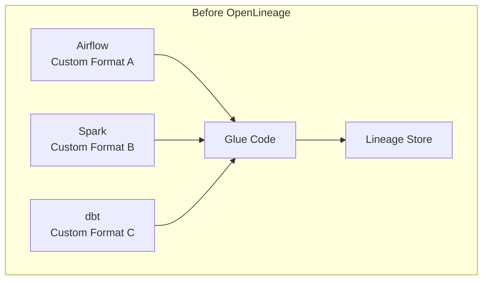

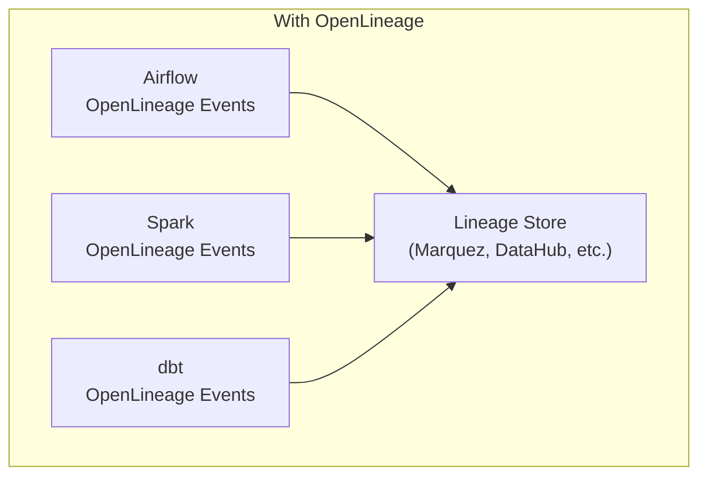

OpenLineage provides:

| Benefit | Description |
|---------|-------------|
| **Interoperability** | Any producer can talk to any consumer |
| **Vendor neutrality** | Not locked into one catalog or platform |
| **Composability** | Mix and match tools freely |
| **Community** | Shared development of integrations |
| **Extensibility** | Facets allow custom metadata without breaking the spec |

OpenLineage is an [OpenLineage project](https://openlineage.io/) under the [Linux Foundation AI & Data](https://lfaidata.foundation/).

---

## 5.2 OpenLineage Architecture

The OpenLineage architecture follows a **producer → transport → consumer** pattern:

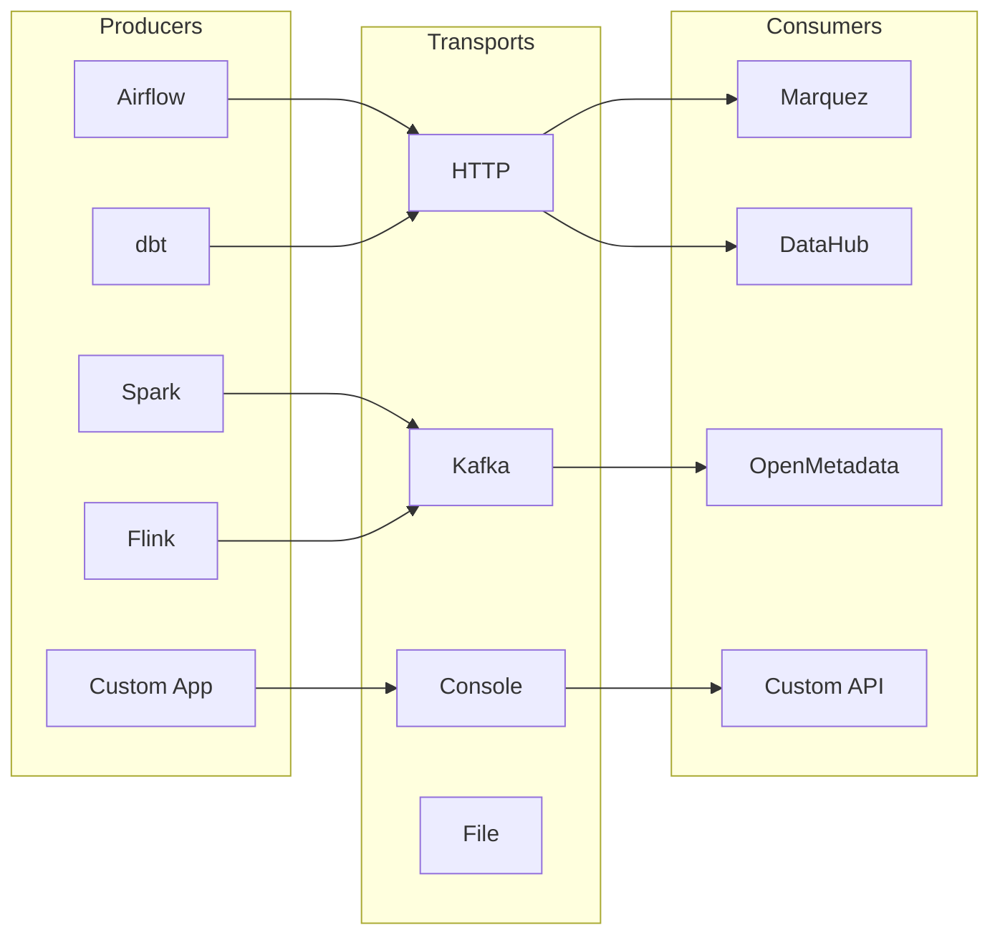

### Component Roles

```
┌─────────────────────────────────────────────────────────────┐
│                    OpenLineage Ecosystem                     │
├─────────────┬─────────────────┬─────────────────────────────┤
│  PRODUCERS  │   TRANSPORTS    │         CONSUMERS           │
│             │                 │                             │
│  Generate   │   Deliver       │   Store, index,            │
│  RunEvent   │   events from   │   serve, and               │
│  JSON when  │   producer to   │   visualize lineage        │
│  jobs start,│   consumer via  │   from aggregated          │
│  run, or    │   HTTP, Kafka,  │   events across            │
│  complete   │   file, etc.    │   all producers            │
└─────────────┴─────────────────┴─────────────────────────────┘
```

---

## 5.3 The Core Data Model

OpenLineage's data model has four core entities:

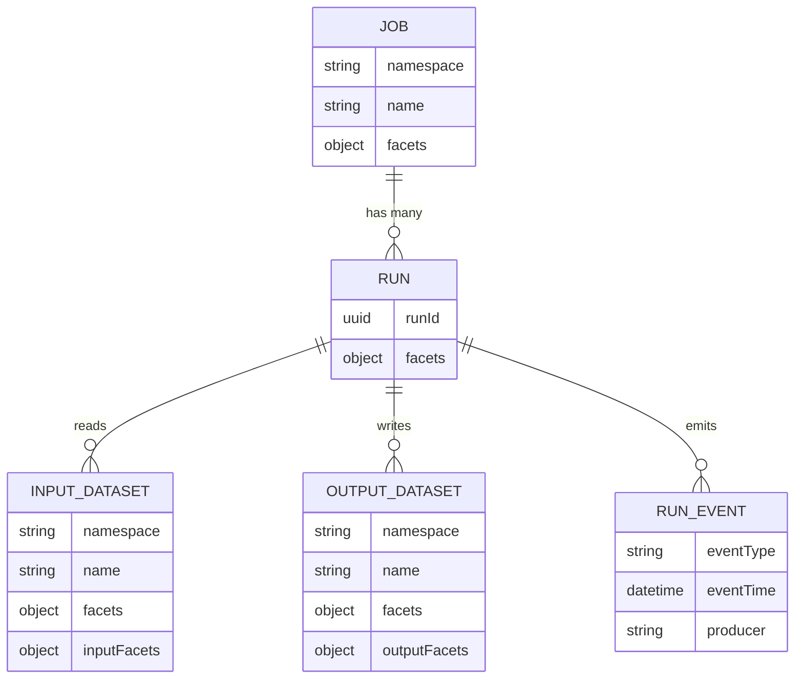

### Entity Descriptions

| Entity | Purpose | Identity | Example |
|--------|---------|----------|---------|
| **Job** | A recurring process | `namespace` + `name` | `airflow://prod` + `etl.load_orders` |
| **Run** | One execution of a Job | `runId` (UUID) | `d46e465b-d358-4d32-83d4-df660ff614dd` |
| **Dataset** | A data asset (input or output) | `namespace` + `name` | `postgres://prod` + `public.orders` |
| **RunEvent** | A timestamped state change | `eventType` + `eventTime` | `COMPLETE` at `2025-03-14T06:12:34Z` |

### The Bipartite Relationship

The OpenLineage graph is bipartite (a graph with two distinct node types where edges only connect different types): datasets connect to runs, and runs connect to datasets, but datasets never link directly to other datasets.

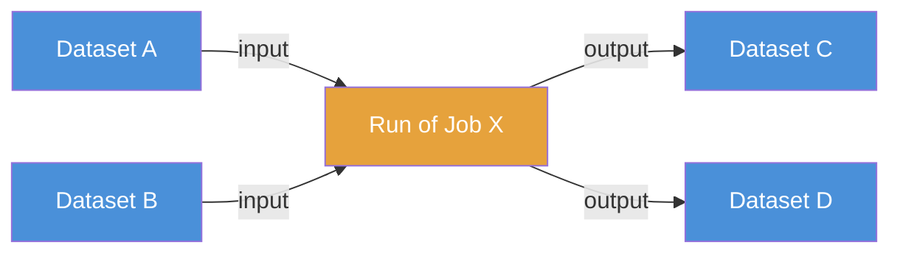

---

## 5.4 Run Events in Detail

A **RunEvent** is the atomic unit of lineage in OpenLineage. It's a JSON document that captures a state change in a job's execution.

### Event Type Lifecycle

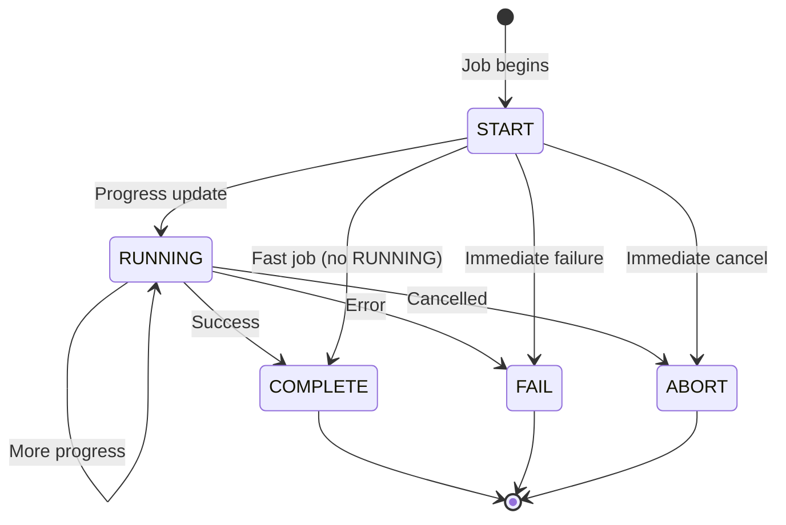

### Event Type Details

| Event Type | When Emitted | What It Contains |
|-----------|-------------|-----------------|
| `START` | Job execution begins | Job identity, run ID, initial inputs (if known), start time |
| `RUNNING` | Periodically during execution | Progress metrics, updated inputs/outputs as discovered |
| `COMPLETE` | Job finishes successfully | Final inputs, outputs, all metrics, row counts |
| `FAIL` | Job finishes with error | Error message, partial outputs, inputs consumed before failure |
| `ABORT` | Job is cancelled | Partial state at cancellation time |

### Complete RunEvent Example

```json
{
  "eventType": "COMPLETE",
  "eventTime": "2025-03-14T06:12:34.567Z",
  "run": {
    "runId": "d46e465b-d358-4d32-83d4-df660ff614dd",
    "facets": {
      "nominalTime": {
        "_producer": "https://openlineage.io",
        "_schemaURL": "https://openlineage.io/spec/facets/1-0-0/NominalTimeRunFacet.json",
        "nominalStartTime": "2025-03-14T06:00:00Z",
        "nominalEndTime": "2025-03-14T06:15:00Z"
      },
      "parent": {
        "_producer": "https://openlineage.io",
        "_schemaURL": "https://openlineage.io/spec/facets/1-0-0/ParentRunFacet.json",
        "run": { "runId": "aaaa-bbbb-cccc-dddd" },
        "job": { "namespace": "airflow://prod", "name": "daily_etl_dag" }
      }
    }
  },
  "job": {
    "namespace": "airflow://prod",
    "name": "daily_etl_dag.load_orders_task",
    "facets": {
      "sql": {
        "_producer": "https://openlineage.io",
        "_schemaURL": "https://openlineage.io/spec/facets/1-0-0/SQLJobFacet.json",
        "query": "INSERT INTO stg_orders SELECT * FROM raw_orders WHERE created_at >= '2025-03-14'"
      }
    }
  },
  "inputs": [
    {
      "namespace": "postgres://prod-db",
      "name": "public.raw_orders",
      "facets": {
        "schema": {
          "_producer": "https://openlineage.io",
          "_schemaURL": "https://openlineage.io/spec/facets/1-0-0/SchemaDatasetFacet.json",
          "fields": [
            { "name": "order_id", "type": "BIGINT" },
            { "name": "customer_id", "type": "BIGINT" },
            { "name": "total", "type": "DECIMAL(10,2)" },
            { "name": "created_at", "type": "TIMESTAMP" }
          ]
        }
      },
      "inputFacets": {
        "dataQualityMetrics": {
          "_producer": "https://openlineage.io",
          "_schemaURL": "https://openlineage.io/spec/facets/1-0-0/DataQualityMetricsInputDatasetFacet.json",
          "rowCount": 15420,
          "bytes": 12500000
        }
      }
    }
  ],
  "outputs": [
    {
      "namespace": "snowflake://my-account",
      "name": "staging.stg_orders",
      "facets": {
        "schema": {
          "_producer": "https://openlineage.io",
          "_schemaURL": "https://openlineage.io/spec/facets/1-0-0/SchemaDatasetFacet.json",
          "fields": [
            { "name": "order_id", "type": "NUMBER(19,0)" },
            { "name": "customer_id", "type": "NUMBER(19,0)" },
            { "name": "total", "type": "NUMBER(10,2)" },
            { "name": "created_at", "type": "TIMESTAMP_NTZ" }
          ]
        },
        "columnLineage": {
          "_producer": "https://openlineage.io",
          "_schemaURL": "https://openlineage.io/spec/facets/1-0-0/ColumnLineageDatasetFacet.json",
          "fields": {
            "order_id": {
              "inputFields": [
                { "namespace": "postgres://prod-db", "name": "public.raw_orders", "field": "order_id" }
              ]
            }
          }
        }
      },
      "outputFacets": {
        "outputStatistics": {
          "_producer": "https://openlineage.io",
          "_schemaURL": "https://openlineage.io/spec/facets/1-0-0/OutputStatisticsOutputDatasetFacet.json",
          "rowCount": 15420,
          "size": 11200000
        }
      }
    }
  ],
  "producer": "https://github.com/OpenLineage/OpenLineage/tree/1.0.0/integration/airflow"
}
```

---

## 5.5 Facets: Extensible Metadata

Facets are the extension mechanism that makes OpenLineage flexible without bloating the core spec.

### Facet Architecture

```mermaid
graph TD
    RE["RunEvent"] --> JF["Job Facets"]
    RE --> RF["Run Facets"]
    RE --> IDF["Input Dataset Facets"]
    RE --> ODF["Output Dataset Facets"]

    JF --> JF1["SQLJobFacet"]
    JF --> JF2["SourceCodeJobFacet"]
    JF --> JF3["SourceCodeLocationJobFacet"]
    JF --> JF4["OwnershipJobFacet"]

    RF --> RF1["NominalTimeRunFacet"]
    RF --> RF2["ParentRunFacet"]
    RF --> RF3["ErrorMessageRunFacet"]
    RF --> RF4["ProcessingEngineRunFacet"]
    RF --> RF5["ExternalQueryRunFacet"]

    IDF --> IDF1["SchemaDatasetFacet"]
    IDF --> IDF2["DataSourceDatasetFacet"]
    IDF --> IDF3["DataQualityMetricsFacet"]
    IDF --> IDF4["LifecycleStateChangeFacet"]

    ODF --> ODF1["SchemaDatasetFacet"]
    ODF --> ODF2["ColumnLineageDatasetFacet"]
    ODF --> ODF3["OutputStatisticsFacet"]
    ODF --> ODF4["DataQualityAssertionsFacet"]
```

### Standard Facets Quick Reference

```
┌──────────────────────────────────────────────────────────────────────┐
│                        FACET CATEGORIES                              │
├──────────────────┬──────────────────┬────────────────────────────────┤
│    Job Facets    │    Run Facets    │       Dataset Facets           │
├──────────────────┼──────────────────┼────────────────────────────────┤
│ • SQL query      │ • Nominal time   │ • Schema (columns, types)     │
│ • Source code    │ • Parent run     │ • Data source (URI)           │
│ • Code location  │ • Error message  │ • Column lineage              │
│ • Ownership      │ • Processing     │ • Data quality metrics        │
│ • Documentation  │   engine version │ • Output statistics           │
│                  │ • External query │ • Lifecycle state             │
│                  │                  │ • Storage (format, location)  │
│                  │                  │ • Symlinks (aliases)          │
└──────────────────┴──────────────────┴────────────────────────────────┘
```

### Custom Facets

You can define your own facets for domain-specific needs:

```python
# Custom facet: cost tracking
cost_facet = {
    "costTracking": {
        "_producer": "https://mycompany.com/lineage",
        "_schemaURL": "https://mycompany.com/schemas/CostTrackingFacet.json",
        "computeCostUSD": 0.45,
        "storageCostUSD": 0.02,
        "totalCostUSD": 0.47,
        "billingProject": "analytics-prod",
    }
}
```

---

## 5.6 Namespaces and Naming Conventions

Correct namespacing is critical for lineage graph integrity. Inconsistent naming causes the same asset to appear as multiple disconnected nodes.

### Namespace Patterns

```
┌─────────────────────────────────────────────────────────────────────┐
│                    NAMESPACE PATTERN                                 │
│                                                                     │
│   scheme://authority/path                                           │
│                                                                     │
│   Examples:                                                         │
│   ├── postgres://prod-cluster:5432       (database server)          │
│   ├── snowflake://xy12345.us-east-1      (Snowflake account)        │
│   ├── s3://my-data-bucket                (S3 bucket)                │
│   ├── kafka://prod-kafka:9092            (Kafka cluster)            │
│   ├── airflow://prod-airflow             (Airflow instance)         │
│   └── bigquery://my-gcp-project          (BigQuery project)         │
│                                                                     │
│   Dataset names within namespace:                                   │
│   ├── public.orders                      (schema.table)             │
│   ├── analytics.staging.stg_orders       (db.schema.table)          │
│   ├── data/orders/2025-03-14.parquet     (path within bucket)       │
│   └── orders-events                      (Kafka topic name)         │
└─────────────────────────────────────────────────────────────────────┘
```

### Naming Decision Tree

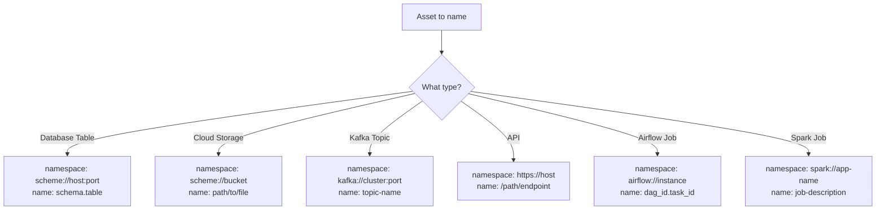

---

## 5.7 Transport Backends

Transports define **how** events get from producers to consumers.

### Transport Comparison

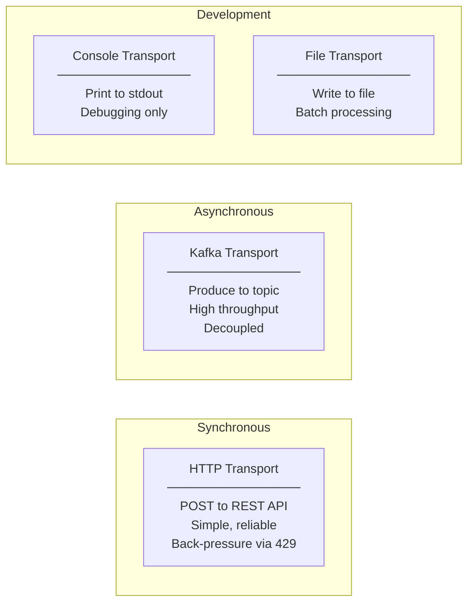

| Transport | Use Case | Pros | Cons |
|----------|----------|------|------|
| **HTTP** | Direct to Marquez/DataHub | Simple setup, immediate delivery | Coupling, back-pressure needed |
| **Kafka** | High-volume production | Decoupled, durable, scalable | Requires Kafka infrastructure |
| **Console** | Development & debugging | Zero setup | Not persistent |
| **File** | Batch/offline processing | Simple, reviewable | Manual consumption step |
| **Custom** | Special requirements | Full control | Must implement interface |

### Configuration Example

```yaml
# openlineage.yml: place in working directory or $HOME/.openlineage
transport:
  type: http
  url: http://marquez:5000/api/v1/lineage
  auth:
    type: api_key
    apiKey: ${MARQUEZ_API_KEY}
  compression: gzip
```

```yaml
# Kafka transport
transport:
  type: kafka
  topicName: openlineage.events
  properties:
    bootstrap.servers: kafka:9092
    acks: all
    retries: 3
  messageKey: ${JOB_NAMESPACE}/${JOB_NAME}
```

---

## 5.8 The Integration Ecosystem

OpenLineage has a broad ecosystem of integrations:

### Integration Map

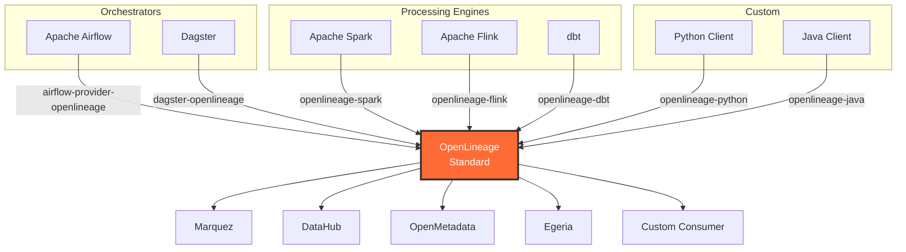

### Integration Maturity

```
                    Integration Maturity Levels
    ┌────────────────────────────────────────────────┐
    │ Integration      │ Maturity   │ Lineage Level  │
    ├────────────────────────────────────────────────┤
    │ Airflow          │ ████████░░ │ Table + Column  │
    │ Spark            │ █████████░ │ Table + Column  │
    │ dbt              │ ████████░░ │ Table + Column  │
    │ Flink            │ ██████░░░░ │ Table           │
    │ Dagster          │ ███████░░░ │ Table           │
    │ Great Expect.    │ █████░░░░░ │ Quality facets  │
    │ Trino/Presto     │ ██████░░░░ │ Table           │
    │ Snowflake        │ ████░░░░░░ │ Via SQL parse   │
    │ BigQuery         │ ████░░░░░░ │ Via SQL parse   │
    └────────────────────────────────────────────────┘
    Scale: ░ = planned  █ = implemented
```

---

## 5.9 Emitting OpenLineage Events in Python

The `openlineage-python` client library lets you emit events from custom code.

### Installation

```bash
pixi add --pypi openlineage-python
```

### Basic Event Emission

```python
from openlineage.client import OpenLineageClient
from openlineage.client.event_v2 import RunEvent, RunState, Run, Job, Dataset
from openlineage.client.facet_v2 import (
    schema_dataset_facet,
    sql_job_facet,
    output_statistics_output_dataset_facet,
    nominal_time_run_facet,
)
from openlineage.client.uuid import generate_new_uuid
from datetime import datetime, timezone


def create_client() -> OpenLineageClient:
    """Create an OpenLineage client (uses openlineage.yml config)."""
    # If openlineage.yml exists, it's auto-loaded
    # For console output during development:
    from openlineage.client.transport.console import ConsoleTransport
    return OpenLineageClient(transport=ConsoleTransport())


def emit_etl_lineage():
    """Emit lineage events for a sample ETL job."""
    client = create_client()
    run_id = str(generate_new_uuid())
    job_namespace = "my-etl-pipeline"
    job_name = "load_daily_orders"
    now = datetime.now(timezone.utc)

    # --- Define datasets ---
    input_dataset = Dataset(
        namespace="postgres://prod-db",
        name="public.raw_orders",
        facets={
            "schema": schema_dataset_facet.SchemaDatasetFacet(
                fields=[
                    schema_dataset_facet.SchemaDatasetFacetFields(
                        name="order_id", type="BIGINT"
                    ),
                    schema_dataset_facet.SchemaDatasetFacetFields(
                        name="total", type="DECIMAL(10,2)"
                    ),
                    schema_dataset_facet.SchemaDatasetFacetFields(
                        name="created_at", type="TIMESTAMP"
                    ),
                ]
            )
        },
    )

    output_dataset = Dataset(
        namespace="snowflake://my-account",
        name="staging.stg_orders",
        facets={
            "schema": schema_dataset_facet.SchemaDatasetFacet(
                fields=[
                    schema_dataset_facet.SchemaDatasetFacetFields(
                        name="order_id", type="NUMBER(19,0)"
                    ),
                    schema_dataset_facet.SchemaDatasetFacetFields(
                        name="total", type="NUMBER(10,2)"
                    ),
                    schema_dataset_facet.SchemaDatasetFacetFields(
                        name="created_at", type="TIMESTAMP_NTZ"
                    ),
                ]
            )
        },
    )

    # --- Emit START event ---
    start_event = RunEvent(
        eventType=RunState.START,
        eventTime=now.isoformat(),
        run=Run(
            runId=run_id,
            facets={
                "nominalTime": nominal_time_run_facet.NominalTimeRunFacet(
                    nominalStartTime=now.isoformat(),
                    nominalEndTime=now.isoformat(),
                )
            },
        ),
        job=Job(
            namespace=job_namespace,
            name=job_name,
            facets={
                "sql": sql_job_facet.SQLJobFacet(
                    query="INSERT INTO staging.stg_orders SELECT * FROM public.raw_orders"
                )
            },
        ),
        inputs=[input_dataset],
        outputs=[],
        producer="https://my-lineage-producer",
    )
    client.emit(start_event)
    print(f"Emitted START event for run {run_id}")

    # --- Simulate ETL work ---
    # ... your actual ETL logic here ...

    # --- Emit COMPLETE event ---
    complete_event = RunEvent(
        eventType=RunState.COMPLETE,
        eventTime=datetime.now(timezone.utc).isoformat(),
        run=Run(runId=run_id),
        job=Job(namespace=job_namespace, name=job_name),
        inputs=[input_dataset],
        outputs=[output_dataset],
        producer="https://my-lineage-producer",
    )
    client.emit(complete_event)
    print(f"Emitted COMPLETE event for run {run_id}")


if __name__ == "__main__":
    emit_etl_lineage()
```

### Event Flow Visualization

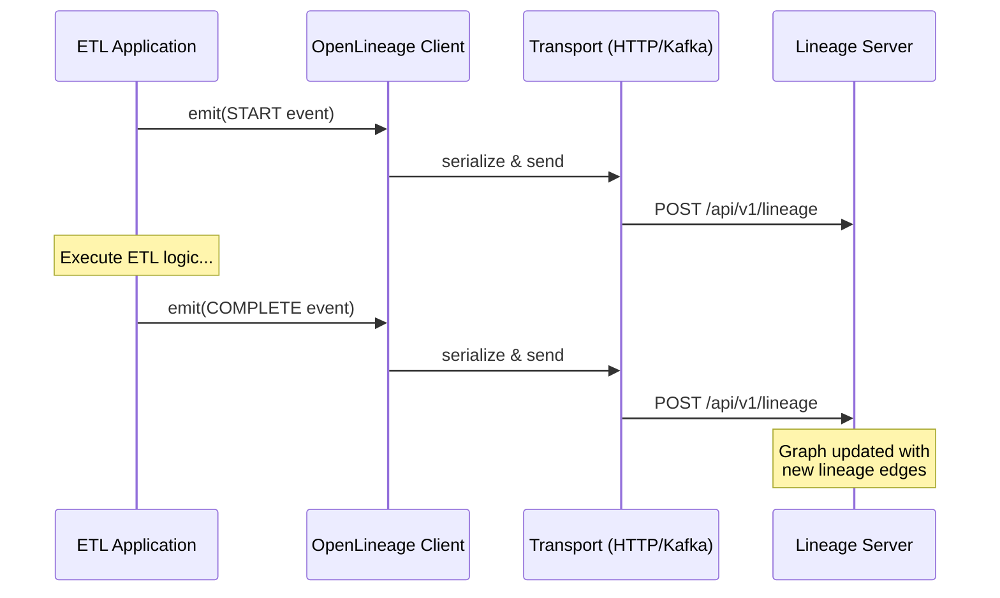

---

## 5.10 Consuming OpenLineage Events

On the consumer side, lineage servers process events and build the graph.

### Marquez API Example

```python
import httpx


def query_marquez_lineage(
    base_url: str = "http://localhost:5000",
    namespace: str = "my-etl-pipeline",
    job_name: str = "load_daily_orders",
) -> dict:
    """Query Marquez for lineage information."""
    client = httpx.Client(base_url=base_url)

    # Get job details
    job = client.get(f"/api/v1/namespaces/{namespace}/jobs/{job_name}").json()
    print(f"Job: {job['name']}")
    print(f"Latest run: {job.get('latestRun', {}).get('state', 'unknown')}")

    # Get lineage graph
    lineage = client.get(
        "/api/v1/lineage",
        params={"nodeId": f"job:{namespace}:{job_name}", "depth": 5},
    ).json()

    # Count nodes by type
    datasets = [n for n in lineage.get("graph", []) if n["type"] == "DATASET"]
    jobs = [n for n in lineage.get("graph", []) if n["type"] == "JOB"]
    print(f"Lineage graph: {len(datasets)} datasets, {len(jobs)} jobs")

    return lineage
```

### Event Processing Pipeline

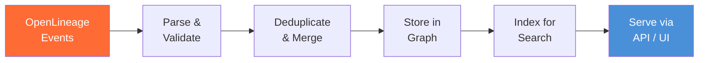

---

## 5.11 Exercise

> **Exercise**: Open [`exercises/ch05_openlineage_events.py`](../exercises/ch05_openlineage_events.py)
> and complete the following tasks:
>
> 1. Create an OpenLineage client with Console transport
> 2. Emit a START → COMPLETE event pair for a fictional ETL job
> 3. Add schema facets to both input and output datasets
> 4. Add a SQL facet to the job
> 5. Emit a FAIL event with an error message facet
> 6. **Bonus**: Implement a custom facet for tracking data freshness

---

## 5.12 Summary

In this chapter, you learned:

- **OpenLineage** is the open standard for lineage event collection, replacing vendor-specific formats
- The architecture follows a **producer → transport → consumer** pattern
- The core data model has four entities: **Job**, **Run**, **Dataset**, and **RunEvent**
- **Facets** provide extensible metadata without bloating the core spec
- **Namespaces** and naming conventions are critical for graph integrity
- **Transports** (HTTP, Kafka, Console, File) define how events are delivered
- The **integration ecosystem** covers Kedro, Airflow, Spark, dbt, Flink, and more
- The `openlineage-python` library lets you **emit events** from custom code

### Key Takeaway

> OpenLineage is the lingua franca of data lineage. Learn it once, and you can
> instrument any pipeline, integrate with any lineage server, and participate in
> a growing open-source ecosystem. Start by adding the Console transport to
> your existing pipelines. Seeing the events flow is the best way to learn.

---

### What's Next

In [Chapter 6: SQL Lineage Parsing](06-sql-lineage-parsing.md), we'll explore how to extract lineage directly from SQL statements, with no runtime instrumentation required.

---

[&larr; Back to Index](../index.md) | [Previous: Chapter 4](04-your-first-lineage-graph.md) | [Next: Chapter 6 &rarr;](06-sql-lineage-parsing.md)
