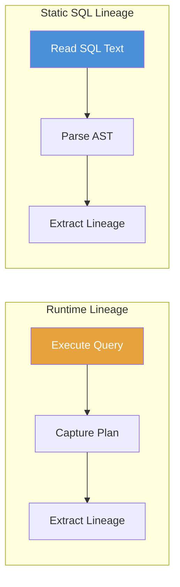
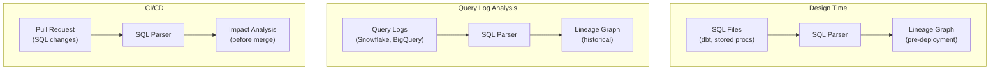
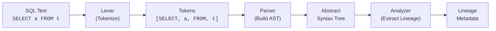
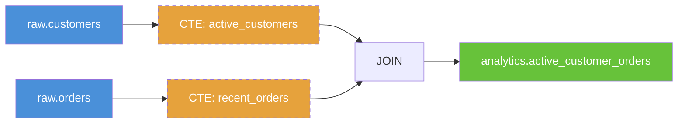
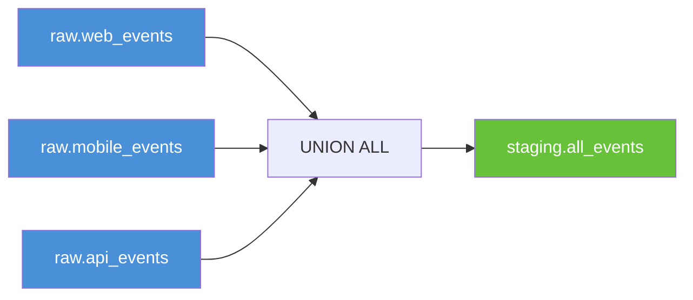
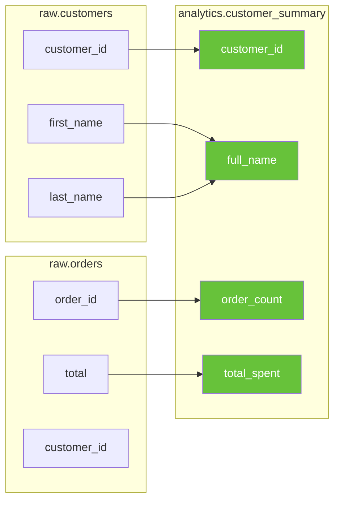
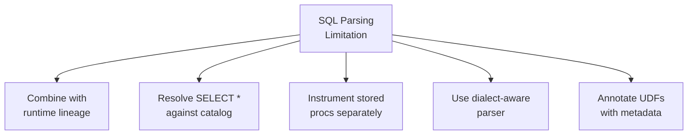
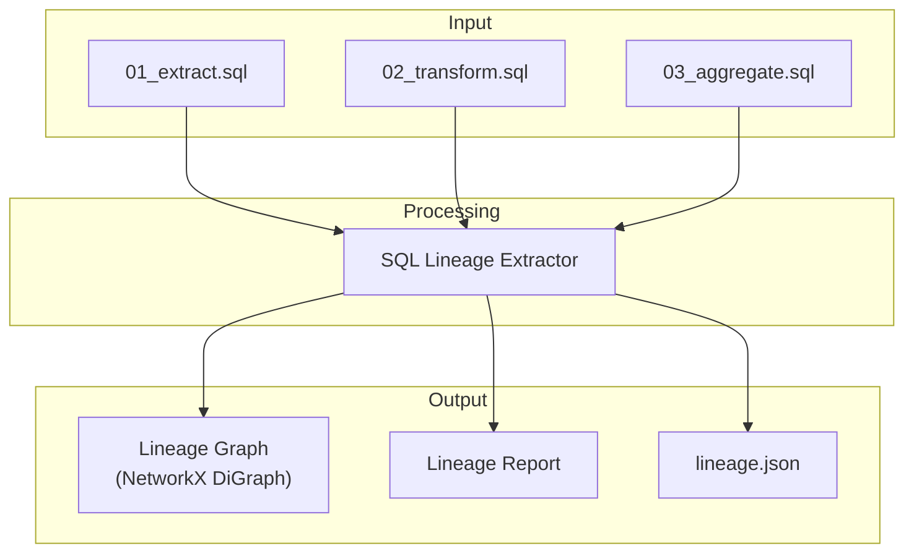

# Chapter 6: SQL Lineage Parsing

[&larr; Back to Index](../index.md) | [Previous: Chapter 5](05-openlineage-standard.md)

---

## Chapter Contents

- [6.1 Why Parse SQL for Lineage?](#61-why-parse-sql-for-lineage)
- [6.2 How SQL Parsing Works](#62-how-sql-parsing-works)
- [6.3 Introducing SQLLineage](#63-introducing-sqllineage)
- [6.4 Table-Level Lineage from SQL](#64-table-level-lineage-from-sql)
- [6.5 Handling Complex SQL Patterns](#65-handling-complex-sql-patterns)
- [6.6 Column-Level Lineage from SQL](#66-column-level-lineage-from-sql)
- [6.7 Limitations and Edge Cases](#67-limitations-and-edge-cases)
- [6.8 Alternative SQL Parsers](#68-alternative-sql-parsers)
- [6.9 Building a SQL Lineage Extractor](#69-building-a-sql-lineage-extractor)
- [6.10 Exercise](#610-exercise)
- [6.11 Summary](#611-summary)

---

## 6.1 Why Parse SQL for Lineage?

SQL is the dominant language for data transformation. Most data pipelines (whether in Spark, dbt, Airflow, or plain scripts) ultimately execute SQL. Parsing SQL lets you extract lineage **without running the query**.



### Benefits of Static SQL Parsing

| Benefit | Description |
|---------|-------------|
| **No execution required** | Extract lineage before deploying: in CI/CD, code review, or planning |
| **Zero runtime overhead** | No performance impact on production queries |
| **Historical analysis** | Parse query logs to reconstruct past lineage |
| **Design-time validation** | Verify lineage in pull requests before merging |
| **Language-agnostic** | Works with any system that executes SQL |

### Where SQL Lineage Parsing Fits



---

## 6.2 How SQL Parsing Works

SQL parsing follows the same principles as any programming language parser:

### The Parsing Pipeline



### Abstract Syntax Tree Example

For the SQL statement:

```sql
SELECT o.order_id, c.name, o.total
FROM orders o
JOIN customers c ON o.customer_id = c.id
WHERE o.status = 'completed'
```

The AST looks like:

```
SELECT Statement
├── Columns
│   ├── o.order_id     → Source: orders.order_id
│   ├── c.name         → Source: customers.name
│   └── o.total        → Source: orders.total
├── FROM
│   ├── Table: orders (alias: o)
│   └── JOIN
│       ├── Table: customers (alias: c)
│       └── ON: o.customer_id = c.id
└── WHERE
    └── o.status = 'completed'
```

From this AST, we can extract:

- **Table-level lineage**: `orders` → query → result, `customers` → query → result
- **Column-level lineage**: `orders.order_id` → `order_id`, `customers.name` → `name`, `orders.total` → `total`
- **Filter conditions**: `orders.status` is used in a filter (column accessed but not output)

---

## 6.3 Introducing SQLLineage

[SQLLineage](https://github.com/reata/sqllineage) is an open-source Python library that parses SQL and extracts lineage metadata.

### Installation

```bash
pixi add --pypi sqllineage
```

### Quick Start

```python
from sqllineage.runner import LineageRunner

sql = """
INSERT INTO staging.stg_orders
SELECT o.order_id, o.total, c.name AS customer_name
FROM raw.orders o
JOIN raw.customers c ON o.customer_id = c.customer_id
"""

result = LineageRunner(sql)

# Table-level lineage
print("Source tables:", result.source_tables())
print("Target tables:", result.target_tables())
```

Output:

```
Source tables: [Table: raw.orders, Table: raw.customers]
Target tables: [Table: staging.stg_orders]
```

### Visualizing SQL Lineage

SQLLineage includes a built-in web visualization:

```bash
# Launch the web UI
sqllineage -g -e "INSERT INTO t3 SELECT * FROM t1 JOIN t2 ON t1.id = t2.id"
# Opens browser at http://localhost:5000 with interactive graph
```

---

## 6.4 Table-Level Lineage from SQL

Let's extract table-level lineage from various SQL patterns:

### Simple SELECT INTO

```python
from sqllineage.runner import LineageRunner


def extract_table_lineage(sql: str) -> dict:
    """Extract source and target tables from a SQL statement."""
    result = LineageRunner(sql)
    return {
        "sources": [str(t) for t in result.source_tables()],
        "targets": [str(t) for t in result.target_tables()],
    }


# Example 1: Simple INSERT
lineage = extract_table_lineage("""
    INSERT INTO analytics.dim_orders
    SELECT * FROM staging.stg_orders
""")
print(lineage)
# {'sources': ['staging.stg_orders'], 'targets': ['analytics.dim_orders']}
```

### Multi-Table JOIN

```python
# Example 2: JOIN with multiple sources
lineage = extract_table_lineage("""
    CREATE TABLE analytics.customer_orders AS
    SELECT c.name, o.total, p.product_name
    FROM staging.customers c
    JOIN staging.orders o ON c.id = o.customer_id
    JOIN staging.products p ON o.product_id = p.id
""")
print(lineage)
# {'sources': ['staging.customers', 'staging.orders', 'staging.products'],
#  'targets': ['analytics.customer_orders']}
```

### Multi-Statement Script

```python
# Example 3: Multiple statements, each building on the previous
sql_script = """
    CREATE TABLE staging.clean_orders AS
    SELECT * FROM raw.orders WHERE status != 'cancelled';

    INSERT INTO analytics.daily_revenue
    SELECT date, SUM(total) AS revenue
    FROM staging.clean_orders
    GROUP BY date;
"""

result = LineageRunner(sql_script)
print("Sources:", [str(t) for t in result.source_tables()])
print("Targets:", [str(t) for t in result.target_tables()])
# Sources: ['raw.orders', 'staging.clean_orders']
# Targets: ['staging.clean_orders', 'analytics.daily_revenue']
```

The resulting lineage graph:


---

## 6.5 Handling Complex SQL Patterns

Real-world SQL is rarely simple. Here's how SQLLineage handles common patterns:

### Common Table Expressions (CTEs)

```python
cte_sql = """
    WITH active_customers AS (
        SELECT customer_id, name
        FROM raw.customers
        WHERE status = 'active'
    ),
    recent_orders AS (
        SELECT customer_id, total, created_at
        FROM raw.orders
        WHERE created_at >= '2025-01-01'
    )
    INSERT INTO analytics.active_customer_orders
    SELECT ac.name, ro.total, ro.created_at
    FROM active_customers ac
    JOIN recent_orders ro ON ac.customer_id = ro.customer_id
"""

lineage = extract_table_lineage(cte_sql)
print(lineage)
# {'sources': ['raw.customers', 'raw.orders'],
#  'targets': ['analytics.active_customer_orders']}
```

The parser resolves CTEs transparently, "seeing through" them to the underlying tables:



> **Note**: Dashed nodes (CTEs) are intermediate and not materialized.
> The lineage correctly connects the real source tables to the real target.

### Subqueries

```python
subquery_sql = """
    INSERT INTO analytics.high_value_customers
    SELECT customer_id, name
    FROM raw.customers
    WHERE customer_id IN (
        SELECT customer_id
        FROM raw.orders
        GROUP BY customer_id
        HAVING SUM(total) > 10000
    )
"""

lineage = extract_table_lineage(subquery_sql)
print(lineage)
# {'sources': ['raw.customers', 'raw.orders'],
#  'targets': ['analytics.high_value_customers']}
```

### UNION / UNION ALL

```python
union_sql = """
    CREATE TABLE staging.all_events AS
    SELECT event_id, event_type, created_at FROM raw.web_events
    UNION ALL
    SELECT event_id, event_type, created_at FROM raw.mobile_events
    UNION ALL
    SELECT event_id, event_type, created_at FROM raw.api_events
"""

lineage = extract_table_lineage(union_sql)
print(lineage)
# {'sources': ['raw.web_events', 'raw.mobile_events', 'raw.api_events'],
#  'targets': ['staging.all_events']}
```



### Views

```python
view_sql = """
    CREATE VIEW analytics.v_monthly_revenue AS
    SELECT
        DATE_TRUNC('month', o.created_at) AS month,
        SUM(o.total) AS revenue,
        COUNT(DISTINCT o.customer_id) AS unique_customers
    FROM staging.stg_orders o
    GROUP BY 1
"""

lineage = extract_table_lineage(view_sql)
print(lineage)
# Views are treated as targets just like tables
# {'sources': ['staging.stg_orders'], 'targets': ['analytics.v_monthly_revenue']}
```

---

## 6.6 Column-Level Lineage from SQL

SQLLineage also supports column-level lineage extraction:

```python
from sqllineage.runner import LineageRunner


def extract_column_lineage(sql: str) -> dict:
    """Extract column-level lineage from SQL."""
    result = LineageRunner(sql)

    column_lineage = {}
    for col in result.get_column_lineage():
        # Each entry is a tuple of (source_column, target_column)
        src = col[0]
        tgt = col[-1]
        target_key = f"{tgt.raw_column.raw_name}"
        if target_key not in column_lineage:
            column_lineage[target_key] = []
        column_lineage[target_key].append(f"{src.raw_column.raw_name}")

    return column_lineage


sql = """
    INSERT INTO analytics.customer_summary
    SELECT
        c.customer_id,
        c.first_name || ' ' || c.last_name AS full_name,
        COUNT(o.order_id) AS order_count,
        SUM(o.total) AS total_spent
    FROM raw.customers c
    JOIN raw.orders o ON c.customer_id = o.customer_id
    GROUP BY c.customer_id, c.first_name, c.last_name
"""

col_lineage = extract_column_lineage(sql)
for target_col, source_cols in col_lineage.items():
    print(f"  {target_col} ← {', '.join(source_cols)}")
```

### Column Lineage Visualization



---

## 6.7 Limitations and Edge Cases

SQL parsing for lineage has notable limitations:

### Limitation Matrix

```
┌─────────────────────────────────────────────────────────────┐
│                SQL PARSING LIMITATIONS                       │
├─────────────────────┬───────────────────────────────────────┤
│ Limitation          │ Description                           │
├─────────────────────┼───────────────────────────────────────┤
│ Dynamic SQL         │ EXECUTE IMMEDIATE, string-built       │
│                     │ queries: can't parse what you         │
│                     │ can't see                             │
├─────────────────────┼───────────────────────────────────────┤
│ Stored Procedures   │ Procedural logic (IF/ELSE, loops)     │
│                     │ may generate different queries at     │
│                     │ runtime                               │
├─────────────────────┼───────────────────────────────────────┤
│ Dialect Differences │ Snowflake vs BigQuery vs Postgres     │
│                     │ syntax variations                     │
├─────────────────────┼───────────────────────────────────────┤
│ UDFs / UDTFs        │ User-defined functions hide           │
│                     │ internal lineage                      │
├─────────────────────┼───────────────────────────────────────┤
│ SELECT *            │ Without schema context, can't         │
│                     │ resolve to specific columns           │
├─────────────────────┼───────────────────────────────────────┤
│ Temp Tables         │ Created at runtime, may not           │
│                     │ exist in any catalog                  │
├─────────────────────┼───────────────────────────────────────┤
│ MERGE / UPSERT      │ Complex control flow makes            │
│                     │ lineage ambiguous                     │
└─────────────────────┴───────────────────────────────────────┘
```

### Mitigation Strategies



---

## 6.8 Alternative SQL Parsers

SQLLineage is not the only option. Here's how alternatives compare:

| Parser | Language | Column-Level | Dialects | Open Source |
|--------|----------|-------------|----------|-------------|
| **SQLLineage** | Python | Yes | ANSI, basic dialects | Yes |
| **sqlglot** | Python | Via analysis | 20+ dialects | Yes |
| **sqlfluff** | Python | Via parse tree | 15+ dialects | Yes |
| **Apache Calcite** | Java | Yes | Extensive | Yes |
| **Datafold** | SaaS | Yes | Many | No (commercial) |
| **SQLMesh** | Python | Yes | Many | Yes |

### sqlglot: A Multi-Dialect Parser

```python
import sqlglot
from sqlglot.lineage import lineage

# sqlglot provides dialect-aware parsing
sql = "SELECT a.id, b.name FROM schema1.table_a a JOIN schema1.table_b b ON a.id = b.id"

# Parse with specific dialect
parsed = sqlglot.parse(sql, dialect="snowflake")
print(parsed[0].sql(dialect="bigquery"))  # Transpile to another dialect!

# Extract lineage using sqlglot's lineage module
node = lineage("id", sql, dialect="snowflake")
print(f"Column 'id' comes from: {node.source.sql()}")
```

---

## 6.9 Building a SQL Lineage Extractor

Let's build a practical tool that processes a directory of SQL files and generates a complete lineage graph:

```python
import json
from pathlib import Path
from sqllineage.runner import LineageRunner
import networkx as nx


def build_lineage_from_sql_files(sql_dir: str) -> nx.DiGraph:
    """Parse all SQL files in a directory and build a lineage graph."""
    graph = nx.DiGraph()
    sql_path = Path(sql_dir)

    for sql_file in sorted(sql_path.glob("**/*.sql")):
        print(f"Parsing: {sql_file.name}")
        sql_content = sql_file.read_text()

        try:
            result = LineageRunner(sql_content)

            # Add source tables
            for source in result.source_tables():
                source_name = str(source)
                graph.add_node(source_name, node_type="dataset", role="source")

            # Add target tables
            for target in result.target_tables():
                target_name = str(target)
                graph.add_node(target_name, node_type="dataset", role="target")

            # Add the SQL file as a job node
            job_name = f"sql:{sql_file.stem}"
            graph.add_node(job_name, node_type="job", sql_file=str(sql_file))

            # Connect: sources → job → targets
            for source in result.source_tables():
                graph.add_edge(str(source), job_name, edge_type="input")
            for target in result.target_tables():
                graph.add_edge(job_name, str(target), edge_type="output")

        except Exception as e:
            print(f"  Warning: Failed to parse {sql_file.name}: {e}")

    return graph


def print_lineage_report(graph: nx.DiGraph) -> None:
    """Print a summary report of the lineage graph."""
    datasets = [n for n, d in graph.nodes(data=True) if d.get("node_type") == "dataset"]
    jobs = [n for n, d in graph.nodes(data=True) if d.get("node_type") == "job"]

    print(f"\n{'='*60}")
    print(f"SQL Lineage Report")
    print(f"{'='*60}")
    print(f"Datasets: {len(datasets)}")
    print(f"SQL Jobs:  {len(jobs)}")
    print(f"Edges:    {graph.number_of_edges()}")
    print(f"Is DAG:   {nx.is_directed_acyclic_graph(graph)}")

    # Source tables (no upstream)
    sources = [n for n in datasets if graph.in_degree(n) == 0]
    print(f"\nSource tables (no upstream): {len(sources)}")
    for s in sorted(sources):
        print(f"  {s}")

    # Sink tables (no downstream)
    sinks = [n for n in datasets if graph.out_degree(n) == 0]
    print(f"\nSink tables (no downstream): {len(sinks)}")
    for s in sorted(sinks):
        print(f"  {s}")

    # Most connected datasets
    print(f"\nMost connected datasets:")
    connectivity = [(n, graph.in_degree(n) + graph.out_degree(n)) for n in datasets]
    for name, degree in sorted(connectivity, key=lambda x: x[1], reverse=True)[:5]:
        print(f"  {name}: {degree} connections")
```

### Pipeline Visualization



---

## 6.10 Exercise

> **Exercise**: Open [`exercises/ch06_sql_parsing.py`](../exercises/ch06_sql_parsing.py)
> and complete the following tasks:
>
> 1. Parse a set of provided SQL statements and extract table-level lineage
> 2. Handle CTEs, subqueries, and UNION ALL statements
> 3. Extract column-level lineage for a complex JOIN query
> 4. Build a NetworkX graph from the parsed lineage
> 5. Generate a lineage report showing source tables, sink tables, and the most connected nodes
> 6. **Bonus**: Compare results between SQLLineage and sqlglot for the same SQL

---

## 6.11 Summary

In this chapter, you learned:

- **SQL parsing** extracts lineage statically, without executing queries
- The parsing pipeline goes: SQL text → tokens → AST → lineage analysis
- **SQLLineage** provides table-level and column-level lineage extraction in Python
- Complex SQL patterns (CTEs, subqueries, UNION, views) are handled by "seeing through" to underlying tables
- **Limitations** include dynamic SQL, stored procedures, dialect differences, and UDFs
- **Alternative parsers** (sqlglot, sqlfluff, Calcite) offer different trade-offs
- You can build practical tools that parse SQL directories and generate lineage graphs

### Key Takeaway

> SQL parsing gives you lineage *before* code runs. Use it in CI/CD pipelines
> to detect breaking changes, in documentation generators to auto-map data
> flows, and as a complement to runtime lineage for full coverage.

---

### What's Next

In [Chapter 7: Apache Airflow & Marquez](07-airflow-and-marquez.md), we connect Airflow to OpenLineage for runtime lineage capture, and explore Marquez as a lineage metadata server.

---

[&larr; Back to Index](../index.md) | [Previous: Chapter 5](05-openlineage-standard.md) | [Next: Chapter 7 &rarr;](07-airflow-and-marquez.md)
