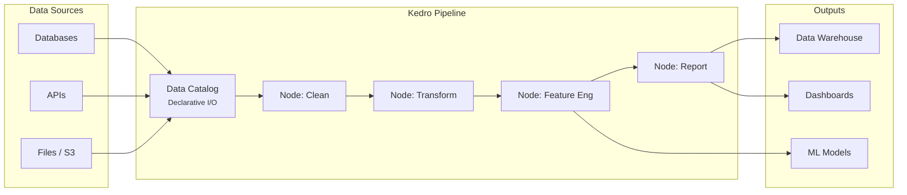
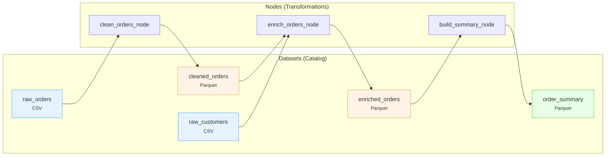
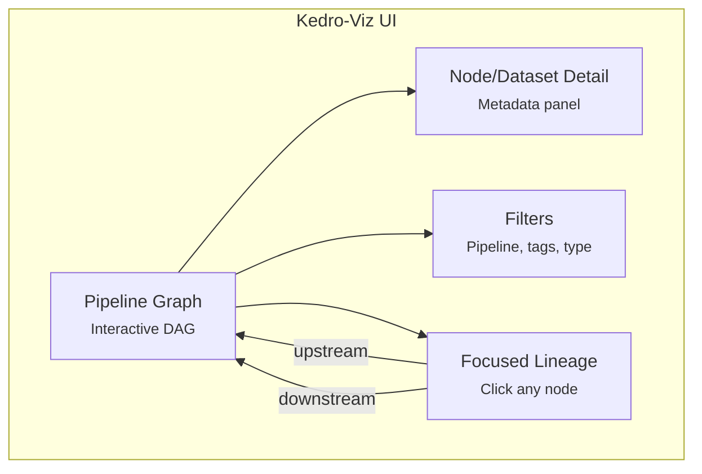
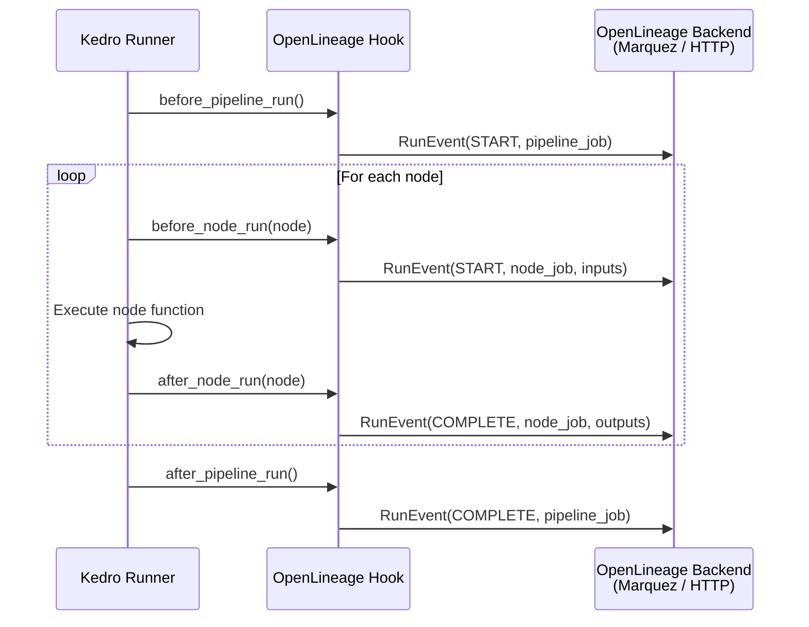
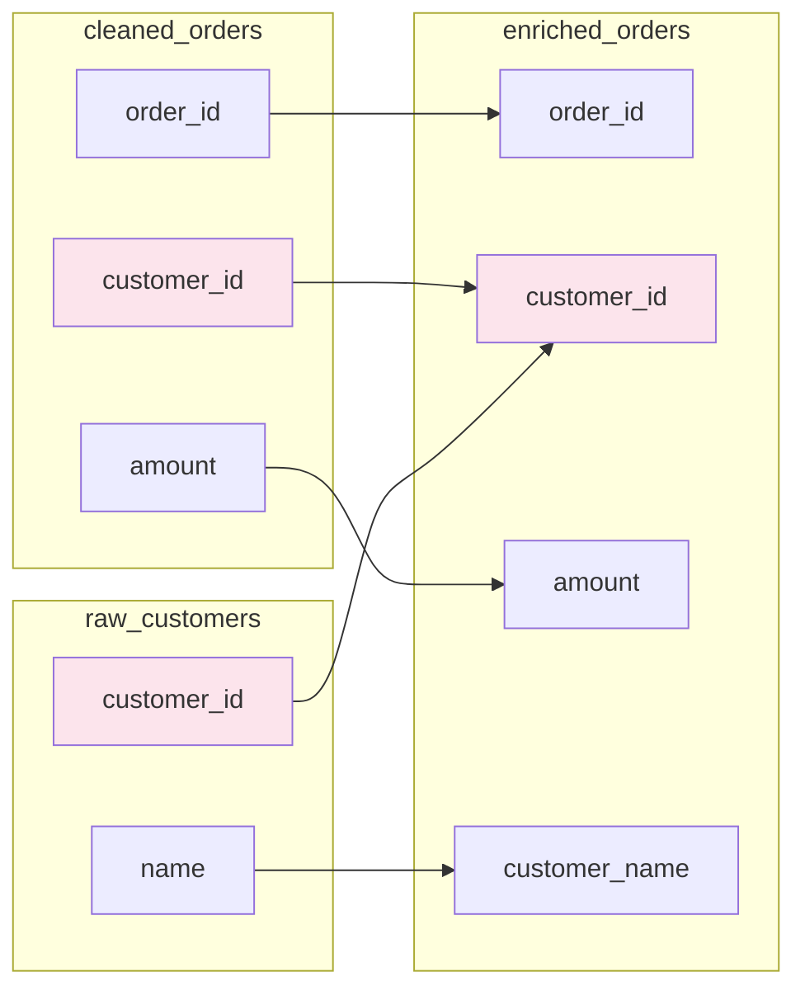

# Chapter 7: Kedro Lineage

[&larr; Back to Index](../index.md) | [Previous: Chapter 6](06-sql-lineage-parsing.md)

---

## Chapter Contents

- [7.1 Why Kedro for Data Lineage](#71-why-kedro-for-data-lineage)
- [7.2 Kedro Architecture Refresher](#72-kedro-architecture-refresher)
- [7.3 The Data Catalog: Lineage's Foundation](#73-the-data-catalog-lineages-foundation)
- [7.4 Pipeline Nodes and Dependency Graphs](#74-pipeline-nodes-and-dependency-graphs)
- [7.5 Kedro-Viz: Built-In Lineage Visualization](#75-kedro-viz-built-in-lineage-visualization)
- [7.6 Extracting Lineage from Kedro Programmatically](#76-extracting-lineage-from-kedro-programmatically)
- [7.7 Kedro + OpenLineage Integration](#77-kedro--openlineage-integration)
- [7.8 Column-Level Lineage in Kedro Pipelines](#78-column-level-lineage-in-kedro-pipelines)
- [7.9 Common Kedro Lineage Patterns](#79-common-kedro-lineage-patterns)
- [7.10 Exercise](#710-exercise)
- [7.11 Summary](#711-summary)

---

## 7.1 Why Kedro for Data Lineage

[Kedro](https://kedro.org/) is an open-source Python framework for creating reproducible, maintainable, and modular data science and data engineering pipelines. Built by QuantumBlack (an AI company within McKinsey), Kedro emphasizes **software engineering best practices** applied to data work.

What makes Kedro uniquely suited for data lineage is that lineage is **built into its architecture** rather than bolted on as an afterthought:

| Feature | Lineage Benefit |
|---------|----------------|
| **Data Catalog** | Declares every dataset, its type, and its location — automatic dataset-level lineage |
| **Pipeline nodes** | Each node declares its inputs and outputs — automatic transformation-level lineage |
| **Kedro-Viz** | Built-in interactive lineage visualization with no extra tooling |
| **Modular pipelines** | Natural lineage boundaries that map to business domains |
| **Hooks system** | Extensible integration points for emitting lineage events to external systems |

### Where Kedro Fits in the Data Stack



### Kedro vs. Other Pipeline Tools for Lineage

| Aspect | Kedro | Airflow | Spark | dbt |
|--------|-------|---------|-------|-----|
| Primary purpose | Data pipeline framework | Workflow orchestration | Distributed compute | SQL transformation |
| Lineage granularity | Dataset + node | Task | Job + query plan | Model (SQL) |
| Lineage built-in? | **Yes** (Data Catalog + DAG) | Via OpenLineage plugin | Via OpenLineage plugin | Via manifest.json |
| Visualization | Kedro-Viz (built-in) | Airflow UI (DAG only) | Spark UI (stages) | dbt docs |
| Language | Python | Python (config) | Python/Scala/SQL | SQL |
| Column-level | Via node I/O tracking | Via OpenLineage | Via query plans | Via manifest |

---

## 7.2 Kedro Architecture Refresher

A Kedro project has a well-defined structure that makes lineage extraction straightforward:

```
my_kedro_project/
├── conf/                  # Configuration (catalog, parameters)
│   ├── base/
│   │   ├── catalog.yml    # ← Dataset declarations (lineage source)
│   │   └── parameters.yml
│   └── local/
├── src/
│   └── my_project/
│       ├── pipelines/     # ← Pipeline definitions (lineage graph)
│       │   ├── data_processing/
│       │   │   ├── nodes.py
│       │   │   └── pipeline.py
│       │   └── reporting/
│       │       ├── nodes.py
│       │       └── pipeline.py
│       └── pipeline_registry.py
└── pyproject.toml
```

### Key Kedro Concepts for Lineage

1. **Data Catalog** (`catalog.yml`): Declares every dataset, its storage type, and its path. This is the **single source of truth** for what data exists and where it lives.

2. **Nodes**: Pure Python functions wrapped in `node()` calls that declare their inputs and outputs by name. These names map directly to Data Catalog entries.

3. **Pipelines**: Ordered collections of nodes. Kedro resolves the execution order automatically from input/output dependencies — it builds a **DAG**.

4. **Runners**: Execute the pipeline (sequentially, in parallel, or on distributed infrastructure). Runners can be instrumented for runtime lineage.

```python
# A simple Kedro node — inputs and outputs are explicit
from kedro.pipeline import node

clean_node = node(
    func=clean_raw_orders,          # Pure Python function
    inputs="raw_orders",            # ← Catalog dataset name (input lineage)
    outputs="cleaned_orders",       # ← Catalog dataset name (output lineage)
    name="clean_raw_orders_node",   # ← Job/task identity for lineage
)
```

> Every Kedro node is a **self-documenting lineage edge**: it explicitly states where data comes from and where it goes.

---

## 7.3 The Data Catalog: Lineage's Foundation

The Data Catalog is Kedro's declarative data layer. Every dataset in the pipeline is registered here with its type, location, and configuration.

### Example catalog.yml

```yaml
# conf/base/catalog.yml

raw_orders:
  type: pandas.CSVDataset
  filepath: data/01_raw/orders.csv

raw_customers:
  type: pandas.CSVDataset
  filepath: data/01_raw/customers.csv

cleaned_orders:
  type: pandas.ParquetDataset
  filepath: data/02_intermediate/cleaned_orders.parquet

enriched_orders:
  type: pandas.ParquetDataset
  filepath: data/03_primary/enriched_orders.parquet

order_summary:
  type: pandas.ParquetDataset
  filepath: data/04_feature/order_summary.parquet

reporting_output:
  type: pandas.CSVDataset
  filepath: data/07_model_output/report.csv
```

### From Catalog to Lineage Metadata

Each catalog entry maps directly to a **Dataset** in lineage terms (as introduced in [Chapter 5](05-openlineage-standard.md)):

| Catalog Field | Lineage Concept | Example |
|--------------|----------------|---------|
| Key name | Dataset name | `raw_orders` |
| `type` | Dataset type / format | `pandas.CSVDataset` |
| `filepath` | Dataset location / namespace | `data/01_raw/orders.csv` |
| Layer convention | Data lifecycle stage | `01_raw` → raw, `03_primary` → curated |

### Lineage from Catalog Alone

Even without running the pipeline, you can extract **dataset inventory lineage** from the catalog:

```python
from kedro.io import DataCatalog
import yaml

with open("conf/base/catalog.yml") as f:
    catalog_config = yaml.safe_load(f)

for name, config in catalog_config.items():
    print(f"Dataset: {name}")
    print(f"  Type:     {config.get('type', 'MemoryDataset')}")
    print(f"  Location: {config.get('filepath', 'in-memory')}")
    print()
```

> **Note**: Kedro's layered data convention (`01_raw`, `02_intermediate`, `03_primary`, etc.) provides a natural lineage progression that mirrors the data lifecycle.

---

## 7.4 Pipeline Nodes and Dependency Graphs

### Defining Nodes

Kedro nodes are the **transformations** in your lineage graph. Each node wraps a pure Python function and declares its inputs and outputs:

```python
# src/my_project/pipelines/data_processing/nodes.py

import pandas as pd


def clean_raw_orders(raw_orders: pd.DataFrame) -> pd.DataFrame:
    """Remove duplicates and null order IDs."""
    return raw_orders.dropna(subset=["order_id"]).drop_duplicates("order_id")


def enrich_orders(
    cleaned_orders: pd.DataFrame,
    raw_customers: pd.DataFrame,
) -> pd.DataFrame:
    """Join orders with customer data."""
    return cleaned_orders.merge(raw_customers, on="customer_id", how="left")


def build_order_summary(enriched_orders: pd.DataFrame) -> pd.DataFrame:
    """Aggregate orders by customer."""
    return (
        enriched_orders.groupby("customer_id")
        .agg(
            total_orders=("order_id", "count"),
            total_amount=("amount", "sum"),
        )
        .reset_index()
    )
```

### Building the Pipeline

```python
# src/my_project/pipelines/data_processing/pipeline.py

from kedro.pipeline import Pipeline, node, pipeline
from .nodes import clean_raw_orders, enrich_orders, build_order_summary


def create_pipeline(**kwargs) -> Pipeline:
    return pipeline([
        node(
            func=clean_raw_orders,
            inputs="raw_orders",
            outputs="cleaned_orders",
            name="clean_orders_node",
        ),
        node(
            func=enrich_orders,
            inputs=["cleaned_orders", "raw_customers"],
            outputs="enriched_orders",
            name="enrich_orders_node",
        ),
        node(
            func=build_order_summary,
            inputs="enriched_orders",
            outputs="order_summary",
            name="build_summary_node",
        ),
    ])
```

### The Implicit Lineage Graph

When Kedro resolves this pipeline, it builds a DAG automatically:



### Extracting the DAG Programmatically

```python
from kedro.framework.project import pipelines

# After loading the Kedro project context
pipe = pipelines["__default__"]

# Node-level lineage
for kedro_node in pipe.nodes:
    print(f"Node: {kedro_node.name}")
    print(f"  Inputs:  {kedro_node.inputs}")
    print(f"  Outputs: {kedro_node.outputs}")
    print()

# Dataset dependencies
print("All datasets:", pipe.datasets())
print("Free inputs (external sources):", pipe.inputs())
print("Final outputs (terminal datasets):", pipe.outputs())
```

> **Key Insight**: Kedro's `Pipeline` object already *is* a lineage graph. The framework gives you the DAG for free — no parsing or instrumentation required.

---

## 7.5 Kedro-Viz: Built-In Lineage Visualization

[Kedro-Viz](https://github.com/kedro-org/kedro-viz) is a standalone web application that renders Kedro pipelines as interactive directed acyclic graphs. It ships as a Kedro plugin and requires no additional infrastructure.

### Running Kedro-Viz

```bash
# Install (if not already in your environment)
pip install kedro-viz

# Launch the visualization server
kedro viz run
# Opens http://localhost:4141 in your browser
```

### What Kedro-Viz Shows

| Feature | Description |
|---------|-------------|
| **Pipeline DAG** | Interactive graph of nodes and datasets |
| **Dataset details** | Type, filepath, layer, metadata |
| **Node details** | Function name, inputs, outputs, tags, namespace |
| **Pipeline filtering** | Filter by pipeline name, tag, or namespace |
| **Search** | Find any node or dataset by name |
| **Flowchart export** | Export the lineage graph as JSON or image |
| **Experiment tracking** | Compare metrics across pipeline runs |

### Kedro-Viz Lineage Features

Kedro-Viz provides three lineage views out of the box:

1. **Full pipeline graph**: Shows every node and dataset in the project
2. **Focused lineage**: Click any node or dataset to see only its upstream and downstream dependencies
3. **Modular pipeline view**: View lineage scoped to a specific sub-pipeline (namespace)



> **Exercise tip**: Run `kedro viz run` on the exercise project and explore the interactive graph. Click any node to see its focused lineage view.

---

## 7.6 Extracting Lineage from Kedro Programmatically

While Kedro-Viz provides a visual interface, you often need to extract lineage for integration with other systems (metadata catalogs, governance tools, custom UIs).

### Using the Kedro Session API

```python
from kedro.framework.session import KedroSession
from kedro.framework.startup import bootstrap_project
from pathlib import Path
import networkx as nx

# Bootstrap the Kedro project
project_path = Path(".")
bootstrap_project(project_path)

with KedroSession.create(project_path=project_path) as session:
    context = session.load_context()
    pipeline = context.pipeline

    # Build a NetworkX graph from the Kedro pipeline
    G = nx.DiGraph()

    for knode in pipeline.nodes:
        # Add node
        G.add_node(knode.name, node_type="task", func=knode.func.__name__)

        # Add dataset → node edges (inputs)
        for inp in knode.inputs:
            G.add_node(inp, node_type="dataset")
            G.add_edge(inp, knode.name)

        # Add node → dataset edges (outputs)
        for out in knode.outputs:
            G.add_node(out, node_type="dataset")
            G.add_edge(knode.name, out)

print(f"Lineage graph: {G.number_of_nodes()} nodes, {G.number_of_edges()} edges")
```

### Exporting Lineage as JSON

```python
import json

def pipeline_to_lineage_json(pipeline) -> dict:
    """Convert a Kedro pipeline to a lineage JSON document."""
    nodes = []
    edges = []

    for knode in pipeline.nodes:
        nodes.append({
            "id": knode.name,
            "type": "task",
            "function": knode.func.__name__,
            "tags": list(knode.tags),
            "namespace": knode.namespace,
        })
        for inp in knode.inputs:
            edges.append({"source": inp, "target": knode.name})
        for out in knode.outputs:
            edges.append({"source": knode.name, "target": out})

    # Add dataset nodes
    for ds_name in pipeline.datasets():
        nodes.append({
            "id": ds_name,
            "type": "dataset",
        })

    return {"nodes": nodes, "edges": edges}

lineage = pipeline_to_lineage_json(pipeline)
print(json.dumps(lineage, indent=2))
```

### Querying Lineage: Upstream and Downstream

```python
def get_upstream(pipeline, dataset_name: str) -> set:
    """Find all upstream datasets and nodes for a given dataset."""
    G = nx.DiGraph()
    for knode in pipeline.nodes:
        for inp in knode.inputs:
            G.add_edge(inp, knode.name)
        for out in knode.outputs:
            G.add_edge(knode.name, out)

    return nx.ancestors(G, dataset_name)


def get_downstream(pipeline, dataset_name: str) -> set:
    """Find all downstream datasets and nodes for a given dataset."""
    G = nx.DiGraph()
    for knode in pipeline.nodes:
        for inp in knode.inputs:
            G.add_edge(inp, knode.name)
        for out in knode.outputs:
            G.add_edge(knode.name, out)

    return nx.descendants(G, dataset_name)
```

---

## 7.7 Kedro + OpenLineage Integration

Kedro's hooks system lets you emit [OpenLineage](https://openlineage.io/) events at pipeline and node lifecycle points, connecting Kedro lineage to the wider OpenLineage ecosystem (Marquez, Atlan, DataHub, etc.).

### How Hook-Based Integration Works



### Implementing a Kedro OpenLineage Hook

```python
"""Hook that emits OpenLineage events from Kedro pipeline runs."""
from __future__ import annotations

import uuid
from datetime import datetime, timezone
from kedro.framework.hooks import hook_impl
from kedro.pipeline.node import Node


class OpenLineageHook:
    """Emit OpenLineage events for each node execution."""

    def __init__(self, namespace: str = "kedro", backend_url: str = "http://localhost:5000"):
        self.namespace = namespace
        self.backend_url = backend_url

    @hook_impl
    def before_node_run(self, node: Node, catalog, inputs, is_async, session_id):
        """Emit a START event before node execution."""
        event = {
            "eventType": "START",
            "eventTime": datetime.now(timezone.utc).isoformat(),
            "run": {
                "runId": str(uuid.uuid4()),
                "facets": {"kedro_session": {"sessionId": session_id}},
            },
            "job": {
                "namespace": self.namespace,
                "name": node.name,
                "facets": {
                    "sourceCode": {"language": "python", "source": node.func.__name__},
                },
            },
            "inputs": [
                {"namespace": self.namespace, "name": ds_name}
                for ds_name in node.inputs
            ],
            "outputs": [],
        }
        self._send_event(event)

    @hook_impl
    def after_node_run(self, node: Node, catalog, inputs, outputs, is_async, session_id):
        """Emit a COMPLETE event after node execution."""
        event = {
            "eventType": "COMPLETE",
            "eventTime": datetime.now(timezone.utc).isoformat(),
            "run": {
                "runId": str(uuid.uuid4()),
                "facets": {"kedro_session": {"sessionId": session_id}},
            },
            "job": {
                "namespace": self.namespace,
                "name": node.name,
            },
            "inputs": [
                {"namespace": self.namespace, "name": ds_name}
                for ds_name in node.inputs
            ],
            "outputs": [
                {"namespace": self.namespace, "name": ds_name}
                for ds_name in node.outputs
            ],
        }
        self._send_event(event)

    def _send_event(self, event: dict):
        """Send an OpenLineage event to the backend."""
        # In production, use httpx or the openlineage-python client
        import json
        print(f"[OpenLineage] {event['eventType']}: {event['job']['name']}")
        # httpx.post(f"{self.backend_url}/api/v1/lineage", json=event)
```

### Registering the Hook

```python
# src/my_project/settings.py
from my_project.hooks import OpenLineageHook

HOOKS = (OpenLineageHook(namespace="my-kedro-project"),)
```

### OpenLineage Facet Mapping

| Kedro Concept | OpenLineage Mapping |
|--------------|-------------------|
| Pipeline run | Parent `RunEvent` for the pipeline job |
| Node execution | Child `RunEvent` per node (START/COMPLETE/FAIL) |
| Catalog dataset (input) | `InputDataset` with namespace + name |
| Catalog dataset (output) | `OutputDataset` with namespace + name |
| Dataset type | `StorageDatasetFacet` (format, storageLayer) |
| Dataset filepath | `DatasetIdentifier` (namespace, name) |
| Node function name | `SourceCodeJobFacet` |
| Node tags | Custom facet |

---

## 7.8 Column-Level Lineage in Kedro Pipelines

While Kedro natively tracks dataset-level lineage (which datasets a node reads and writes), you can extend this to **column-level lineage** by tracking which columns flow through each transformation.

### Approach: Column Annotations on Nodes

```python
from kedro.pipeline import node


def enrich_orders(cleaned_orders, raw_customers):
    """Join orders with customer data."""
    return cleaned_orders.merge(raw_customers, on="customer_id", how="left")


# Annotate columns for lineage tracking
enrich_node = node(
    func=enrich_orders,
    inputs=["cleaned_orders", "raw_customers"],
    outputs="enriched_orders",
    name="enrich_orders_node",
    tags=["lineage:column-mapping"],
)

# Column lineage metadata (stored separately or as custom facets)
COLUMN_LINEAGE = {
    "enrich_orders_node": {
        "enriched_orders.order_id": [("cleaned_orders", "order_id")],
        "enriched_orders.customer_id": [
            ("cleaned_orders", "customer_id"),
            ("raw_customers", "customer_id"),
        ],
        "enriched_orders.amount": [("cleaned_orders", "amount")],
        "enriched_orders.customer_name": [("raw_customers", "name")],
    }
}
```

### Visualizing Column Flow



> Column-level lineage in Kedro requires manual annotation or runtime introspection of DataFrame schemas. We explore column-level lineage in depth in [Chapter 11](11-column-level-lineage.md).

---

## 7.9 Common Kedro Lineage Patterns

### Pattern 1: Modular Pipelines as Lineage Boundaries

Kedro supports **modular pipelines** — sub-pipelines that encapsulate a domain. Each modular pipeline is a lineage sub-graph:

```python
from kedro.pipeline.modular_pipeline import pipeline as modular_pipeline

# Create namespaced pipeline
data_processing = modular_pipeline(
    pipe=create_data_processing_pipeline(),
    namespace="data_processing",
    inputs={"raw_orders", "raw_customers"},
    outputs={"order_summary"},
)

# In lineage: datasets are prefixed with the namespace
# data_processing.cleaned_orders, data_processing.enriched_orders, etc.
```

### Pattern 2: Transcoding for Format-Aware Lineage

Kedro supports **transcoding** — the same logical dataset accessed through different I/O formats:

```yaml
# catalog.yml
orders@pandas:
  type: pandas.ParquetDataset
  filepath: data/orders.parquet

orders@spark:
  type: spark.SparkDataset
  filepath: data/orders.parquet
```

In lineage terms, `orders@pandas` and `orders@spark` point to the **same underlying dataset** — Kedro tracks this relationship automatically.

### Pattern 3: Pipeline Slicing for Impact Analysis

```python
# Slice the pipeline to see what's affected by a dataset change
affected = pipeline.from_inputs("raw_customers")
print("Nodes affected by raw_customers changes:")
for n in affected.nodes:
    print(f"  {n.name}: {n.inputs} → {n.outputs}")

# Or find what feeds a particular output
dependencies = pipeline.to_outputs("order_summary")
print("Nodes required to produce order_summary:")
for n in dependencies.nodes:
    print(f"  {n.name}: {n.inputs} → {n.outputs}")
```

> Pipeline slicing is essentially **lineage querying** built into the framework. `from_inputs()` is downstream impact analysis, and `to_outputs()` is upstream dependency analysis.

### Pattern 4: Hook-Based Runtime Lineage Capture

Use Kedro hooks to capture **runtime metadata** (timing, record counts, schema) alongside the structural lineage:

```python
from kedro.framework.hooks import hook_impl
from datetime import datetime, timezone


class RuntimeLineageHook:
    """Capture runtime lineage metadata."""

    def __init__(self):
        self.run_log = []

    @hook_impl
    def after_node_run(self, node, catalog, inputs, outputs, is_async, session_id):
        record = {
            "node": node.name,
            "timestamp": datetime.now(timezone.utc).isoformat(),
            "inputs": {},
            "outputs": {},
        }
        for name, data in inputs.items():
            record["inputs"][name] = {
                "rows": len(data) if hasattr(data, "__len__") else None,
                "columns": list(data.columns) if hasattr(data, "columns") else None,
            }
        for name, data in outputs.items():
            record["outputs"][name] = {
                "rows": len(data) if hasattr(data, "__len__") else None,
                "columns": list(data.columns) if hasattr(data, "columns") else None,
            }
        self.run_log.append(record)
```

---

## 7.10 Exercise

> **Exercise**: Open [`exercises/ch07_kedro_lineage.py`](../exercises/ch07_kedro_lineage.py)
> and complete the following tasks:
>
> 1. Define a Data Catalog configuration with multiple datasets across different layers
> 2. Build a Kedro-style pipeline with nodes declaring explicit inputs and outputs
> 3. Extract the pipeline dependency graph as a NetworkX DiGraph
> 4. Query upstream and downstream lineage for any dataset
> 5. Export the lineage graph as JSON compatible with Kedro-Viz format
> 6. **Bonus**: Add column-level lineage annotations and query column provenance

---

## 7.11 Summary

In this chapter, you learned:

- **Kedro** is a Python data pipeline framework with **lineage built into its architecture** through the Data Catalog and pipeline DAG
- The **Data Catalog** declaratively registers every dataset, providing automatic dataset-level lineage metadata
- **Pipeline nodes** explicitly declare their inputs and outputs, creating a self-documenting lineage graph
- **Kedro-Viz** provides built-in interactive lineage visualization with no additional infrastructure
- Kedro pipelines can be **programmatically traversed** to extract lineage using the Pipeline API and NetworkX
- **OpenLineage integration** via Kedro hooks connects Kedro lineage to the broader ecosystem (Marquez, DataHub, Atlan)
- **Modular pipelines**, **transcoding**, and **pipeline slicing** provide patterns for organizing and querying lineage at scale
- **Column-level lineage** can be layered onto Kedro nodes via manual annotation or runtime schema tracking

### Key Takeaway

> Kedro is unique among data pipeline frameworks because lineage is a first-class citizen, not an afterthought. The Data Catalog gives you dataset inventory, pipeline nodes give you transformation lineage, and Kedro-Viz gives you visualization — all without any external tooling. When you need to connect to the wider lineage ecosystem, Kedro's hooks make OpenLineage integration straightforward.

---

### What's Next

In [Chapter 8: Apache Airflow & Marquez](08-airflow-and-marquez.md), we'll see how workflow orchestrators capture runtime lineage and how Marquez serves as a lineage metadata server.

---

[&larr; Back to Index](../index.md) | [Previous: Chapter 6](06-sql-lineage-parsing.md) | [Next: Chapter 8 &rarr;](08-airflow-and-marquez.md)
