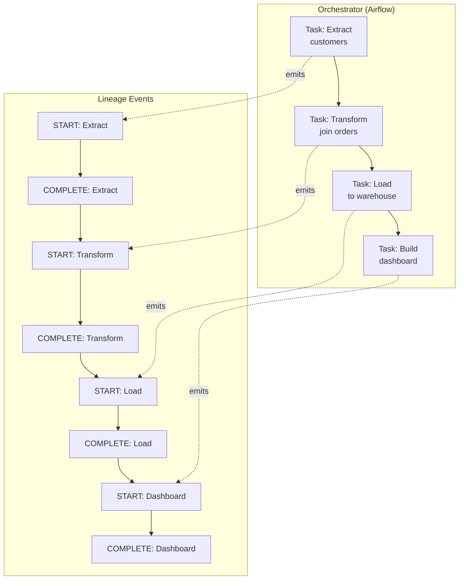
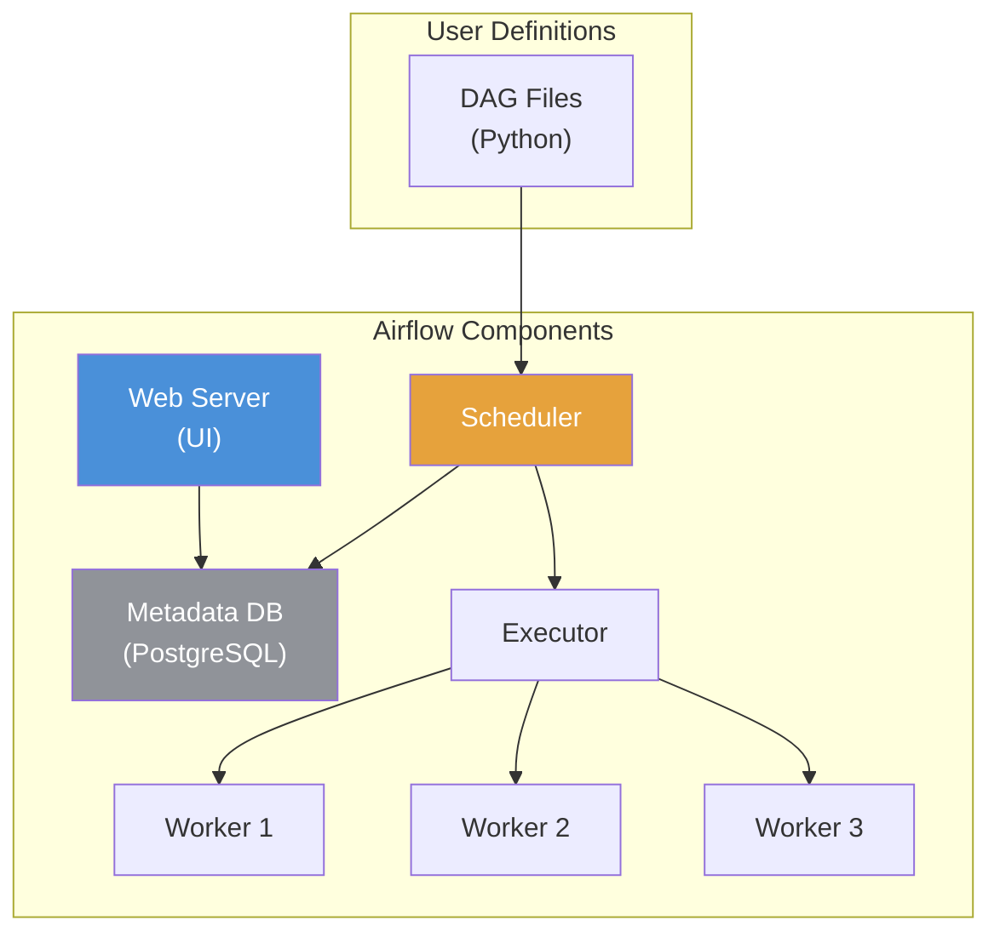
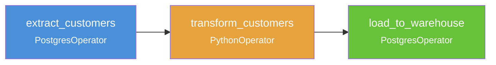
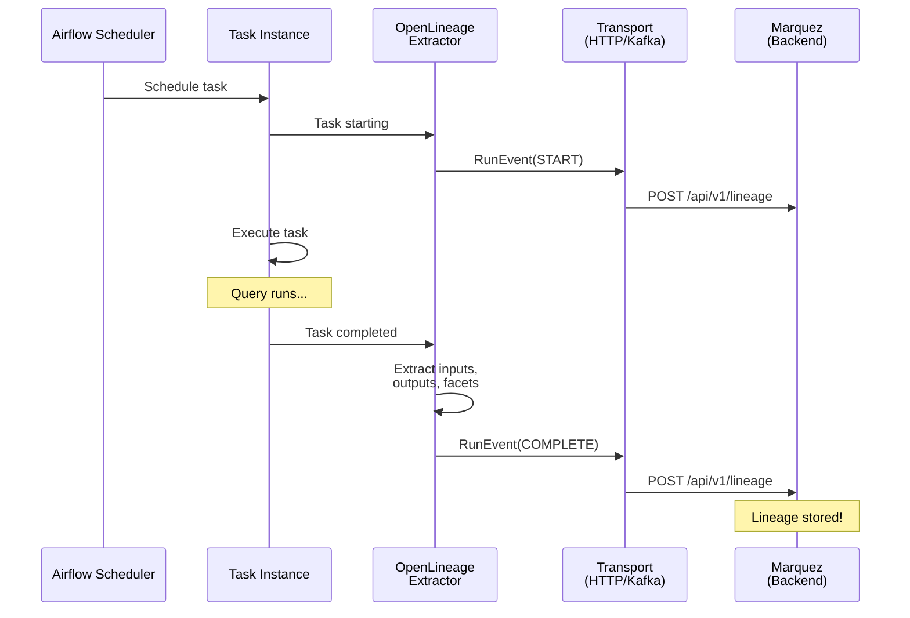
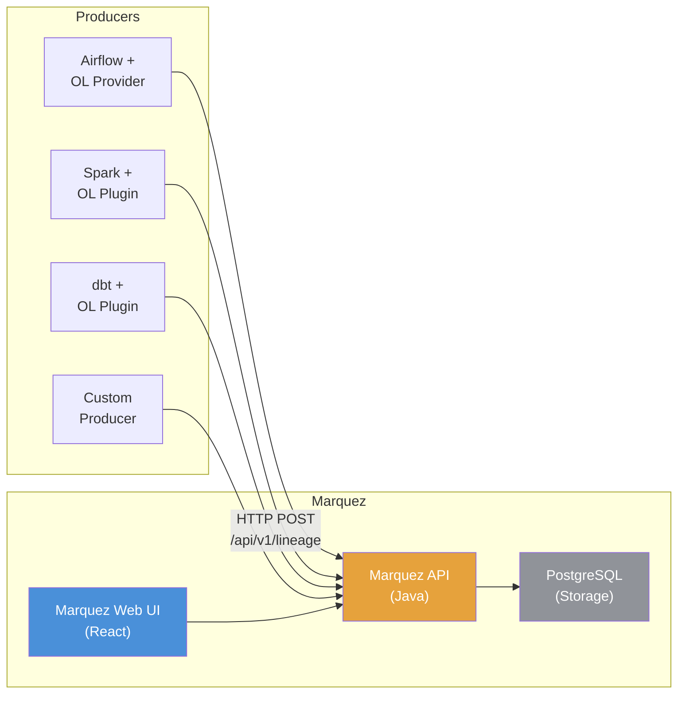
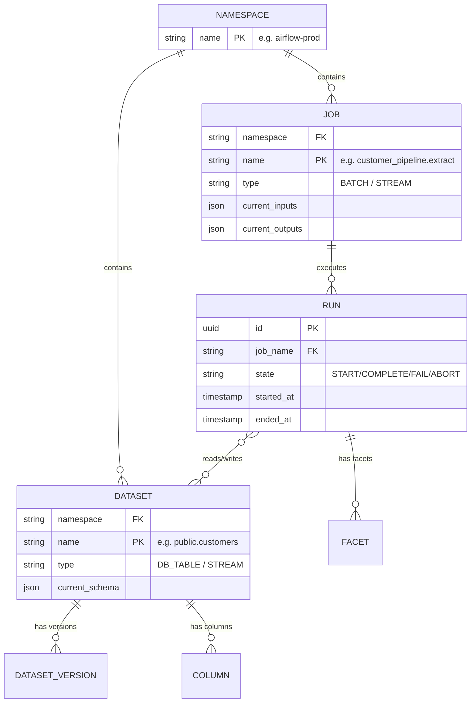
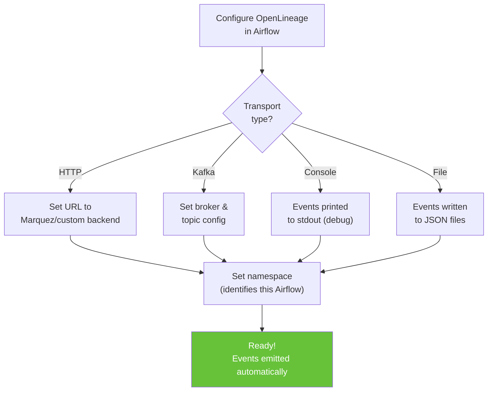
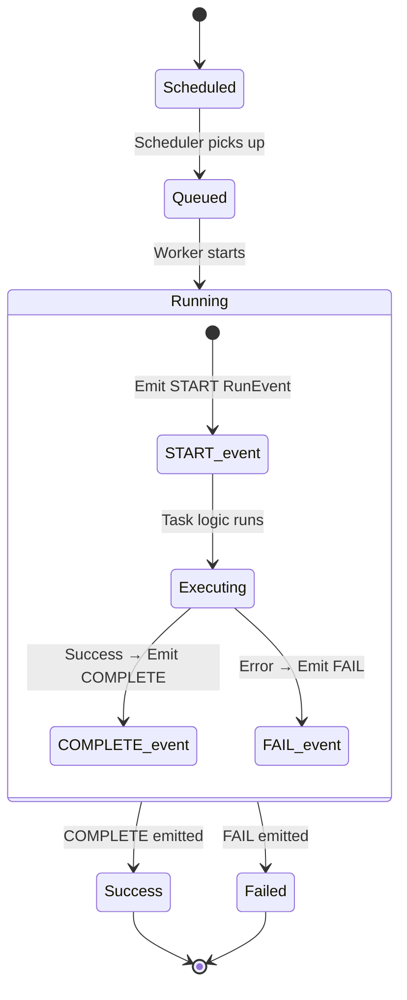
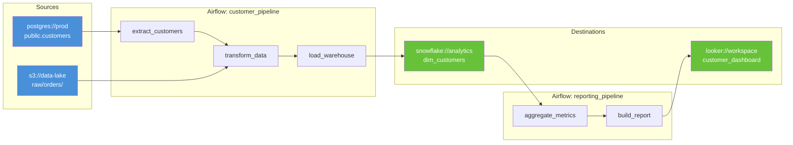
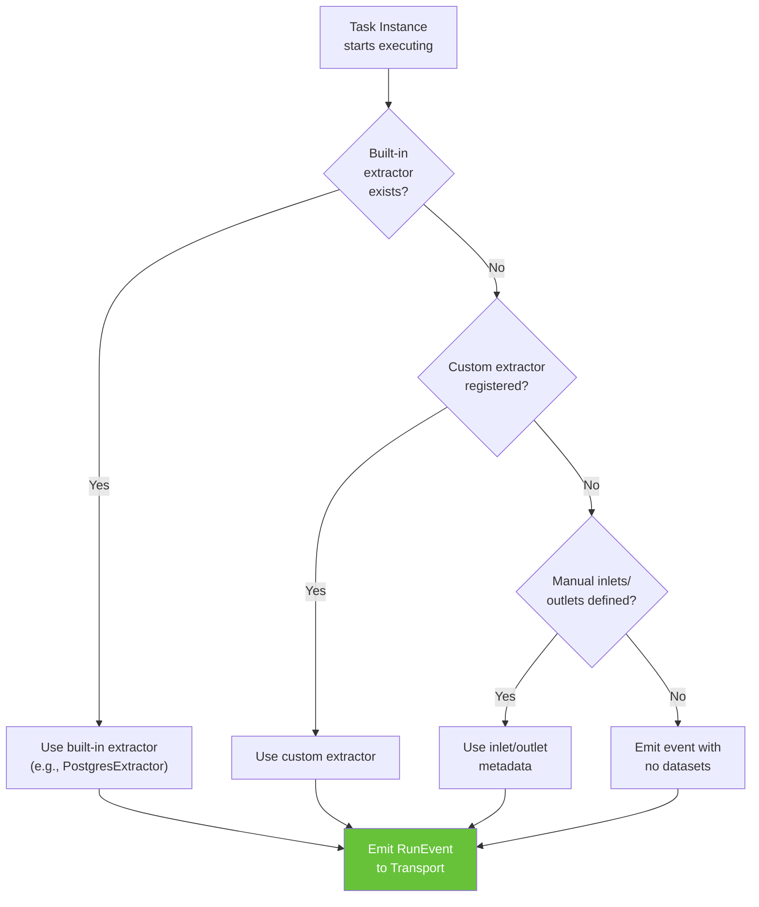

# Chapter 8: Apache Airflow & Marquez

[&larr; Back to Index](../index.md) | [Previous: Chapter 7](07-kedro-lineage.md)

---

## Chapter Contents

- [8.1 Why Orchestration Lineage Matters](#81-why-orchestration-lineage-matters)
- [8.2 Apache Airflow Primer](#82-apache-airflow-primer)
- [8.3 Lineage in Airflow: The OpenLineage Integration](#83-lineage-in-airflow-the-openlineage-integration)
- [8.4 Introducing Marquez](#84-introducing-marquez)
- [8.5 Setting Up Airflow with OpenLineage](#85-setting-up-airflow-with-openlineage)
- [8.6 How Airflow Emits Lineage Events](#86-how-airflow-emits-lineage-events)
- [8.7 Exploring Lineage in the Marquez UI](#87-exploring-lineage-in-the-marquez-ui)
- [8.8 Querying the Marquez API](#88-querying-the-marquez-api)
- [8.9 Custom Extractors](#89-custom-extractors)
- [8.10 Exercise](#810-exercise)
- [8.11 Summary](#811-summary)

---

## 8.1 Why Orchestration Lineage Matters

Data orchestrators schedule and coordinate the execution of data pipelines. They are the **control plane** of data engineering — they know *what* ran, *when*, *in what order*, and *whether it succeeded*.

This makes orchestrators the ideal place to capture **runtime lineage**.



### What Orchestrator Lineage Captures

| Metadata | Example |
|----------|---------|
| **Job identity** | `airflow.my_dag.extract_task` |
| **Run timing** | Started 2025-01-15T08:00:00, ended 08:02:34 |
| **Input datasets** | `postgres://prod/public.customers` |
| **Output datasets** | `s3://warehouse/staging/customers.parquet` |
| **Run state** | START → RUNNING → COMPLETE (or FAIL) |
| **Schema** | Columns: `id INT`, `name VARCHAR`, `email VARCHAR` |
| **Data quality** | 1,234,567 rows, 0 nulls in `id` column |

---

## 8.2 Apache Airflow Primer

[Apache Airflow](https://airflow.apache.org/) is the most widely adopted open-source workflow orchestrator. If you're new to Airflow, here's the core model:

### Airflow Architecture



### Key Concepts

- **DAG** (Directed Acyclic Graph): A collection of tasks with dependencies
- **Task**: A single unit of work (e.g., run a SQL query, execute a Python function)
- **Operator**: A template for a task (`BashOperator`, `PythonOperator`, `PostgresOperator`, etc.)
- **DAG Run**: A specific execution of a DAG at a point in time
- **Task Instance**: A specific execution of a task within a DAG run

### Example DAG

```python
from datetime import datetime
from airflow import DAG
from airflow.operators.python import PythonOperator
from airflow.providers.postgres.operators.postgres import PostgresOperator


with DAG(
    dag_id="customer_pipeline",
    start_date=datetime(2025, 1, 1),
    schedule="@daily",
    catchup=False,
) as dag:
    extract = PostgresOperator(
        task_id="extract_customers",
        postgres_conn_id="source_db",
        sql="SELECT * FROM customers WHERE updated_at >= '{{ ds }}'",
    )

    transform = PythonOperator(
        task_id="transform_customers",
        python_callable=transform_customer_data,
    )

    load = PostgresOperator(
        task_id="load_to_warehouse",
        postgres_conn_id="warehouse_db",
        sql="INSERT INTO warehouse.dim_customers SELECT * FROM staging.customers",
    )

    extract >> transform >> load
```

### DAG Dependency Flow



---

## 8.3 Lineage in Airflow: The OpenLineage Integration

Airflow integrates with OpenLineage through the `apache-airflow-providers-openlineage` package. This provider automatically captures lineage events from Airflow tasks.

### How It Works



### Built-In Extractors

The OpenLineage provider includes "extractors" that understand how to read lineage from specific operators:

```
┌──────────────────────────────────────────────────────────────┐
│           BUILT-IN OPENLINEAGE EXTRACTORS                    │
├────────────────────────────┬─────────────────────────────────┤
│ Operator                   │ What It Extracts                │
├────────────────────────────┼─────────────────────────────────┤
│ PostgresOperator           │ SQL → input/output tables       │
│ SnowflakeOperator          │ SQL → input/output tables       │
│ BigQueryInsertJobOperator  │ SQL → input/output tables       │
│ MySqlOperator              │ SQL → input/output tables       │
│ S3CopyObjectOperator       │ S3 bucket/key → datasets        │
│ GCSToGCSOperator           │ GCS bucket/object → datasets    │
│ SparkSubmitOperator        │ Delegates to Spark OL plugin    │
│ PythonOperator             │ via manual inlets/outlets       │
│ BashOperator               │ via manual inlets/outlets       │
│ GreatExpectationsOperator  │ Data quality facets             │
└────────────────────────────┴─────────────────────────────────┘
```

---

## 8.4 Introducing Marquez

[Marquez](https://marquezproject.ai/) is an open-source lineage metadata server built by the same team behind OpenLineage (at Datakin/LF AI & Data). It collects, stores, and serves lineage metadata.

### Marquez Architecture



### Marquez Data Model



---

## 8.5 Setting Up Airflow with OpenLineage

### Option A: Docker Compose (Recommended for Learning)

Marquez ships with a Docker Compose setup that includes everything:

```bash
# Clone Marquez (includes Airflow example)
git clone https://github.com/MarquezProject/marquez.git
cd marquez

# Start Marquez + example Airflow environment
./docker/up.sh --seed

# Services launched:
#   Marquez API:     http://localhost:5000
#   Marquez Web UI:  http://localhost:3000
#   Airflow Web UI:  http://localhost:8080 (user: airflow, pass: airflow)
```

### Option B: Configure OpenLineage in Existing Airflow

```python
# airflow.cfg or environment variables
# Tell the OpenLineage provider where to send events
AIRFLOW__OPENLINEAGE__TRANSPORT = '{"type": "http", "url": "http://marquez:5000/api/v1/lineage"}'
AIRFLOW__OPENLINEAGE__NAMESPACE = "my-airflow-instance"
```

Or via an `openlineage.yml` config file in `AIRFLOW_HOME`:

```yaml
# openlineage.yml
transport:
  type: http
  url: http://marquez:5000/api/v1/lineage
  auth:
    type: api_key
    apiKey: ${MARQUEZ_API_KEY}
```

### Configuration Flowchart



---

## 8.6 How Airflow Emits Lineage Events

When a task runs, the OpenLineage provider automatically intercepts key lifecycle moments:

### Task Lifecycle → Lineage Events



### What Each Event Contains

```json
{
  "eventType": "COMPLETE",
  "eventTime": "2025-01-15T08:02:34.000Z",
  "run": {
    "runId": "d46e465b-d5d9-4c3a-b3e0-7b2e01234567",
    "facets": {
      "airflow": {
        "dag": { "dag_id": "customer_pipeline" },
        "task": { "task_id": "extract_customers" },
        "dagRun": { "run_id": "scheduled__2025-01-15T08:00:00" }
      },
      "processing_engine": {
        "version": "2.10.4",
        "name": "Airflow"
      }
    }
  },
  "job": {
    "namespace": "airflow-prod",
    "name": "customer_pipeline.extract_customers"
  },
  "inputs": [
    {
      "namespace": "postgres://prod-db:5432",
      "name": "public.customers",
      "facets": {
        "schema": {
          "fields": [
            { "name": "id", "type": "INTEGER" },
            { "name": "name", "type": "VARCHAR" },
            { "name": "email", "type": "VARCHAR" }
          ]
        }
      }
    }
  ],
  "outputs": [
    {
      "namespace": "s3://data-lake",
      "name": "staging/customers/2025-01-15.parquet",
      "facets": {
        "schema": {
          "fields": [
            { "name": "id", "type": "INTEGER" },
            { "name": "name", "type": "STRING" },
            { "name": "email", "type": "STRING" }
          ]
        },
        "stats": {
          "rowCount": 1234567,
          "size": 45678901
        }
      }
    }
  ]
}
```

---

## 8.7 Exploring Lineage in the Marquez UI

Marquez provides a React-based web UI for exploring lineage interactively.

### UI Layout

```
┌─────────────────────────────────────────────────────────────────┐
│  MARQUEZ                                            🔍 Search   │
├─────────┬───────────────────────────────────────────────────────┤
│         │                                                       │
│  Jobs   │  ┌─── customer_pipeline.extract_customers            │
│         │  │                                                    │
│  ───    │  │  Namespace: airflow-prod                           │
│         │  │  Latest Run: ✓ COMPLETE (2m 34s)                   │
│  Data   │  │  Last Run: 2025-01-15 08:02:34                    │
│  sets   │  │                                                    │
│         │  │  ┌──────────┐    ┌──────────┐    ┌──────────┐     │
│  ───    │  │  │ public.  │───▶│ extract  │───▶│ staging/ │     │
│         │  │  │customers │    │_customers│    │customers │     │
│  Events │  │  └──────────┘    └──────────┘    └──────────┘     │
│         │  │                                                    │
│         │  │  Inputs:                                           │
│         │  │    postgres://prod/public.customers                │
│         │  │  Outputs:                                          │
│         │  │    s3://data-lake/staging/customers/...            │
│         │  │                                                    │
│         │  │  Schema:                                           │
│         │  │    id       INTEGER                                │
│         │  │    name     VARCHAR                                │
│         │  │    email    VARCHAR                                │
│         │  │                                                    │
│         │  │  Run History:                                      │
│         │  │    ✓ 2025-01-15 08:00 → 08:02 (2m 34s)           │
│         │  │    ✓ 2025-01-14 08:00 → 08:02 (2m 12s)           │
│         │  │    ✗ 2025-01-13 08:00 → 08:01 (FAIL)             │
│         │  └───────────────────────────────────────────────────  │
└─────────┴───────────────────────────────────────────────────────┘
```

### End-to-End Lineage View

The UI renders the full lineage graph across DAGs and tasks:



---

## 8.8 Querying the Marquez API

Marquez provides a complete REST API for programmatic access:

### List Namespaces

```python
import httpx


MARQUEZ_URL = "http://localhost:5000/api/v1"


async def list_namespaces():
    async with httpx.AsyncClient() as client:
        response = await client.get(f"{MARQUEZ_URL}/namespaces")
        namespaces = response.json()["namespaces"]
        for ns in namespaces:
            print(f"  {ns['name']} (created: {ns['createdAt']})")
```

### Get Job Lineage

```python
async def get_job_lineage(namespace: str, job_name: str, depth: int = 5):
    """Get upstream and downstream lineage for a job."""
    async with httpx.AsyncClient() as client:
        response = await client.get(
            f"{MARQUEZ_URL}/lineage",
            params={
                "nodeId": f"job:{namespace}:{job_name}",
                "depth": depth,
            },
        )
        lineage = response.json()

        # Parse the graph
        nodes = lineage.get("graph", [])
        print(f"Lineage graph for {job_name}:")
        print(f"  Nodes: {len(nodes)}")

        for node in nodes:
            node_type = node["type"]  # "JOB" or "DATASET"
            node_name = node["id"]["name"]
            edges_in = len(node.get("inEdges", []))
            edges_out = len(node.get("outEdges", []))
            print(f"  [{node_type}] {node_name} (in={edges_in}, out={edges_out})")

        return lineage
```

### Get Dataset Versions

```python
async def get_dataset_history(namespace: str, dataset_name: str):
    """Get the version history of a dataset."""
    async with httpx.AsyncClient() as client:
        response = await client.get(
            f"{MARQUEZ_URL}/namespaces/{namespace}/datasets/{dataset_name}/versions",
        )
        versions = response.json()["versions"]

        print(f"Dataset: {dataset_name}")
        print(f"Versions: {len(versions)}")
        for v in versions[:5]:  # Show last 5
            created = v["createdAt"]
            run_id = v.get("createdByRunId", "?")
            fields = len(v.get("fields", []))
            print(f"  {created} | run={run_id[:8]}... | {fields} columns")
```

### Build a Lineage Graph from Marquez Data

```python
import networkx as nx


async def build_graph_from_marquez(namespace: str, job_name: str) -> nx.DiGraph:
    """Build a NetworkX graph from Marquez lineage API response."""
    lineage = await get_job_lineage(namespace, job_name, depth=10)

    graph = nx.DiGraph()

    for node in lineage.get("graph", []):
        node_id = f"{node['type'].lower()}:{node['id']['namespace']}:{node['id']['name']}"
        graph.add_node(
            node_id,
            node_type=node["type"],
            name=node["id"]["name"],
            namespace=node["id"]["namespace"],
        )

        # Add edges
        for edge in node.get("inEdges", []):
            origin = f"{edge['origin']['type'].lower()}:{edge['origin']['namespace']}:{edge['origin']['name']}"
            graph.add_edge(origin, node_id)

        for edge in node.get("outEdges", []):
            dest = f"{edge['destination']['type'].lower()}:{edge['destination']['namespace']}:{edge['destination']['name']}"
            graph.add_edge(node_id, dest)

    return graph
```

---

## 8.9 Custom Extractors

When an Airflow operator isn't natively supported by OpenLineage, you can write a custom extractor:

```python
from airflow.models import BaseOperator
from openlineage.airflow.extractors.base import BaseExtractor, TaskMetadata
from openlineage.client.facet import (
    SchemaDatasetFacet,
    SchemaDatasetFacetFields,
)
from openlineage.client.run import Dataset


class MyCustomOperator(BaseOperator):
    """A custom operator that processes data from source to target."""

    def __init__(self, source_table: str, target_table: str, **kwargs):
        super().__init__(**kwargs)
        self.source_table = source_table
        self.target_table = target_table

    def execute(self, context):
        # ... your processing logic ...
        pass


class MyCustomExtractor(BaseExtractor):
    """OpenLineage extractor for MyCustomOperator."""

    @classmethod
    def get_operator_classnames(cls) -> list[str]:
        return ["MyCustomOperator"]

    def extract(self) -> TaskMetadata:
        """Extract lineage metadata from the operator."""
        operator: MyCustomOperator = self.operator

        inputs = [
            Dataset(
                namespace="postgres://prod:5432",
                name=operator.source_table,
                facets={
                    "schema": SchemaDatasetFacet(
                        fields=[
                            SchemaDatasetFacetFields(name="id", type="INTEGER"),
                            SchemaDatasetFacetFields(name="data", type="JSONB"),
                        ]
                    )
                },
            )
        ]

        outputs = [
            Dataset(
                namespace="postgres://prod:5432",
                name=operator.target_table,
            )
        ]

        return TaskMetadata(
            name=f"{self.operator.dag_id}.{self.operator.task_id}",
            inputs=inputs,
            outputs=outputs,
        )
```

### Extractor Discovery Flow



---

## 8.10 Exercise

> **Exercise**: Open [`exercises/ch08_airflow_marquez.py`](../exercises/ch08_airflow_marquez.py)
> and complete the following tasks:
>
> 1. Start the Marquez Docker Compose environment
> 2. Send manual OpenLineage events to the Marquez API using `httpx`
> 3. Query the Marquez API to retrieve lineage for your events
> 4. Build a NetworkX graph from the Marquez lineage response
> 5. Explore the Marquez Web UI at `http://localhost:3000`
> 6. **Bonus**: Write a simple DAG definition and explain which extractors would fire

---

## 8.11 Summary

In this chapter, you learned:

- **Apache Airflow** is the most popular orchestrator for data pipelines, and its task-based model maps naturally to lineage
- The **OpenLineage provider** for Airflow automatically captures lineage events (START, COMPLETE, FAIL) for supported operators
- **Marquez** is an open-source lineage metadata server that collects events via HTTP/Kafka and provides a REST API and web UI
- **Built-in extractors** handle common operators (Postgres, Snowflake, BigQuery, S3, etc.)
- **Custom extractors** can be written for unsupported operators
- The **Marquez API** enables programmatic access to lineage graphs, dataset versions, and run history

### Key Takeaway

> Airflow + OpenLineage + Marquez forms a complete open-source lineage stack:
> Airflow orchestrates and emits, OpenLineage standardizes the format, and
> Marquez stores and serves. This pattern extends to any orchestrator that
> supports OpenLineage.

---

### What's Next

In [Chapter 9: Apache Spark Lineage](09-spark-lineage.md), we'll explore how Spark captures lineage from its query execution plans.

---

[&larr; Back to Index](../index.md) | [Previous: Chapter 7](07-kedro-lineage.md) | [Next: Chapter 9 &rarr;](09-spark-lineage.md)
