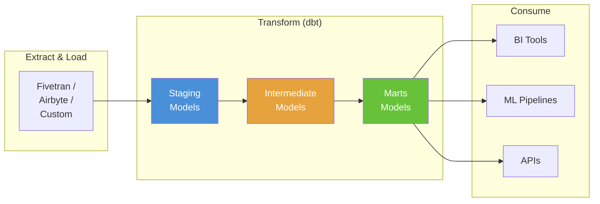
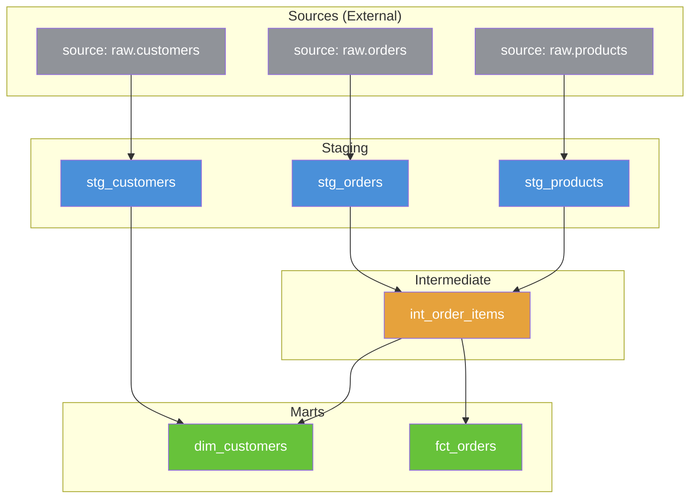
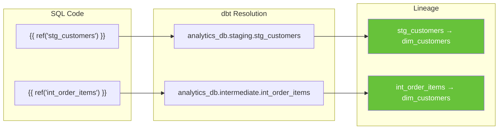
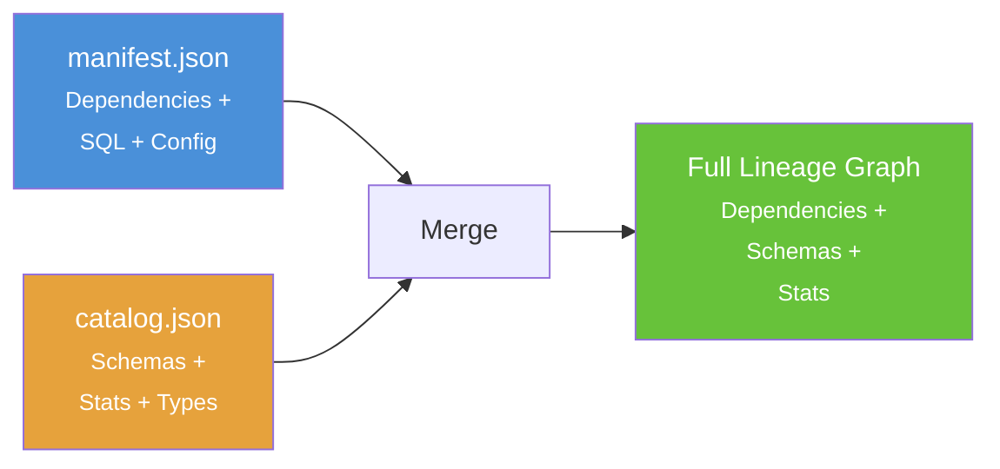
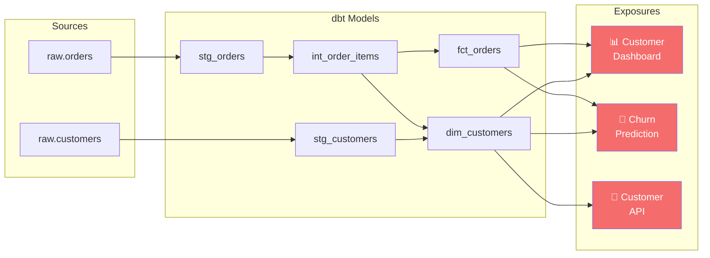
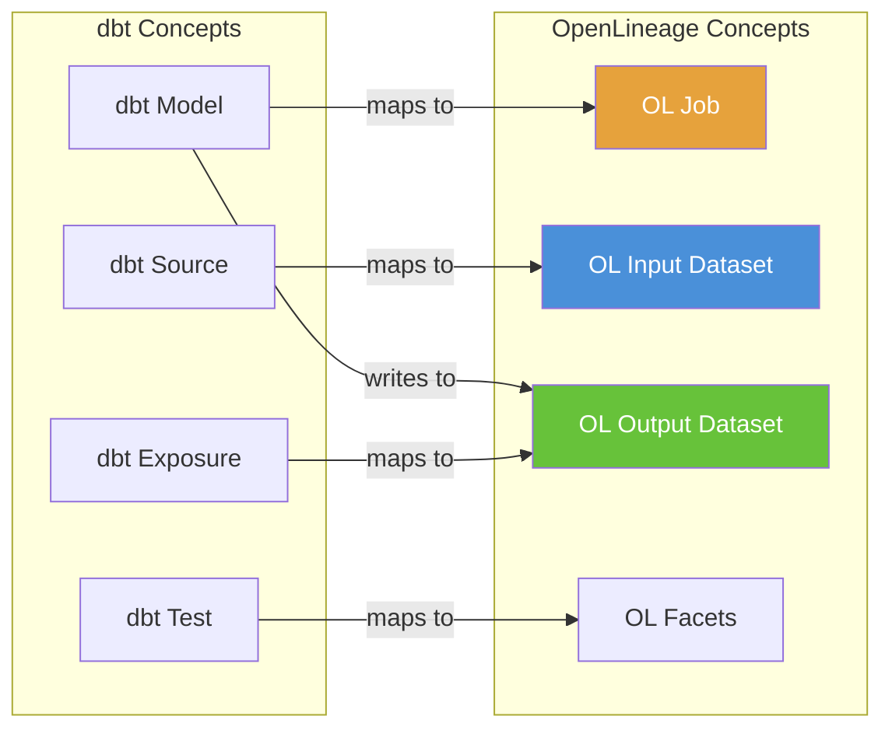

# Chapter 9: dbt Lineage

[&larr; Back to Index](../index.md) | [Previous: Chapter 8](08-spark-lineage.md)

---

## Chapter Contents

- [9.1 dbt and the Analytics Engineering Paradigm](#91-dbt-and-the-analytics-engineering-paradigm)
- [9.2 How dbt Models Lineage](#92-how-dbt-models-track-lineage)
- [9.3 The ref() and source() Functions](#93-the-ref-and-source-functions)
- [9.4 The manifest.json: dbt's Lineage Artifact](#94-the-manifestjson-dbts-lineage-artifact)
- [9.5 Parsing manifest.json for Lineage](#95-parsing-manifestjson-for-lineage)
- [9.6 The catalog.json: Schema Metadata](#96-the-catalogjson-schema-metadata)
- [9.7 dbt Exposures: Downstream Consumers](#97-dbt-exposures-downstream-consumers)
- [9.8 Visualizing dbt Lineage](#98-visualizing-dbt-lineage)
- [9.9 dbt + OpenLineage Integration](#99-dbt--openlineage-integration)
- [9.10 Exercise](#910-exercise)
- [9.11 Summary](#911-summary)

---

## 9.1 dbt and the Analytics Engineering Paradigm

[dbt](https://www.getdbt.com/) (data build tool) transforms data inside your warehouse using SQL `SELECT` statements. It compiles models, manages dependencies, and generates documentation, all centered on **lineage**.

### Where dbt Fits



### dbt Project Structure

```
my_dbt_project/
├── dbt_project.yml           # Project config
├── models/
│   ├── staging/              # Raw → cleaned
│   │   ├── stg_customers.sql
│   │   ├── stg_orders.sql
│   │   └── stg_products.sql
│   ├── intermediate/         # Business logic
│   │   └── int_order_items.sql
│   └── marts/                # Final models
│       ├── dim_customers.sql
│       └── fct_orders.sql
├── sources.yml               # External source definitions
├── exposures.yml             # Downstream consumers
└── target/                   # Compiled artifacts
    ├── manifest.json         # ← The lineage goldmine
    ├── catalog.json          # ← Schema metadata
    └── run_results.json      # ← Execution results
```

---

## 9.2 How dbt Models Track Lineage

dbt tracks lineage through a simple but powerful mechanism: **every model is a SQL SELECT**, and dependencies are declared via `ref()` and `source()` functions.

### The Model DAG



---

## 9.3 The ref() and source() Functions

### source(): Declaring External Inputs

```yaml
# sources.yml
version: 2
sources:
  - name: raw
    database: analytics_db
    schema: raw_data
    tables:
      - name: customers
        description: "Raw customer data from CRM"
        columns:
          - name: customer_id
            description: "Primary key"
            tests: [unique, not_null]
          - name: email
            tests: [unique]
      - name: orders
        description: "Raw order data from e-commerce platform"
      - name: products
        description: "Product catalog"
```

### ref(): Declaring Model Dependencies

```sql
-- models/staging/stg_customers.sql
SELECT
    customer_id,
    LOWER(TRIM(first_name)) AS first_name,
    LOWER(TRIM(last_name)) AS last_name,
    LOWER(TRIM(email)) AS email,
    created_at
FROM {{ source('raw', 'customers') }}
WHERE customer_id IS NOT NULL
```

```sql
-- models/intermediate/int_order_items.sql
SELECT
    o.order_id,
    o.customer_id,
    o.order_date,
    p.product_name,
    p.category,
    o.quantity,
    p.unit_price,
    o.quantity * p.unit_price AS line_total
FROM {{ ref('stg_orders') }} o
JOIN {{ ref('stg_products') }} p ON o.product_id = p.product_id
```

```sql
-- models/marts/dim_customers.sql
SELECT
    c.customer_id,
    c.first_name,
    c.last_name,
    c.email,
    c.created_at,
    COUNT(DISTINCT oi.order_id) AS total_orders,
    SUM(oi.line_total) AS lifetime_value,
    MAX(oi.order_date) AS last_order_date
FROM {{ ref('stg_customers') }} c
LEFT JOIN {{ ref('int_order_items') }} oi ON c.customer_id = oi.customer_id
GROUP BY 1, 2, 3, 4, 5
```

### How ref() Creates Lineage



> **Key insight**: `ref()` is both a SQL compilation function **and** a lineage
> declaration. Every `ref()` call creates an edge in the DAG.

---

## 9.4 The manifest.json: dbt's Lineage Artifact

When dbt compiles or runs, it produces `target/manifest.json`, a detailed JSON file containing the full project graph.

### manifest.json Structure

```
manifest.json (~5-50 MB for large projects)
├── metadata        → dbt version, project name, generated_at
├── nodes           → All models, tests, snapshots, seeds
│   ├── model.project.stg_customers
│   │   ├── unique_id, name, schema, database
│   │   ├── raw_code (original SQL)
│   │   ├── compiled_code (with refs resolved)
│   │   ├── depends_on.nodes → ["source.project.raw.customers"]
│   │   ├── columns → {customer_id: {name, description, ...}}
│   │   └── config → materialization, tags, etc.
│   └── ...
├── sources         → External source definitions
├── exposures       → Downstream consumers
├── parent_map      → node → [parent nodes]
├── child_map       → node → [child nodes]
└── disabled        → Disabled models
```

### Manifest Content Example

```json
{
  "nodes": {
    "model.my_project.dim_customers": {
      "unique_id": "model.my_project.dim_customers",
      "name": "dim_customers",
      "resource_type": "model",
      "schema": "marts",
      "database": "analytics_db",
      "depends_on": {
        "nodes": [
          "model.my_project.stg_customers",
          "model.my_project.int_order_items"
        ]
      },
      "columns": {
        "customer_id": {
          "name": "customer_id",
          "description": "Primary key",
          "meta": {},
          "tags": []
        },
        "lifetime_value": {
          "name": "lifetime_value",
          "description": "Total spend across all orders",
          "meta": { "contains_pii": false }
        }
      },
      "config": {
        "materialized": "table",
        "tags": ["daily", "tier_1"]
      }
    }
  },
  "parent_map": {
    "model.my_project.dim_customers": [
      "model.my_project.stg_customers",
      "model.my_project.int_order_items"
    ]
  },
  "child_map": {
    "model.my_project.stg_customers": [
      "model.my_project.dim_customers",
      "test.my_project.not_null_stg_customers_customer_id"
    ]
  }
}
```

---

## 9.5 Parsing manifest.json for Lineage

Here's a complete Python module for extracting lineage from a dbt manifest:

```python
import json
from pathlib import Path
import networkx as nx


def load_manifest(manifest_path: str) -> dict:
    """Load and parse a dbt manifest.json file."""
    path = Path(manifest_path)
    if not path.exists():
        raise FileNotFoundError(f"Manifest not found: {manifest_path}")
    return json.loads(path.read_text())


def build_dbt_lineage_graph(manifest: dict) -> nx.DiGraph:
    """Build a lineage graph from a dbt manifest."""
    graph = nx.DiGraph()

    # Add source nodes
    for source_id, source_data in manifest.get("sources", {}).items():
        graph.add_node(
            source_id,
            name=source_data["name"],
            node_type="source",
            schema=source_data.get("schema", ""),
            database=source_data.get("database", ""),
            description=source_data.get("description", ""),
        )

    # Add model/test/snapshot nodes
    for node_id, node_data in manifest.get("nodes", {}).items():
        resource_type = node_data.get("resource_type", "unknown")
        graph.add_node(
            node_id,
            name=node_data["name"],
            node_type=resource_type,
            schema=node_data.get("schema", ""),
            database=node_data.get("database", ""),
            materialized=node_data.get("config", {}).get("materialized", ""),
            description=node_data.get("description", ""),
            columns=list(node_data.get("columns", {}).keys()),
            tags=node_data.get("tags", []),
        )

    # Add exposure nodes
    for exp_id, exp_data in manifest.get("exposures", {}).items():
        graph.add_node(
            exp_id,
            name=exp_data["name"],
            node_type="exposure",
            type=exp_data.get("type", ""),
            owner=exp_data.get("owner", {}).get("name", ""),
        )

    # Add edges from parent_map
    for child_id, parent_ids in manifest.get("parent_map", {}).items():
        for parent_id in parent_ids:
            if parent_id in graph.nodes and child_id in graph.nodes:
                graph.add_edge(parent_id, child_id)

    return graph


def print_dbt_lineage_report(graph: nx.DiGraph) -> None:
    """Print a summary of the dbt lineage graph."""
    type_counts = {}
    for _, data in graph.nodes(data=True):
        node_type = data.get("node_type", "unknown")
        type_counts[node_type] = type_counts.get(node_type, 0) + 1

    print("=" * 60)
    print("dbt Lineage Report")
    print("=" * 60)
    print(f"Total nodes: {graph.number_of_nodes()}")
    print(f"Total edges: {graph.number_of_edges()}")
    print(f"Is DAG:      {nx.is_directed_acyclic_graph(graph)}")
    print()
    for node_type, count in sorted(type_counts.items()):
        print(f"  {node_type:20s} {count}")

    # Find root sources
    roots = [n for n in graph.nodes if graph.in_degree(n) == 0]
    print(f"\nRoot sources ({len(roots)}):")
    for r in sorted(roots):
        print(f"  {graph.nodes[r].get('name', r)}")

    # Find leaf nodes (final outputs)
    leaves = [n for n in graph.nodes if graph.out_degree(n) == 0]
    print(f"\nLeaf nodes ({len(leaves)}):")
    for l in sorted(leaves):
        print(f"  {graph.nodes[l].get('name', l)} ({graph.nodes[l].get('node_type', '?')})")

    # Longest path
    if nx.is_directed_acyclic_graph(graph):
        longest = nx.dag_longest_path(graph)
        print(f"\nLongest lineage path ({len(longest)} nodes):")
        for node in longest:
            name = graph.nodes[node].get("name", node)
            ntype = graph.nodes[node].get("node_type", "?")
            print(f"  → {name} ({ntype})")


# Usage
manifest = load_manifest("target/manifest.json")
graph = build_dbt_lineage_graph(manifest)
print_dbt_lineage_report(graph)
```

### Example Output

```
============================================================
dbt Lineage Report
============================================================
Total nodes: 42
Total edges: 56
Is DAG:      True

  exposure                3
  model                  18
  source                  6
  test                   15

Root sources (6):
  customers
  events
  orders
  payments
  products
  users

Leaf nodes (18):
  dim_customers (model)
  fct_orders (model)
  customer_dashboard (exposure)
  ...

Longest lineage path (5 nodes):
  → orders (source)
  → stg_orders (model)
  → int_order_items (model)
  → fct_orders (model)
  → revenue_dashboard (exposure)
```

---

## 9.6 The catalog.json: Schema Metadata

After running `dbt docs generate`, dbt produces `target/catalog.json` with actual schema information from the warehouse:

```python
def enrich_graph_with_catalog(
    graph: nx.DiGraph,
    catalog_path: str,
) -> nx.DiGraph:
    """Add column-level metadata from catalog.json to the lineage graph."""
    catalog = json.loads(Path(catalog_path).read_text())

    for node_id, catalog_node in catalog.get("nodes", {}).items():
        if node_id in graph.nodes:
            columns = {}
            for col_name, col_data in catalog_node.get("columns", {}).items():
                columns[col_name] = {
                    "type": col_data.get("type", "unknown"),
                    "index": col_data.get("index", 0),
                    "comment": col_data.get("comment", ""),
                }
            graph.nodes[node_id]["catalog_columns"] = columns
            graph.nodes[node_id]["row_count"] = (
                catalog_node.get("stats", {}).get("row_count", {}).get("value")
            )
            graph.nodes[node_id]["size_bytes"] = (
                catalog_node.get("stats", {}).get("bytes", {}).get("value")
            )

    return graph
```

### Combining manifest + catalog



---

## 9.7 dbt Exposures: Downstream Consumers

dbt **exposures** let you document what consumes your dbt models: dashboards, ML models, and applications:

```yaml
# exposures.yml
version: 2
exposures:
  - name: customer_dashboard
    type: dashboard
    maturity: high
    url: https://looker.company.com/dashboards/42
    description: "Executive customer dashboard updated daily"
    depends_on:
      - ref('dim_customers')
      - ref('fct_orders')
    owner:
      name: Analytics Team
      email: analytics@company.com

  - name: churn_prediction_model
    type: ml
    maturity: medium
    description: "ML model predicting customer churn probability"
    depends_on:
      - ref('dim_customers')
      - ref('fct_orders')
    owner:
      name: Data Science Team
      email: datascience@company.com

  - name: customer_api
    type: application
    maturity: low
    description: "REST API serving customer data to mobile app"
    depends_on:
      - ref('dim_customers')
    owner:
      name: Backend Team
      email: backend@company.com
```

### End-to-End Lineage with Exposures



---

## 9.8 Visualizing dbt Lineage

### Option 1: dbt Docs (Built-In)

```bash
# Generate documentation + catalog
dbt docs generate

# Serve locally
dbt docs serve
# Opens browser at http://localhost:8080 with interactive lineage graph
```

### Option 2: NetworkX + Matplotlib

```python
import matplotlib
matplotlib.use("Agg")
import matplotlib.pyplot as plt
import networkx as nx


def visualize_dbt_graph(graph: nx.DiGraph, output_path: str = "dbt_lineage.png"):
    """Visualize the dbt lineage graph with colored node types."""
    color_map = {
        "source": "#909399",
        "model": "#4A90D9",
        "test": "#E6A23C",
        "exposure": "#F56C6C",
    }

    # Filter to models and sources only (remove tests for clarity)
    display_nodes = [
        n for n, d in graph.nodes(data=True)
        if d.get("node_type") in ("source", "model", "exposure")
    ]
    subgraph = graph.subgraph(display_nodes)

    colors = [
        color_map.get(subgraph.nodes[n].get("node_type", "model"), "#4A90D9")
        for n in subgraph.nodes
    ]

    labels = {n: subgraph.nodes[n].get("name", n) for n in subgraph.nodes}

    pos = nx.spring_layout(subgraph, k=2, seed=42)
    fig, ax = plt.subplots(1, 1, figsize=(16, 10))

    nx.draw(
        subgraph, pos, ax=ax,
        labels=labels, node_color=colors,
        node_size=2000, font_size=8,
        edge_color="#ccc", arrows=True,
        arrowsize=15,
    )

    ax.set_title("dbt Lineage Graph", fontsize=16)
    fig.savefig(output_path, dpi=150, bbox_inches="tight")
    print(f"Saved to {output_path}")
```

### Option 3: Export to Mermaid

```python
def dbt_graph_to_mermaid(graph: nx.DiGraph) -> str:
    """Convert a dbt lineage graph to a Mermaid diagram."""
    lines = ["graph LR"]

    # Node definitions with styling
    for node_id, data in graph.nodes(data=True):
        name = data.get("name", node_id)
        node_type = data.get("node_type", "model")
        safe_id = node_id.replace(".", "_").replace(" ", "_")

        if node_type == "source":
            lines.append(f'    {safe_id}[("{name}")]')
        elif node_type == "exposure":
            lines.append(f'    {safe_id}[["📊 {name}"]]')
        else:
            lines.append(f"    {safe_id}[{name}]")

    # Edges
    for source, target in graph.edges:
        safe_src = source.replace(".", "_").replace(" ", "_")
        safe_tgt = target.replace(".", "_").replace(" ", "_")
        lines.append(f"    {safe_src} --> {safe_tgt}")

    return "\n".join(lines)
```

---

## 9.9 dbt + OpenLineage Integration

dbt can emit OpenLineage events via the `openlineage-dbt` integration:

```bash
# Install
pip install openlineage-dbt

# Run dbt with OpenLineage
dbt run  # Standard dbt run

# Then extract events from the artifacts
openlineage-dbt \
    --target-dir target/ \
    --namespace "dbt-prod" \
    --transport-type http \
    --transport-url http://marquez:5000/api/v1/lineage
```

### How dbt Maps to OpenLineage



### OpenLineage Event for a dbt Model

```json
{
  "eventType": "COMPLETE",
  "eventTime": "2025-01-15T10:05:22.000Z",
  "job": {
    "namespace": "dbt-prod",
    "name": "my_project.dim_customers",
    "facets": {
      "sql": {
        "query": "SELECT c.customer_id, ... FROM staging.stg_customers c LEFT JOIN ..."
      },
      "sourceCode": {
        "language": "sql",
        "sourceCode": "SELECT c.customer_id, ... FROM {{ ref('stg_customers') }} c ..."
      }
    }
  },
  "inputs": [
    {
      "namespace": "snowflake://myaccount",
      "name": "analytics_db.staging.stg_customers"
    },
    {
      "namespace": "snowflake://myaccount",
      "name": "analytics_db.intermediate.int_order_items"
    }
  ],
  "outputs": [
    {
      "namespace": "snowflake://myaccount",
      "name": "analytics_db.marts.dim_customers",
      "facets": {
        "schema": {
          "fields": [
            { "name": "customer_id", "type": "NUMBER" },
            { "name": "first_name", "type": "VARCHAR" },
            { "name": "lifetime_value", "type": "NUMBER" }
          ]
        }
      }
    }
  ]
}
```

---

## 9.10 Exercise

> **Exercise**: Open [`exercises/ch09_dbt_lineage.py`](../exercises/ch09_dbt_lineage.py)
> and complete the following tasks:
>
> 1. Parse the provided sample `manifest.json` to extract all model dependencies
> 2. Build a NetworkX graph from the manifest's `parent_map`
> 3. Identify all root sources and leaf models
> 4. Calculate the longest dependency chain
> 5. Generate a Mermaid diagram from the parsed lineage
> 6. **Bonus**: Enrich the graph with column metadata from a sample `catalog.json`

---

## 9.11 Summary

In this chapter, you learned:

- **dbt's `ref()` and `source()` functions** implicitly declare lineage. Every reference is an edge in the DAG.
- **`manifest.json`** is the primary lineage artifact, containing all dependencies, SQL, columns, and configuration
- **`catalog.json`** adds runtime schema information from the warehouse (types, row counts, sizes)
- **Exposures** extend lineage beyond dbt to downstream consumers (dashboards, ML models, APIs)
- The manifest can be parsed with Python to build a full lineage graph programmatically
- **OpenLineage integration** connects dbt lineage to the broader ecosystem (Marquez, Spark, Airflow)

### Key Takeaway

> dbt is the rare tool that makes lineage a first-class citizen. The `ref()`
> function simultaneously resolves SQL dependencies AND declares lineage
> edges. Combined with `manifest.json`, `catalog.json`, and exposures,
> dbt provides one of the most complete lineage stories in the analytics engineering ecosystem.

---

### What's Next

[Chapter 10: Column-Level Lineage Deep Dive](10-column-level-lineage.md) moves from table-level to column-level lineage, tracking how individual fields move through pipelines.

---

[&larr; Back to Index](../index.md) | [Previous: Chapter 8](08-spark-lineage.md) | [Next: Chapter 10 &rarr;](10-column-level-lineage.md)
