# Chapter 9: Apache Spark Lineage

[&larr; Back to Index](../index.md) | [Previous: Chapter 8](08-airflow-and-marquez.md)

---

## Chapter Contents

- [9.1 Why Spark Lineage Is Unique](#91-why-spark-lineage-is-unique)
- [9.2 Spark Architecture Refresher](#92-spark-architecture-refresher)
- [9.3 Catalyst Optimizer and Query Plans](#93-catalyst-optimizer-and-query-plans)
- [9.4 OpenLineage Spark Integration](#94-openlineage-spark-integration)
- [9.5 PySpark Lineage in Practice](#95-pyspark-lineage-in-practice)
- [9.6 Reading Query Plans for Lineage](#96-reading-query-plans-for-lineage)
- [9.7 Column-Level Lineage in Spark](#97-column-level-lineage-in-spark)
- [9.8 Spark Streaming Lineage](#98-spark-streaming-lineage)
- [9.9 Common Spark Lineage Patterns](#99-common-spark-lineage-patterns)
- [9.10 Exercise](#910-exercise)
- [9.11 Summary](#911-summary)

---

## 9.1 Why Spark Lineage Is Unique

Apache Spark processes massive datasets across distributed clusters. Unlike simple SQL queries, Spark jobs involve complex transformations, joins across multiple data sources, and UDFs, making lineage extraction both valuable and challenging.

### Spark vs. SQL-Only Lineage

| Aspect | SQL Lineage | Spark Lineage |
|---|---|---|
| Input format | SQL text | Code + SQL + API |
| Parsing approach | Static AST parsing | Runtime plan capture |
| Data sources | Tables only | Files, APIs, tables, streams, custom |
| Transformations | SQL operations | SQL + DataFrame API + RDD + UDFs |
| Scale | Single query | Multi-stage pipeline |
| Column tracking | From SQL | From optimized plan |
| UDF handling | Opaque | Opaque (same limit) |

### The Spark Lineage Advantage

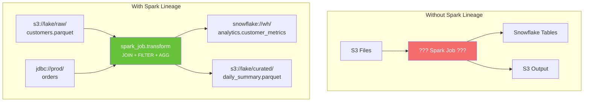

---

## 9.2 Spark Architecture Refresher

### Core Components

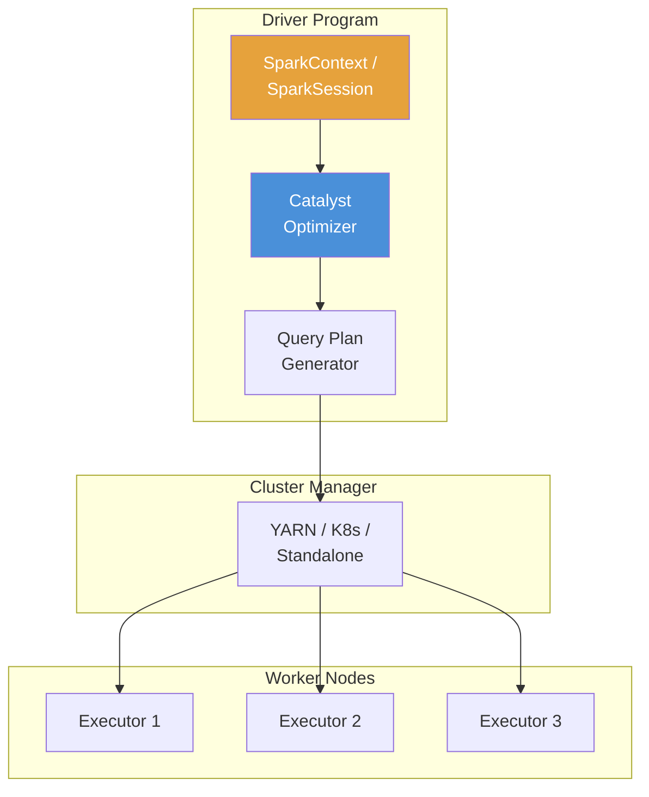

### Spark Job Execution Flow

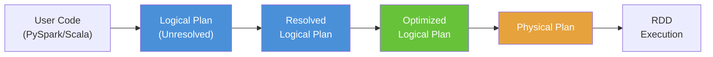

> **Key insight**: The **optimized logical plan** is where lineage lives. It contains
> the complete mapping of inputs → transformations → outputs, after Spark has
> resolved table names, pushed down predicates, and optimized joins.

---

## 9.3 Catalyst Optimizer and Query Plans

The Catalyst optimizer is Spark's query planner. It transforms user code into an optimized execution plan rich with lineage information.

### Reading a Query Plan

```python
from pyspark.sql import SparkSession

spark = SparkSession.builder.appName("lineage_demo").getOrCreate()

# Read source data
customers = spark.read.parquet("s3://lake/raw/customers.parquet")
orders = spark.read.parquet("s3://lake/raw/orders.parquet")

# Transform
result = (
    customers.join(orders, "customer_id")
    .filter(orders.status == "completed")
    .groupBy("customer_id", "name")
    .agg({"total": "sum", "order_id": "count"})
)

# Print the logical plan
result.explain(mode="extended")
```

Output (simplified):

```
== Parsed Logical Plan ==
'Aggregate ['customer_id, 'name],
    [sum('total), count('order_id)]
+- 'Filter ('status = completed)
   +- 'Join Inner, ('customer_id = 'customer_id)
      :- 'Relation [customers.parquet]
      +- 'Relation [orders.parquet]

== Optimized Logical Plan ==
Aggregate [customer_id, name],
    [sum(total), count(order_id)]
+- Join Inner, (customer_id = customer_id)
   :- Filter (isnotnull(customer_id))
   :  +- Relation [customers.parquet]
   :       [customer_id, name, email]
   +- Filter (status = completed
   :    AND isnotnull(customer_id))
      +- Relation [orders.parquet]
           [order_id, customer_id, total]
```

### Plan → Lineage Mapping

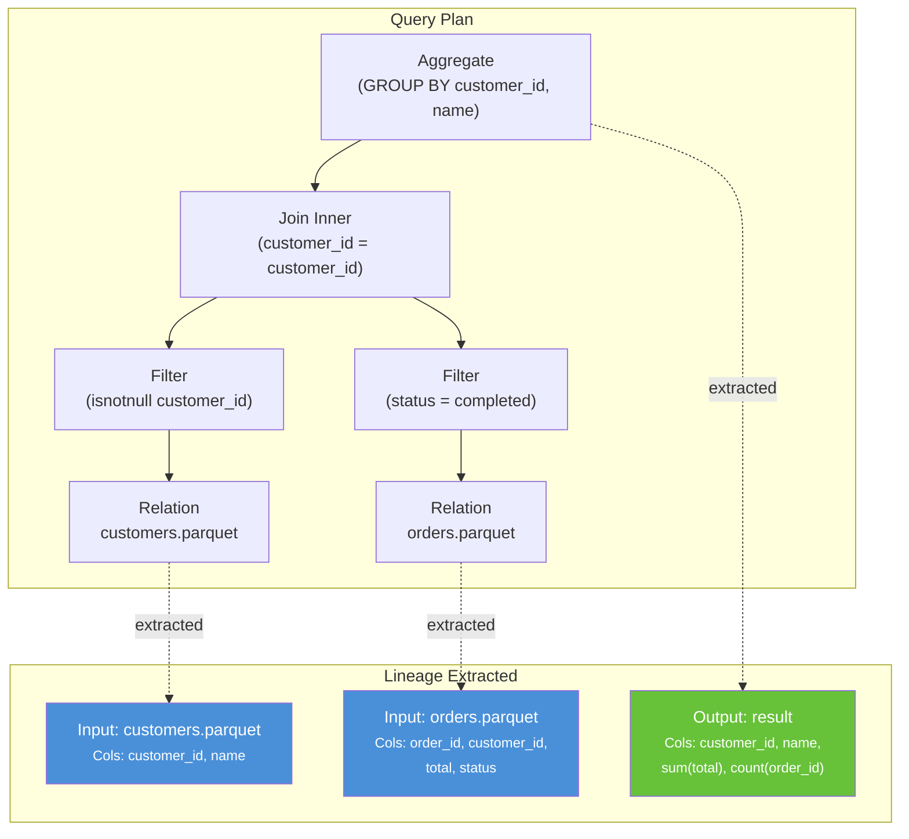

---

## 9.4 OpenLineage Spark Integration

The [openlineage-spark](https://github.com/OpenLineage/OpenLineage/tree/main/integration/spark) library is a Spark listener that hooks into the query plan lifecycle and emits OpenLineage events.

### How It Works

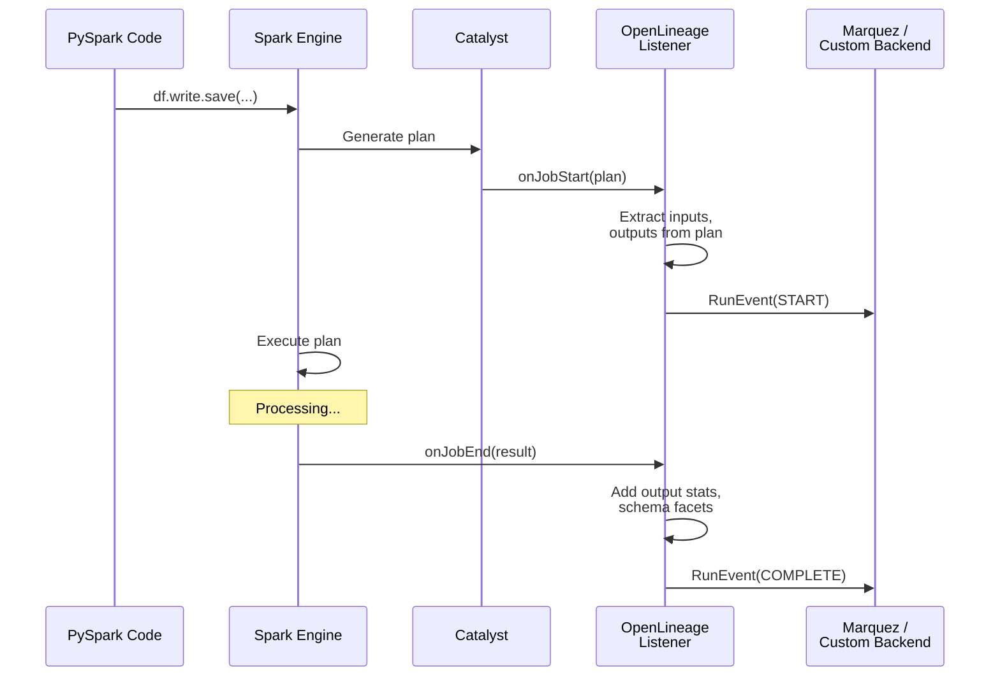

### Configuration

Add the OpenLineage Spark listener to your Spark session:

```python
spark = (
    SparkSession.builder
    .appName("my_etl_job")
    .config("spark.jars.packages", "io.openlineage:openlineage-spark:1.26.0")
    .config(
        "spark.extraListeners",
        "io.openlineage.spark.agent.OpenLineageSparkListener",
    )
    .config("spark.openlineage.transport.type", "http")
    .config(
        "spark.openlineage.transport.url",
        "http://marquez:5000/api/v1/lineage",
    )
    .config("spark.openlineage.namespace", "spark-prod")
    .getOrCreate()
)
```

Or via `spark-submit`:

```bash
spark-submit \
  --packages io.openlineage:openlineage-spark:1.26.0 \
  --conf "spark.extraListeners=io.openlineage.spark.agent.OpenLineageSparkListener" \
  --conf "spark.openlineage.transport.type=http" \
  --conf "spark.openlineage.transport.url=http://marquez:5000/api/v1/lineage" \
  --conf "spark.openlineage.namespace=spark-prod" \
  my_etl_job.py
```

### Supported Data Sources

**OpenLineage Spark: Supported Sources**

| Source Type | Support | Details |
|---|---|---|
| Parquet | Full | Schema + row count |
| Delta Lake | Full | Schema + version tracking |
| Iceberg | Full | Schema + snapshot lineage |
| CSV / JSON | Basic | Schema when available |
| JDBC | Full | Table name + schema |
| Hive tables | Full | Metastore integration |
| Kafka | Full | Topic + schema |
| S3 / GCS / ADLS | Full | Path-based dataset names |
| Custom sources | Partial | Dependent on V2 Data Source |

---

## 9.5 PySpark Lineage in Practice

This section walks through a realistic PySpark ETL pipeline and the lineage it produces:

```python
from pyspark.sql import SparkSession
from pyspark.sql import functions as F


# Initialize Spark with OpenLineage
spark = (
    SparkSession.builder
    .appName("customer_metrics_etl")
    .config("spark.jars.packages", "io.openlineage:openlineage-spark:1.26.0")
    .config(
        "spark.extraListeners",
        "io.openlineage.spark.agent.OpenLineageSparkListener",
    )
    .config("spark.openlineage.transport.type", "console")  # Print events
    .config("spark.openlineage.namespace", "spark-demo")
    .getOrCreate()
)

# ── Step 1: Read source data ──────────────────────
customers = spark.read.parquet("/data/raw/customers/")
orders = spark.read.parquet("/data/raw/orders/")
products = spark.read.parquet("/data/raw/products/")

# ── Step 2: Join and transform ─────────────────────
order_details = (
    orders
    .join(customers, "customer_id")
    .join(products, "product_id")
    .filter(F.col("order_date") >= "2025-01-01")
    .select(
        "customer_id",
        "customer_name",
        "product_id",
        "product_name",
        "category",
        "order_date",
        "quantity",
        "unit_price",
        (F.col("quantity") * F.col("unit_price")).alias("line_total"),
    )
)

# ── Step 3: Aggregate customer metrics ────────────
customer_metrics = (
    order_details
    .groupBy("customer_id", "customer_name")
    .agg(
        F.count("*").alias("total_orders"),
        F.sum("line_total").alias("total_spent"),
        F.avg("line_total").alias("avg_order_value"),
        F.countDistinct("category").alias("categories_purchased"),
        F.max("order_date").alias("last_order_date"),
    )
)

# ── Step 4: Write output ──────────────────────────
customer_metrics.write.mode("overwrite").parquet(
    "/data/curated/customer_metrics/"
)

spark.stop()
```

### Generated Lineage Graph

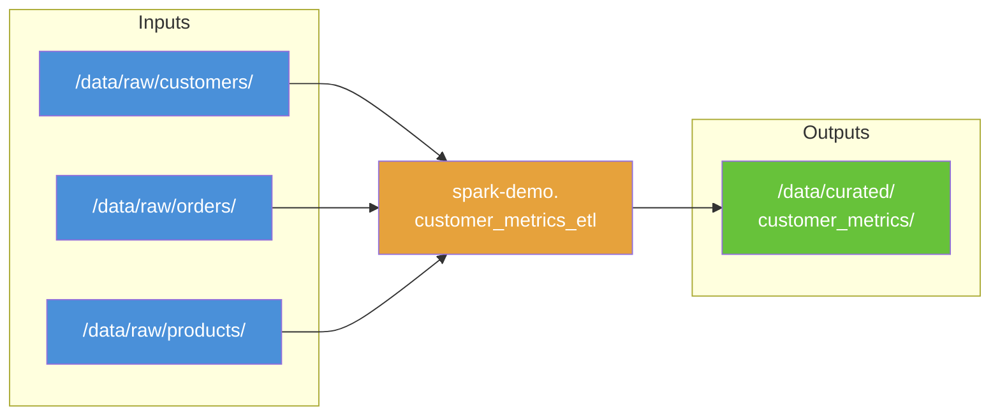

---

## 9.6 Reading Query Plans for Lineage

Even without OpenLineage, you can extract lineage from Spark's query plans programmatically:

```python
def extract_lineage_from_plan(df) -> dict:
    """Extract input sources from a DataFrame's query plan."""
    plan = df._jdf.queryExecution().optimizedPlan()
    plan_str = plan.toString()

    # Parse relations from the plan
    import re
    sources = []

    # Match file-based sources
    file_pattern = r"FileScan\s+\w+\s+\[(.*?)\]\s+.*?Location:\s+(.*?),"
    for match in re.finditer(file_pattern, plan_str):
        columns = match.group(1)
        location = match.group(2)
        sources.append({
            "type": "file",
            "location": location.strip(),
            "columns": [c.strip() for c in columns.split(",")],
        })

    # Match JDBC sources
    jdbc_pattern = r"JDBCRelation\((.*?)\)"
    for match in re.finditer(jdbc_pattern, plan_str):
        sources.append({
            "type": "jdbc",
            "table": match.group(1),
        })

    return {"sources": sources, "plan": plan_str}


# Usage
lineage_info = extract_lineage_from_plan(customer_metrics)
for source in lineage_info["sources"]:
    print(f"  [{source['type']}] {source.get('location', source.get('table'))}")
```

---

## 9.7 Column-Level Lineage in Spark

OpenLineage's Spark integration can track column-level lineage through the Catalyst optimizer:

### How Column Lineage Flows Through Spark

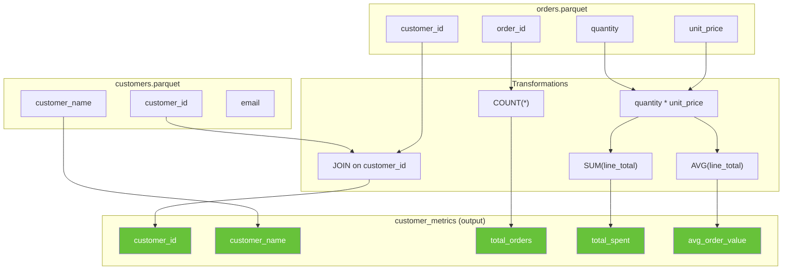

### Enabling Column-Level Lineage

```python
spark = (
    SparkSession.builder
    .appName("column_lineage_demo")
    .config("spark.jars.packages", "io.openlineage:openlineage-spark:1.26.0")
    .config(
        "spark.extraListeners",
        "io.openlineage.spark.agent.OpenLineageSparkListener",
    )
    # Enable column-level lineage
    .config("spark.openlineage.facets.columnLineage.enabled", "true")
    .config("spark.openlineage.transport.type", "http")
    .config(
        "spark.openlineage.transport.url",
        "http://marquez:5000/api/v1/lineage",
    )
    .getOrCreate()
)
```

The emitted event includes a `columnLineage` facet:

```json
{
  "outputs": [
    {
      "name": "/data/curated/customer_metrics",
      "facets": {
        "columnLineage": {
          "fields": {
            "total_spent": {
              "inputFields": [
                {
                  "namespace": "file",
                  "name": "/data/raw/orders",
                  "field": "quantity"
                },
                {
                  "namespace": "file",
                  "name": "/data/raw/orders",
                  "field": "unit_price"
                }
              ],
              "transformationType": "AGGREGATION",
              "transformationDescription": "SUM(quantity * unit_price)"
            }
          }
        }
      }
    }
  ]
}
```

---

## 9.8 Spark Streaming Lineage

Spark Structured Streaming has its own lineage patterns:

```python
# Streaming job example
stream_df = (
    spark.readStream
    .format("kafka")
    .option("kafka.bootstrap.servers", "kafka:9092")
    .option("subscribe", "user_events")
    .load()
)

parsed = (
    stream_df
    .selectExpr("CAST(value AS STRING) as json_str")
    .select(F.from_json("json_str", event_schema).alias("event"))
    .select("event.*")
    .filter(F.col("event_type") == "purchase")
)

query = (
    parsed.writeStream
    .format("delta")
    .outputMode("append")
    .option("checkpointLocation", "/checkpoints/purchases")
    .start("/data/streaming/purchases")
)
```

### Streaming Lineage Events

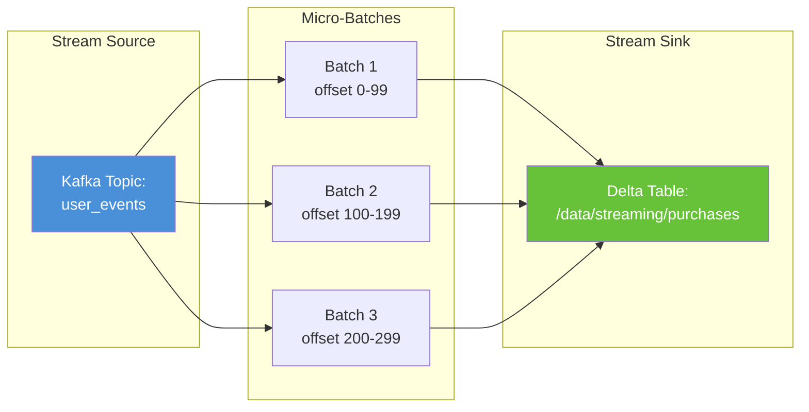

> **Note**: Streaming lineage emits events per micro-batch. The OpenLineage Spark
> listener captures each batch's inputs (Kafka offsets) and outputs (files/partitions
> written), providing a continuous lineage trail.

---

## 9.9 Common Spark Lineage Patterns

### Pattern 1: Multi-Source Fan-In

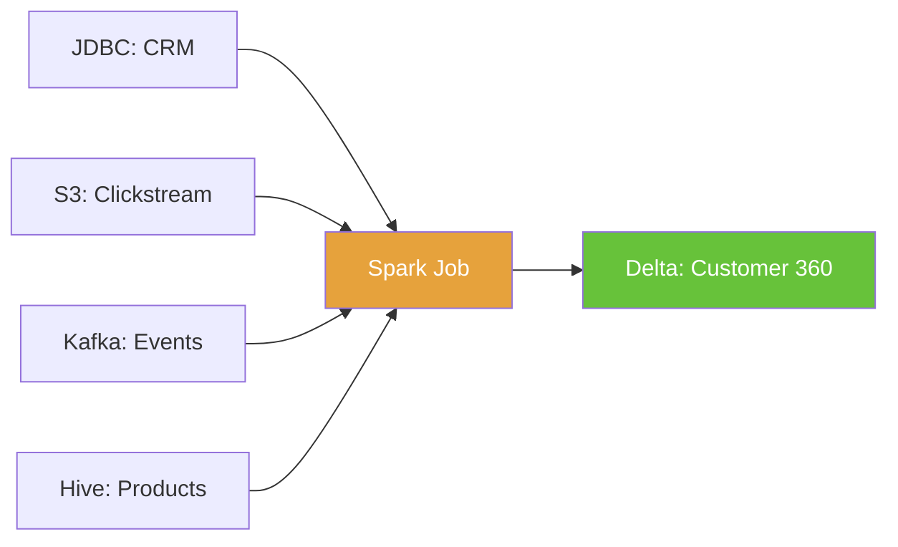

### Pattern 2: Multi-Output Fan-Out

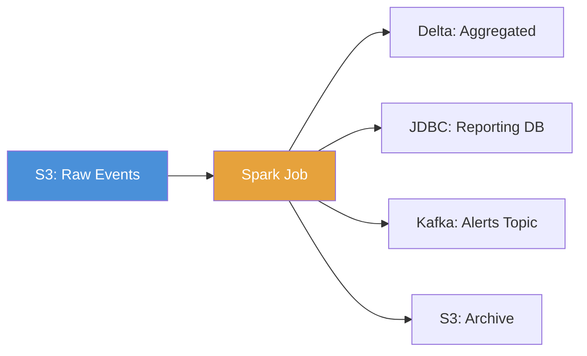

### Pattern 3: Checkpoint / Intermediate Materialization

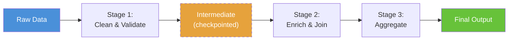

### Pattern 4: Delta Lake Time Travel

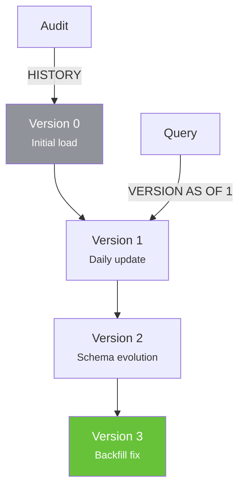

---

## 9.10 Exercise

> **Exercise**: Open [`exercises/ch09_spark_lineage.py`](../exercises/ch09_spark_lineage.py)
> and complete the following tasks:
>
> 1. Create a local PySpark session (no cluster needed)
> 2. Read multiple CSV files and perform a JOIN + aggregation
> 3. Examine the query plan using `df.explain(mode="extended")`
> 4. Parse the logical plan to identify input sources and output columns
> 5. Write a function to extract lineage metadata from any DataFrame's plan
> 6. **Bonus**: Configure the OpenLineage Spark listener with console transport and examine the emitted events

---

## 9.11 Summary

In this chapter, you learned:

- **Spark's Catalyst optimizer** generates logical and physical plans that contain complete lineage information
- The **OpenLineage Spark listener** hooks into these plans to automatically emit RunEvents with input/output datasets
- **Column-level lineage** tracks how individual columns flow through joins, filters, and aggregations
- **Spark Structured Streaming** emits lineage events per micro-batch
- Query plans can be read and parsed programmatically for custom lineage extraction
- Common patterns include fan-in (multi-source), fan-out (multi-output), and materialization checkpoints

### Key Takeaway

> Spark's optimizer already understands your data flow — OpenLineage just
> makes that understanding accessible. Every `df.write` call becomes a
> lineage event that captures what was read, how it was transformed, and
> where it was written.

---

### What's Next

[Chapter 10: dbt Lineage](10-dbt-lineage.md) covers the data transformation tool that puts lineage at the center of its design: `manifest.json`, `ref()` functions, and built-in DAG visualization.

---

[&larr; Back to Index](../index.md) | [Previous: Chapter 8](08-airflow-and-marquez.md) | [Next: Chapter 10 &rarr;](10-dbt-lineage.md)
