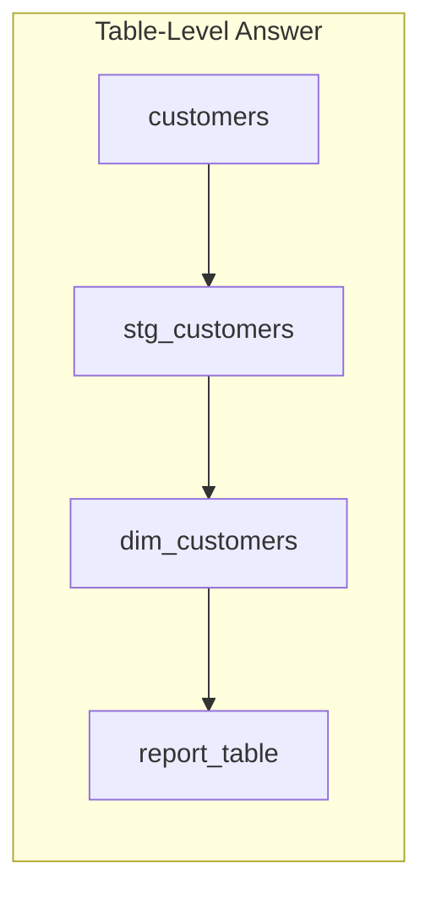
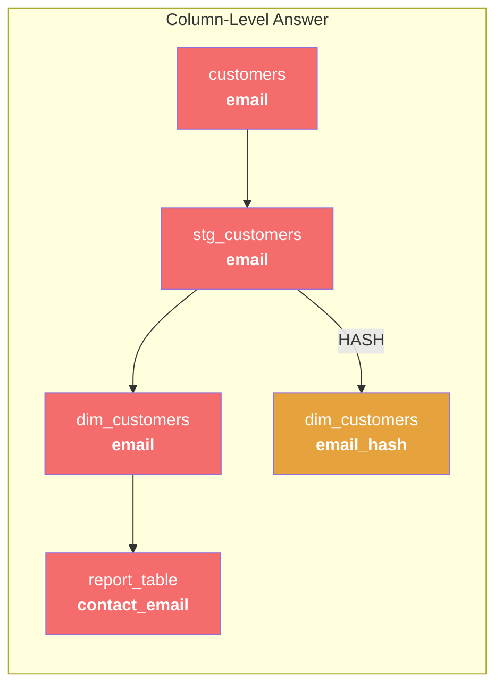
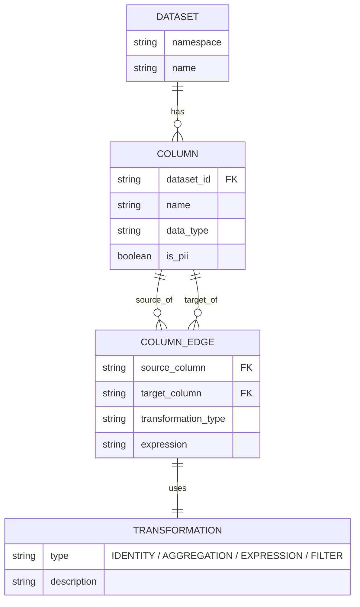
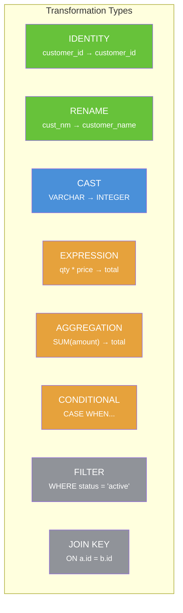
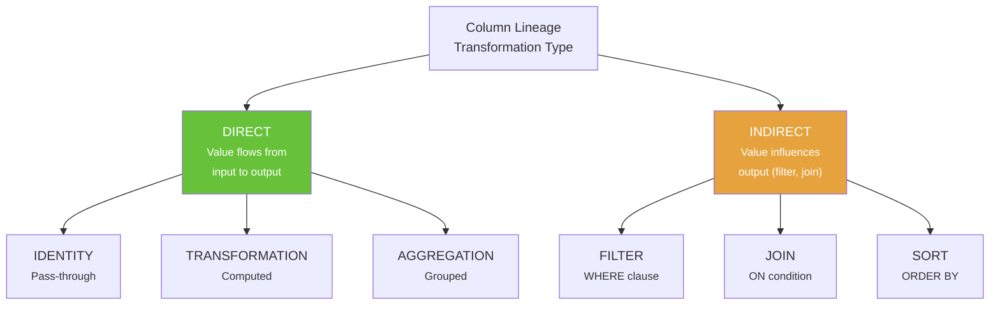
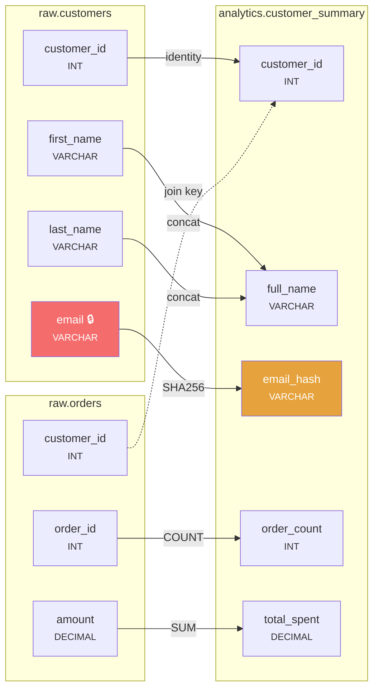

# Chapter 10: Column-Level Lineage Deep Dive

[&larr; Back to Index](../index.md) | [Previous: Chapter 9](09-dbt-lineage.md)

---

## Chapter Contents

- [10.1 Why Column-Level Lineage?](#101-why-column-level-lineage)
- [10.2 Table-Level vs Column-Level Lineage](#102-table-level-vs-column-level-lineage)
- [10.3 Column Lineage Data Model](#103-column-lineage-data-model)
- [10.4 Transformation Types](#104-transformation-types)
- [10.5 Extracting Column Lineage from SQL](#105-extracting-column-lineage-from-sql)
- [10.6 Column Lineage in OpenLineage](#106-column-lineage-in-openlineage)
- [10.7 Building a Column Lineage Tracker](#107-building-a-column-lineage-tracker)
- [10.8 Visualizing Column Lineage](#108-visualizing-column-lineage)
- [10.9 Use Cases and Applications](#109-use-cases-and-applications)
- [10.10 Exercise](#1010-exercise)
- [10.11 Summary](#1011-summary)

---

## 10.1 Why Column-Level Lineage?

Table-level lineage answers: *"Which tables does this table depend on?"*
Column-level lineage answers: *"Where did this specific field come from, and what happened to it along the way?"*

### The PII Compliance Scenario

Imagine a regulator asks: *"Show me every place the customer email address appears in your data platform."*



> Table-level lineage says "these tables are connected," but doesn't tell you
> which columns carry the email. Maybe `report_table` has email, maybe not.



> Column-level lineage traces the exact path: `email` flows through 3 tables,
> gets hashed in one branch, and appears renamed as `contact_email` in the report.

---

## 10.2 Table-Level vs Column-Level Lineage

```
┌──────────────────────┬────────────────────────┬─────────────────────────┐
│ Aspect               │ Table-Level            │ Column-Level            │
├──────────────────────┼────────────────────────┼─────────────────────────┤
│ Granularity          │ Table / dataset        │ Individual column       │
│ Question answered    │ "What tables are       │ "Where does this        │
│                      │  connected?"           │  field come from?"      │
│ Extraction cost      │ Low (parse SQL refs)   │ High (parse SQL logic)  │
│ Storage cost         │ O(tables × edges)      │ O(columns × edges)      │
│ PII tracking         │ Coarse                 │ Precise                 │
│ Impact analysis      │ "These tables break"   │ "These columns break"   │
│ Root cause           │ "Check this table"     │ "Check this column"     │
│ Complexity           │ Simple graph           │ Nested / multi-layer    │
└──────────────────────┴────────────────────────┴─────────────────────────┘
```

---

## 10.3 Column Lineage Data Model

### Core Concepts



### Python Data Model

```python
from dataclasses import dataclass, field
from enum import Enum


class TransformationType(Enum):
    """How a column's value changes between source and target."""
    IDENTITY = "identity"           # Passed through unchanged
    RENAME = "rename"               # Same value, different name
    CAST = "cast"                   # Type conversion
    EXPRESSION = "expression"       # Computed from one or more columns
    AGGREGATION = "aggregation"     # Grouped/reduced (SUM, COUNT, etc.)
    CONDITIONAL = "conditional"     # CASE WHEN / IF-ELSE
    FILTER = "filter"               # Used in WHERE but not in output
    JOIN_KEY = "join_key"           # Used in JOIN ON condition


@dataclass
class ColumnRef:
    """Reference to a specific column in a specific dataset."""
    dataset: str          # e.g., "schema.table_name"
    column: str           # e.g., "customer_id"
    data_type: str = ""   # e.g., "VARCHAR(255)"

    def __str__(self) -> str:
        return f"{self.dataset}.{self.column}"


@dataclass
class ColumnEdge:
    """A lineage edge between two columns."""
    source: ColumnRef
    target: ColumnRef
    transformation: TransformationType = TransformationType.IDENTITY
    expression: str = ""  # e.g., "SUM(quantity * unit_price)"

    def __str__(self) -> str:
        arrow = f"--[{self.transformation.value}]-->"
        return f"{self.source} {arrow} {self.target}"


@dataclass
class ColumnLineageGraph:
    """A graph of column-level lineage edges."""
    edges: list[ColumnEdge] = field(default_factory=list)

    def add_edge(
        self,
        source: ColumnRef,
        target: ColumnRef,
        transformation: TransformationType = TransformationType.IDENTITY,
        expression: str = "",
    ) -> None:
        self.edges.append(ColumnEdge(source, target, transformation, expression))

    def get_upstream(self, column: ColumnRef) -> list[ColumnEdge]:
        """Get all edges where this column is the target (its sources)."""
        return [e for e in self.edges if str(e.target) == str(column)]

    def get_downstream(self, column: ColumnRef) -> list[ColumnEdge]:
        """Get all edges where this column is the source (its consumers)."""
        return [e for e in self.edges if str(e.source) == str(column)]

    def trace_origin(self, column: ColumnRef) -> list[list[ColumnEdge]]:
        """Trace a column back to all its ultimate sources (recursive)."""
        paths = []
        upstream = self.get_upstream(column)
        if not upstream:
            return [[]]  # Leaf source: no further upstream
        for edge in upstream:
            sub_paths = self.trace_origin(edge.source)
            for path in sub_paths:
                paths.append(path + [edge])
        return paths
```

---

## 10.4 Transformation Types

Understanding *how* a column's value changes is as important as knowing *where* it came from.



### Transformation Classification

```
Value preserved?
├── Yes → IDENTITY (same col, same value)
├── Yes → RENAME (different name, same value)
├── Maybe → CAST (type changes, value may change)
├── No → EXPRESSION (computed from 1+ columns)
│       ├── Single-row: qty * price → total
│       └── Multi-row: SUM(amount) → total (AGGREGATION)
└── N/A → FILTER / JOIN_KEY (used in logic, not output)
```

---

## 10.5 Extracting Column Lineage from SQL

```python
from sqllineage.runner import LineageRunner


def extract_detailed_column_lineage(sql: str) -> ColumnLineageGraph:
    """Extract column-level lineage with transformation types."""
    result = LineageRunner(sql)
    graph = ColumnLineageGraph()

    for lineage_tuple in result.get_column_lineage():
        src = lineage_tuple[0]
        tgt = lineage_tuple[-1]

        source_ref = ColumnRef(
            dataset=str(src.source) if hasattr(src, "source") else "",
            column=src.raw_column.raw_name,
        )
        target_ref = ColumnRef(
            dataset=str(tgt.source) if hasattr(tgt, "source") else "",
            column=tgt.raw_column.raw_name,
        )

        # Classify transformation type
        src_name = src.raw_column.raw_name.lower()
        tgt_name = tgt.raw_column.raw_name.lower()

        if src_name == tgt_name:
            transformation = TransformationType.IDENTITY
        else:
            transformation = TransformationType.EXPRESSION

        graph.add_edge(source_ref, target_ref, transformation)

    return graph


# Example: detailed column lineage
sql = """
INSERT INTO analytics.customer_summary
SELECT
    c.customer_id,
    c.first_name || ' ' || c.last_name AS full_name,
    COUNT(o.order_id) AS order_count,
    SUM(o.amount) AS total_spent,
    CASE
        WHEN SUM(o.amount) > 10000 THEN 'platinum'
        WHEN SUM(o.amount) > 5000 THEN 'gold'
        ELSE 'standard'
    END AS tier
FROM raw.customers c
JOIN raw.orders o ON c.customer_id = o.customer_id
GROUP BY c.customer_id, c.first_name, c.last_name
"""

col_graph = extract_detailed_column_lineage(sql)
for edge in col_graph.edges:
    print(f"  {edge}")
```

---

## 10.6 Column Lineage in OpenLineage

OpenLineage defines a `ColumnLineageDatasetFacet` for column-level tracking:

```json
{
  "outputs": [
    {
      "namespace": "postgres://warehouse",
      "name": "analytics.customer_summary",
      "facets": {
        "columnLineage": {
          "_producer": "https://openlineage.io",
          "_schemaURL": "https://openlineage.io/spec/facets/...",
          "fields": {
            "full_name": {
              "inputFields": [
                {
                  "namespace": "postgres://source",
                  "name": "raw.customers",
                  "field": "first_name",
                  "transformations": [
                    {
                      "type": "DIRECT",
                      "subtype": "TRANSFORMATION",
                      "description": "Concatenation: first_name || ' ' || last_name"
                    }
                  ]
                },
                {
                  "namespace": "postgres://source",
                  "name": "raw.customers",
                  "field": "last_name",
                  "transformations": [
                    {
                      "type": "DIRECT",
                      "subtype": "TRANSFORMATION",
                      "description": "Concatenation: first_name || ' ' || last_name"
                    }
                  ]
                }
              ]
            },
            "total_spent": {
              "inputFields": [
                {
                  "namespace": "postgres://source",
                  "name": "raw.orders",
                  "field": "amount",
                  "transformations": [
                    {
                      "type": "DIRECT",
                      "subtype": "AGGREGATION",
                      "description": "SUM(amount)"
                    }
                  ]
                }
              ]
            }
          }
        }
      }
    }
  ]
}
```

### OpenLineage Column Lineage Types



---

## 10.7 Building a Column Lineage Tracker

Let's build a complete column lineage tracker that works across multiple SQL statements:

```python
import networkx as nx
from dataclasses import dataclass


@dataclass
class ColumnNode:
    dataset: str
    column: str
    data_type: str = ""
    is_pii: bool = False

    @property
    def id(self) -> str:
        return f"{self.dataset}.{self.column}"


class ColumnLineageTracker:
    """Tracks column-level lineage across multiple transformations."""

    def __init__(self):
        self.graph = nx.DiGraph()

    def add_column(self, node: ColumnNode) -> None:
        self.graph.add_node(
            node.id,
            dataset=node.dataset,
            column=node.column,
            data_type=node.data_type,
            is_pii=node.is_pii,
        )

    def add_lineage(
        self,
        source: ColumnNode,
        target: ColumnNode,
        transform: str = "identity",
        expression: str = "",
    ) -> None:
        self.add_column(source)
        self.add_column(target)
        self.graph.add_edge(
            source.id, target.id,
            transformation=transform,
            expression=expression,
        )

    def trace_upstream(self, column_id: str, max_depth: int = 20) -> list[str]:
        """Find all upstream columns (ancestors)."""
        if column_id not in self.graph:
            return []
        return list(nx.ancestors(self.graph, column_id))

    def trace_downstream(self, column_id: str, max_depth: int = 20) -> list[str]:
        """Find all downstream columns (descendants)."""
        if column_id not in self.graph:
            return []
        return list(nx.descendants(self.graph, column_id))

    def find_pii_propagation(self) -> dict[str, list[str]]:
        """Find all columns that PII data flows into."""
        pii_sources = [
            n for n, d in self.graph.nodes(data=True)
            if d.get("is_pii", False)
        ]

        result = {}
        for source in pii_sources:
            downstream = self.trace_downstream(source)
            if downstream:
                result[source] = downstream

        return result

    def impact_analysis(self, column_id: str) -> dict:
        """Analyze the impact of changing/removing a column."""
        downstream = self.trace_downstream(column_id)
        affected_datasets = set()
        for col_id in downstream:
            data = self.graph.nodes[col_id]
            affected_datasets.add(data["dataset"])

        return {
            "column": column_id,
            "downstream_columns": len(downstream),
            "affected_datasets": sorted(affected_datasets),
            "affected_columns": sorted(downstream),
        }


# Usage example
tracker = ColumnLineageTracker()

# raw.customers → stg_customers
tracker.add_lineage(
    ColumnNode("raw.customers", "email", "VARCHAR", is_pii=True),
    ColumnNode("stg_customers", "email", "VARCHAR", is_pii=True),
    transform="identity",
)

tracker.add_lineage(
    ColumnNode("stg_customers", "email", "VARCHAR", is_pii=True),
    ColumnNode("dim_customers", "email_hash", "VARCHAR"),
    transform="expression",
    expression="SHA256(email)",
)

tracker.add_lineage(
    ColumnNode("stg_customers", "email", "VARCHAR", is_pii=True),
    ColumnNode("report_contacts", "contact_email", "VARCHAR", is_pii=True),
    transform="rename",
)

# PII propagation analysis
pii_spread = tracker.find_pii_propagation()
for source, targets in pii_spread.items():
    print(f"\nPII source: {source}")
    for t in targets:
        print(f"  → {t}")
```

---

## 10.8 Visualizing Column Lineage

### Cross-Table Column Flow Diagram



---

## 10.9 Use Cases and Applications

### 1. PII/GDPR Compliance

Track where sensitive data flows, verify masking/hashing is applied:

```python
# Find all places email ends up
impact = tracker.impact_analysis("raw.customers.email")
print(f"Email appears in {impact['downstream_columns']} downstream columns")
print(f"Affected datasets: {impact['affected_datasets']}")
```

### 2. Schema Change Impact Analysis

Before renaming or removing a column:

```python
# What breaks if we remove 'amount' from raw.orders?
impact = tracker.impact_analysis("raw.orders.amount")
# → Affects: analytics.customer_summary.total_spent,
#            analytics.customer_summary.tier, ...
```

### 3. Data Quality Root Cause

When a metric is wrong, trace it back to the source:

```python
# total_spent looks wrong. Where does it come from?
upstream = tracker.trace_upstream("analytics.customer_summary.total_spent")
print("Sources of total_spent:")
for col in upstream:
    print(f"  {col}")
# → raw.orders.amount (the source to investigate)
```

---

## 10.10 Exercise

> **Exercise**: Open [`exercises/ch10_column_lineage.py`](../exercises/ch10_column_lineage.py)
> and complete the following tasks:
>
> 1. Build the `ColumnLineageTracker` class
> 2. Model a 3-table pipeline (source → staging → analytics) with 15+ column edges
> 3. Mark PII columns and trace their propagation
> 4. Perform impact analysis on a key source column
> 5. Generate a column-level lineage report
> 6. **Bonus**: Visualize the column lineage graph with NetworkX and matplotlib

---

## 10.11 Summary

In this chapter, you learned:

- **Column-level lineage** provides precise tracking of individual fields through pipelines
- **Transformation types** classify how values change (identity, expression, aggregation, filter, join)
- **OpenLineage's `ColumnLineageDatasetFacet`** standardizes column lineage in events
- A Python `ColumnLineageTracker` can model, query, and analyze column flows
- Key use cases include **PII compliance**, **impact analysis**, and **data quality root cause** tracing

### Key Takeaway

> Column-level lineage is what transforms "these tables are connected" into
> "this specific PII field flows through 4 systems and is properly hashed
> in 3 of them." It's the level of detail that compliance, quality, and trust require.

---

### What's Next

In [Chapter 11: Graph Databases for Lineage](11-graph-databases-lineage.md), we'll store this lineage metadata in a graph database (Neo4j) and write Cypher queries for lineage exploration.

---

[&larr; Back to Index](../index.md) | [Previous: Chapter 9](09-dbt-lineage.md) | [Next: Chapter 11 &rarr;](11-graph-databases-lineage.md)
