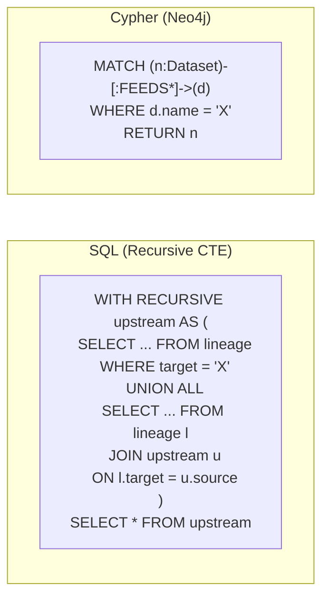
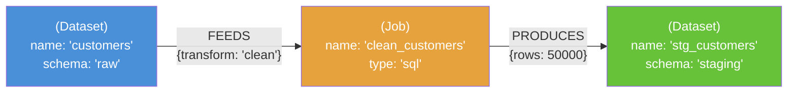
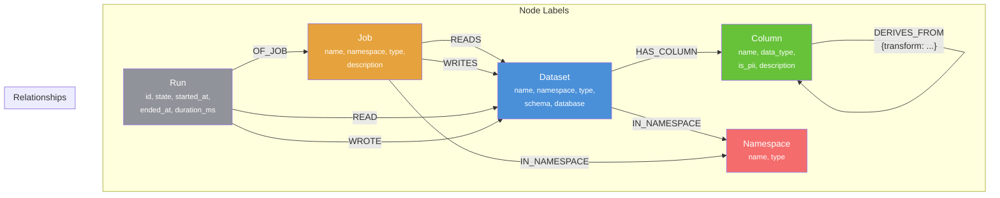
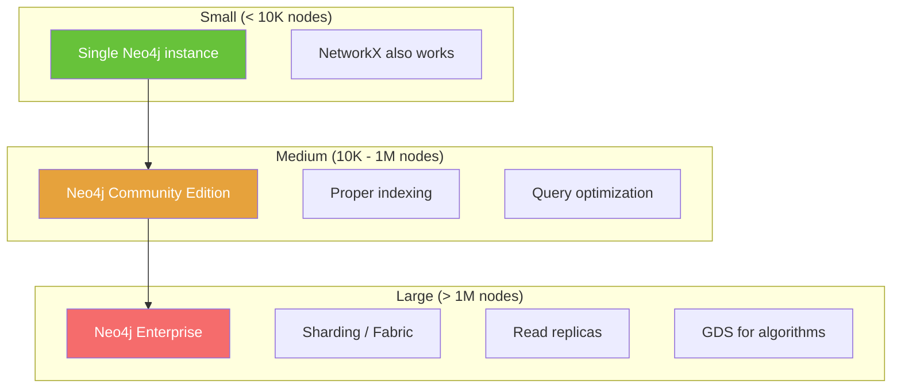

# Chapter 12: Graph Databases for Lineage

[&larr; Back to Index](../index.md) | [Previous: Chapter 11](11-column-level-lineage.md)

---

## Chapter Contents

- [12.1 Why Graph Databases for Lineage?](#121-why-graph-databases-for-lineage)
- [12.2 Graph Database Fundamentals](#122-graph-database-fundamentals)
- [12.3 Neo4j Primer](#123-neo4j-primer)
- [12.4 Modeling Lineage in Neo4j](#124-modeling-lineage-in-neo4j)
- [12.5 Loading Lineage Data into Neo4j](#125-loading-lineage-data-into-neo4j)
- [12.6 Cypher Queries for Lineage](#126-cypher-queries-for-lineage)
- [12.7 Advanced Graph Patterns](#127-advanced-graph-patterns)
- [12.8 Performance and Scaling](#128-performance-and-scaling)
- [12.9 Neo4j vs Alternatives](#129-neo4j-vs-alternatives)
- [12.10 Exercise](#1210-exercise)
- [12.11 Summary](#1211-summary)

---

## 12.1 Why Graph Databases for Lineage?

Lineage is inherently a graph problem — datasets connected by transformations, columns flowing through joins and aggregations. While you *can* store lineage in a relational database, graph databases are purpose-built for this.

### The Storage Trade-Off

```
┌──────────────────┬─────────────────────┬──────────────────────┐
│ Operation        │ Relational DB       │ Graph DB             │
├──────────────────┼─────────────────────┼──────────────────────┤
│ "What are the    │ Easy: single JOIN   │ Easy: single hop     │
│  direct inputs?" │                     │                      │
├──────────────────┼─────────────────────┼──────────────────────┤
│ "Trace full      │ Hard: recursive     │ Easy: variable-      │
│  upstream path"  │ CTE / N+1 queries   │ length path          │
├──────────────────┼─────────────────────┼──────────────────────┤
│ "Find all paths  │ Very hard:          │ Native: built-in     │
│  between A & B"  │ complex recursion   │ pathfinding          │
├──────────────────┼─────────────────────┼──────────────────────┤
│ "Impact of       │ Hard: reverse       │ Easy: downstream     │
│  changing X?"    │ recursive CTE       │ traversal            │
├──────────────────┼─────────────────────┼──────────────────────┤
│ "Which nodes     │ Requires app-       │ Native: centrality   │
│  are critical?"  │ level processing    │ algorithms           │
└──────────────────┴─────────────────────┴──────────────────────┘
```

### Query Complexity Comparison



---

## 12.2 Graph Database Fundamentals

### The Labeled Property Graph Model



Key concepts:

- **Nodes** (vertices): Entities with labels and properties (e.g., `Dataset`, `Job`, `Column`)
- **Relationships** (edges): Directed connections with types and properties (e.g., `FEEDS`, `PRODUCES`, `HAS_COLUMN`)
- **Labels**: Categories for nodes (like types/classes)
- **Properties**: Key-value pairs on nodes and relationships

### Neo4j vs NetworkX

```
┌──────────────────┬──────────────────────┬──────────────────────┐
│ Feature          │ NetworkX             │ Neo4j                │
├──────────────────┼──────────────────────┼──────────────────────┤
│ Storage          │ In-memory (Python)   │ Persistent (disk)    │
│ Scale            │ ~100K nodes          │ Billions of nodes    │
│ Query language   │ Python API           │ Cypher               │
│ Visualization    │ Matplotlib           │ Neo4j Browser/Bloom  │
│ Algorithms       │ Built-in (Python)    │ GDS library          │
│ Concurrency      │ Single-threaded      │ Multi-user           │
│ Use case         │ Prototyping, scripts │ Production systems   │
└──────────────────┴──────────────────────┴──────────────────────┘
```

> **GDS** (Graph Data Science) is Neo4j's library of graph algorithms including centrality, community detection, and path-finding.

---

## 12.3 Neo4j Primer

### Starting Neo4j with Docker

```bash
# Start Neo4j
docker run -d \
  --name neo4j-lineage \
  -p 7474:7474 \
  -p 7687:7687 \
  -e NEO4J_AUTH=neo4j/lineage_password \
  -e NEO4J_PLUGINS='["graph-data-science"]' \
  -v neo4j_data:/data \
  neo4j:5

# Access Neo4j Browser: http://localhost:7474
# Bolt connection: bolt://localhost:7687
```

### Cypher Basics

```cypher
-- Create nodes
CREATE (d:Dataset {name: 'customers', schema: 'raw', database: 'prod'})
CREATE (j:Job {name: 'clean_customers', type: 'sql'})

-- Create relationships
MATCH (d:Dataset {name: 'customers'})
MATCH (j:Job {name: 'clean_customers'})
CREATE (d)-[:FEEDS {transform_type: 'filter'}]->(j)

-- Query
MATCH (d:Dataset)-[:FEEDS]->(j:Job)
RETURN d.name, j.name
```

### Python Driver

```python
from neo4j import GraphDatabase


class Neo4jLineageStore:
    """Manages lineage data in Neo4j."""

    def __init__(self, uri: str, user: str, password: str):
        self.driver = GraphDatabase.driver(uri, auth=(user, password))

    def close(self):
        self.driver.close()

    def _run_query(self, query: str, parameters: dict | None = None) -> list:
        with self.driver.session() as session:
            result = session.run(query, parameters or {})
            return [record.data() for record in result]
```

---

## 12.4 Modeling Lineage in Neo4j

### Schema Design



### Create Constraints and Indexes

```cypher
-- Unique constraints
CREATE CONSTRAINT dataset_unique IF NOT EXISTS
FOR (d:Dataset) REQUIRE (d.namespace, d.name) IS UNIQUE;

CREATE CONSTRAINT job_unique IF NOT EXISTS
FOR (j:Job) REQUIRE (j.namespace, j.name) IS UNIQUE;

CREATE CONSTRAINT run_unique IF NOT EXISTS
FOR (r:Run) REQUIRE r.id IS UNIQUE;

-- Indexes for common queries
CREATE INDEX dataset_name IF NOT EXISTS FOR (d:Dataset) ON (d.name);
CREATE INDEX job_name IF NOT EXISTS FOR (j:Job) ON (j.name);
CREATE INDEX column_pii IF NOT EXISTS FOR (c:Column) ON (c.is_pii);
```

---

## 12.5 Loading Lineage Data into Neo4j

```python
class Neo4jLineageStore:
    # ... (constructor from above) ...

    def upsert_dataset(self, namespace: str, name: str, **properties) -> None:
        """Create or update a dataset node."""
        query = """
        MERGE (d:Dataset {namespace: $namespace, name: $name})
        ON CREATE SET d += $props, d.created_at = datetime()
        ON MATCH SET d += $props, d.updated_at = datetime()
        """
        self._run_query(query, {
            "namespace": namespace,
            "name": name,
            "props": properties,
        })

    def upsert_job(self, namespace: str, name: str, **properties) -> None:
        """Create or update a job node."""
        query = """
        MERGE (j:Job {namespace: $namespace, name: $name})
        ON CREATE SET j += $props, j.created_at = datetime()
        ON MATCH SET j += $props, j.updated_at = datetime()
        """
        self._run_query(query, {
            "namespace": namespace,
            "name": name,
            "props": properties,
        })

    def add_job_reads(self, job_ns: str, job_name: str,
                      dataset_ns: str, dataset_name: str) -> None:
        """Create a READS relationship between a job and dataset."""
        query = """
        MATCH (j:Job {namespace: $job_ns, name: $job_name})
        MATCH (d:Dataset {namespace: $dataset_ns, name: $dataset_name})
        MERGE (j)-[:READS]->(d)
        """
        self._run_query(query, {
            "job_ns": job_ns, "job_name": job_name,
            "dataset_ns": dataset_ns, "dataset_name": dataset_name,
        })

    def add_job_writes(self, job_ns: str, job_name: str,
                       dataset_ns: str, dataset_name: str) -> None:
        """Create a WRITES relationship between a job and dataset."""
        query = """
        MATCH (j:Job {namespace: $job_ns, name: $job_name})
        MATCH (d:Dataset {namespace: $dataset_ns, name: $dataset_name})
        MERGE (j)-[:WRITES]->(d)
        """
        self._run_query(query, {
            "job_ns": job_ns, "job_name": job_name,
            "dataset_ns": dataset_ns, "dataset_name": dataset_name,
        })

    def add_column(self, dataset_ns: str, dataset_name: str,
                   column_name: str, data_type: str = "",
                   is_pii: bool = False) -> None:
        """Add a column to a dataset."""
        query = """
        MATCH (d:Dataset {namespace: $ds_ns, name: $ds_name})
        MERGE (c:Column {dataset_ns: $ds_ns, dataset_name: $ds_name, name: $col_name})
        ON CREATE SET c.data_type = $data_type, c.is_pii = $is_pii
        MERGE (d)-[:HAS_COLUMN]->(c)
        """
        self._run_query(query, {
            "ds_ns": dataset_ns, "ds_name": dataset_name,
            "col_name": column_name, "data_type": data_type,
            "is_pii": is_pii,
        })

    def load_openlineage_event(self, event: dict) -> None:
        """Load a complete OpenLineage RunEvent into Neo4j."""
        job = event["job"]
        run = event["run"]
        event_type = event["eventType"]

        # Upsert job
        self.upsert_job(job["namespace"], job["name"], type="BATCH")

        # Upsert run
        run_query = """
        MATCH (j:Job {namespace: $ns, name: $name})
        MERGE (r:Run {id: $run_id})
        ON CREATE SET r.state = $state, r.event_time = $event_time
        ON MATCH SET r.state = $state, r.event_time = $event_time
        MERGE (r)-[:OF_JOB]->(j)
        """
        self._run_query(run_query, {
            "ns": job["namespace"],
            "name": job["name"],
            "run_id": run["runId"],
            "state": event_type,
            "event_time": event.get("eventTime", ""),
        })

        # Upsert input datasets
        for inp in event.get("inputs", []):
            self.upsert_dataset(inp["namespace"], inp["name"])
            self.add_job_reads(job["namespace"], job["name"],
                               inp["namespace"], inp["name"])

        # Upsert output datasets
        for out in event.get("outputs", []):
            self.upsert_dataset(out["namespace"], out["name"])
            self.add_job_writes(job["namespace"], job["name"],
                                out["namespace"], out["name"])
```

---

## 12.6 Cypher Queries for Lineage

### Upstream Lineage (All Ancestors)

```cypher
-- Find all upstream datasets for a given dataset
MATCH path = (upstream:Dataset)-[:WRITES|READS*]->(target:Dataset {name: 'dim_customers'})
RETURN upstream.name AS source,
       length(path) AS distance
ORDER BY distance
```

### Downstream Impact Analysis

```cypher
-- Find everything downstream of a dataset
MATCH path = (source:Dataset {name: 'raw.customers'})-[:READS|WRITES*]->(downstream)
RETURN downstream.name AS affected,
       labels(downstream) AS type,
       length(path) AS hops
ORDER BY hops
```

### Full Path Between Two Datasets

```cypher
-- Find all paths from dataset A to dataset B
MATCH path = shortestPath(
    (a:Dataset {name: 'raw.orders'})-[:READS|WRITES*]-(b:Dataset {name: 'revenue_report'})
)
RETURN [n IN nodes(path) | n.name] AS path_names,
       length(path) AS hops
```

### PII Column Tracking

```cypher
-- Find all columns marked as PII and where they flow
MATCH (pii:Column {is_pii: true})-[:DERIVES_FROM*0..10]->(downstream:Column)
RETURN pii.name AS pii_source,
       pii.dataset_name AS source_dataset,
       downstream.name AS reaches_column,
       downstream.dataset_name AS reaches_dataset
```

### Most Connected Datasets (Centrality)

```cypher
-- Find hub datasets (most connections)
MATCH (d:Dataset)
WITH d, size((d)<-[:READS]-()) AS readers,
        size((d)<-[:WRITES]-()) AS writers
RETURN d.name,
       readers + writers AS total_connections,
       readers,
       writers
ORDER BY total_connections DESC
LIMIT 10
```

---

## 12.7 Advanced Graph Patterns

### Community Detection

Find clusters of tightly connected datasets:

```cypher
-- Using Neo4j GDS (Graph Data Science)
CALL gds.louvain.stream('lineage-graph')
YIELD nodeId, communityId
WITH gds.util.asNode(nodeId) AS node, communityId
RETURN communityId,
       collect(node.name) AS members,
       count(*) AS size
ORDER BY size DESC
```

### Critical Path Analysis

```cypher
-- Find the longest dependency chain
MATCH path = (source:Dataset)-[:READS|WRITES*]->(sink:Dataset)
WHERE NOT EXISTS { ()-[:WRITES]->(source) }  -- source has no upstream
AND NOT EXISTS { (sink)-[:READS]->() }        -- sink has no downstream
RETURN [n IN nodes(path) | n.name] AS full_path,
       length(path) AS chain_length
ORDER BY chain_length DESC
LIMIT 5
```

### Temporal Lineage

```cypher
-- How has lineage evolved over time?
MATCH (r:Run)-[:OF_JOB]->(j:Job)-[:WRITES]->(d:Dataset {name: 'dim_customers'})
WHERE r.state = 'COMPLETE'
RETURN r.event_time AS when,
       j.name AS job,
       r.id AS run_id
ORDER BY r.event_time DESC
LIMIT 20
```

---

## 12.8 Performance and Scaling

### Index Strategy

```
┌────────────────────┬─────────────────────┬──────────────────┐
│ Query Pattern      │ Index Needed        │ Type             │
├────────────────────┼─────────────────────┼──────────────────┤
│ Find by name       │ ON (d.name)         │ B-tree           │
│ Find by namespace  │ ON (d.namespace)    │ B-tree           │
│ PII columns        │ ON (c.is_pii)       │ B-tree           │
│ Full-text search   │ ON (d.description)  │ Full-text        │
│ Time range         │ ON (r.event_time)   │ Range (B-tree)   │
│ Uniqueness         │ ON (d.namespace,    │ Unique           │
│                    │     d.name)         │ constraint       │
└────────────────────┴─────────────────────┴──────────────────┘
```

### Scaling Considerations



---

## 12.9 Neo4j vs Alternatives

| Database | Model | Query Language | Best For |
|----------|-------|---------------|----------|
| **Neo4j** | Labeled property graph | Cypher | General graph, rich queries |
| **Amazon Neptune** | Property graph + RDF | Gremlin / SPARQL | AWS ecosystem |
| **JanusGraph** | Property graph | Gremlin | Very large scale, distributed |
| **ArangoDB** | Multi-model (graph + doc) | AQL | Polyglot use cases |
| **TigerGraph** | Property graph | GSQL | Analytics, deep-link queries |
| **PostgreSQL + Apache AGE** | Property graph extension | Cypher (openCypher) | Existing Postgres infra |

---

## 12.10 Exercise

> **Exercise**: Open [`exercises/ch12_neo4j_lineage.py`](../exercises/ch12_neo4j_lineage.py)
> and complete the following tasks:
>
> 1. Start a Neo4j Docker container
> 2. Load the e-commerce lineage graph (from Chapter 4) into Neo4j
> 3. Write Cypher queries for upstream/downstream traversal
> 4. Find the most connected datasets
> 5. Run a shortest-path query between two distant datasets
> 6. **Bonus**: Add column-level lineage nodes and trace PII propagation

---

## 12.11 Summary

In this chapter, you learned:

- **Graph databases** are a natural fit for lineage: relationships ARE the data
- **Neo4j** provides Cypher, a pattern-matching query language for graph traversal
- A **labeled property graph model** maps cleanly to lineage concepts (Dataset, Job, Run, Column)
- **Cypher queries** make upstream/downstream traversal, impact analysis, and path finding simple
- **Advanced graph algorithms** (community detection, centrality) reveal structural patterns in lineage
- **Performance scales** with proper indexing and Neo4j's native graph storage engine

### Key Takeaway

> When your lineage graph grows beyond what fits in Python memory, or when
> you need concurrent access, persistent storage, and expressive graph queries,
> Neo4j is the natural next step. Cypher turns complex traversal questions
> into readable, declarative queries.

---

### What's Next

[Chapter 13: Building a Lineage API with FastAPI](13-lineage-api-fastapi.md) covers building a REST API over lineage storage so applications and UIs can query lineage programmatically.

---

[&larr; Back to Index](../index.md) | [Previous: Chapter 11](11-column-level-lineage.md) | [Next: Chapter 13 &rarr;](13-lineage-api-fastapi.md)
