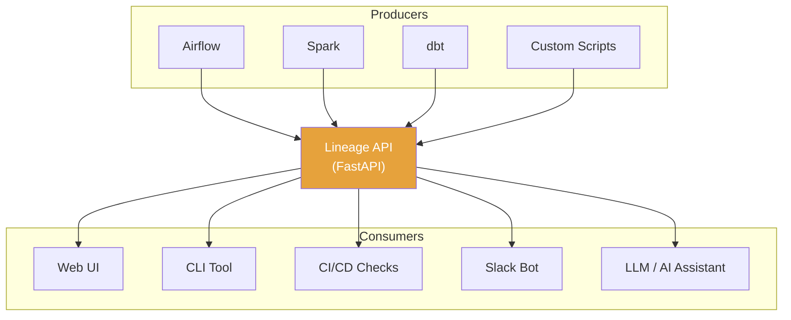
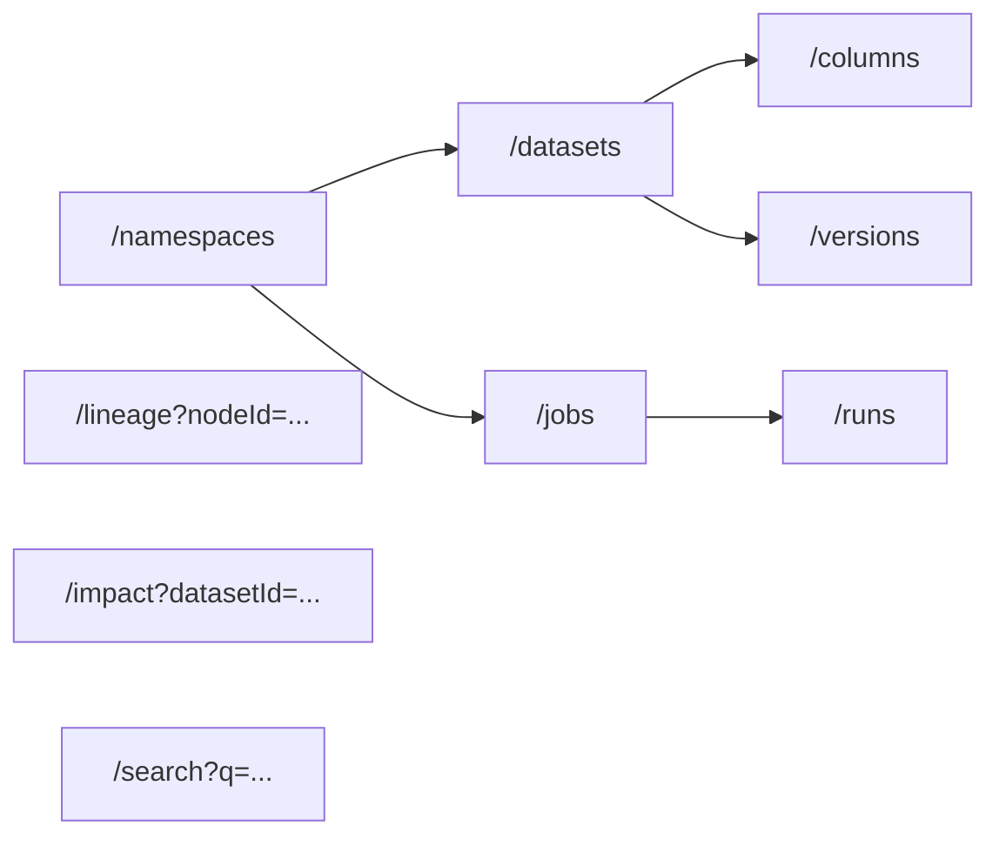
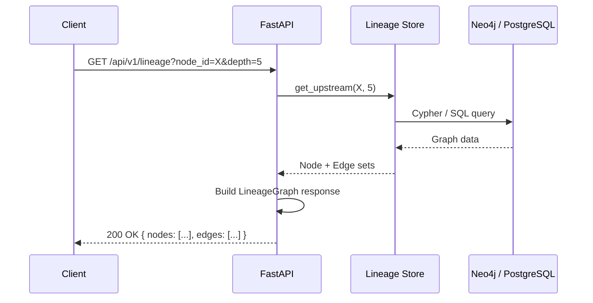

# Chapter 12: Building a Lineage API with FastAPI

[&larr; Back to Index](../index.md) | [Previous: Chapter 11](11-graph-databases-lineage.md)

---

## Chapter Contents

- [12.1 Why Build a Lineage API?](#121-why-build-a-lineage-api)
- [12.2 API Design Principles](#122-api-design-principles)
- [12.3 Pydantic Models for Lineage](#123-pydantic-models-for-lineage)
- [12.4 Building the FastAPI Application](#124-building-the-fastapi-application)
- [12.5 Lineage Endpoints](#125-lineage-endpoints)
- [12.6 Impact Analysis Endpoint](#126-impact-analysis-endpoint)
- [12.7 Search and Discovery](#127-search-and-discovery)
- [12.8 OpenLineage Event Ingestion](#128-openlineage-event-ingestion)
- [12.9 Testing the API](#129-testing-the-api)
- [12.10 Exercise](#1210-exercise)
- [12.11 Summary](#1211-summary)

---

## 12.1 Why Build a Lineage API?

A lineage API decouples lineage **producers** (Airflow, Spark, dbt) from **consumers** (UIs, CLIs, auditors, AI assistants).



---

## 12.2 API Design Principles

### Resource Model



### Endpoint Summary

```
┌────────────┬──────────────────────────────┬──────────────────────┐
│ Method     │ Endpoint                     │ Description          │
├────────────┼──────────────────────────────┼──────────────────────┤
│ GET        │ /api/v1/namespaces           │ List namespaces      │
│ GET        │ /api/v1/datasets             │ List/search datasets │
│ GET        │ /api/v1/datasets/{id}        │ Get dataset details  │
│ GET        │ /api/v1/datasets/{id}/columns│ Get dataset columns  │
│ GET        │ /api/v1/jobs                 │ List/search jobs     │
│ GET        │ /api/v1/jobs/{id}            │ Get job details      │
│ GET        │ /api/v1/jobs/{id}/runs       │ Get job run history  │
│ GET        │ /api/v1/lineage              │ Get lineage graph    │
│ GET        │ /api/v1/impact               │ Impact analysis      │
│ POST       │ /api/v1/lineage/events       │ Ingest OL event      │
│ GET        │ /api/v1/search               │ Full-text search     │
│ GET        │ /api/v1/health               │ Health check         │
└────────────┴──────────────────────────────┴──────────────────────┘
```

---

## 12.3 Pydantic Models for Lineage

```python
from datetime import datetime
from enum import Enum
from pydantic import BaseModel, Field


# ── Enums ──────────────────────────────────────────────────────

class DatasetType(str, Enum):
    DB_TABLE = "DB_TABLE"
    STREAM = "STREAM"
    FILE = "FILE"


class JobType(str, Enum):
    BATCH = "BATCH"
    STREAM = "STREAM"
    SERVICE = "SERVICE"


class RunState(str, Enum):
    START = "START"
    RUNNING = "RUNNING"
    COMPLETE = "COMPLETE"
    FAIL = "FAIL"
    ABORT = "ABORT"


class NodeType(str, Enum):
    DATASET = "DATASET"
    JOB = "JOB"


# ── Core Models ────────────────────────────────────────────────

class ColumnSchema(BaseModel):
    name: str
    data_type: str = ""
    description: str = ""
    is_pii: bool = False


class DatasetSummary(BaseModel):
    namespace: str
    name: str
    type: DatasetType = DatasetType.DB_TABLE
    description: str = ""
    created_at: datetime | None = None
    updated_at: datetime | None = None


class DatasetDetail(DatasetSummary):
    columns: list[ColumnSchema] = Field(default_factory=list)
    tags: list[str] = Field(default_factory=list)
    current_version: str | None = None


class JobSummary(BaseModel):
    namespace: str
    name: str
    type: JobType = JobType.BATCH
    description: str = ""
    latest_run_state: RunState | None = None
    latest_run_at: datetime | None = None


class RunSummary(BaseModel):
    id: str
    state: RunState
    started_at: datetime | None = None
    ended_at: datetime | None = None
    duration_ms: int | None = None


# ── Lineage Graph Models ──────────────────────────────────────

class LineageNode(BaseModel):
    """A node in the lineage graph (dataset or job)."""
    id: str
    type: NodeType
    name: str
    namespace: str
    in_edges: list[str] = Field(default_factory=list)
    out_edges: list[str] = Field(default_factory=list)


class LineageEdge(BaseModel):
    """An edge connecting two nodes in the lineage graph."""
    source: str
    target: str


class LineageGraph(BaseModel):
    """The complete lineage graph response."""
    nodes: list[LineageNode] = Field(default_factory=list)
    edges: list[LineageEdge] = Field(default_factory=list)
    depth: int
    root_node: str


# ── Impact Analysis ───────────────────────────────────────────

class ImpactAnalysis(BaseModel):
    """Result of impact analysis on a dataset or column."""
    source: str
    downstream_datasets: list[DatasetSummary] = Field(default_factory=list)
    downstream_jobs: list[JobSummary] = Field(default_factory=list)
    total_downstream_nodes: int
    max_depth: int
    critical_paths: list[list[str]] = Field(default_factory=list)
```

---

## 12.4 Building the FastAPI Application

```python
from contextlib import asynccontextmanager
from fastapi import FastAPI, Query, HTTPException


# In-memory store for simplicity (replace with Neo4j/PostgreSQL in production)
class LineageStore:
    """Simple in-memory lineage storage."""

    def __init__(self):
        self.datasets: dict[str, DatasetDetail] = {}
        self.jobs: dict[str, JobSummary] = {}
        self.edges: list[tuple[str, str]] = []  # (source_id, target_id)

    def add_dataset(self, dataset: DatasetDetail) -> None:
        key = f"{dataset.namespace}:{dataset.name}"
        self.datasets[key] = dataset

    def add_job(self, job: JobSummary) -> None:
        key = f"{job.namespace}:{job.name}"
        self.jobs[key] = job

    def add_edge(self, source_id: str, target_id: str) -> None:
        self.edges.append((source_id, target_id))

    def get_downstream(self, node_id: str, max_depth: int = 10) -> set[str]:
        """BFS to find all downstream nodes."""
        visited = set()
        queue = [(node_id, 0)]
        while queue:
            current, depth = queue.pop(0)
            if current in visited or depth > max_depth:
                continue
            visited.add(current)
            for src, tgt in self.edges:
                if src == current and tgt not in visited:
                    queue.append((tgt, depth + 1))
        visited.discard(node_id)
        return visited

    def get_upstream(self, node_id: str, max_depth: int = 10) -> set[str]:
        """BFS to find all upstream nodes."""
        visited = set()
        queue = [(node_id, 0)]
        while queue:
            current, depth = queue.pop(0)
            if current in visited or depth > max_depth:
                continue
            visited.add(current)
            for src, tgt in self.edges:
                if tgt == current and src not in visited:
                    queue.append((src, depth + 1))
        visited.discard(node_id)
        return visited


store = LineageStore()


@asynccontextmanager
async def lifespan(app: FastAPI):
    # Startup: load seed data or connect to DB
    print("Lineage API starting up...")
    yield
    # Shutdown: cleanup
    print("Lineage API shutting down...")


app = FastAPI(
    title="Lineage API",
    description="REST API for querying and managing data lineage metadata",
    version="0.1.0",
    lifespan=lifespan,
)
```

---

## 12.5 Lineage Endpoints

```python
@app.get("/api/v1/datasets", response_model=list[DatasetSummary])
async def list_datasets(
    namespace: str | None = Query(None, description="Filter by namespace"),
    limit: int = Query(20, ge=1, le=100),
    offset: int = Query(0, ge=0),
):
    """List all datasets, optionally filtered by namespace."""
    datasets = list(store.datasets.values())
    if namespace:
        datasets = [d for d in datasets if d.namespace == namespace]
    return datasets[offset : offset + limit]


@app.get("/api/v1/datasets/{namespace}/{name}", response_model=DatasetDetail)
async def get_dataset(namespace: str, name: str):
    """Get detailed information about a specific dataset."""
    key = f"{namespace}:{name}"
    if key not in store.datasets:
        raise HTTPException(status_code=404, detail=f"Dataset not found: {key}")
    return store.datasets[key]


@app.get("/api/v1/lineage", response_model=LineageGraph)
async def get_lineage(
    node_id: str = Query(..., description="Node ID (namespace:name)"),
    depth: int = Query(5, ge=1, le=20, description="Max traversal depth"),
    direction: str = Query("both", regex="^(upstream|downstream|both)$"),
):
    """Get the lineage graph for a given node.

    Returns the upstream and/or downstream lineage graph as a set
    of nodes and edges.
    """
    nodes_found = set()
    edges_found = []

    if direction in ("upstream", "both"):
        upstream = store.get_upstream(node_id, depth)
        nodes_found.update(upstream)

    if direction in ("downstream", "both"):
        downstream = store.get_downstream(node_id, depth)
        nodes_found.update(downstream)

    nodes_found.add(node_id)

    # Build response nodes
    lineage_nodes = []
    for nid in nodes_found:
        if nid in store.datasets:
            d = store.datasets[nid]
            lineage_nodes.append(LineageNode(
                id=nid, type=NodeType.DATASET,
                name=d.name, namespace=d.namespace,
            ))
        elif nid in store.jobs:
            j = store.jobs[nid]
            lineage_nodes.append(LineageNode(
                id=nid, type=NodeType.JOB,
                name=j.name, namespace=j.namespace,
            ))

    # Build response edges
    for src, tgt in store.edges:
        if src in nodes_found and tgt in nodes_found:
            edges_found.append(LineageEdge(source=src, target=tgt))

    return LineageGraph(
        nodes=lineage_nodes,
        edges=edges_found,
        depth=depth,
        root_node=node_id,
    )
```

### Lineage API Flow



---

## 12.6 Impact Analysis Endpoint

```python
@app.get("/api/v1/impact", response_model=ImpactAnalysis)
async def impact_analysis(
    dataset_id: str = Query(..., description="Dataset ID (namespace:name)"),
    max_depth: int = Query(10, ge=1, le=50),
):
    """Analyze the downstream impact of changes to a dataset.

    Returns all datasets and jobs that would be affected if the
    specified dataset's schema or data changes.
    """
    if dataset_id not in store.datasets:
        raise HTTPException(status_code=404, detail=f"Dataset not found: {dataset_id}")

    downstream_ids = store.get_downstream(dataset_id, max_depth)

    downstream_datasets = []
    downstream_jobs = []
    for nid in downstream_ids:
        if nid in store.datasets:
            downstream_datasets.append(store.datasets[nid])
        elif nid in store.jobs:
            downstream_jobs.append(store.jobs[nid])

    return ImpactAnalysis(
        source=dataset_id,
        downstream_datasets=downstream_datasets,
        downstream_jobs=downstream_jobs,
        total_downstream_nodes=len(downstream_ids),
        max_depth=max_depth,
    )
```

---

## 12.7 Search and Discovery

```python
@app.get("/api/v1/search")
async def search(
    q: str = Query(..., min_length=2, description="Search query"),
    node_type: NodeType | None = Query(None, description="Filter by type"),
    limit: int = Query(20, ge=1, le=100),
):
    """Search datasets and jobs by name or description."""
    results = []
    query_lower = q.lower()

    if node_type is None or node_type == NodeType.DATASET:
        for key, ds in store.datasets.items():
            if query_lower in ds.name.lower() or query_lower in ds.description.lower():
                results.append({
                    "id": key,
                    "type": "DATASET",
                    "name": ds.name,
                    "namespace": ds.namespace,
                    "description": ds.description,
                })

    if node_type is None or node_type == NodeType.JOB:
        for key, job in store.jobs.items():
            if query_lower in job.name.lower() or query_lower in job.description.lower():
                results.append({
                    "id": key,
                    "type": "JOB",
                    "name": job.name,
                    "namespace": job.namespace,
                    "description": job.description,
                })

    return {"query": q, "total": len(results), "results": results[:limit]}
```

---

## 12.8 OpenLineage Event Ingestion

```python
@app.post("/api/v1/lineage/events", status_code=201)
async def ingest_openlineage_event(event: dict):
    """Ingest an OpenLineage RunEvent.

    This endpoint accepts standard OpenLineage events and stores them
    in the lineage graph.
    """
    job_data = event.get("job", {})
    job_ns = job_data.get("namespace", "default")
    job_name = job_data.get("name", "unknown")
    job_id = f"{job_ns}:{job_name}"

    # Upsert job
    store.add_job(JobSummary(
        namespace=job_ns,
        name=job_name,
        type=JobType.BATCH,
    ))

    # Process inputs
    for inp in event.get("inputs", []):
        ds_ns = inp.get("namespace", "default")
        ds_name = inp.get("name", "unknown")
        ds_id = f"{ds_ns}:{ds_name}"

        columns = []
        schema_facet = inp.get("facets", {}).get("schema", {})
        for field in schema_facet.get("fields", []):
            columns.append(ColumnSchema(
                name=field["name"],
                data_type=field.get("type", ""),
            ))

        store.add_dataset(DatasetDetail(
            namespace=ds_ns, name=ds_name, columns=columns,
        ))
        store.add_edge(ds_id, job_id)

    # Process outputs
    for out in event.get("outputs", []):
        ds_ns = out.get("namespace", "default")
        ds_name = out.get("name", "unknown")
        ds_id = f"{ds_ns}:{ds_name}"

        columns = []
        schema_facet = out.get("facets", {}).get("schema", {})
        for field in schema_facet.get("fields", []):
            columns.append(ColumnSchema(
                name=field["name"],
                data_type=field.get("type", ""),
            ))

        store.add_dataset(DatasetDetail(
            namespace=ds_ns, name=ds_name, columns=columns,
        ))
        store.add_edge(job_id, ds_id)

    return {"status": "accepted", "job": job_id, "event_type": event.get("eventType")}
```

---

## 12.9 Testing the API

```python
import pytest
from httpx import AsyncClient, ASGITransport
from unittest.mock import MagicMock


@pytest.fixture
def test_app():
    """Create a test application with seed data."""
    # Seed the store
    store.add_dataset(DatasetDetail(
        namespace="postgres", name="raw.customers", type=DatasetType.DB_TABLE,
        columns=[
            ColumnSchema(name="id", data_type="INTEGER"),
            ColumnSchema(name="email", data_type="VARCHAR", is_pii=True),
        ],
    ))
    store.add_dataset(DatasetDetail(
        namespace="postgres", name="staging.stg_customers", type=DatasetType.DB_TABLE,
    ))
    store.add_job(JobSummary(
        namespace="airflow", name="clean_customers", type=JobType.BATCH,
    ))
    store.add_edge("postgres:raw.customers", "airflow:clean_customers")
    store.add_edge("airflow:clean_customers", "postgres:staging.stg_customers")
    return app


@pytest.mark.asyncio
async def test_get_lineage(test_app):
    transport = ASGITransport(app=test_app)
    async with AsyncClient(transport=transport, base_url="http://test") as client:
        response = await client.get(
            "/api/v1/lineage",
            params={"node_id": "postgres:raw.customers", "depth": 5},
        )
        assert response.status_code == 200
        data = response.json()
        assert len(data["nodes"]) >= 1
        assert data["root_node"] == "postgres:raw.customers"


@pytest.mark.asyncio
async def test_impact_analysis(test_app):
    transport = ASGITransport(app=test_app)
    async with AsyncClient(transport=transport, base_url="http://test") as client:
        response = await client.get(
            "/api/v1/impact",
            params={"dataset_id": "postgres:raw.customers"},
        )
        assert response.status_code == 200
        data = response.json()
        assert data["source"] == "postgres:raw.customers"
        assert data["total_downstream_nodes"] >= 1


@pytest.mark.asyncio
async def test_ingest_openlineage_event(test_app):
    transport = ASGITransport(app=test_app)
    async with AsyncClient(transport=transport, base_url="http://test") as client:
        event = {
            "eventType": "COMPLETE",
            "eventTime": "2025-01-15T10:00:00Z",
            "job": {"namespace": "spark", "name": "etl_job"},
            "inputs": [{"namespace": "s3", "name": "raw/data.parquet"}],
            "outputs": [{"namespace": "s3", "name": "curated/data.parquet"}],
            "run": {"runId": "abc-123"},
        }
        response = await client.post("/api/v1/lineage/events", json=event)
        assert response.status_code == 201
        assert response.json()["status"] == "accepted"
```

---

## 12.10 Exercise

> **Exercise**: Open [`exercises/ch12_lineage_api.py`](../exercises/ch12_lineage_api.py)
> and complete the following tasks:
>
> 1. Build a FastAPI application with the lineage endpoints described above
> 2. Seed the store with the e-commerce lineage graph from earlier chapters
> 3. Test the `/lineage`, `/impact`, and `/search` endpoints using `httpx`
> 4. Ingest OpenLineage events via POST and verify the graph updates
> 5. Add pagination to the list endpoints
> 6. **Bonus**: Generate an OpenAPI spec and explore it in Swagger UI

---

## 12.11 Summary

In this chapter, you learned:

- A **Lineage API** decouples producers from consumers, enabling diverse integrations
- **Pydantic models** provide validated, type-safe request/response schemas
- **FastAPI** simplifies building async REST APIs with automatic OpenAPI documentation
- Key endpoints include **lineage graph traversal**, **impact analysis**, **search**, and **event ingestion**
- The OpenLineage event ingestion endpoint lets any producer feed the lineage store
- **Testing** with `httpx` and `pytest-asyncio` verifies API behavior

### Key Takeaway

> A lineage API turns your metadata graph into a platform. Once lineage is
> accessible via REST, any tool can query it: CI/CD pipelines for impact
> checks, chatbots for lineage questions, UIs for visual exploration, and
> LLMs for narrative generation (which is what LENS does).

---

### What's Next

In [Chapter 13: Data Quality and Lineage](13-data-quality-lineage.md), we begin Part IV (Production Patterns) by exploring how data quality integrates with lineage. You will use tools like Great Expectations to add quality metadata to your lineage graph.

---

[&larr; Back to Index](../index.md) | [Previous: Chapter 11](11-graph-databases-lineage.md) | [Next: Chapter 13 &rarr;](13-data-quality-lineage.md)
