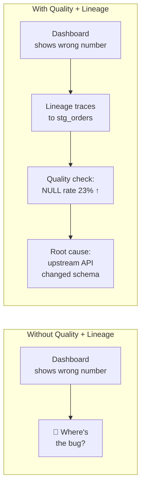
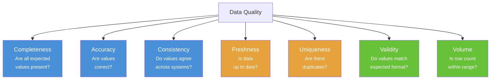
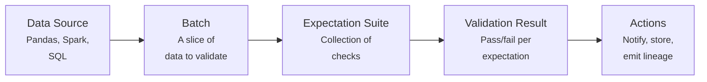
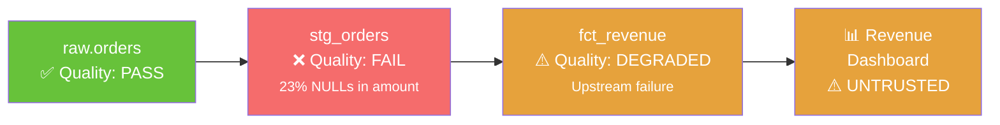

# Chapter 14: Data Quality and Lineage

[&larr; Back to Index](../index.md) | [Previous: Chapter 13](13-lineage-api-fastapi.md)

---

## Chapter Contents

- [14.1 The Quality-Lineage Connection](#141-the-quality-lineage-connection)
- [14.2 Data Quality Dimensions](#142-data-quality-dimensions)
- [14.3 Great Expectations Overview](#143-great-expectations-overview)
- [14.4 Quality Checks in Practice](#144-quality-checks-in-practice)
- [14.5 Quality Metadata as Lineage Facets](#145-quality-metadata-as-lineage-facets)
- [14.6 Propagating Quality Through the Graph](#146-propagating-quality-through-the-graph)
- [14.7 Building a Quality-Aware Lineage System](#147-building-a-quality-aware-lineage-system)
- [14.8 Exercise](#148-exercise)
- [14.9 Summary](#149-summary)

---

## 14.1 The Quality-Lineage Connection

Data quality and lineage are closely linked:

- **Lineage** tells you *where* data came from
- **Quality** tells you how *trustworthy* that data is

Together, they answer a core question: *"Can I trust this data, and if not, where did it go wrong?"*



---

## 14.2 Data Quality Dimensions



### Quality Checks Mapped to Lineage

| Dimension | What Lineage Adds | Example |
|-----------|-------------------|---------|
| **Completeness** | Trace NULLs back to source | `email` NULL rate increased → source CRM changed schema |
| **Freshness** | Check if upstream ran recently | Dashboard stale → Airflow DAG failed at 3 AM |
| **Volume** | Compare row counts across hops | `stg_orders` has 50% fewer rows → filter too aggressive |
| **Consistency** | Cross-reference joined datasets | `customer_id` in orders doesn't match customers table |

---

## 14.3 Great Expectations Overview

[Great Expectations](https://greatexpectations.io/) (GX) is an open-source data quality framework.

### Core Concepts



### Example Expectations

```python
import great_expectations as gx

context = gx.get_context()

# Define expectations for a dataset
suite = context.add_expectation_suite("orders_quality")

# Completeness
suite.add_expectation(
    gx.expectations.ExpectColumnValuesToNotBeNull(column="order_id")
)

# Uniqueness
suite.add_expectation(
    gx.expectations.ExpectColumnValuesToBeUnique(column="order_id")
)

# Validity
suite.add_expectation(
    gx.expectations.ExpectColumnValuesToBeBetween(
        column="total", min_value=0, max_value=1_000_000
    )
)

# Volume
suite.add_expectation(
    gx.expectations.ExpectTableRowCountToBeBetween(
        min_value=1000, max_value=10_000_000
    )
)

# Freshness (custom)
suite.add_expectation(
    gx.expectations.ExpectColumnMaxToBeBetween(
        column="created_at",
        min_value="2025-01-14",  # No older than yesterday
    )
)
```

---

## 14.4 Quality Checks in Practice

### Integrating Quality into a Pipeline

```python
from datetime import datetime


def run_quality_checks(df, dataset_name: str) -> dict:
    """Run data quality checks and return a report."""
    report = {
        "dataset": dataset_name,
        "checked_at": datetime.now().isoformat(),
        "row_count": len(df),
        "checks": [],
    }

    # Check 1: Completeness
    for col in df.columns:
        null_count = df[col].isnull().sum()
        null_rate = null_count / len(df) if len(df) > 0 else 0
        report["checks"].append({
            "check": "completeness",
            "column": col,
            "null_count": int(null_count),
            "null_rate": round(float(null_rate), 4),
            "passed": null_rate < 0.05,  # < 5% nulls
        })

    # Check 2: Uniqueness (for ID columns)
    id_cols = [c for c in df.columns if c.endswith("_id") or c == "id"]
    for col in id_cols:
        dup_count = len(df) - df[col].nunique()
        report["checks"].append({
            "check": "uniqueness",
            "column": col,
            "duplicate_count": int(dup_count),
            "passed": dup_count == 0,
        })

    # Check 3: Volume
    report["checks"].append({
        "check": "volume",
        "row_count": len(df),
        "passed": 100 <= len(df) <= 10_000_000,
    })

    # Overall status
    report["passed"] = all(c["passed"] for c in report["checks"])
    report["failed_checks"] = sum(1 for c in report["checks"] if not c["passed"])

    return report
```

---

## 14.5 Quality Metadata as Lineage Facets

OpenLineage provides a `DataQualityMetricsInputDatasetFacet` to embed quality metadata in lineage events:

```json
{
  "inputs": [
    {
      "namespace": "postgres://prod",
      "name": "raw.orders",
      "facets": {
        "dataQualityMetrics": {
          "_producer": "https://greatexpectations.io",
          "_schemaURL": "https://openlineage.io/spec/facets/...",
          "rowCount": 1234567,
          "bytes": 456789012,
          "columnMetrics": {
            "order_id": {
              "nullCount": 0,
              "distinctCount": 1234567,
              "min": 1,
              "max": 1234567
            },
            "total": {
              "nullCount": 42,
              "distinctCount": 89012,
              "min": 0.01,
              "max": 99999.99,
              "quantiles": {
                "0.25": 24.99,
                "0.5": 79.99,
                "0.75": 149.99
              }
            }
          }
        },
        "dataQualityAssertions": {
          "assertions": [
            {
              "assertion": "not_null",
              "column": "order_id",
              "success": true
            },
            {
              "assertion": "values_between",
              "column": "total",
              "success": true
            },
            {
              "assertion": "row_count_between",
              "success": true
            }
          ]
        }
      }
    }
  ]
}
```

---

## 14.6 Propagating Quality Through the Graph

When a quality check fails upstream, downstream consumers should know:



### Quality Propagation Algorithm

```python
from enum import Enum


class QualityStatus(Enum):
    PASS = "pass"
    FAIL = "fail"
    DEGRADED = "degraded"  # Upstream failure
    UNKNOWN = "unknown"


def propagate_quality(
    graph: dict[str, list[str]],      # adjacency list: node → downstream
    quality: dict[str, QualityStatus],  # node → quality status
) -> dict[str, QualityStatus]:
    """Propagate quality status through the lineage graph.

    If a node's quality is FAIL, all downstream nodes become DEGRADED.
    """
    from collections import deque

    result = dict(quality)

    # Find all failed nodes
    failed_nodes = [n for n, s in quality.items() if s == QualityStatus.FAIL]

    # BFS from each failed node
    for start in failed_nodes:
        queue = deque([start])
        visited = {start}
        while queue:
            current = queue.popleft()
            for downstream in graph.get(current, []):
                if downstream not in visited:
                    visited.add(downstream)
                    if result.get(downstream) != QualityStatus.FAIL:
                        result[downstream] = QualityStatus.DEGRADED
                    queue.append(downstream)

    return result
```

---

## 14.7 Building a Quality-Aware Lineage System

```python
from dataclasses import dataclass, field
from datetime import datetime


@dataclass
class QualityReport:
    dataset: str
    checked_at: datetime
    row_count: int
    passed: bool
    checks: list[dict] = field(default_factory=list)
    failed_checks: int = 0


class QualityAwareLineage:
    """Lineage system that tracks quality status at each node."""

    def __init__(self):
        self.graph: dict[str, list[str]] = {}
        self.quality: dict[str, QualityReport | None] = {}

    def add_edge(self, source: str, target: str):
        self.graph.setdefault(source, []).append(target)
        self.graph.setdefault(target, [])

    def record_quality(self, report: QualityReport):
        self.quality[report.dataset] = report

    def get_trust_score(self, dataset: str) -> float:
        """Calculate a trust score (0-1) based on own + upstream quality."""
        # Own quality
        own = self.quality.get(dataset)
        if own is None:
            return 0.5  # Unknown

        own_score = 1.0 if own.passed else 0.0

        # Upstream quality (recursive, with weighting by distance)
        upstream = self._get_upstream(dataset)
        if not upstream:
            return own_score

        upstream_scores = []
        for node, depth in upstream:
            q = self.quality.get(node)
            if q is not None:
                weight = 1.0 / (depth + 1)
                upstream_scores.append((1.0 if q.passed else 0.0, weight))

        if not upstream_scores:
            return own_score

        weighted_sum = sum(s * w for s, w in upstream_scores)
        total_weight = sum(w for _, w in upstream_scores)
        upstream_avg = weighted_sum / total_weight

        # Blend: 60% own quality, 40% upstream quality
        return 0.6 * own_score + 0.4 * upstream_avg

    def _get_upstream(self, node: str, depth: int = 0) -> list[tuple[str, int]]:
        """Find all upstream nodes with their depth."""
        result = []
        for src, targets in self.graph.items():
            if node in targets:
                result.append((src, depth + 1))
                result.extend(self._get_upstream(src, depth + 1))
        return result
```

---

## 14.8 Exercise

> **Exercise**: Open [`exercises/ch14_quality_lineage.py`](../exercises/ch14_quality_lineage.py)
> and complete the following tasks:
>
> 1. Build the `QualityAwareLineage` system
> 2. Model a pipeline with 5+ datasets and add quality reports
> 3. Introduce a quality failure at one node and propagate status downstream
> 4. Calculate trust scores for each dataset in the pipeline
> 5. Generate a quality-annotated lineage report
> 6. **Bonus**: Create OpenLineage events with `dataQualityMetrics` facets

---

## 14.9 Summary

This chapter covered:

- **Data quality checks** (completeness, uniqueness, freshness, volume) integrate directly with lineage
- **OpenLineage facets** standardize quality metadata alongside lineage events
- **Quality propagation** through the lineage graph enables "trust scores" for downstream datasets
- **Great Expectations** can emit quality metrics as lineage facets
- A quality-aware lineage system answers both "where did it come from?" and "can I trust it?"

### Key Takeaway

> Lineage without quality signals is incomplete. When you attach quality metadata
> to every node in the graph, downstream consumers can make informed decisions
> about whether to trust the data they depend on.

### What's Next

[Chapter 15: Data Observability](15-data-observability.md) extends quality monitoring into full observability, covering freshness, volume, schema drift, anomaly detection, and SLA-based alerting.

---

[&larr; Back to Index](../index.md) | [Previous: Chapter 13](13-lineage-api-fastapi.md) | [Next: Chapter 15 &rarr;](15-data-observability.md)
