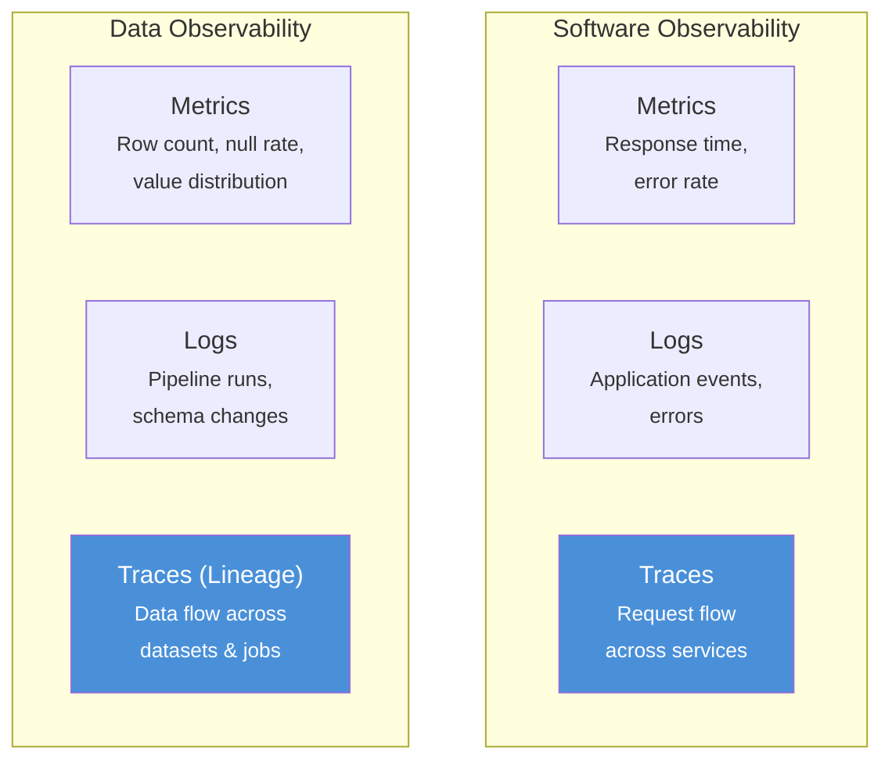
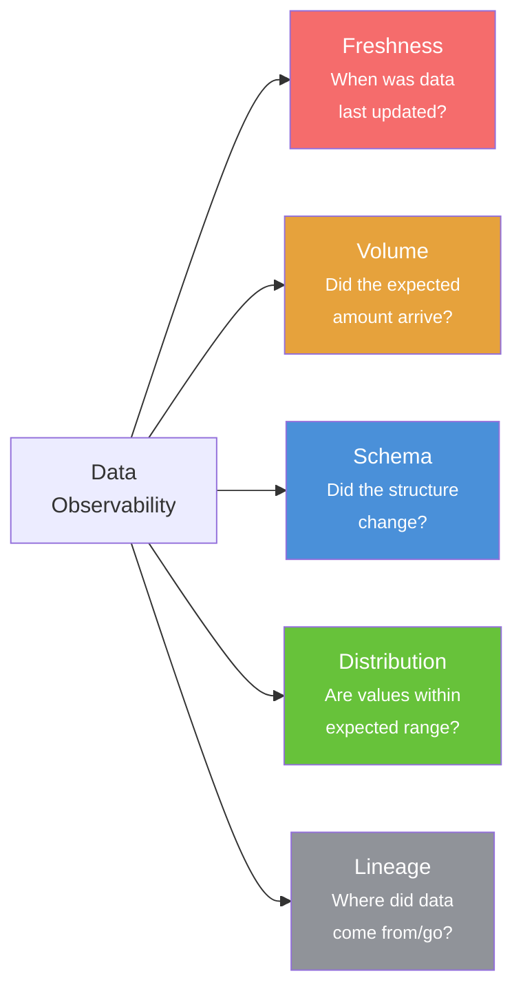
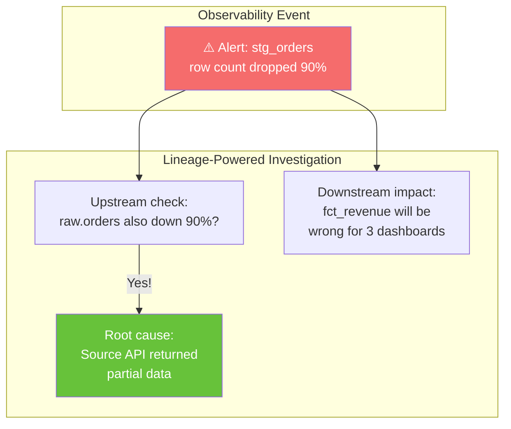
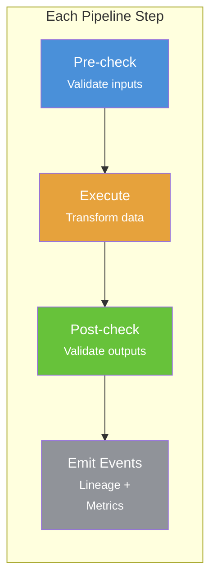
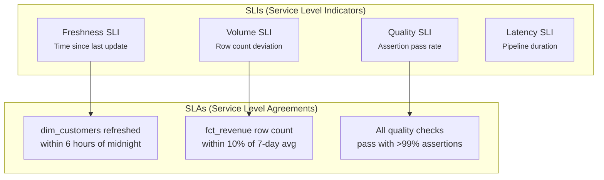

# Chapter 15: Data Observability

[&larr; Back to Index](../index.md) | [Previous: Chapter 14](14-data-quality-lineage.md)

---

## Chapter Contents

- [15.1 What Is Data Observability?](#151-what-is-data-observability)
- [15.2 The Five Pillars of Data Observability](#152-the-five-pillars-of-data-observability)
- [15.3 Observability vs Data Quality](#153-observability-vs-data-quality)
- [15.4 Lineage as the Backbone of Observability](#154-lineage-as-the-backbone-of-observability)
- [15.5 Building Observable Pipelines](#155-building-observable-pipelines)
- [15.6 Anomaly Detection with Lineage Context](#156-anomaly-detection-with-lineage-context)
- [15.7 SLAs and SLIs for Data Pipelines](#157-slas-and-slis-for-data-pipelines)
- [15.8 Exercise](#158-exercise)
- [15.9 Summary](#159-summary)

---

## 15.1 What Is Data Observability?

Data observability applies the principles of software observability (metrics, logs, traces) to data systems. Instead of monitoring application uptime, you monitor data freshness, volume, schema, and quality.



> **Key insight**: In data observability, **lineage IS tracing**. Just as distributed
> traces show a request's path through microservices, lineage shows data's path
> through pipelines.

---

## 15.2 The Five Pillars of Data Observability



### Monitoring Each Pillar

```python
from datetime import datetime, timedelta
from dataclasses import dataclass


@dataclass
class ObservabilityMetrics:
    """Observability metrics for a single dataset."""
    dataset: str
    measured_at: datetime

    # Freshness
    last_updated: datetime | None = None
    freshness_hours: float | None = None
    freshness_sla_hours: float = 24.0

    # Volume
    row_count: int = 0
    expected_row_range: tuple[int, int] = (0, 0)

    # Schema
    column_count: int = 0
    schema_changed: bool = False
    columns_added: list[str] | None = None
    columns_removed: list[str] | None = None

    # Distribution
    null_rates: dict[str, float] | None = None  # column → null rate
    value_ranges: dict[str, tuple[float, float]] | None = None

    @property
    def is_fresh(self) -> bool:
        if self.freshness_hours is None:
            return False
        return self.freshness_hours <= self.freshness_sla_hours

    @property
    def volume_ok(self) -> bool:
        low, high = self.expected_row_range
        return low <= self.row_count <= high

    @property
    def overall_health(self) -> str:
        issues = []
        if not self.is_fresh:
            issues.append("stale")
        if not self.volume_ok:
            issues.append("volume_anomaly")
        if self.schema_changed:
            issues.append("schema_changed")
        if not issues:
            return "healthy"
        return f"unhealthy: {', '.join(issues)}"
```

---

## 15.3 Observability vs Data Quality

```
┌─────────────────────┬──────────────────────┬──────────────────────┐
│ Aspect              │ Data Quality         │ Data Observability   │
├─────────────────────┼──────────────────────┼──────────────────────┤
│ Approach            │ Define tests upfront │ Monitor continuously │
│ Scope               │ Specific assertions  │ Holistic health      │
│ When it runs        │ During ETL pipeline  │ Always / scheduled   │
│ Failure mode        │ Pipeline stops       │ Alert fires          │
│ Lineage role        │ Root cause analysis  │ Impact propagation   │
│ Example tool        │ Great Expectations   │ Monte Carlo,         │
│                     │                      │ Elementary           │
│ Analogy             │ Unit tests           │ APM / monitoring     │
└─────────────────────┴──────────────────────┴──────────────────────┘
```

---

## 15.4 Lineage as the Backbone of Observability



### Automated Root Cause Flow

```python
async def investigate_anomaly(
    dataset: str,
    anomaly_type: str,
    lineage_api: str,
) -> dict:
    """Use lineage to investigate an anomaly.

    This is an async function; call it from an async runtime, e.g.:
        asyncio.run(investigate_anomaly("stg_orders", "volume_drop", "http://localhost:5000"))
    """
    import httpx

    async with httpx.AsyncClient() as client:
        # Step 1: Get upstream lineage
        response = await client.get(
            f"{lineage_api}/api/v1/lineage",
            params={"node_id": dataset, "direction": "upstream", "depth": 10},
        )
        upstream = response.json()

        # Step 2: Check quality/metrics for each upstream node
        suspects = []
        for node in upstream["nodes"]:
            if node["type"] == "DATASET":
                metrics_resp = await client.get(
                    f"{lineage_api}/api/v1/datasets/{node['namespace']}/{node['name']}/metrics"
                )
                metrics = metrics_resp.json()
                if metrics.get("health") != "healthy":
                    suspects.append({
                        "dataset": node["name"],
                        "issue": metrics.get("health"),
                    })

        # Step 3: Get downstream impact
        impact_resp = await client.get(
            f"{lineage_api}/api/v1/impact",
            params={"dataset_id": dataset},
        )
        impact = impact_resp.json()

        return {
            "dataset": dataset,
            "anomaly": anomaly_type,
            "probable_root_causes": suspects,
            "downstream_impact": impact["total_downstream_nodes"],
            "affected_datasets": [d["name"] for d in impact["downstream_datasets"]],
        }
```

---

## 15.5 Building Observable Pipelines

### The Observable Pipeline Pattern



### Implementation

```python
from datetime import datetime
import json


class ObservablePipeline:
    """A pipeline wrapper that emits lineage + observability events."""

    def __init__(self, job_name: str, namespace: str = "default"):
        self.job_name = job_name
        self.namespace = namespace
        self.events: list[dict] = []
        self.metrics: dict[str, ObservabilityMetrics] = {}

    def record_input(self, dataset: str, row_count: int, schema: list[str]):
        """Record an input dataset with its metrics."""
        self.metrics[dataset] = ObservabilityMetrics(
            dataset=dataset,
            measured_at=datetime.now(),
            row_count=row_count,
            column_count=len(schema),
        )

    def record_output(self, dataset: str, row_count: int, schema: list[str]):
        """Record an output dataset with its metrics."""
        self.metrics[dataset] = ObservabilityMetrics(
            dataset=dataset,
            measured_at=datetime.now(),
            row_count=row_count,
            column_count=len(schema),
            last_updated=datetime.now(),
            freshness_hours=0,
        )

    def emit_openlineage_event(self, event_type: str = "COMPLETE") -> dict:
        """Generate an OpenLineage event with observability facets."""
        inputs = []
        outputs = []
        for name, metrics in self.metrics.items():
            facets = {
                "dataQualityMetrics": {
                    "rowCount": metrics.row_count,
                    "columnMetrics": {},
                }
            }
            dataset_entry = {
                "namespace": self.namespace,
                "name": name,
                "facets": facets,
            }
            if metrics.last_updated:
                outputs.append(dataset_entry)
            else:
                inputs.append(dataset_entry)

        event = {
            "eventType": event_type,
            "eventTime": datetime.now().isoformat(),
            "job": {"namespace": self.namespace, "name": self.job_name},
            "run": {"runId": f"run-{datetime.now().timestamp()}"},
            "inputs": inputs,
            "outputs": outputs,
        }
        self.events.append(event)
        return event
```

---

## 15.6 Anomaly Detection with Lineage Context

### Statistical Anomaly Detection

```python
import statistics


class AnomalyDetector:
    """Detect anomalies in dataset metrics using historical baselines."""

    def __init__(self):
        self.history: dict[str, list[float]] = {}  # metric_key → values

    def record(self, dataset: str, metric: str, value: float):
        key = f"{dataset}:{metric}"
        self.history.setdefault(key, []).append(value)

    def is_anomaly(self, dataset: str, metric: str, value: float,
                   z_threshold: float = 3.0) -> bool:
        """Detect if a value is anomalous using z-score."""
        key = f"{dataset}:{metric}"
        history = self.history.get(key, [])
        if len(history) < 5:  # Need enough history
            return False

        mean = statistics.mean(history)
        stdev = statistics.stdev(history)
        if stdev == 0:
            return value != mean

        z_score = abs(value - mean) / stdev
        return z_score > z_threshold

    def check_dataset(self, dataset: str, current_metrics: dict) -> list[dict]:
        """Check all metrics for a dataset and return anomalies."""
        anomalies = []
        for metric, value in current_metrics.items():
            if self.is_anomaly(dataset, metric, value):
                key = f"{dataset}:{metric}"
                history = self.history.get(key, [])
                anomalies.append({
                    "dataset": dataset,
                    "metric": metric,
                    "current_value": value,
                    "historical_mean": statistics.mean(history),
                    "historical_stdev": statistics.stdev(history),
                })
        return anomalies
```

---

## 15.7 SLAs and SLIs for Data Pipelines

### Data SLA Framework



### SLA Monitoring

```python
@dataclass
class DataSLA:
    dataset: str
    metric: str         # "freshness", "volume", "quality"
    threshold: float    # SLA threshold
    unit: str           # "hours", "percent", "rows"
    owner: str          # Team responsible

    def check(self, current_value: float) -> bool:
        if self.metric == "freshness":
            return current_value <= self.threshold  # Must be within N hours
        elif self.metric == "volume":
            return abs(current_value) <= self.threshold  # Deviation %
        elif self.metric == "quality":
            return current_value >= self.threshold  # Pass rate %
        return True


# Define SLAs
slas = [
    DataSLA("dim_customers", "freshness", 6.0, "hours", "analytics-team"),
    DataSLA("fct_revenue", "volume", 10.0, "percent", "data-eng"),
    DataSLA("dim_customers", "quality", 99.0, "percent", "analytics-team"),
]
```

---

## 15.8 Exercise

> **Exercise**: Open [`exercises/ch15_observability.py`](../exercises/ch15_observability.py)
> and complete the following tasks:
>
> 1. Build the `AnomalyDetector` class with z-score detection
> 2. Create an `ObservablePipeline` that emits metrics and lineage
> 3. Simulate a week of pipeline runs with varying metrics
> 4. Detect anomalies and use lineage to identify root causes
> 5. Define and check SLAs for key datasets

---

## 15.9 Summary

You now know how to:

- Apply **data observability** (monitoring, logging, and tracing) to data pipelines
- Evaluate pipelines across the **five pillars**: freshness, volume, schema, distribution, and lineage
- Use **lineage as tracing**, showing data's path through the platform
- Combine **anomaly detection** with lineage for automated root cause analysis
- Define **SLAs/SLIs** that measure data reliability as concrete contracts

### Key Takeaway

> Observability turns lineage from a static map into a live dashboard. When you
> can detect anomalies and trace them back to their source automatically, you shift
> from reactive firefighting to proactive data operations.

### What's Next

[Chapter 16: Streaming & Real-Time Lineage](16-streaming-lineage.md) moves from batch-oriented lineage to continuous, unbounded data flows through Kafka, Flink, and Spark Structured Streaming.

---

[&larr; Back to Index](../index.md) | [Previous: Chapter 14](14-data-quality-lineage.md) | [Next: Chapter 16 &rarr;](16-streaming-lineage.md)
