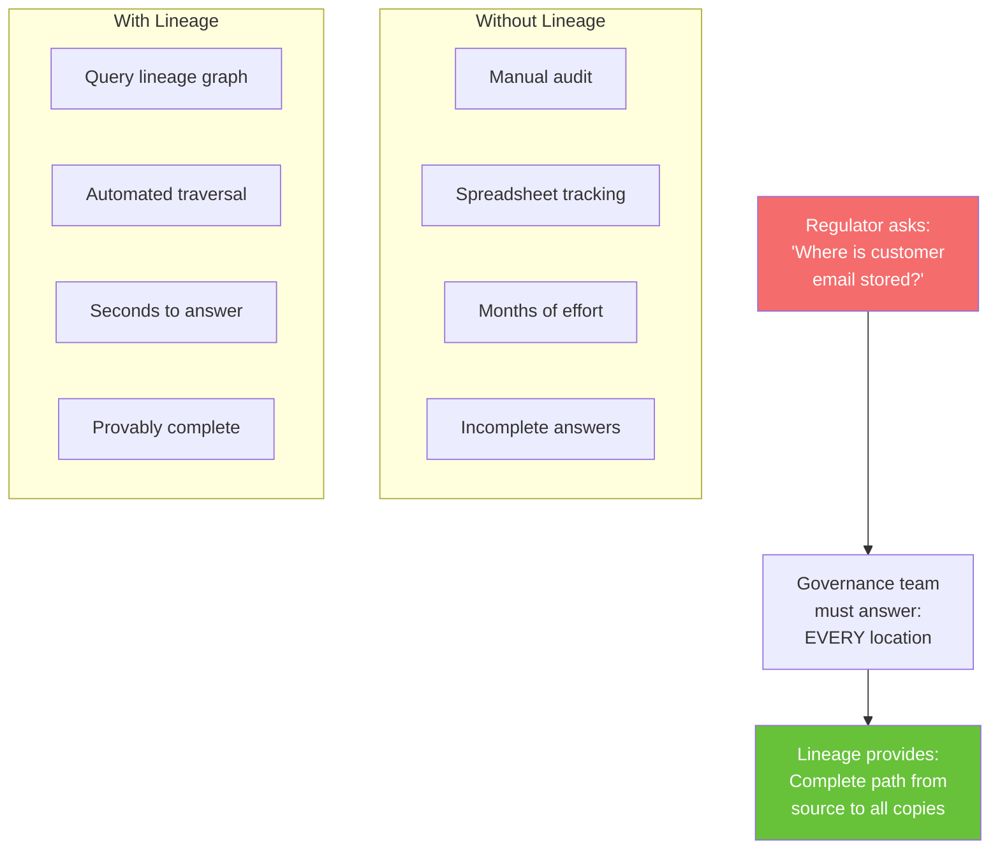
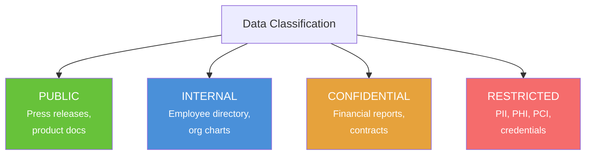
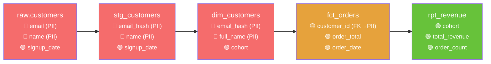
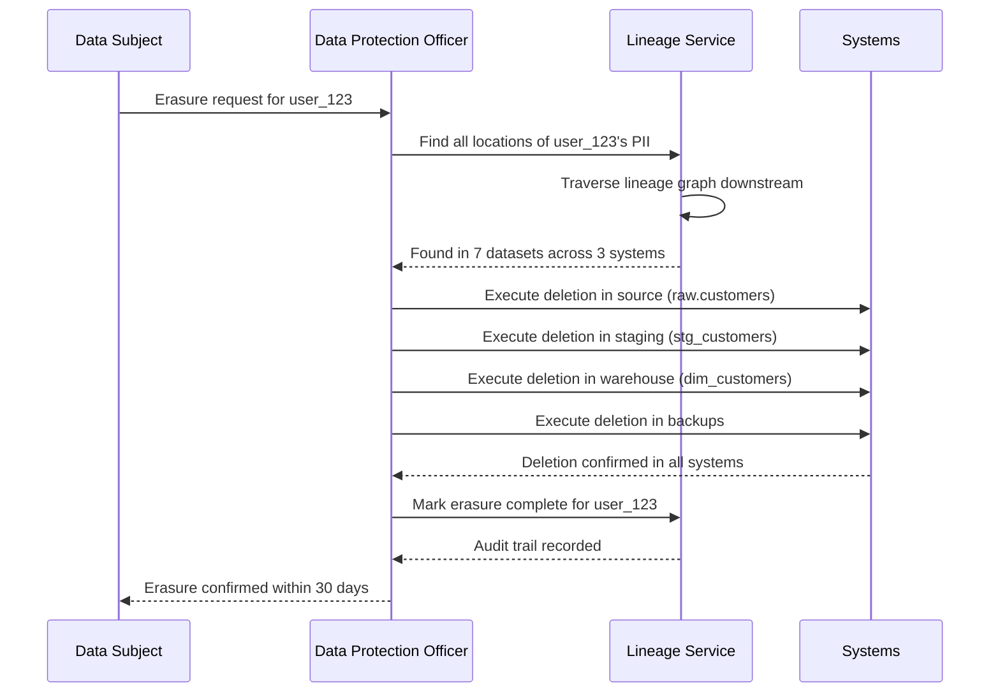
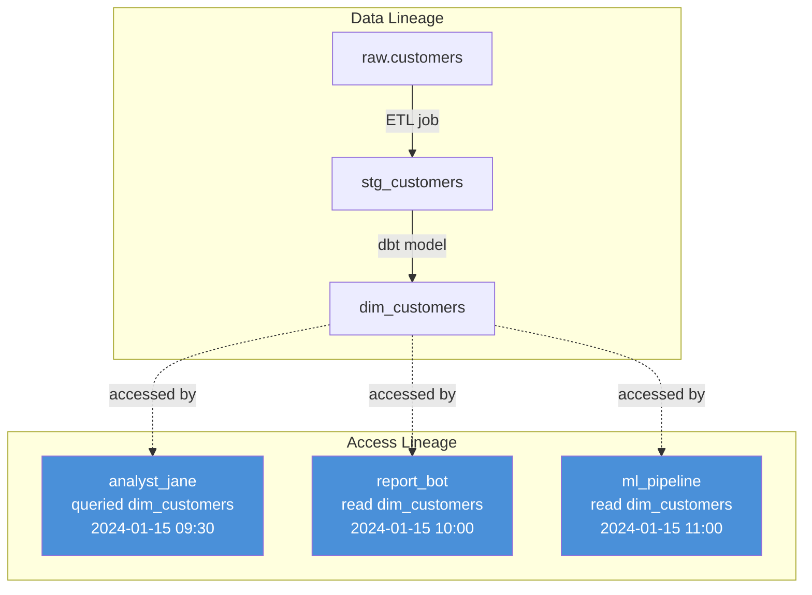
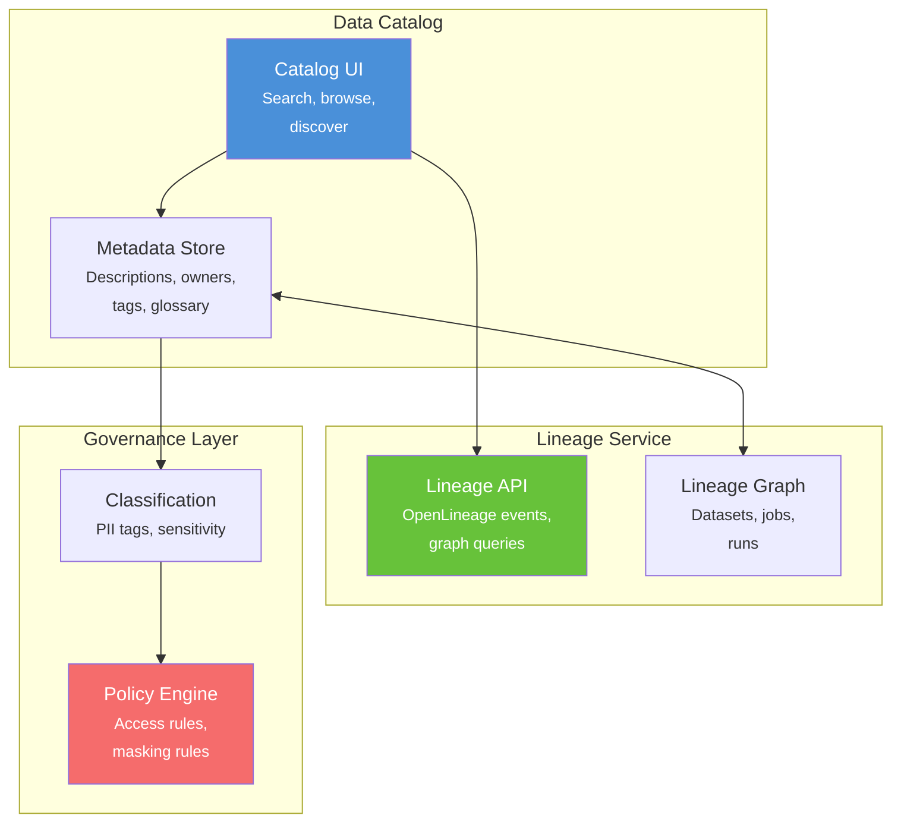
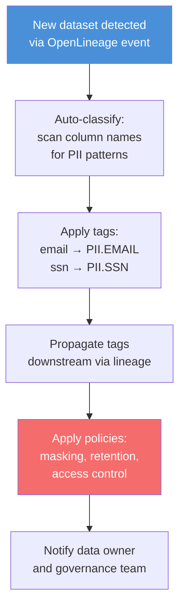

# Chapter 16: Compliance, Governance & Privacy

[&larr; Back to Index](../index.md) | [Previous: Chapter 15](15-streaming-lineage.md)

---

## Chapter Contents

- [16.1 Why Governance Needs Lineage](#161-why-governance-needs-lineage)
- [16.2 Key Regulations](#162-key-regulations)
- [16.3 Data Classification and Tagging](#163-data-classification-and-tagging)
- [16.4 PII Lineage Tracking](#164-pii-lineage-tracking)
- [16.5 Right to Erasure (GDPR Article 17)](#165-right-to-erasure-gdpr-article-17)
- [16.6 Access Lineage and Audit Trails](#166-access-lineage-and-audit-trails)
- [16.7 Data Catalog Integration](#167-data-catalog-integration)
- [16.8 Governance Automation with Lineage](#168-governance-automation-with-lineage)
- [16.9 Exercise](#169-exercise)
- [16.10 Summary](#1610-summary)

---

## 16.1 Why Governance Needs Lineage



> **Without lineage**, answering "where does customer data go?" requires
> interviewing every team. **With lineage**, it's a graph traversal.

---

## 16.2 Key Regulations

| Regulation | Key Requirements | Lineage's Role |
|---|---|---|
| GDPR (EU) | Right to erasure, data portability, lawful basis | Track PII flow, prove deletion across all copies, audit access |
| CCPA/CPRA (California) | Right to know, right to delete, opt-out | Map data collection to downstream uses, track opt-outs |
| HIPAA (US Healthcare) | PHI (Protected Health Info) safeguards | Track all PHI movement, access logging |
| SOX (US Financial) | Financial reporting accuracy | Prove data integrity from source to financial report |
| BCBS 239 (Banking) | Risk data aggregation and reporting | Trace risk metrics to source systems |
| DORA (EU Financial) | Digital operational resilience | Map data dependencies for incident response |

---

## 16.3 Data Classification and Tagging

### Classification Taxonomy



### Tagging System

```python
from enum import Enum
from dataclasses import dataclass, field


class Classification(Enum):
    PUBLIC = "PUBLIC"
    INTERNAL = "INTERNAL"
    CONFIDENTIAL = "CONFIDENTIAL"
    RESTRICTED = "RESTRICTED"


class PIIType(Enum):
    EMAIL = "EMAIL"
    PHONE = "PHONE"
    SSN = "SSN"
    NAME = "NAME"
    ADDRESS = "ADDRESS"
    DOB = "DATE_OF_BIRTH"
    IP_ADDRESS = "IP_ADDRESS"
    FINANCIAL = "FINANCIAL_ACCOUNT"


@dataclass
class ColumnTag:
    """Tag model for a single column."""
    column: str
    classification: Classification
    pii_types: list[PIIType] = field(default_factory=list)
    retention_days: int | None = None  # Auto-delete after N days
    legal_basis: str | None = None     # GDPR lawful basis
    masked: bool = False               # Is this column masked/hashed?

    @property
    def is_pii(self) -> bool:
        return len(self.pii_types) > 0


@dataclass
class DatasetTags:
    """Classification tags for an entire dataset."""
    dataset: str
    owner: str
    columns: list[ColumnTag] = field(default_factory=list)

    @property
    def highest_classification(self) -> Classification:
        if not self.columns:
            return Classification.PUBLIC
        priority = [
            Classification.RESTRICTED,
            Classification.CONFIDENTIAL,
            Classification.INTERNAL,
            Classification.PUBLIC,
        ]
        for level in priority:
            if any(c.classification == level for c in self.columns):
                return level
        return Classification.PUBLIC

    def pii_columns(self) -> list[ColumnTag]:
        return [c for c in self.columns if c.is_pii]


# Example
customers = DatasetTags(
    dataset="raw.customers",
    owner="data-engineering",
    columns=[
        ColumnTag("customer_id", Classification.INTERNAL),
        ColumnTag("email", Classification.RESTRICTED,
                  pii_types=[PIIType.EMAIL],
                  legal_basis="consent", retention_days=365 * 3),
        ColumnTag("name", Classification.RESTRICTED,
                  pii_types=[PIIType.NAME],
                  legal_basis="contract"),
        ColumnTag("signup_date", Classification.INTERNAL),
    ],
)

print(f"Highest classification: {customers.highest_classification.value}")
print(f"PII columns: {[c.column for c in customers.pii_columns()]}")
```

---

## 16.4 PII Lineage Tracking

**PII** (Personally Identifiable Information) covers any data that can identify a specific person. The lineage graph reveals every location where PII lands and every transformation it passes through.

### PII Propagation Through the Graph



### PII Propagation Tracker

```python
import networkx as nx
from dataclasses import dataclass, field


@dataclass
class PIITracker:
    """Track PII propagation through the lineage graph."""

    lineage: nx.DiGraph
    dataset_tags: dict[str, DatasetTags] = field(default_factory=dict)

    def register_tags(self, tags: DatasetTags):
        self.dataset_tags[tags.dataset] = tags

    def find_all_pii_locations(self, pii_type: PIIType) -> list[dict]:
        """Find every dataset+column containing a specific PII type."""
        locations = []
        for ds_name, tags in self.dataset_tags.items():
            for col in tags.columns:
                if pii_type in col.pii_types:
                    locations.append({
                        "dataset": ds_name,
                        "column": col.column,
                        "classification": col.classification.value,
                        "masked": col.masked,
                    })
        return locations

    def trace_pii_downstream(self, source_dataset: str,
                              source_column: str) -> list[dict]:
        """Trace where a PII column's data ends up downstream."""
        if source_dataset not in self.lineage:
            return []

        path = []
        descendants = nx.descendants(self.lineage, source_dataset)
        for desc in descendants:
            tags = self.dataset_tags.get(desc)
            if tags:
                for col in tags.columns:
                    if col.is_pii:
                        path.append({
                            "dataset": desc,
                            "column": col.column,
                            "pii_types": [t.value for t in col.pii_types],
                            "masked": col.masked,
                        })
        return path

    def erasure_plan(self, pii_type: PIIType) -> list[dict]:
        """Generate a deletion plan for right-to-erasure requests."""
        locations = self.find_all_pii_locations(pii_type)
        plan = []
        for loc in locations:
            plan.append({
                **loc,
                "action": "delete" if not loc["masked"] else "verify_masked",
                "priority": "high" if not loc["masked"] else "low",
            })
        # Sort by priority (high first)
        plan.sort(key=lambda x: 0 if x["priority"] == "high" else 1)
        return plan
```

---

## 16.5 Right to Erasure (GDPR Article 17)

### Erasure Workflow with Lineage



### Erasure Execution

```python
@dataclass
class ErasureRequest:
    """Track a GDPR erasure request through the pipeline."""
    request_id: str
    subject_id: str
    pii_types: list[PIIType]
    requested_at: datetime
    deadline: datetime  # 30 days from request

    status: str = "pending"  # pending → in_progress → completed
    plan: list[dict] = field(default_factory=list)
    completed_deletions: list[dict] = field(default_factory=list)

    def generate_plan(self, tracker: PIITracker) -> list[dict]:
        """Use lineage to generate erasure plan."""
        self.plan = []
        for pii_type in self.pii_types:
            locations = tracker.erasure_plan(pii_type)
            self.plan.extend(locations)
        self.status = "in_progress"
        return self.plan

    def record_deletion(self, dataset: str, column: str):
        """Record that a deletion was executed."""
        self.completed_deletions.append({
            "dataset": dataset,
            "column": column,
            "deleted_at": datetime.now().isoformat(),
        })
        # Check if complete
        if len(self.completed_deletions) >= len(self.plan):
            self.status = "completed"

    def audit_report(self) -> dict:
        """Generate an audit report for the erasure request."""
        return {
            "request_id": self.request_id,
            "subject_id": self.subject_id,
            "requested_at": self.requested_at.isoformat(),
            "deadline": self.deadline.isoformat(),
            "status": self.status,
            "total_locations": len(self.plan),
            "completed_deletions": len(self.completed_deletions),
            "locations": self.plan,
            "deletions": self.completed_deletions,
        }
```

---

## 16.6 Access Lineage and Audit Trails

### What Is Access Lineage?

Traditional lineage tracks **data flow** (where data came from and where it goes).
**Access lineage** tracks **who accessed data and when**.



### Access Log Model

```python
@dataclass
class AccessEvent:
    """Record an access to a dataset."""
    user: str
    dataset: str
    columns_accessed: list[str]
    access_type: str      # "SELECT", "INSERT", "UPDATE", "DELETE"
    query_hash: str       # Hash of the SQL query
    timestamp: datetime
    purpose: str = ""     # Why the access occurred
    approved: bool = True # Was this access pre-approved?


@dataclass
class AccessLineageStore:
    """Store and query access lineage events."""
    events: list[AccessEvent] = field(default_factory=list)

    def record(self, event: AccessEvent):
        self.events.append(event)

    def who_accessed(self, dataset: str,
                     since: datetime | None = None) -> list[dict]:
        """Find everyone who accessed a dataset."""
        results = []
        for e in self.events:
            if e.dataset == dataset:
                if since and e.timestamp < since:
                    continue
                results.append({
                    "user": e.user,
                    "access_type": e.access_type,
                    "columns": e.columns_accessed,
                    "timestamp": e.timestamp.isoformat(),
                })
        return results

    def what_pii_accessed(self, user: str,
                          pii_columns: dict[str, list[str]]) -> list[dict]:
        """Find all PII columns a user has accessed."""
        accessed = []
        for e in self.events:
            if e.user != user:
                continue
            ds_pii = pii_columns.get(e.dataset, [])
            overlap = set(e.columns_accessed) & set(ds_pii)
            if overlap:
                accessed.append({
                    "dataset": e.dataset,
                    "pii_columns": list(overlap),
                    "timestamp": e.timestamp.isoformat(),
                })
        return accessed
```

---

## 16.7 Data Catalog Integration

### Lineage + Catalog Architecture



### Enriching Lineage with Catalog Metadata

```python
@dataclass
class CatalogEnrichedLineage:
    """Combine lineage graph with catalog metadata."""

    lineage: nx.DiGraph
    catalog: dict[str, dict]  # dataset → metadata

    def enrich_node(self, dataset: str) -> dict:
        """Get lineage + catalog info for a dataset."""
        catalog_meta = self.catalog.get(dataset, {})
        lineage_meta = {}

        if dataset in self.lineage:
            lineage_meta = {
                "upstream_count": len(list(self.lineage.predecessors(dataset))),
                "downstream_count": len(list(self.lineage.successors(dataset))),
                "total_upstream": len(nx.ancestors(self.lineage, dataset)),
                "total_downstream": len(nx.descendants(self.lineage, dataset)),
            }

        return {
            "dataset": dataset,
            "catalog": {
                "description": catalog_meta.get("description", ""),
                "owner": catalog_meta.get("owner", ""),
                "tags": catalog_meta.get("tags", []),
                "glossary_terms": catalog_meta.get("glossary_terms", []),
            },
            "lineage": lineage_meta,
            "governance": {
                "classification": catalog_meta.get("classification", "UNKNOWN"),
                "has_pii": catalog_meta.get("has_pii", False),
                "retention_policy": catalog_meta.get("retention_policy", "none"),
            },
        }

    def search(self, query: str) -> list[dict]:
        """Search datasets by name, description, or tags."""
        results = []
        q = query.lower()
        for dataset, meta in self.catalog.items():
            if (
                q in dataset.lower()
                or q in meta.get("description", "").lower()
                or any(q in t.lower() for t in meta.get("tags", []))
            ):
                results.append(self.enrich_node(dataset))
        return results
```

---

## 16.8 Governance Automation with Lineage

### Policy Engine



### Automated PII Scanner

```python
import re


PII_PATTERNS: dict[PIIType, list[str]] = {
    PIIType.EMAIL: [r"email", r"e_mail", r"email_addr"],
    PIIType.PHONE: [r"phone", r"tel", r"mobile", r"cell"],
    PIIType.SSN: [r"ssn", r"social_security", r"sin"],
    PIIType.NAME: [r"first_name", r"last_name", r"full_name", r"customer_name"],
    PIIType.ADDRESS: [r"address", r"street", r"city", r"zip", r"postal"],
    PIIType.DOB: [r"dob", r"birth_date", r"date_of_birth", r"birthday"],
    PIIType.IP_ADDRESS: [r"ip_addr", r"ip_address", r"client_ip"],
    PIIType.FINANCIAL: [r"credit_card", r"account_num", r"iban", r"routing"],
}


def auto_classify_columns(
    columns: list[str],
) -> list[ColumnTag]:
    """Automatically classify columns based on naming patterns."""
    tags = []
    for col in columns:
        col_lower = col.lower()
        detected_pii: list[PIIType] = []

        for pii_type, patterns in PII_PATTERNS.items():
            for pattern in patterns:
                if re.search(pattern, col_lower):
                    detected_pii.append(pii_type)
                    break

        classification = (
            Classification.RESTRICTED if detected_pii
            else Classification.INTERNAL
        )

        tags.append(ColumnTag(
            column=col,
            classification=classification,
            pii_types=detected_pii,
        ))
    return tags


# Example
columns = ["customer_id", "email", "first_name", "order_date", "ip_address"]
tags = auto_classify_columns(columns)
for tag in tags:
    pii_str = [p.value for p in tag.pii_types]
    print(f"  {tag.column}: {tag.classification.value} {pii_str or ''}")
```

**Output:**

```
  customer_id: INTERNAL
  email: RESTRICTED ['EMAIL']
  first_name: RESTRICTED ['NAME']
  order_date: INTERNAL
  ip_address: RESTRICTED ['IP_ADDRESS']
```

---

## 16.9 Exercise

> **Exercise**: Open [`exercises/ch16_governance.py`](../exercises/ch16_governance.py)
> and complete the following tasks:
>
> 1. Build a PII scanner using regex column-name matching
> 2. Tag a set of datasets with classifications and PII types
> 3. Trace PII propagation downstream through a lineage graph
> 4. Generate a GDPR erasure plan for a specific PII type
> 5. Produce a compliance report listing all RESTRICTED datasets and their owners

---

## 16.10 Summary

This chapter covered:

- **Lineage is essential for regulatory compliance**: it answers "where is this data?" in seconds, not months
- **Data classification** assigns sensitivity levels to columns and datasets
- **PII tracking** uses lineage to follow personal data through every transformation
- **Right to erasure** requires lineage to identify all copies of personal data
- **Access lineage** extends data lineage with who-accessed-what-when
- **Governance automation** combines lineage, classification, and policy engines

### Key Takeaway

> Regulators do not accept "we think the data is somewhere in these systems."
> Lineage gives you a concrete, auditable answer to "where is this person's data
> and how did it get there?" That capability is the difference between a fine and
> a clean audit.

### What's Next

[Chapter 17: Data Mesh & Federated Lineage](17-data-mesh-federated-lineage.md) addresses what happens when lineage crosses organizational boundaries, exploring domain ownership, federated governance, and cross-domain stitching.

---

[&larr; Back to Index](../index.md) | [Previous: Chapter 15](15-streaming-lineage.md) | [Next: Chapter 17 &rarr;](17-data-mesh-federated-lineage.md)
