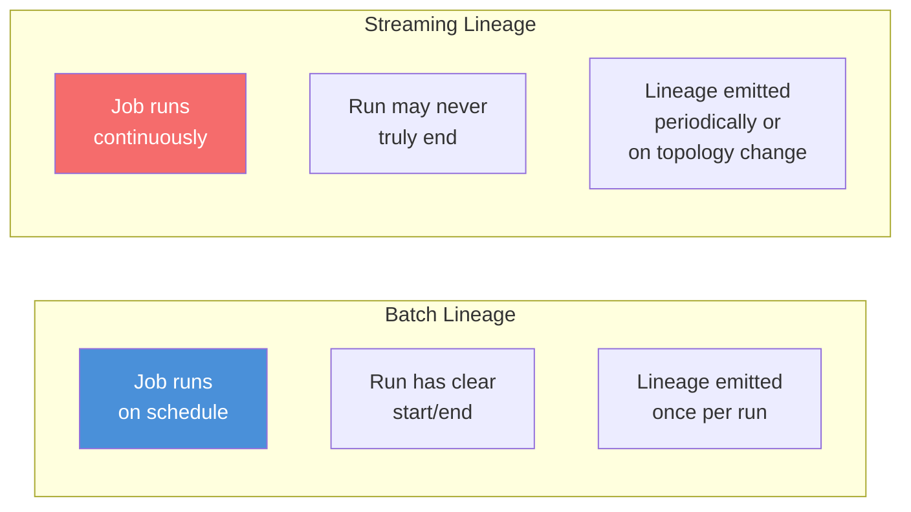
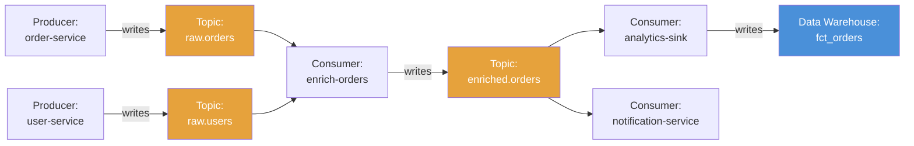
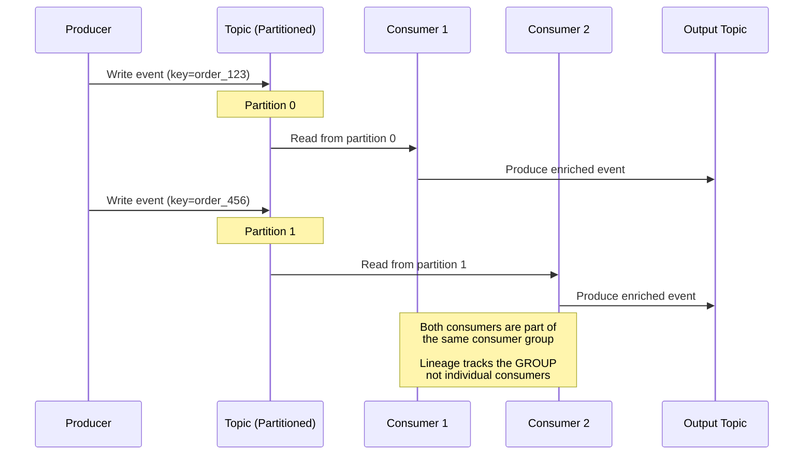
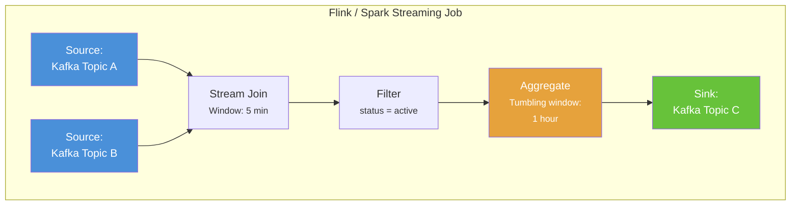
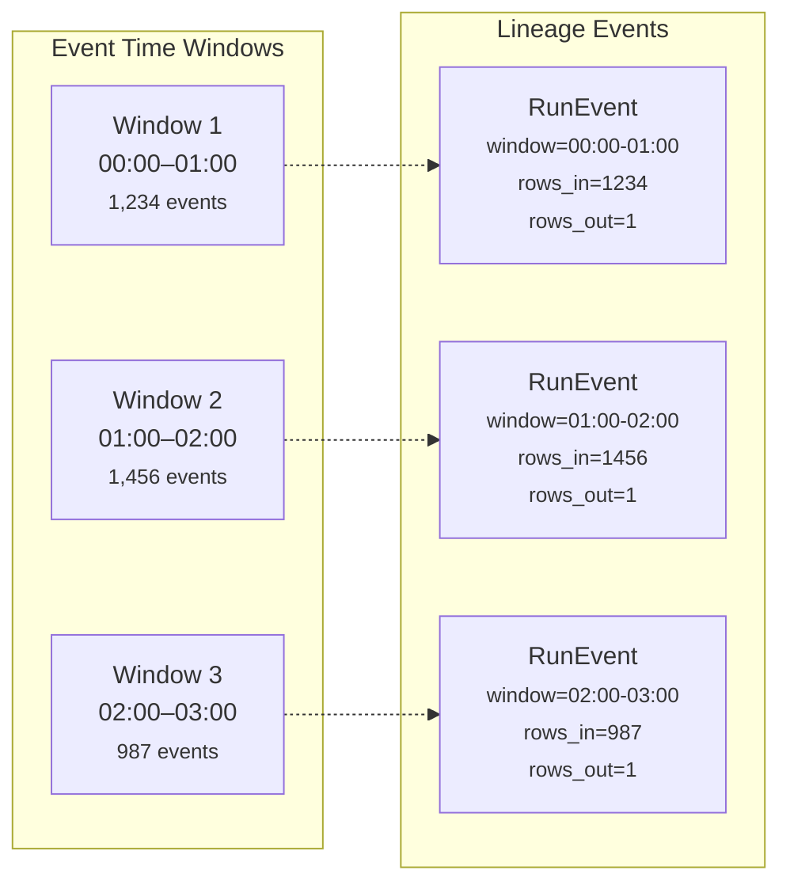
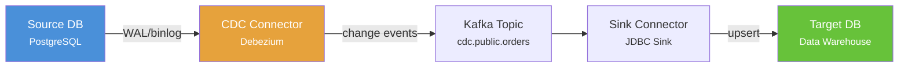
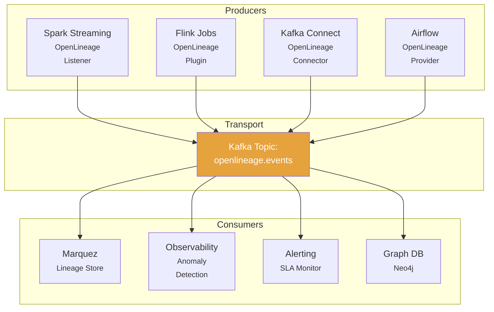

# Chapter 16: Streaming & Real-Time Lineage

[&larr; Back to Index](../index.md) | [Previous: Chapter 15](15-data-observability.md)

---

## Chapter Contents

- [16.1 Batch vs Streaming Lineage](#161-batch-vs-streaming-lineage)
- [16.2 Kafka and Event-Driven Architectures](#162-kafka-and-event-driven-architectures)
- [16.3 Tracking Lineage Through Topics and Consumers](#163-tracking-lineage-through-topics-and-consumers)
- [16.4 Stream Processing Lineage (Flink & Spark Streaming)](#164-stream-processing-lineage-flink--spark-streaming)
- [16.5 Change Data Capture (CDC) Lineage](#165-change-data-capture-cdc-lineage)
- [16.6 Real-Time Lineage Event Architecture](#166-real-time-lineage-event-architecture)
- [16.7 Building a Kafka Lineage Tracker](#167-building-a-kafka-lineage-tracker)
- [16.8 Exercise](#168-exercise)
- [16.9 Summary](#169-summary)

---

## 16.1 Batch vs Streaming Lineage



### Key Differences

```
┌──────────────────┬─────────────────────┬──────────────────────────────┐
│ Dimension        │ Batch               │ Streaming                    │
├──────────────────┼─────────────────────┼──────────────────────────────┤
│ Run lifecycle    │ START → COMPLETE    │ START → RUNNING (indefinite) │
│ Lineage granularity │ Per-run          │ Per-window or per-checkpoint │
│ Input/output     │ Bounded datasets    │ Unbounded streams (topics)   │
│ Schema evolution │ Between runs        │ Mid-stream (tricky!)         │
│ Time semantics   │ Processing time     │ Event time + processing time │
│ Failure handling │ Retry full run      │ Replay from offset           │
│ Volume tracking  │ Total rows          │ Events/sec, throughput       │
└──────────────────┴─────────────────────┴──────────────────────────────┘
```

---

## 16.2 Kafka and Event-Driven Architectures

### Kafka Topology as a Lineage Graph



### Modeling Kafka in OpenLineage

```python
from datetime import datetime


def kafka_lineage_event(
    consumer_group: str,
    input_topics: list[str],
    output_topics: list[str],
    namespace: str = "kafka://cluster-prod",
) -> dict:
    """Create an OpenLineage event for a Kafka consumer."""
    return {
        "eventType": "RUNNING",
        "eventTime": datetime.now().isoformat(),
        "job": {
            "namespace": namespace,
            "name": consumer_group,
            "facets": {
                "jobType": {
                    "processingType": "STREAMING",
                    "integration": "KAFKA",
                    "jobType": "CONSUMER_GROUP",
                },
            },
        },
        "run": {
            "runId": f"{consumer_group}-streaming",
            "facets": {
                "streaming": {
                    "topic_partitions": {
                        topic: {"lag": 0, "offset": -1}
                        for topic in input_topics
                    },
                },
            },
        },
        "inputs": [
            {"namespace": namespace, "name": topic}
            for topic in input_topics
        ],
        "outputs": [
            {"namespace": namespace, "name": topic}
            for topic in output_topics
        ],
    }


# Example usage
event = kafka_lineage_event(
    consumer_group="enrich-orders",
    input_topics=["raw.orders", "raw.users"],
    output_topics=["enriched.orders"],
)
```

---

## 16.3 Tracking Lineage Through Topics and Consumers

### The Consumer Group Challenge



### Consumer Offset as Lineage Metadata

```python
@dataclass
class KafkaLineageMetadata:
    """Track Kafka-specific lineage metadata."""
    consumer_group: str
    topic: str
    partitions: dict[int, int]  # partition → offset

    def to_facet(self) -> dict:
        return {
            "kafka_consumer": {
                "consumerGroup": self.consumer_group,
                "topic": self.topic,
                "partitionOffsets": {
                    str(p): o for p, o in self.partitions.items()
                },
                "totalLag": sum(self.partitions.values()),
            }
        }
```

---

## 16.4 Stream Processing Lineage (Flink & Spark Streaming)

### Stream Processing Topology



### Spark Structured Streaming with OpenLineage

```python
from pyspark.sql import SparkSession

# Configure Spark with OpenLineage listener
spark = (
    SparkSession.builder
    .appName("streaming-enrichment")
    .config(
        "spark.extraListeners",
        "io.openlineage.spark.agent.OpenLineageSparkListener",
    )
    .config("spark.openlineage.transport.type", "http")
    .config("spark.openlineage.transport.url", "http://localhost:5000")
    .config("spark.openlineage.namespace", "streaming-prod")
    .getOrCreate()
)

# Read from Kafka
orders = (
    spark.readStream
    .format("kafka")
    .option("kafka.bootstrap.servers", "localhost:9092")
    .option("subscribe", "raw.orders")
    .option("startingOffsets", "latest")
    .load()
)

# Transform
from pyspark.sql.functions import col, from_json, window
from pyspark.sql.types import StructType, StructField, StringType, DoubleType

schema = StructType([
    StructField("order_id", StringType()),
    StructField("amount", DoubleType()),
    StructField("timestamp", StringType()),
])

enriched = (
    orders
    .select(from_json(col("value").cast("string"), schema).alias("data"))
    .select("data.*")
    .withWatermark("timestamp", "10 minutes")
    .groupBy(window("timestamp", "1 hour"))
    .agg({"amount": "sum", "order_id": "count"})
)

# Write back to Kafka; OpenLineage automatically tracks the topology
query = (
    enriched.writeStream
    .format("kafka")
    .option("kafka.bootstrap.servers", "localhost:9092")
    .option("topic", "hourly.order.summary")
    .option("checkpointLocation", "/tmp/checkpoint/orders")
    .outputMode("update")
    .start()
)
```

### Windowed Lineage



> **Windowed lineage**: For streaming jobs, emit lineage events per
> **processing window** rather than per event. This keeps event volume
> manageable while still capturing data flow.

---

## 16.5 Change Data Capture (CDC) Lineage

### CDC Flow



### CDC Lineage Model

```python
@dataclass
class CDCLineageEvent:
    """Model CDC operations as lineage events."""
    source_database: str
    source_schema: str
    source_table: str
    target_topic: str
    operation: str  # "INSERT", "UPDATE", "DELETE"
    captured_at: datetime

    def to_openlineage_event(self) -> dict:
        return {
            "eventType": "RUNNING",
            "eventTime": self.captured_at.isoformat(),
            "job": {
                "namespace": f"cdc://{self.source_database}",
                "name": f"debezium.{self.source_schema}.{self.source_table}",
                "facets": {
                    "jobType": {
                        "processingType": "STREAMING",
                        "integration": "DEBEZIUM",
                        "jobType": "CDC_CONNECTOR",
                    },
                },
            },
            "inputs": [{
                "namespace": f"postgres://{self.source_database}",
                "name": f"{self.source_schema}.{self.source_table}",
                "facets": {
                    "lifecycleStateChange": {
                        "lifecycleStateChange": self.operation,
                    },
                },
            }],
            "outputs": [{
                "namespace": "kafka://cluster-prod",
                "name": self.target_topic,
            }],
        }
```

---

## 16.6 Real-Time Lineage Event Architecture

### Architecture Overview



### Event Bus Implementation

```python
import json
from datetime import datetime


class LineageEventBus:
    """Route OpenLineage events from producers to consumers via Kafka."""

    def __init__(
        self,
        bootstrap_servers: str = "localhost:9092",
        topic: str = "openlineage.events",
    ):
        self.topic = topic
        self.bootstrap_servers = bootstrap_servers
        self._producer = None
        self._consumers: list = []

    def _get_producer(self):
        """Lazy-initialize Kafka producer."""
        if self._producer is None:
            from confluent_kafka import Producer
            self._producer = Producer({
                "bootstrap.servers": self.bootstrap_servers,
            })
        return self._producer

    def emit(self, event: dict):
        """Publish an OpenLineage event to the lineage topic."""
        producer = self._get_producer()
        key = event.get("job", {}).get("name", "unknown")
        producer.produce(
            self.topic,
            key=key.encode("utf-8"),
            value=json.dumps(event).encode("utf-8"),
            timestamp=int(datetime.now().timestamp() * 1000),
        )
        producer.flush()

    def consume(self, group_id: str, handler):
        """Create a consumer for processing lineage events."""
        from confluent_kafka import Consumer

        consumer = Consumer({
            "bootstrap.servers": self.bootstrap_servers,
            "group.id": group_id,
            "auto.offset.reset": "earliest",
        })
        consumer.subscribe([self.topic])
        return consumer
```

---

## 16.7 Building a Kafka Lineage Tracker

### Complete Kafka Topology Tracker

```python
import networkx as nx
from dataclasses import dataclass, field


@dataclass
class KafkaTopologyTracker:
    """Track and visualize Kafka data flow topology."""

    graph: nx.DiGraph = field(default_factory=nx.DiGraph)
    topic_metadata: dict = field(default_factory=dict)

    def register_producer(self, service: str, topic: str, schema: dict | None = None):
        """Register a producer writing to a topic."""
        self.graph.add_node(service, type="service", role="producer")
        self.graph.add_node(topic, type="topic")
        self.graph.add_edge(service, topic, relation="produces")
        if schema:
            self.topic_metadata[topic] = {"schema": schema}

    def register_consumer(self, group: str, input_topics: list[str],
                          output_topics: list[str] | None = None):
        """Register a consumer group with its input and output topics."""
        self.graph.add_node(group, type="service", role="consumer")
        for topic in input_topics:
            self.graph.add_node(topic, type="topic")
            self.graph.add_edge(topic, group, relation="consumed_by")

        for topic in (output_topics or []):
            self.graph.add_node(topic, type="topic")
            self.graph.add_edge(group, topic, relation="produces")

    def register_sink(self, name: str, source_topic: str, target: str):
        """Register a sink connector (e.g., to a data warehouse)."""
        self.graph.add_node(name, type="connector", role="sink")
        self.graph.add_node(source_topic, type="topic")
        self.graph.add_node(target, type="dataset")
        self.graph.add_edge(source_topic, name, relation="consumed_by")
        self.graph.add_edge(name, target, relation="writes_to")

    def trace_data_flow(self, source: str) -> list[str]:
        """Trace all downstream destinations from a source."""
        if source not in self.graph:
            return []
        return list(nx.descendants(self.graph, source))

    def find_all_paths(self, source: str, target: str) -> list[list[str]]:
        """Find all paths from source to target."""
        try:
            return list(nx.all_simple_paths(self.graph, source, target))
        except nx.NetworkXError:
            return []

    def to_mermaid(self) -> str:
        """Export the topology as a Mermaid graph."""
        lines = ["graph LR"]
        for node, data in self.graph.nodes(data=True):
            safe = node.replace(".", "_").replace("-", "_")
            node_type = data.get("type", "unknown")
            if node_type == "topic":
                lines.append(f'    {safe}[("{node}")]')
            elif node_type == "dataset":
                lines.append(f'    {safe}[("{node}")]')
            else:
                lines.append(f'    {safe}["{node}"]')

        for src, dst, _data in self.graph.edges(data=True):
            safe_src = src.replace(".", "_").replace("-", "_")
            safe_dst = dst.replace(".", "_").replace("-", "_")
            lines.append(f"    {safe_src} --> {safe_dst}")

        return "\n".join(lines)


# --- Demo usage ---
tracker = KafkaTopologyTracker()

# Register producers
tracker.register_producer("order-service", "raw.orders")
tracker.register_producer("user-service", "raw.users")

# Register stream processor
tracker.register_consumer(
    "enrich-orders",
    input_topics=["raw.orders", "raw.users"],
    output_topics=["enriched.orders"],
)

# Register analytics consumer
tracker.register_consumer(
    "analytics-agg",
    input_topics=["enriched.orders"],
    output_topics=["hourly.revenue"],
)

# Register sink
tracker.register_sink("warehouse-sink", "hourly.revenue", "dw.fct_hourly_revenue")

# Trace data flow
print("Downstream from order-service:")
for node in tracker.trace_data_flow("order-service"):
    print(f"  → {node}")

# Find specific paths
paths = tracker.find_all_paths("order-service", "dw.fct_hourly_revenue")
print(f"\nPaths from order-service to warehouse:")
for path in paths:
    print(f"  {' → '.join(path)}")

# Export Mermaid
print(f"\n{tracker.to_mermaid()}")
```

**Expected output:**

```
Downstream from order-service:
  → raw.orders
  → enrich-orders
  → enriched.orders
  → analytics-agg
  → hourly.revenue
  → warehouse-sink
  → dw.fct_hourly_revenue

Paths from order-service to warehouse:
  order-service → raw.orders → enrich-orders → enriched.orders →
  analytics-agg → hourly.revenue → warehouse-sink → dw.fct_hourly_revenue
```

---

## 16.8 Exercise

> **Exercise**: Open [`exercises/ch16_streaming_lineage.py`](../exercises/ch16_streaming_lineage.py)
> and complete the following tasks:
>
> 1. Build a `KafkaTopologyTracker` from a config describing producers, consumers, and sinks
> 2. Trace data flow from a source service to all downstream destinations
> 3. Model CDC events as OpenLineage events
> 4. Generate a Mermaid diagram of the full streaming topology
> 5. Detect a "broken link" when a consumer group is removed

---

## 16.9 Summary

We explored:

- **Streaming lineage** models continuous, unbounded data flows
- **Kafka topics** are the streaming equivalent of datasets in the lineage graph
- **Consumer groups** are the equivalent of jobs/transforms
- **CDC lineage** bridges database changes to streaming platforms
- **Windowed lineage** emits events per time window to keep volume manageable
- A **lineage event bus** routes OpenLineage events through Kafka itself

### Key Takeaway

> Streaming lineage is not a separate discipline from batch lineage. The same
> graph model applies: topics are datasets, consumer groups are jobs. The difference
> is that events arrive continuously, so you need windowed emission and a durable
> event bus to avoid overwhelming your lineage store.

### What's Next

[Chapter 17: Compliance, Governance & Privacy](17-compliance-governance-privacy.md) turns to the regulatory side, showing how lineage supports GDPR, CCPA, SOX, and HIPAA through PII tracking, audit trails, and automated erasure plans.

---

[&larr; Back to Index](../index.md) | [Previous: Chapter 15](15-data-observability.md) | [Next: Chapter 17 &rarr;](17-compliance-governance-privacy.md)
