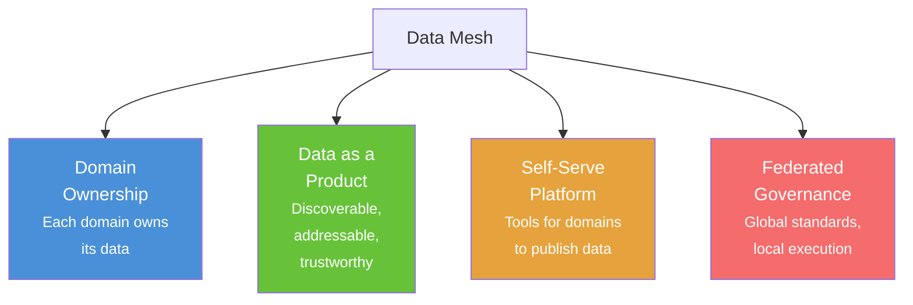
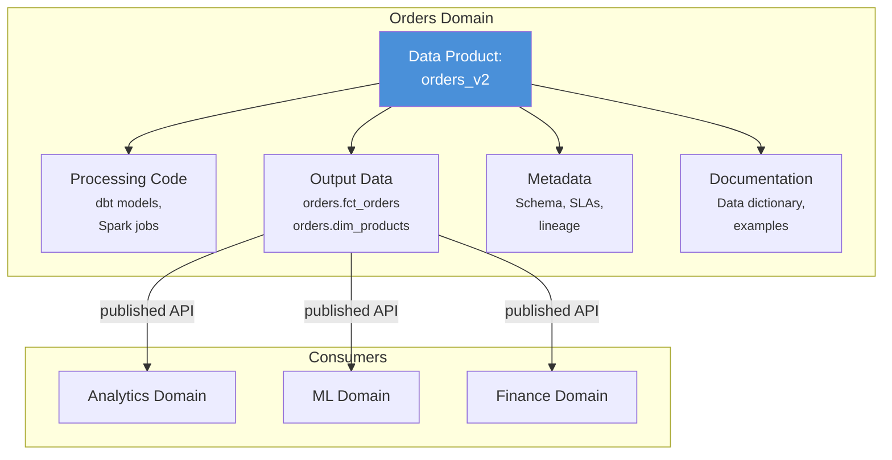
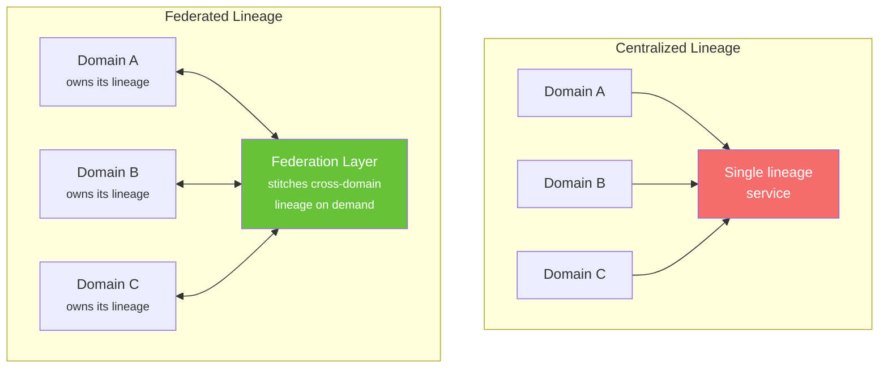
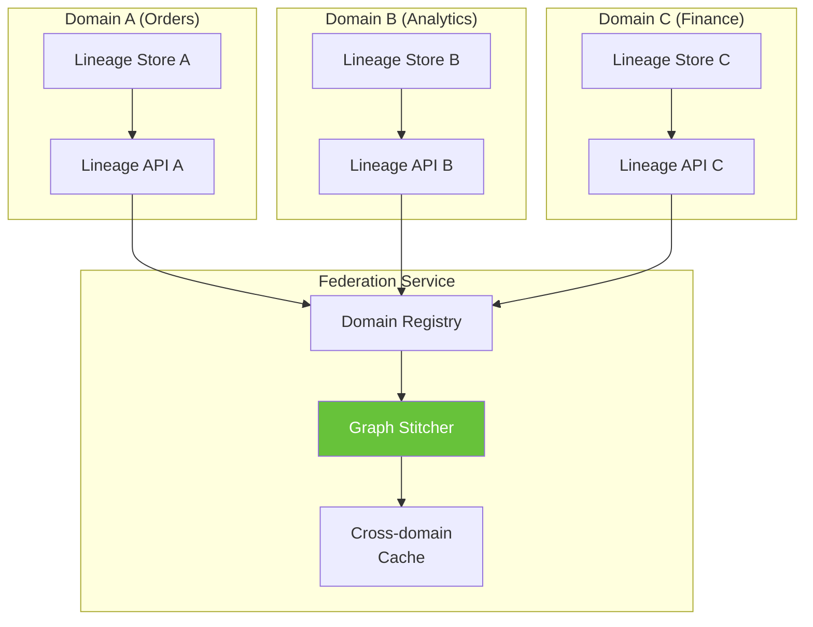
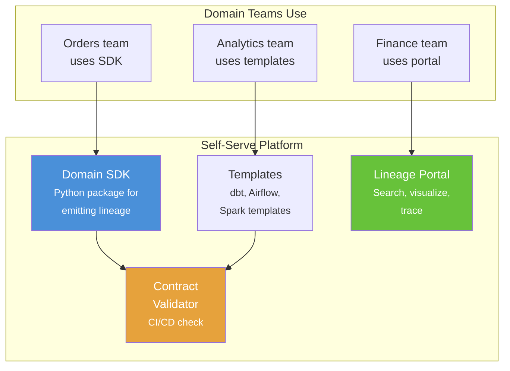

# Chapter 17: Data Mesh & Federated Lineage

[&larr; Back to Index](../index.md) | [Previous: Chapter 16](16-compliance-governance-privacy.md)

---

## Chapter Contents

- [17.1 Data Mesh Principles](#171-data-mesh-principles)
- [17.2 Domain Ownership and Data Products](#172-domain-ownership-and-data-products)
- [17.3 The Federated Lineage Challenge](#173-the-federated-lineage-challenge)
- [17.4 Cross-Domain Lineage](#174-cross-domain-lineage)
- [17.5 Lineage Contracts and Data Product Interfaces](#175-lineage-contracts-and-data-product-interfaces)
- [17.6 Building a Federated Lineage Graph](#176-building-a-federated-lineage-graph)
- [17.7 Self-Serve Lineage Platform](#177-self-serve-lineage-platform)
- [17.8 Exercise](#178-exercise)
- [17.9 Summary](#179-summary)

---

## 17.1 Data Mesh Principles



> **Data mesh** decentralizes data ownership to domain teams while maintaining
> global interoperability. Lineage must work across domains without a
> single centralized team controlling it.

---

## 17.2 Domain Ownership and Data Products

### Data Product Anatomy



### Data Product Model

```python
from dataclasses import dataclass, field
from datetime import datetime
from enum import Enum


class DataProductStatus(Enum):
    DRAFT = "DRAFT"
    PUBLISHED = "PUBLISHED"
    DEPRECATED = "DEPRECATED"


@dataclass
class SLA:
    freshness_hours: float
    completeness_percent: float
    availability_percent: float


@dataclass
class OutputPort:
    """A dataset exposed by a data product."""
    name: str
    format: str           # "table", "topic", "file", "api"
    schema: dict           # JSON schema or column definitions
    classification: str    # "public", "internal", "restricted"
    sample_query: str = ""


@dataclass
class InputPort:
    """A dataset consumed by a data product."""
    name: str
    source_domain: str
    source_product: str


@dataclass
class DataProduct:
    """A self-contained, domain-owned data product."""
    name: str
    domain: str
    owner: str
    description: str
    version: str
    status: DataProductStatus = DataProductStatus.DRAFT

    input_ports: list[InputPort] = field(default_factory=list)
    output_ports: list[OutputPort] = field(default_factory=list)
    sla: SLA | None = None
    tags: list[str] = field(default_factory=list)

    created_at: datetime = field(default_factory=datetime.now)
    updated_at: datetime = field(default_factory=datetime.now)

    def to_catalog_entry(self) -> dict:
        return {
            "name": self.name,
            "domain": self.domain,
            "owner": self.owner,
            "description": self.description,
            "version": self.version,
            "status": self.status.value,
            "inputs": [
                f"{ip.source_domain}/{ip.source_product}/{ip.name}"
                for ip in self.input_ports
            ],
            "outputs": [op.name for op in self.output_ports],
            "sla": {
                "freshness_hours": self.sla.freshness_hours,
                "completeness_percent": self.sla.completeness_percent,
            } if self.sla else None,
            "tags": self.tags,
        }


# Example
orders_product = DataProduct(
    name="orders_v2",
    domain="orders",
    owner="orders-team@company.com",
    description="Enriched order facts and product dimensions",
    version="2.1.0",
    status=DataProductStatus.PUBLISHED,
    input_ports=[
        InputPort("raw_orders", "ingestion", "source_systems"),
        InputPort("dim_products", "catalog", "product_master"),
    ],
    output_ports=[
        OutputPort(
            name="fct_orders",
            format="table",
            schema={"order_id": "STRING", "amount": "DECIMAL", "order_date": "DATE"},
            classification="internal",
        ),
        OutputPort(
            name="orders_stream",
            format="topic",
            schema={"order_id": "STRING", "event_type": "STRING"},
            classification="internal",
        ),
    ],
    sla=SLA(freshness_hours=2, completeness_percent=99.5, availability_percent=99.9),
    tags=["commerce", "revenue"],
)
```

---

## 17.3 The Federated Lineage Challenge

### Centralized vs Federated



### Challenges

```
┌──────────────────────┬──────────────────────────────────────────┐
│ Challenge            │ Description                              │
├──────────────────────┼──────────────────────────────────────────┤
│ Namespace conflicts  │ Two domains may use the same dataset     │
│                      │ name (e.g., "customers")                 │
├──────────────────────┼──────────────────────────────────────────┤
│ Cross-domain joins   │ Lineage must stitch graphs at domain     │
│                      │ boundaries                               │
├──────────────────────┼──────────────────────────────────────────┤
│ Schema versioning    │ Each domain evolves schemas independently│
├──────────────────────┼──────────────────────────────────────────┤
│ Trust boundaries     │ Not all lineage should be visible        │
│                      │ across domains                           │
├──────────────────────┼──────────────────────────────────────────┤
│ Eventual consistency │ Domain lineage may update at different   │
│                      │ rates                                    │
└──────────────────────┴──────────────────────────────────────────┘
```

---

## 17.4 Cross-Domain Lineage

### Cross-Domain Graph

```mermaid
graph LR
    subgraph "Ingestion Domain"
        SRC["raw.orders<br/><small>source system<br/>extract</small>"]
    end

    subgraph "Orders Domain"
        STG["stg_orders"]
        FCT["fct_orders"]
        SRC -->|"cross-domain"| STG
        STG --> FCT
    end

    subgraph "Analytics Domain"
        REV["rpt_revenue"]
        FCT -->|"cross-domain"| REV
    end

    subgraph "Finance Domain"
        FIN_RPT["fin_quarterly_report"]
        REV -->|"cross-domain"| FIN_RPT
    end

    linkStyle 0 stroke:#F56C6C,stroke-width:3px
    linkStyle 3 stroke:#F56C6C,stroke-width:3px
    linkStyle 4 stroke:#F56C6C,stroke-width:3px
```

### Namespace Strategy

```python
@dataclass
class LineageNamespace:
    """Namespaced identifier for federated lineage."""
    organization: str
    domain: str
    environment: str = "prod"

    def qualify(self, dataset: str) -> str:
        """Create fully qualified dataset name."""
        return f"{self.organization}://{self.domain}.{self.environment}/{dataset}"

    @staticmethod
    def parse(qualified_name: str) -> tuple[str, str, str, str]:
        """Parse a qualified name into (org, domain, env, dataset)."""
        # Format: org://domain.env/dataset
        org, rest = qualified_name.split("://")
        domain_env, dataset = rest.split("/", 1)
        domain, env = domain_env.split(".")
        return org, domain, env, dataset


# Example
ns_orders = LineageNamespace("acme", "orders")
ns_analytics = LineageNamespace("acme", "analytics")

fqn = ns_orders.qualify("fct_orders")
print(fqn)  # acme://orders.prod/fct_orders

org, domain, env, dataset = LineageNamespace.parse(fqn)
print(f"Domain: {domain}, Dataset: {dataset}")
```

---

## 17.5 Lineage Contracts and Data Product Interfaces

### Lineage Contract

A **lineage contract** declares the promised upstream dependencies and downstream
guarantees of a data product.

```python
@dataclass
class LineageContract:
    """A contract declaring lineage expectations for a data product."""
    product: str
    domain: str
    version: str

    # Upstream contract: what this product depends on
    declared_inputs: list[str]    # Fully qualified dataset names
    input_freshness_sla: dict[str, float] = field(default_factory=dict)

    # Downstream contract: what this product guarantees
    declared_outputs: list[str]   # Fully qualified dataset names
    output_schema: dict[str, dict] = field(default_factory=dict)
    output_freshness_sla: dict[str, float] = field(default_factory=dict)

    def validate_actual_lineage(self, actual_inputs: list[str],
                                 actual_outputs: list[str]) -> list[str]:
        """Validate actual lineage matches the contract."""
        violations = []

        unexpected_inputs = set(actual_inputs) - set(self.declared_inputs)
        if unexpected_inputs:
            violations.append(
                f"Undeclared inputs: {unexpected_inputs}"
            )

        missing_outputs = set(self.declared_outputs) - set(actual_outputs)
        if missing_outputs:
            violations.append(
                f"Missing declared outputs: {missing_outputs}"
            )

        return violations


# Example contract
contract = LineageContract(
    product="orders_v2",
    domain="orders",
    version="2.1.0",
    declared_inputs=[
        "acme://ingestion.prod/raw_orders",
        "acme://catalog.prod/dim_products",
    ],
    declared_outputs=[
        "acme://orders.prod/fct_orders",
        "acme://orders.prod/dim_order_status",
    ],
    output_freshness_sla={
        "acme://orders.prod/fct_orders": 2.0,
    },
)

# Validate at runtime
violations = contract.validate_actual_lineage(
    actual_inputs=[
        "acme://ingestion.prod/raw_orders",
        "acme://catalog.prod/dim_products",
        "acme://users.prod/dim_customers",  # ← undeclared!
    ],
    actual_outputs=[
        "acme://orders.prod/fct_orders",
        # dim_order_status missing!
    ],
)
for v in violations:
    print(f"CONTRACT VIOLATION: {v}")
```

---

## 17.6 Building a Federated Lineage Graph

### Architecture



### Federation Service Implementation

```python
import networkx as nx
from dataclasses import dataclass, field


@dataclass
class DomainRegistration:
    domain: str
    api_url: str
    products: list[str]


@dataclass
class FederatedLineageService:
    """Stitch lineage graphs from multiple domains."""

    domains: dict[str, DomainRegistration] = field(default_factory=dict)
    cross_domain_edges: list[tuple[str, str]] = field(default_factory=list)

    def register_domain(self, registration: DomainRegistration):
        self.domains[registration.domain] = registration

    def declare_cross_domain_edge(self, source_fqn: str, target_fqn: str):
        """Declare a cross-domain data dependency."""
        self.cross_domain_edges.append((source_fqn, target_fqn))

    async def build_federated_graph(
        self,
        root_dataset: str,
        direction: str = "downstream",
        max_depth: int = 10,
    ) -> nx.DiGraph:
        """Build a cross-domain lineage graph on demand."""
        import httpx

        graph = nx.DiGraph()
        visited: set[str] = set()
        queue: list[tuple[str, int]] = [(root_dataset, 0)]

        async with httpx.AsyncClient() as client:
            while queue:
                current, depth = queue.pop(0)
                if current in visited or depth > max_depth:
                    continue
                visited.add(current)

                # Determine which domain owns this dataset
                _, domain, _, _ = LineageNamespace.parse(current)
                registration = self.domains.get(domain)
                if not registration:
                    continue

                # Fetch local lineage from domain API
                resp = await client.get(
                    f"{registration.api_url}/api/v1/lineage",
                    params={
                        "dataset": current,
                        "direction": direction,
                        "depth": 1,
                    },
                )
                local_lineage = resp.json()

                # Add local edges
                for edge in local_lineage.get("edges", []):
                    graph.add_edge(edge["source"], edge["target"],
                                   domain=domain)
                    # Queue neighbors for exploration
                    neighbor = (
                        edge["target"] if direction == "downstream"
                        else edge["source"]
                    )
                    queue.append((neighbor, depth + 1))

                # Add cross-domain edges
                for src, tgt in self.cross_domain_edges:
                    if direction == "downstream" and src == current:
                        graph.add_edge(src, tgt, cross_domain=True)
                        queue.append((tgt, depth + 1))
                    elif direction == "upstream" and tgt == current:
                        graph.add_edge(src, tgt, cross_domain=True)
                        queue.append((src, depth + 1))

        return graph

    def impact_analysis(self, graph: nx.DiGraph, dataset: str) -> dict:
        """Analyze cross-domain impact of a change."""
        if dataset not in graph:
            return {"affected_domains": [], "affected_datasets": []}

        downstream = nx.descendants(graph, dataset)
        affected_domains: set[str] = set()
        affected_datasets: list[str] = []

        for node in downstream:
            try:
                _, domain, _, _ = LineageNamespace.parse(node)
                affected_domains.add(domain)
                affected_datasets.append(node)
            except (ValueError, IndexError):
                continue

        return {
            "source": dataset,
            "affected_domains": sorted(affected_domains),
            "affected_datasets": affected_datasets,
            "cross_domain_edges": [
                (s, t) for s, t in graph.edges()
                if graph[s][t].get("cross_domain")
                and (s == dataset or s in downstream)
            ],
        }
```

---

## 17.7 Self-Serve Lineage Platform

### Platform Components



### Domain SDK

```python
class LineageSDK:
    """SDK for domain teams to emit lineage from their pipelines."""

    def __init__(self, domain: str, namespace: str, api_url: str):
        self.domain = domain
        self.namespace = LineageNamespace("acme", domain)
        self.api_url = api_url

    def dataset(self, name: str) -> str:
        """Create a fully qualified dataset reference."""
        return self.namespace.qualify(name)

    def emit_run(
        self,
        job_name: str,
        inputs: list[str],
        outputs: list[str],
        status: str = "COMPLETE",
        facets: dict | None = None,
    ) -> dict:
        """Emit an OpenLineage run event."""
        event = {
            "eventType": status,
            "eventTime": datetime.now().isoformat(),
            "job": {
                "namespace": f"acme://{self.domain}",
                "name": job_name,
            },
            "inputs": [
                {"namespace": "acme", "name": ds} for ds in inputs
            ],
            "outputs": [
                {"namespace": "acme", "name": ds} for ds in outputs
            ],
        }
        if facets:
            event["run"] = {"facets": facets}

        # In production, POST to lineage API
        # httpx.post(f"{self.api_url}/api/v1/lineage/events", json=event)
        return event


# Domain team usage
sdk = LineageSDK("orders", "acme://orders", "http://lineage.internal")

event = sdk.emit_run(
    job_name="build_fct_orders",
    inputs=[
        sdk.dataset("stg_orders"),
        sdk.dataset("dim_products"),
    ],
    outputs=[
        sdk.dataset("fct_orders"),
    ],
)
```

---

## 17.8 Exercise

> **Exercise**: Open [`exercises/ch17_data_mesh.py`](../exercises/ch17_data_mesh.py)
> and complete the following tasks:
>
> 1. Define three `DataProduct` instances across different domains
> 2. Build a `FederatedLineageService` that connects them
> 3. Declare cross-domain lineage edges
> 4. Run a cross-domain impact analysis
> 5. Validate lineage contracts and detect violations

---

## 17.9 Summary

You now understand:

- **Data mesh** decentralizes ownership while maintaining interoperability
- **Data products** are the unit of data sharing, with explicit input/output ports
- **Federated lineage** stitches domain-local graphs at cross-domain boundaries
- **Namespaces** prevent conflicts (`org://domain.env/dataset`)
- **Lineage contracts** declare expected inputs/outputs and detect violations
- **Self-serve platforms** provide SDKs and templates for domain teams

### Key Takeaway

> In a data mesh, no single team owns the full lineage graph. Federated lineage
> succeeds when each domain publishes its own lineage and a central service stitches
> the pieces together at well-defined boundaries. Contracts make those boundaries
> explicit and enforceable.

### What's Next

[Chapter 18: ML & MLOps Lineage](18-ml-lineage.md) extends lineage into the machine learning lifecycle, tracking data from source tables through feature engineering, model training, and prediction serving.

---

[&larr; Back to Index](../index.md) | [Previous: Chapter 16](16-compliance-governance-privacy.md) | [Next: Chapter 18 &rarr;](18-ml-lineage.md)
