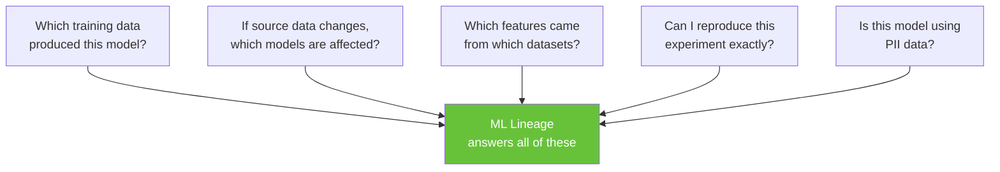
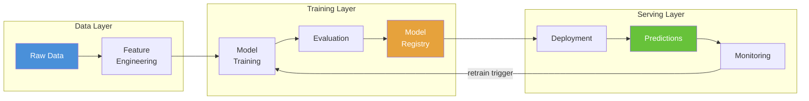
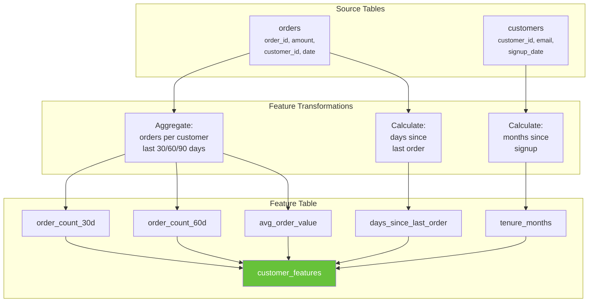
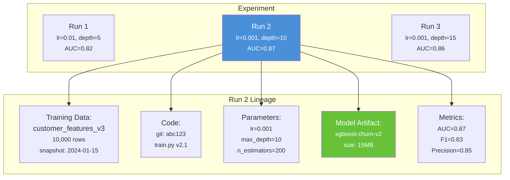
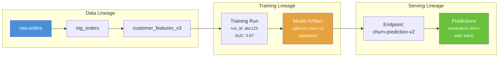
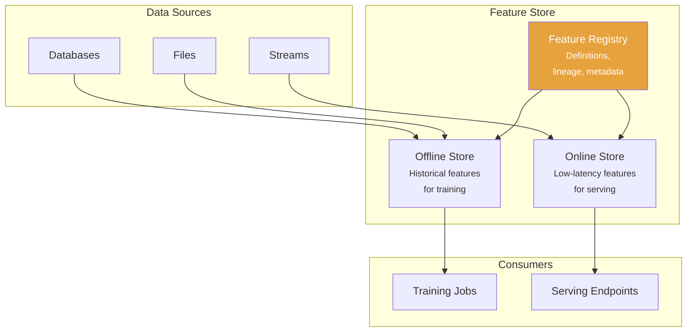
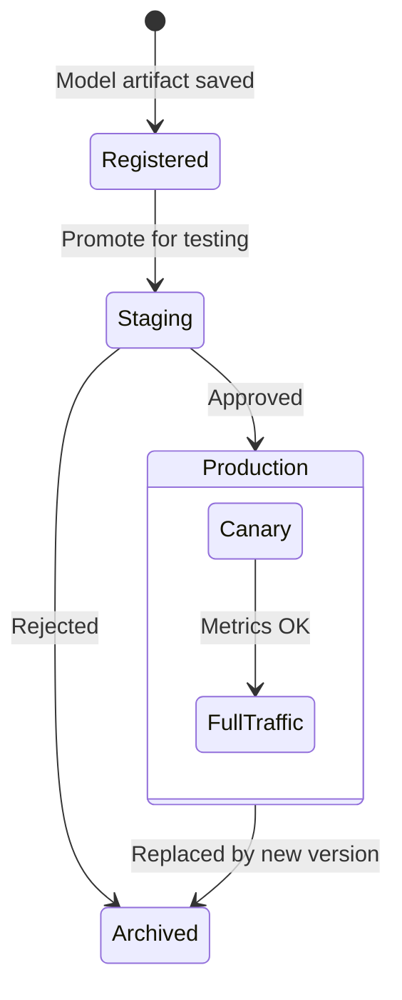
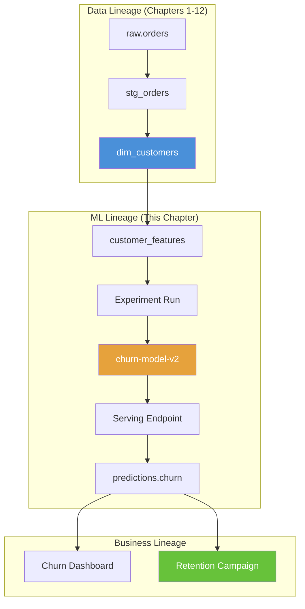

# Chapter 19: ML & MLOps Lineage

[&larr; Back to Index](../index.md) | [Previous: Chapter 18](18-data-mesh-federated-lineage.md)

---

## Chapter Contents

- [19.1 Why ML Needs Lineage](#191-why-ml-needs-lineage)
- [19.2 The ML Lifecycle](#192-the-ml-lifecycle)
- [19.3 Feature Lineage](#193-feature-lineage)
- [19.4 Experiment Tracking with MLflow](#194-experiment-tracking-with-mlflow)
- [19.5 Model Lineage: Training Data to Predictions](#195-model-lineage-training-data-to-predictions)
- [19.6 Feature Store Lineage](#196-feature-store-lineage)
- [19.7 Model Registry and Deployment Lineage](#197-model-registry-and-deployment-lineage)
- [19.8 Connecting ML Lineage to Data Lineage](#198-connecting-ml-lineage-to-data-lineage)
- [19.9 Exercise](#199-exercise)
- [19.10 Summary](#1910-summary)

---

## 19.1 Why ML Needs Lineage



> **ML lineage** extends data lineage into the machine learning lifecycle,
> tracking the path from raw data → features → training → model →
> predictions → business decisions.

---

## 19.2 The ML Lifecycle



### ML Lineage Dimensions

| Dimension | What It Tracks |
|---|---|
| Data lineage | Raw data → cleaned data → feature tables |
| Feature lineage | Which columns/transforms created each feature |
| Experiment lineage | Hyperparameters, metrics, code version |
| Model lineage | Training data + code + config → model artifact |
| Prediction lineage | Model version + input features → prediction |
| Deployment lineage | Model version → endpoint → traffic split |

---

## 19.3 Feature Lineage

### Feature Derivation Graph



### Feature Lineage Model

```python
from dataclasses import dataclass, field
from enum import Enum


class FeatureTransformType(Enum):
    AGGREGATION = "AGGREGATION"
    CALCULATION = "CALCULATION"
    ENCODING = "ENCODING"
    NORMALIZATION = "NORMALIZATION"
    IMPUTATION = "IMPUTATION"
    WINDOW = "WINDOW"
    LOOKUP = "LOOKUP"


@dataclass
class FeatureDefinition:
    """Track the lineage of a single feature."""
    name: str
    description: str
    source_tables: list[str]
    source_columns: list[str]
    transform_type: FeatureTransformType
    transform_logic: str  # SQL or Python expression
    data_type: str = "FLOAT"
    is_pii: bool = False

    def to_lineage_edge(self) -> list[dict]:
        """Convert to lineage edges."""
        edges = []
        for table in self.source_tables:
            for col in self.source_columns:
                edges.append({
                    "source": f"{table}.{col}",
                    "target": f"features.{self.name}",
                    "transform": self.transform_type.value,
                    "logic": self.transform_logic,
                })
        return edges


@dataclass
class FeatureSet:
    """A collection of features with their lineage."""
    name: str
    features: list[FeatureDefinition] = field(default_factory=list)

    def add_feature(self, feature: FeatureDefinition):
        self.features.append(feature)

    def source_tables(self) -> set[str]:
        tables: set[str] = set()
        for f in self.features:
            tables.update(f.source_tables)
        return tables

    def pii_features(self) -> list[FeatureDefinition]:
        return [f for f in self.features if f.is_pii]

    def impact_of_table_change(self, table: str) -> list[str]:
        """Which features break if this source table changes?"""
        return [f.name for f in self.features if table in f.source_tables]


# Example
feature_set = FeatureSet("customer_churn_features")

feature_set.add_feature(FeatureDefinition(
    name="order_count_30d",
    description="Number of orders in the last 30 days",
    source_tables=["orders"],
    source_columns=["order_id", "customer_id", "order_date"],
    transform_type=FeatureTransformType.AGGREGATION,
    transform_logic="COUNT(order_id) WHERE order_date >= NOW() - INTERVAL '30 days'",
))

feature_set.add_feature(FeatureDefinition(
    name="avg_order_value",
    description="Average order amount for the customer",
    source_tables=["orders"],
    source_columns=["amount", "customer_id"],
    transform_type=FeatureTransformType.AGGREGATION,
    transform_logic="AVG(amount) GROUP BY customer_id",
))

feature_set.add_feature(FeatureDefinition(
    name="tenure_months",
    description="Months since customer signup",
    source_tables=["customers"],
    source_columns=["signup_date"],
    transform_type=FeatureTransformType.CALCULATION,
    transform_logic="MONTHS_BETWEEN(NOW(), signup_date)",
))

# Impact analysis
affected = feature_set.impact_of_table_change("orders")
print(f"Features affected by 'orders' table change: {affected}")
# → ['order_count_30d', 'avg_order_value']
```

---

## 19.4 Experiment Tracking with MLflow

### MLflow Architecture



### MLflow with Lineage Metadata

```python
import mlflow


def train_with_lineage(
    feature_table: str,
    feature_version: str,
    model_name: str,
):
    """Train a model while recording full lineage in MLflow."""
    mlflow.set_experiment("churn-prediction")

    with mlflow.start_run() as run:
        # --- Record data lineage ---
        mlflow.set_tag("data.source_table", feature_table)
        mlflow.set_tag("data.version", feature_version)
        mlflow.set_tag("data.row_count", "10000")
        mlflow.set_tag("data.snapshot_date", "2024-01-15")

        # Record feature lineage
        features_used = [
            "order_count_30d",
            "avg_order_value",
            "tenure_months",
            "days_since_last_order",
        ]
        mlflow.set_tag("features.names", ",".join(features_used))
        mlflow.set_tag("features.count", str(len(features_used)))

        # --- Record code lineage ---
        mlflow.set_tag("mlflow.source.git.commit", "abc123def456")
        mlflow.set_tag("mlflow.source.git.branch", "main")

        # --- Training ---
        params = {
            "learning_rate": 0.001,
            "max_depth": 10,
            "n_estimators": 200,
            "objective": "binary:logistic",
        }
        mlflow.log_params(params)

        # Simulate training (replace with actual model training)
        metrics = {
            "auc": 0.87,
            "f1_score": 0.83,
            "precision": 0.85,
            "recall": 0.81,
        }
        mlflow.log_metrics(metrics)

        # --- Register model with lineage ---
        # In production: mlflow.xgboost.log_model(model, "model")
        mlflow.log_dict(
            {"model_type": "xgboost", "params": params},
            "model_config.json",
        )

        # Record the full lineage chain
        mlflow.set_tag(
            "lineage.chain",
            f"raw.orders → stg_orders → {feature_table} → {model_name}",
        )

        print(f"Run ID: {run.info.run_id}")
        print(f"Experiment: churn-prediction")
        print(f"Model lineage: raw data → features → model")

        return run.info.run_id
```

---

## 19.5 Model Lineage: Training Data to Predictions

### End-to-End Model Lineage



### Model Lineage Graph

```python
import networkx as nx
from dataclasses import dataclass, field
from datetime import datetime


@dataclass
class ModelLineageNode:
    """A node in the ML lineage graph."""
    name: str
    node_type: str  # "dataset", "feature_set", "experiment", "model", "endpoint", "prediction"
    metadata: dict = field(default_factory=dict)


@dataclass
class MLLineageGraph:
    """Complete ML lineage from data to predictions."""

    graph: nx.DiGraph = field(default_factory=nx.DiGraph)

    def add_node(self, node: ModelLineageNode):
        self.graph.add_node(node.name, **{"type": node.node_type, **node.metadata})

    def add_edge(self, source: str, target: str, relation: str = "derived_from"):
        self.graph.add_edge(source, target, relation=relation)

    def training_data_for_model(self, model: str) -> list[str]:
        """Find all training data sources for a model."""
        ancestors = nx.ancestors(self.graph, model)
        return [
            n for n in ancestors
            if self.graph.nodes[n].get("type") == "dataset"
        ]

    def models_affected_by_data(self, dataset: str) -> list[str]:
        """Which models would be affected if this dataset changes?"""
        descendants = nx.descendants(self.graph, dataset)
        return [
            n for n in descendants
            if self.graph.nodes[n].get("type") == "model"
        ]

    def full_prediction_lineage(self, prediction_table: str) -> dict:
        """Trace full lineage for a prediction: data → features → model → prediction."""
        ancestors = nx.ancestors(self.graph, prediction_table)
        return {
            "prediction": prediction_table,
            "models": [n for n in ancestors if self.graph.nodes[n].get("type") == "model"],
            "feature_sets": [n for n in ancestors if self.graph.nodes[n].get("type") == "feature_set"],
            "datasets": [n for n in ancestors if self.graph.nodes[n].get("type") == "dataset"],
        }


# Build ML lineage graph
ml_graph = MLLineageGraph()

# Data layer
ml_graph.add_node(ModelLineageNode("raw.orders", "dataset"))
ml_graph.add_node(ModelLineageNode("raw.customers", "dataset"))
ml_graph.add_node(ModelLineageNode("stg_orders", "dataset"))
ml_graph.add_node(ModelLineageNode("customer_features_v3", "feature_set",
                                    {"features": ["order_count_30d", "avg_order_value", "tenure_months"]}))

# Training layer
ml_graph.add_node(ModelLineageNode("churn-experiment-run-42", "experiment",
                                    {"auc": 0.87, "params": {"lr": 0.001}}))
ml_graph.add_node(ModelLineageNode("xgboost-churn-v2", "model",
                                    {"framework": "xgboost", "version": "2.0"}))

# Serving layer
ml_graph.add_node(ModelLineageNode("churn-endpoint-v2", "endpoint"))
ml_graph.add_node(ModelLineageNode("predictions.churn_scores", "prediction"))

# Edges
ml_graph.add_edge("raw.orders", "stg_orders")
ml_graph.add_edge("raw.customers", "stg_orders")
ml_graph.add_edge("stg_orders", "customer_features_v3")
ml_graph.add_edge("customer_features_v3", "churn-experiment-run-42", "training_input")
ml_graph.add_edge("churn-experiment-run-42", "xgboost-churn-v2", "produced")
ml_graph.add_edge("xgboost-churn-v2", "churn-endpoint-v2", "deployed_to")
ml_graph.add_edge("churn-endpoint-v2", "predictions.churn_scores", "generates")

# Query
print("Training data for model:")
print(ml_graph.training_data_for_model("xgboost-churn-v2"))

print("\nModels affected by raw.orders change:")
print(ml_graph.models_affected_by_data("raw.orders"))

print("\nFull prediction lineage:")
print(ml_graph.full_prediction_lineage("predictions.churn_scores"))
```

---

## 19.6 Feature Store Lineage

### Feature Store Architecture



### Feature Store Lineage Tracking

```python
@dataclass
class FeatureStoreLineage:
    """Track lineage within a feature store."""
    features: dict[str, FeatureDefinition] = field(default_factory=dict)
    consumers: dict[str, list[str]] = field(default_factory=dict)  # model → features used

    def register_feature(self, feature: FeatureDefinition):
        self.features[feature.name] = feature

    def register_consumer(self, model_name: str, feature_names: list[str]):
        self.consumers[model_name] = feature_names

    def feature_usage_report(self) -> dict[str, list[str]]:
        """Which models use each feature?"""
        usage: dict[str, list[str]] = {}
        for model, features in self.consumers.items():
            for feat in features:
                usage.setdefault(feat, []).append(model)
        return usage

    def unused_features(self) -> list[str]:
        """Find features not consumed by any model."""
        used = set()
        for features in self.consumers.values():
            used.update(features)
        return [f for f in self.features if f not in used]

    def feature_freshness_impact(self, stale_table: str) -> list[dict]:
        """If a source table is stale, which features and models are affected?"""
        affected_features = []
        for name, feat in self.features.items():
            if stale_table in feat.source_tables:
                affected_features.append(name)

        affected_models = []
        for model, features in self.consumers.items():
            overlap = set(features) & set(affected_features)
            if overlap:
                affected_models.append({
                    "model": model,
                    "stale_features": list(overlap),
                })

        return affected_models
```

---

## 19.7 Model Registry and Deployment Lineage

### Model Lifecycle



### Deployment Lineage

```python
@dataclass
class ModelDeployment:
    """Track model deployment lineage."""
    model_name: str
    model_version: str
    run_id: str
    endpoint: str
    deployed_at: datetime
    traffic_percent: float = 100.0
    status: str = "active"

    # Lineage references
    training_data: str = ""
    feature_set_version: str = ""
    code_commit: str = ""

    def full_lineage(self) -> dict:
        return {
            "deployment": {
                "endpoint": self.endpoint,
                "model": f"{self.model_name}@{self.model_version}",
                "deployed_at": self.deployed_at.isoformat(),
                "traffic": f"{self.traffic_percent}%",
            },
            "training": {
                "run_id": self.run_id,
                "data": self.training_data,
                "features": self.feature_set_version,
                "code": self.code_commit,
            },
        }


# Track A/B deployment
deployment_a = ModelDeployment(
    model_name="churn-model",
    model_version="2",
    run_id="run-001",
    endpoint="churn-prediction",
    deployed_at=datetime.now(),
    traffic_percent=90.0,
    training_data="customer_features_v3 (2024-01-15)",
    feature_set_version="v3",
    code_commit="abc123",
)

deployment_b = ModelDeployment(
    model_name="churn-model",
    model_version="3",
    run_id="run-042",
    endpoint="churn-prediction",
    deployed_at=datetime.now(),
    traffic_percent=10.0,
    training_data="customer_features_v4 (2024-02-01)",
    feature_set_version="v4",
    code_commit="def456",
)
```

---

## 19.8 Connecting ML Lineage to Data Lineage

### Unified Lineage Graph



### OpenLineage for ML Jobs

The following example uses **custom facets** (`mlTraining`, `modelMetrics`) that are not part of the OpenLineage spec. In a real deployment you would register these facets with your OpenLineage backend; they are shown here to illustrate how ML-specific metadata can ride alongside standard lineage events.

```python
def ml_training_openlineage_event(
    run_id: str,
    feature_table: str,
    model_artifact: str,
    metrics: dict,
    hyperparams: dict,
) -> dict:
    """Create an OpenLineage event for an ML training run."""
    return {
        "eventType": "COMPLETE",
        "eventTime": datetime.now().isoformat(),
        "job": {
            "namespace": "ml://training",
            "name": "churn-model-training",
            "facets": {
                "jobType": {
                    "processingType": "BATCH",
                    "integration": "MLFLOW",
                    "jobType": "ML_TRAINING",
                },
            },
        },
        "run": {
            "runId": run_id,
            "facets": {
                "mlTraining": {
                    "framework": "xgboost",
                    "hyperparameters": hyperparams,
                    "metrics": metrics,
                },
            },
        },
        "inputs": [
            {
                "namespace": "warehouse://prod",
                "name": feature_table,
                "facets": {
                    "dataQualityMetrics": {
                        "rowCount": 10000,
                    },
                },
            },
        ],
        "outputs": [
            {
                "namespace": "mlflow://models",
                "name": model_artifact,
                "facets": {
                    "modelMetrics": metrics,
                },
            },
        ],
    }
```

---

## 19.9 Exercise

> **Exercise**: Open [`exercises/ch19_ml_lineage.py`](../exercises/ch19_ml_lineage.py)
> and complete the following tasks:
>
> 1. Define a `FeatureSet` with at least 5 features from 2 source tables
> 2. Build an `MLLineageGraph` connecting data → features → model → predictions
> 3. Simulate an MLflow experiment run recording lineage metadata
> 4. Query the graph to find which source tables affect a given model
> 5. Generate a full prediction lineage report

---

## 19.10 Summary

We explored:

- **ML lineage** extends data lineage from features through models to predictions
- **Feature lineage** tracks which source columns produce each feature
- **MLflow** records experiment metadata, parameters, metrics, and artifacts
- **Model lineage** connects training data, code, and config to model artifacts
- **Feature stores** centralize feature definitions with built-in lineage
- **Unified lineage** connects the data platform to the ML platform end-to-end

### Key Takeaway

> A model is only as trustworthy as the data it was trained on. ML lineage closes
> the loop between data engineering and machine learning so that when source data
> changes, you know exactly which models and predictions are affected.

### What's Next

[Chapter 20: GenAI & LLM Lineage](20-genai-llm-lineage.md) takes lineage into generative AI, covering RAG pipelines, prompt chains, embedding provenance, and governance for LLM-powered applications.

---

[&larr; Back to Index](../index.md) | [Previous: Chapter 18](18-data-mesh-federated-lineage.md) | [Next: Chapter 20 &rarr;](20-genai-llm-lineage.md)
