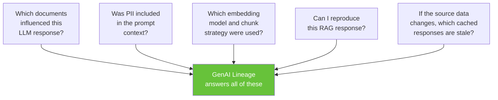
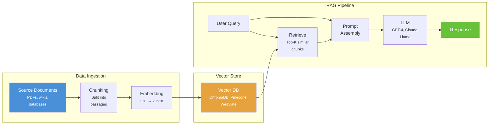
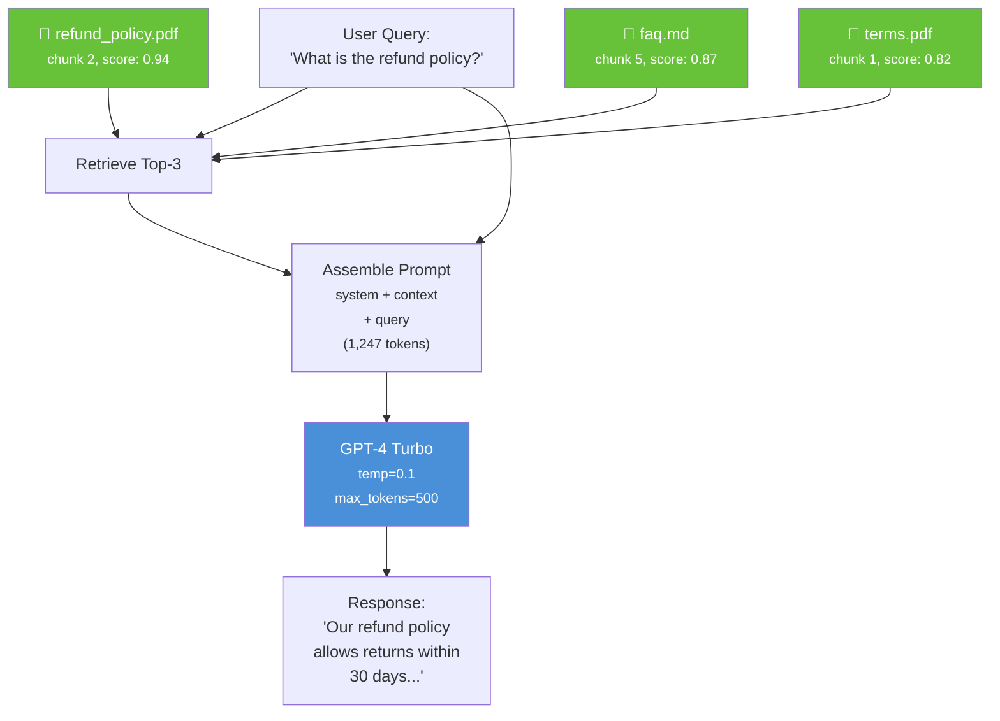
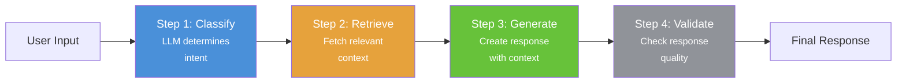
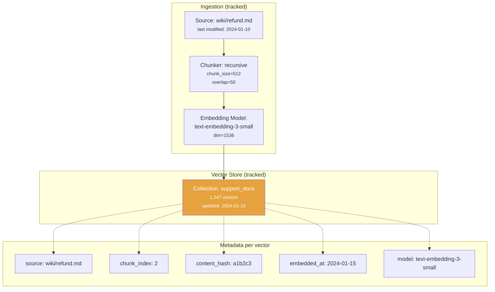
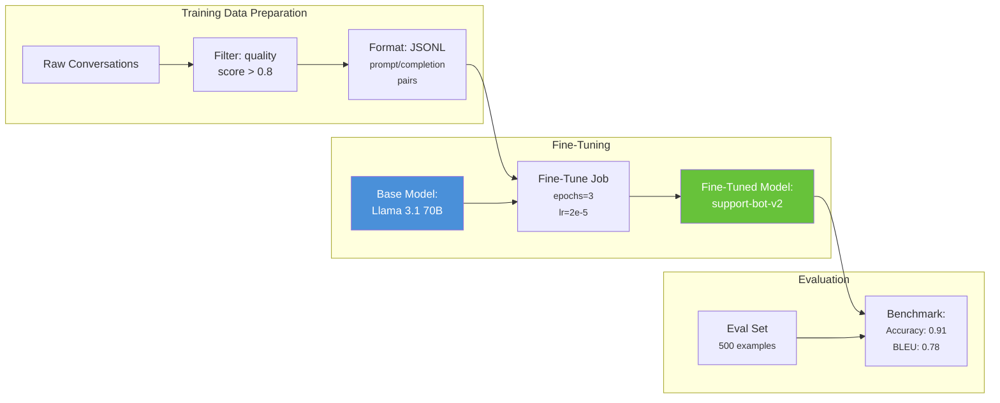
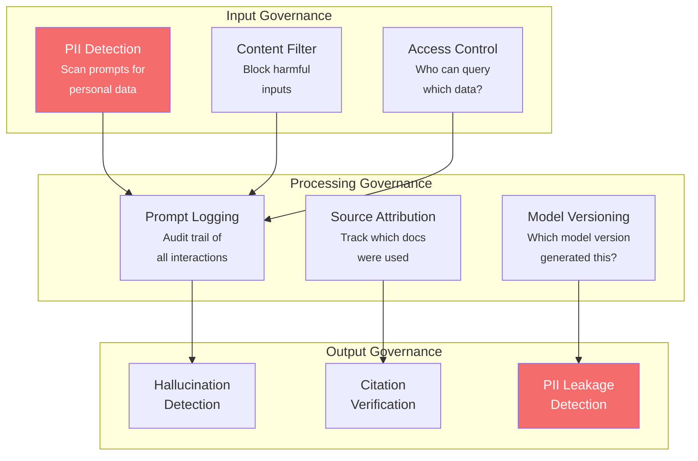

# Chapter 20: GenAI & LLM Lineage

[&larr; Back to Index](../index.md) | [Previous: Chapter 19](19-ml-lineage.md)

---

## Chapter Contents

- [20.1 Why GenAI Needs Lineage](#201-why-genai-needs-lineage)
- [20.2 The GenAI Data Pipeline](#202-the-genai-data-pipeline)
- [20.3 RAG Lineage: Retrieval-Augmented Generation](#203-rag-lineage-retrieval-augmented-generation)
- [20.4 Prompt Chain Lineage](#204-prompt-chain-lineage)
- [20.5 Embedding and Vector Store Lineage](#205-embedding-and-vector-store-lineage)
- [20.6 Fine-Tuning Lineage](#206-fine-tuning-lineage)
- [20.7 LLM Observability and Lineage](#207-llm-observability-and-lineage)
- [20.8 Governance for GenAI Outputs](#208-governance-for-genai-outputs)
- [20.9 Exercise](#209-exercise)
- [20.10 Summary](#2010-summary)

---

## 20.1 Why GenAI Needs Lineage



> **GenAI lineage** tracks data from source documents through embeddings,
> retrieval, prompt construction, and LLM generation. It supports provenance,
> debugging, and governance.

---

## 20.2 The GenAI Data Pipeline



### GenAI Lineage Dimensions

```
┌──────────────────────┬──────────────────────────────────────────────┐
│ Dimension            │ What It Tracks                               │
├──────────────────────┼──────────────────────────────────────────────┤
│ Document lineage     │ Source docs → chunks → embeddings             │
│ Retrieval lineage    │ Query → retrieved chunks (with scores)        │
│ Prompt lineage       │ System prompt + context + query → final prompt│
│ Generation lineage   │ Model + prompt + params → response            │
│ Chain lineage        │ Multi-step prompt chains and tool calls       │
│ Evaluation lineage   │ Response + ground truth → quality metrics     │
└──────────────────────┴──────────────────────────────────────────────┘
```

---

## 20.3 RAG Lineage: Retrieval-Augmented Generation

### RAG Lineage Model

```python
from dataclasses import dataclass, field
from datetime import datetime
import hashlib
import json


@dataclass
class DocumentChunk:
    """A chunk of a source document."""
    chunk_id: str
    document_id: str
    document_source: str  # File path, URL, or database reference
    text: str
    chunk_index: int
    metadata: dict = field(default_factory=dict)

    @property
    def content_hash(self) -> str:
        return hashlib.sha256(self.text.encode()).hexdigest()[:16]


@dataclass
class RetrievalResult:
    """A retrieved chunk with its similarity score."""
    chunk: DocumentChunk
    similarity_score: float
    rank: int


@dataclass
class RAGLineageEvent:
    """Complete lineage for a single RAG interaction."""
    trace_id: str
    timestamp: datetime

    # Query
    user_query: str
    query_embedding_model: str

    # Retrieval
    retrieved_chunks: list[RetrievalResult]
    retrieval_strategy: str  # "cosine_similarity", "mmr", etc.
    top_k: int

    # Prompt
    system_prompt: str
    assembled_prompt_hash: str  # Hash of the full prompt (avoid storing PII)
    context_token_count: int

    # Generation
    llm_model: str
    llm_parameters: dict  # temperature, max_tokens, etc.
    response_text: str
    response_token_count: int
    latency_ms: float

    # Optional evaluation
    relevance_score: float | None = None
    faithfulness_score: float | None = None

    def source_documents(self) -> list[str]:
        """Which source documents contributed to this response?"""
        return list({r.chunk.document_source for r in self.retrieved_chunks})

    def to_lineage_graph(self) -> dict:
        """Export as a lineage graph for visualization."""
        nodes = [
            {"id": "query", "type": "query", "label": self.user_query[:50]},
            {"id": "retrieval", "type": "process",
             "label": f"Retrieve top-{self.top_k}"},
            {"id": "prompt", "type": "process", "label": "Assemble prompt"},
            {"id": "llm", "type": "model", "label": self.llm_model},
            {"id": "response", "type": "output",
             "label": self.response_text[:50]},
        ]
        # Add source document nodes
        for r in self.retrieved_chunks:
            nodes.append({
                "id": f"doc_{r.chunk.chunk_id}",
                "type": "document",
                "label": f"{r.chunk.document_source} [chunk {r.chunk.chunk_index}]",
                "score": r.similarity_score,
            })

        edges = [
            {"source": "query", "target": "retrieval"},
            {"source": "retrieval", "target": "prompt"},
            {"source": "query", "target": "prompt"},
            {"source": "prompt", "target": "llm"},
            {"source": "llm", "target": "response"},
        ]
        for r in self.retrieved_chunks:
            edges.append({
                "source": f"doc_{r.chunk.chunk_id}",
                "target": "retrieval",
            })

        return {"nodes": nodes, "edges": edges}
```

### RAG Lineage Visualization



---

## 20.4 Prompt Chain Lineage

### Multi-Step Chains



### Chain Lineage Tracker

```python
@dataclass
class ChainStep:
    """A single step in a prompt chain."""
    step_id: str
    step_name: str
    model: str
    input_text: str
    output_text: str
    input_tokens: int
    output_tokens: int
    latency_ms: float
    metadata: dict = field(default_factory=dict)


@dataclass
class PromptChainLineage:
    """Track lineage through a multi-step LLM chain."""
    chain_id: str
    chain_name: str
    started_at: datetime
    steps: list[ChainStep] = field(default_factory=list)

    def add_step(self, step: ChainStep):
        self.steps.append(step)

    @property
    def total_tokens(self) -> int:
        return sum(s.input_tokens + s.output_tokens for s in self.steps)

    @property
    def total_latency_ms(self) -> float:
        return sum(s.latency_ms for s in self.steps)

    @property
    def total_cost_estimate(self) -> float:
        """Rough cost estimate (GPT-4 pricing)."""
        cost = 0.0
        for step in self.steps:
            if "gpt-4" in step.model:
                cost += step.input_tokens * 0.00003  # $30/M input
                cost += step.output_tokens * 0.00006  # $60/M output
            elif "gpt-3.5" in step.model:
                cost += step.input_tokens * 0.0000005
                cost += step.output_tokens * 0.0000015
        return cost

    def to_mermaid(self) -> str:
        """Generate Mermaid sequence diagram."""
        lines = ["sequenceDiagram"]
        lines.append("    participant U as User")
        for i, step in enumerate(self.steps):
            safe_name = step.step_name.replace(" ", "_")
            lines.append(f"    participant S{i} as {step.step_name}")

        prev = "U"
        for i, step in enumerate(self.steps):
            lines.append(f"    {prev}->>S{i}: {step.input_text[:30]}...")
            lines.append(f"    Note over S{i}: {step.model}<br/>{step.latency_ms}ms")
            prev = f"S{i}"

        lines.append(f"    {prev}-->>U: Final response")
        return "\n".join(lines)


# Example chain
chain = PromptChainLineage(
    chain_id="chain-001",
    chain_name="customer-support-rag",
    started_at=datetime.now(),
)

chain.add_step(ChainStep(
    step_id="step-1",
    step_name="Classify Intent",
    model="gpt-3.5-turbo",
    input_text="What is the refund policy for electronics?",
    output_text='{"intent": "refund_policy", "category": "electronics"}',
    input_tokens=25,
    output_tokens=15,
    latency_ms=120,
))

chain.add_step(ChainStep(
    step_id="step-2",
    step_name="Retrieve Context",
    model="text-embedding-3-small",
    input_text="refund policy electronics",
    output_text="[chunk_id_1, chunk_id_2, chunk_id_3]",
    input_tokens=5,
    output_tokens=10,
    latency_ms=50,
))

chain.add_step(ChainStep(
    step_id="step-3",
    step_name="Generate Response",
    model="gpt-4-turbo",
    input_text="System: You are a helpful assistant...\nContext: ...\nQuery: ...",
    output_text="Electronics can be returned within 30 days...",
    input_tokens=1200,
    output_tokens=150,
    latency_ms=2500,
))

print(f"Total tokens: {chain.total_tokens}")
print(f"Total latency: {chain.total_latency_ms}ms")
print(f"Est. cost: ${chain.total_cost_estimate:.4f}")
```

---

## 20.5 Embedding and Vector Store Lineage

### Embedding Pipeline Lineage



### Embedding Lineage Tracker

```python
@dataclass
class EmbeddingLineage:
    """Track lineage from source documents through embedding pipeline."""
    collection_name: str
    embedding_model: str
    embedding_dimensions: int
    chunk_strategy: str  # "recursive", "sentence", "fixed"
    chunk_size: int
    chunk_overlap: int

    # Track source documents
    documents: dict[str, dict] = field(default_factory=dict)

    def register_document(self, doc_id: str, source_path: str,
                          content_hash: str, chunk_count: int):
        self.documents[doc_id] = {
            "source": source_path,
            "content_hash": content_hash,
            "chunk_count": chunk_count,
            "embedded_at": datetime.now().isoformat(),
            "model": self.embedding_model,
        }

    def stale_documents(self, current_hashes: dict[str, str]) -> list[str]:
        """Find documents whose source has changed since embedding."""
        stale = []
        for doc_id, meta in self.documents.items():
            current = current_hashes.get(doc_id)
            if current and current != meta["content_hash"]:
                stale.append(doc_id)
        return stale

    def re_embedding_plan(self, stale_docs: list[str]) -> dict:
        """Generate a plan for re-embedding stale documents."""
        total_chunks = sum(
            self.documents[d]["chunk_count"]
            for d in stale_docs
            if d in self.documents
        )
        return {
            "stale_documents": stale_docs,
            "total_chunks_to_reprocess": total_chunks,
            "embedding_model": self.embedding_model,
            "estimated_api_calls": total_chunks,
        }
```

---

## 20.6 Fine-Tuning Lineage

### Fine-Tuning Pipeline



### Fine-Tuning Lineage Model

```python
@dataclass
class FineTuneLineage:
    """Track lineage for model fine-tuning."""
    job_id: str
    base_model: str
    fine_tuned_model: str

    # Training data lineage
    training_data_source: str
    training_data_version: str
    training_examples: int
    data_filters: list[str]  # How was data filtered?

    # Hyperparameters
    epochs: int
    learning_rate: float
    batch_size: int

    # Evaluation
    eval_dataset: str
    eval_metrics: dict = field(default_factory=dict)

    # Lineage
    started_at: datetime = field(default_factory=datetime.now)
    completed_at: datetime | None = None

    def to_openlineage_event(self) -> dict:
        """Express fine-tuning as an OpenLineage event."""
        return {
            "eventType": "COMPLETE",
            "eventTime": (self.completed_at or datetime.now()).isoformat(),
            "job": {
                "namespace": "llm://fine-tuning",
                "name": f"fine-tune-{self.job_id}",
                "facets": {
                    "jobType": {
                        "processingType": "BATCH",
                        "integration": "LLM_FINE_TUNE",
                        "jobType": "FINE_TUNING",
                    },
                },
            },
            "inputs": [
                {
                    "namespace": "llm://models",
                    "name": self.base_model,
                },
                {
                    "namespace": "storage://training-data",
                    "name": self.training_data_source,
                    "facets": {
                        "dataQualityMetrics": {
                            "rowCount": self.training_examples,
                        },
                    },
                },
            ],
            "outputs": [
                {
                    "namespace": "llm://models",
                    "name": self.fine_tuned_model,
                    "facets": {
                        "modelMetrics": self.eval_metrics,
                    },
                },
            ],
        }
```

---

## 20.7 LLM Observability and Lineage

### LLM Observability Dashboard Metrics

```
┌────────────────────────┬──────────────────────────────────────┐
│ Metric                 │ Description                          │
├────────────────────────┼──────────────────────────────────────┤
│ Latency (P50, P99)     │ Time from query to response          │
│ Token throughput        │ Tokens per second per request        │
│ Retrieval relevance     │ How relevant are retrieved chunks?   │
│ Faithfulness            │ Does response match context?         │
│ Hallucination rate      │ Claims not supported by context      │
│ Cost per request        │ Token cost for each interaction      │
│ Cache hit rate          │ Semantic cache effectiveness         │
│ Error rate              │ LLM API failures, timeouts           │
└────────────────────────┴──────────────────────────────────────┘
```

### LLM Trace Logger

```python
@dataclass
class LLMTrace:
    """A single LLM interaction trace with full lineage."""
    trace_id: str
    timestamp: datetime

    # Request
    model: str
    prompt_tokens: int
    system_prompt_hash: str
    has_rag_context: bool

    # Response
    completion_tokens: int
    latency_ms: float
    finish_reason: str  # "stop", "length", "content_filter"

    # Quality
    retrieval_scores: list[float] = field(default_factory=list)
    faithfulness_score: float | None = None

    # Cost
    @property
    def estimated_cost(self) -> float:
        rates = {
            "gpt-4-turbo": (0.01, 0.03),       # per 1K tokens
            "gpt-4o": (0.005, 0.015),
            "gpt-3.5-turbo": (0.0005, 0.0015),
            "claude-3-opus": (0.015, 0.075),
            "claude-3-sonnet": (0.003, 0.015),
        }
        input_rate, output_rate = rates.get(self.model, (0.01, 0.03))
        return (self.prompt_tokens / 1000 * input_rate +
                self.completion_tokens / 1000 * output_rate)


@dataclass
class LLMObservabilityStore:
    """Store and analyze LLM traces."""
    traces: list[LLMTrace] = field(default_factory=list)

    def record(self, trace: LLMTrace):
        self.traces.append(trace)

    def summary(self, last_n: int = 100) -> dict:
        recent = self.traces[-last_n:]
        if not recent:
            return {}

        latencies = [t.latency_ms for t in recent]
        costs = [t.estimated_cost for t in recent]

        return {
            "total_requests": len(recent),
            "avg_latency_ms": sum(latencies) / len(latencies),
            "p99_latency_ms": sorted(latencies)[int(len(latencies) * 0.99)],
            "total_cost": sum(costs),
            "avg_cost_per_request": sum(costs) / len(costs),
            "avg_prompt_tokens": sum(t.prompt_tokens for t in recent) / len(recent),
            "avg_completion_tokens": sum(t.completion_tokens for t in recent) / len(recent),
            "models_used": list({t.model for t in recent}),
            "rag_percentage": sum(1 for t in recent if t.has_rag_context) / len(recent) * 100,
        }
```

---

## 20.8 Governance for GenAI Outputs

### GenAI Governance Framework



### Governance Checks

```python
import re


class GenAIGovernance:
    """Governance checks for GenAI pipelines."""

    PII_PATTERNS = {
        "email": r"[a-zA-Z0-9._%+-]+@[a-zA-Z0-9.-]+\.[a-zA-Z]{2,}",
        "phone": r"\b\d{3}[-.]?\d{3}[-.]?\d{4}\b",
        "ssn": r"\b\d{3}-\d{2}-\d{4}\b",
        "credit_card": r"\b\d{4}[-\s]?\d{4}[-\s]?\d{4}[-\s]?\d{4}\b",
    }

    @classmethod
    def scan_for_pii(cls, text: str) -> list[dict]:
        """Scan text for PII patterns."""
        findings = []
        for pii_type, pattern in cls.PII_PATTERNS.items():
            matches = re.findall(pattern, text)
            if matches:
                findings.append({
                    "type": pii_type,
                    "count": len(matches),
                    "action": "REDACT",
                })
        return findings

    @staticmethod
    def check_source_attribution(response: str,
                                  retrieved_chunks: list[str]) -> dict:
        """Check if response claims are supported by retrieved context."""
        # Simple sentence-level check (production: use NLI model)
        sentences = response.split(". ")
        context = " ".join(retrieved_chunks).lower()

        supported = 0
        unsupported = 0
        for sentence in sentences:
            words = set(sentence.lower().split())
            # Check if key words appear in context
            overlap = sum(1 for w in words if w in context)
            if overlap / max(len(words), 1) > 0.3:
                supported += 1
            else:
                unsupported += 1

        total = supported + unsupported
        return {
            "total_claims": total,
            "supported": supported,
            "unsupported": unsupported,
            "faithfulness_score": supported / max(total, 1),
        }


# Example
prompt = "My email is john@example.com and SSN is 123-45-6789"
findings = GenAIGovernance.scan_for_pii(prompt)
print(f"PII found: {findings}")
# → PII found: [{'type': 'email', 'count': 1, 'action': 'REDACT'},
#                {'type': 'ssn', 'count': 1, 'action': 'REDACT'}]
```

---

## 20.9 Exercise

> **Exercise**: Open [`exercises/ch20_genai_lineage.py`](../exercises/ch20_genai_lineage.py)
> and complete the following tasks:
>
> 1. Build a `RAGLineageEvent` capturing document → chunks → retrieval → response
> 2. Create a `PromptChainLineage` with at least 3 steps
> 3. Track embedding pipeline lineage (document → chunks → vectors)
> 4. Implement PII scanning for prompts and responses
> 5. Calculate cost and latency metrics across multiple RAG interactions

---

## 20.10 Summary

This chapter covered:

- **GenAI lineage** tracks data flow from documents through embeddings to LLM responses
- **RAG lineage** records which chunks were retrieved and their relevance scores
- **Prompt chain lineage** tracks multi-step LLM interactions end-to-end
- **Embedding lineage** connects source documents to vector representations
- **Fine-tuning lineage** links training data and base model to fine-tuned outputs
- **GenAI governance** scans for PII, checks attribution, and detects hallucinations

### Key Takeaway

> GenAI applications are only as reliable as the data they retrieve and the prompts
> they construct. Lineage for RAG, prompt chains, and embeddings lets you trace any
> generated answer back to its source documents, making debugging and compliance
> tractable.

### What's Next

[Chapter 21: Lineage at Scale](21-lineage-at-scale.md) addresses the engineering challenges of running lineage in production: event-driven architecture, tiered storage, query optimization, temporal versioning, and multi-cloud federation.

---

[&larr; Back to Index](../index.md) | [Previous: Chapter 19](19-ml-lineage.md) | [Next: Chapter 21 &rarr;](21-lineage-at-scale.md)
