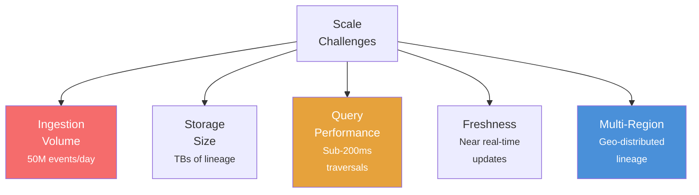
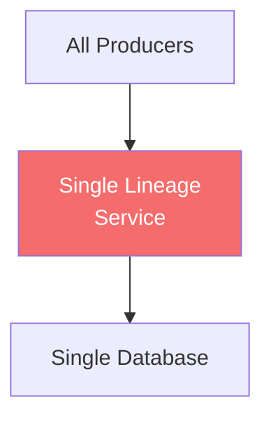
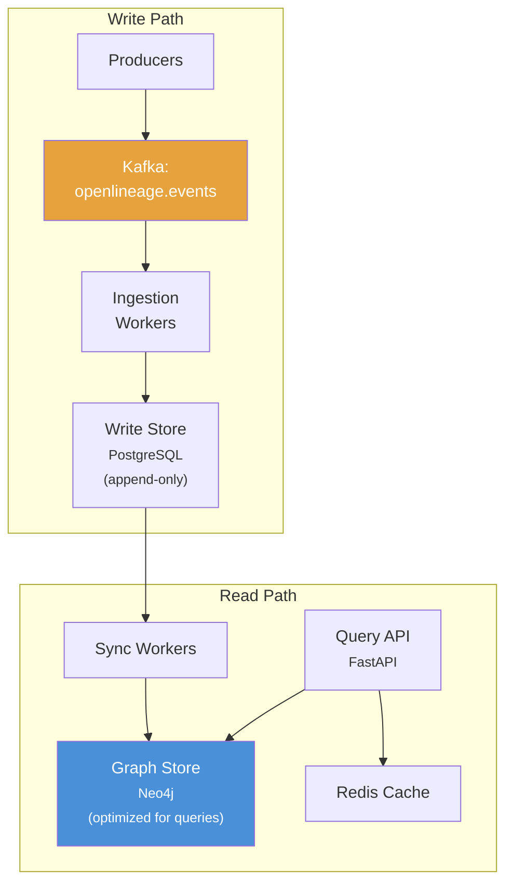
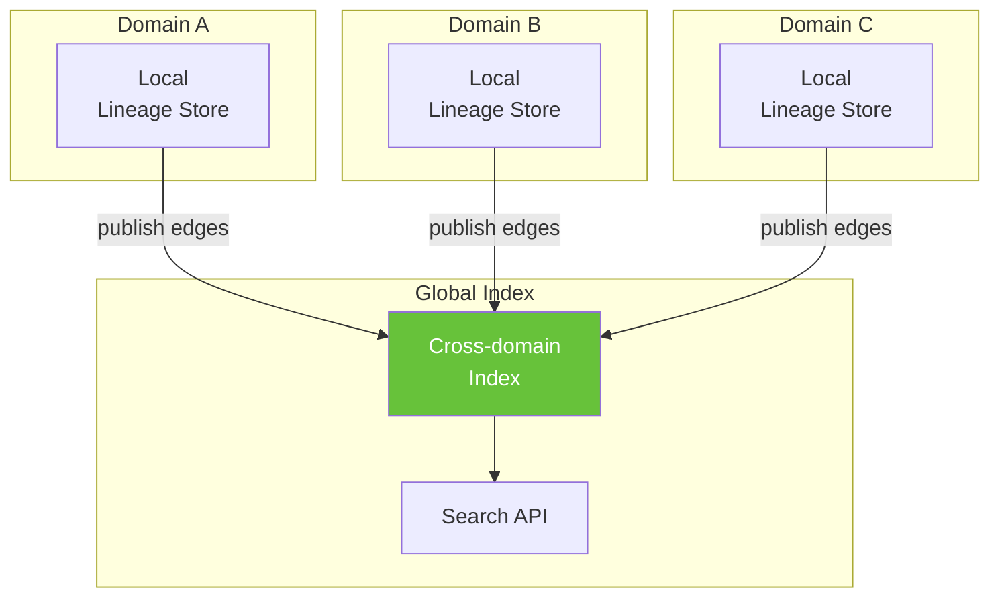
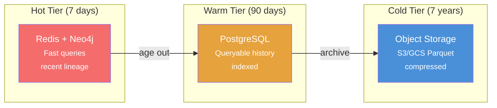
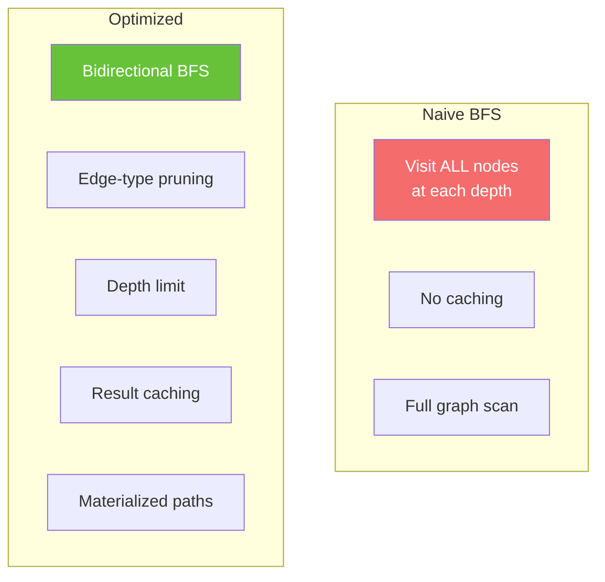
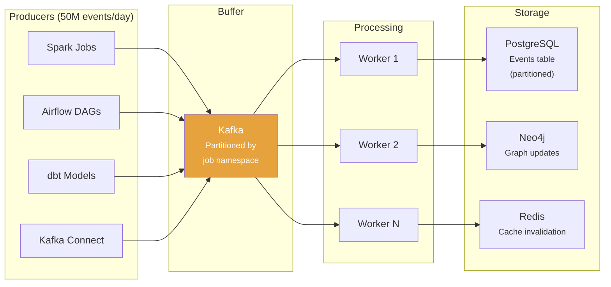
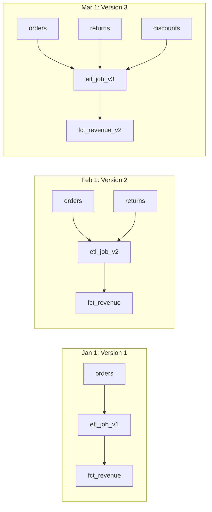
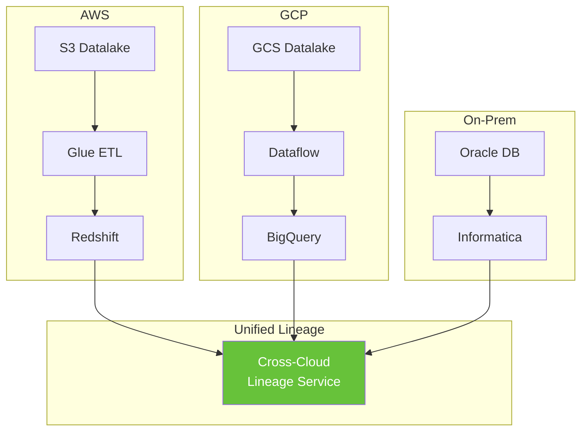

# Chapter 20: Lineage at Scale

[&larr; Back to Index](../index.md) | [Previous: Chapter 19](19-genai-llm-lineage.md)

---

## Chapter Contents

- [20.1 Scale Challenges](#201-scale-challenges)
- [20.2 Architecture Patterns](#202-architecture-patterns)
- [20.3 Storage Strategies](#203-storage-strategies)
- [20.4 Query Optimization](#204-query-optimization)
- [20.5 Event Ingestion at Scale](#205-event-ingestion-at-scale)
- [20.6 Lineage Versioning and Time Travel](#206-lineage-versioning-and-time-travel)
- [20.7 Multi-Cloud and Hybrid Lineage](#207-multi-cloud-and-hybrid-lineage)
- [20.8 Performance Benchmarking](#208-performance-benchmarking)
- [20.9 Exercise](#209-exercise)
- [20.10 Summary](#2010-summary)

---

## 20.1 Scale Challenges

```
┌────────────────────┬───────────────┬──────────────────────────────────┐
│ Scale Dimension    │ Small         │ Enterprise                       │
├────────────────────┼───────────────┼──────────────────────────────────┤
│ Datasets           │ 100s          │ 100,000s+                        │
│ Jobs               │ 50            │ 50,000+                          │
│ Lineage edges      │ 500           │ 10,000,000+                      │
│ Runs per day       │ 100           │ 1,000,000+                       │
│ Columns tracked    │ 1,000         │ 10,000,000+                      │
│ OpenLineage events │ 500/day       │ 50,000,000/day                   │
│ Query latency SLA  │ < 5s          │ < 200ms                          │
│ History retention  │ 30 days       │ 7 years (regulatory)             │
└────────────────────┴───────────────┴──────────────────────────────────┘
```



---

## 20.2 Architecture Patterns

### Pattern 1: Monolithic Lineage Service



**Pros**: Simple. **Cons**: Single point of failure, doesn't scale.

### Pattern 2: Event-Driven with CQRS

CQRS (Command Query Responsibility Segregation) separates write and read paths, letting each scale independently.



### Pattern 3: Federated with Global Index



### Pattern Comparison

```python
from dataclasses import dataclass
from enum import Enum


class ArchPattern(Enum):
    MONOLITHIC = "monolithic"
    CQRS = "event_driven_cqrs"
    FEDERATED = "federated_global_index"


@dataclass
class ScaleProfile:
    """Profile the scalability of a lineage architecture."""
    pattern: ArchPattern
    max_events_per_second: int
    query_latency_p99_ms: int
    storage_scalability: str  # "vertical", "horizontal"
    operational_complexity: str  # "low", "medium", "high"
    consistency_model: str  # "strong", "eventual"

    def fits_requirements(self, events_per_second: int,
                          latency_sla_ms: int) -> bool:
        return (
            self.max_events_per_second >= events_per_second
            and self.query_latency_p99_ms <= latency_sla_ms
        )


profiles = [
    ScaleProfile(ArchPattern.MONOLITHIC, 1000, 500, "vertical", "low", "strong"),
    ScaleProfile(ArchPattern.CQRS, 100000, 50, "horizontal", "medium", "eventual"),
    ScaleProfile(ArchPattern.FEDERATED, 500000, 100, "horizontal", "high", "eventual"),
]

# Which pattern fits our requirements?
required_eps = 10000
required_latency = 200

for p in profiles:
    fits = p.fits_requirements(required_eps, required_latency)
    print(f"{p.pattern.value}: {'✅' if fits else '❌'} "
          f"(eps={p.max_events_per_second}, "
          f"p99={p.query_latency_p99_ms}ms)")
```

---

## 20.3 Storage Strategies

### Tiered Storage



### Partitioning Strategy

```python
from datetime import datetime, timedelta


@dataclass
class LineagePartitionManager:
    """Manage time-partitioned lineage storage."""
    hot_retention_days: int = 7
    warm_retention_days: int = 90
    cold_retention_days: int = 2555  # ~7 years

    def partition_key(self, event_time: datetime) -> str:
        """Generate partition key (daily)."""
        return event_time.strftime("%Y-%m-%d")

    def tier_for_date(self, event_date: datetime) -> str:
        age = (datetime.now() - event_date).days
        if age <= self.hot_retention_days:
            return "hot"
        elif age <= self.warm_retention_days:
            return "warm"
        elif age <= self.cold_retention_days:
            return "cold"
        return "expired"  # Can be purged

    def partitions_to_archive(self) -> dict[str, list[str]]:
        """Identify partitions that need to move between tiers."""
        moves: dict[str, list[str]] = {"hot_to_warm": [], "warm_to_cold": []}
        today = datetime.now()

        for days_ago in range(self.cold_retention_days):
            date = today - timedelta(days=days_ago)
            key = self.partition_key(date)
            tier = self.tier_for_date(date)

            if days_ago == self.hot_retention_days:
                moves["hot_to_warm"].append(key)
            elif days_ago == self.warm_retention_days:
                moves["warm_to_cold"].append(key)

        return moves
```

---

## 20.4 Query Optimization

### Graph Traversal Optimization



### Optimized Traversal

```python
import networkx as nx
from collections import deque
from functools import lru_cache


class OptimizedLineageQuerier:
    """Optimized lineage graph queries for scale."""

    def __init__(self, graph: nx.DiGraph):
        self.graph = graph
        self._path_cache: dict[tuple[str, str, int], list[str]] = {}

    def bounded_upstream(self, node: str, max_depth: int = 10,
                         max_nodes: int = 1000) -> list[str]:
        """BFS upstream with depth and node count limits."""
        if node not in self.graph:
            return []

        visited: set[str] = set()
        queue: deque[tuple[str, int]] = deque([(node, 0)])
        result: list[str] = []

        while queue and len(result) < max_nodes:
            current, depth = queue.popleft()
            if current in visited or depth > max_depth:
                continue
            visited.add(current)
            if current != node:
                result.append(current)

            for pred in self.graph.predecessors(current):
                if pred not in visited:
                    queue.append((pred, depth + 1))

        return result

    def bounded_downstream(self, node: str, max_depth: int = 10,
                           max_nodes: int = 1000) -> list[str]:
        """BFS downstream with limits."""
        if node not in self.graph:
            return []

        visited: set[str] = set()
        queue: deque[tuple[str, int]] = deque([(node, 0)])
        result: list[str] = []

        while queue and len(result) < max_nodes:
            current, depth = queue.popleft()
            if current in visited or depth > max_depth:
                continue
            visited.add(current)
            if current != node:
                result.append(current)

            for succ in self.graph.successors(current):
                if succ not in visited:
                    queue.append((succ, depth + 1))

        return result

    def bidirectional_path(self, source: str, target: str,
                           max_depth: int = 15) -> list[str] | None:
        """Find shortest path using bidirectional BFS."""
        cache_key = (source, target, max_depth)
        if cache_key in self._path_cache:
            return self._path_cache[cache_key]

        try:
            path = nx.shortest_path(self.graph, source, target)
            if len(path) <= max_depth:
                self._path_cache[cache_key] = list(path)
                return list(path)
        except nx.NetworkXNoPath:
            pass

        self._path_cache[cache_key] = []
        return None

    def impact_radius(self, node: str) -> dict:
        """Calculate impact metrics without full traversal."""
        if node not in self.graph:
            return {"direct": 0, "depth_2": 0, "depth_5": 0, "total": 0}

        return {
            "direct": len(list(self.graph.successors(node))),
            "depth_2": len(self.bounded_downstream(node, max_depth=2)),
            "depth_5": len(self.bounded_downstream(node, max_depth=5)),
            "total": len(nx.descendants(self.graph, node)),
        }
```

---

## 20.5 Event Ingestion at Scale

### Ingestion Pipeline



### Batch Ingestion Worker

```python
import json
from dataclasses import dataclass, field
from datetime import datetime


@dataclass
class IngestionMetrics:
    """Track ingestion performance."""
    events_received: int = 0
    events_processed: int = 0
    events_failed: int = 0
    batch_count: int = 0
    total_latency_ms: float = 0

    @property
    def avg_latency_ms(self) -> float:
        if self.events_processed == 0:
            return 0
        return self.total_latency_ms / self.events_processed

    @property
    def success_rate(self) -> float:
        total = self.events_processed + self.events_failed
        return self.events_processed / max(total, 1) * 100


@dataclass
class BatchIngestionWorker:
    """Process OpenLineage events in micro-batches."""
    batch_size: int = 100
    buffer: list[dict] = field(default_factory=list)
    metrics: IngestionMetrics = field(default_factory=IngestionMetrics)

    def receive(self, event: dict):
        """Buffer an incoming event."""
        self.buffer.append(event)
        self.metrics.events_received += 1

        if len(self.buffer) >= self.batch_size:
            self.flush()

    def flush(self):
        """Process buffered events as a batch."""
        if not self.buffer:
            return

        start = datetime.now()
        batch = self.buffer[:]
        self.buffer.clear()

        # Deduplicate by run_id + event_type
        seen: set[str] = set()
        unique: list[dict] = []
        for event in batch:
            run_id = event.get("run", {}).get("runId", "")
            event_type = event.get("eventType", "")
            key = f"{run_id}:{event_type}"
            if key not in seen:
                seen.add(key)
                unique.append(event)

        # Process each event
        for event in unique:
            try:
                self._process_event(event)
                self.metrics.events_processed += 1
            except Exception:
                self.metrics.events_failed += 1

        elapsed = (datetime.now() - start).total_seconds() * 1000
        self.metrics.total_latency_ms += elapsed
        self.metrics.batch_count += 1

    def _process_event(self, event: dict):
        """Process a single OpenLineage event."""
        event_type = event.get("eventType")
        job = event.get("job", {})
        run = event.get("run", {})

        # Upsert job
        job_key = f"{job.get('namespace')}/{job.get('name')}"

        # Upsert run
        run_id = run.get("runId")

        # Upsert input/output datasets and edges
        for inp in event.get("inputs", []):
            _dataset_key = f"{inp.get('namespace')}/{inp.get('name')}"
            # Create edge: input_dataset → job

        for out in event.get("outputs", []):
            _dataset_key = f"{out.get('namespace')}/{out.get('name')}"
            # Create edge: job → output_dataset
```

---

## 20.6 Lineage Versioning and Time Travel

### Point-in-Time Lineage



### Temporal Lineage Store

```python
@dataclass
class VersionedEdge:
    """A lineage edge with temporal validity."""
    source: str
    target: str
    valid_from: datetime
    valid_to: datetime | None = None  # None = still active

    def is_active_at(self, point_in_time: datetime) -> bool:
        if point_in_time < self.valid_from:
            return False
        if self.valid_to and point_in_time > self.valid_to:
            return False
        return True


@dataclass
class TemporalLineageStore:
    """Lineage store supporting time-travel queries."""
    edges: list[VersionedEdge] = field(default_factory=list)

    def add_edge(self, source: str, target: str, valid_from: datetime):
        """Add a new edge, closing any existing edge between the same pair."""
        for e in self.edges:
            if e.source == source and e.target == target and e.valid_to is None:
                e.valid_to = valid_from  # Close previous version
        self.edges.append(VersionedEdge(source, target, valid_from))

    def remove_edge(self, source: str, target: str, removed_at: datetime):
        """Close an edge at a point in time."""
        for e in self.edges:
            if e.source == source and e.target == target and e.valid_to is None:
                e.valid_to = removed_at

    def graph_at(self, point_in_time: datetime) -> nx.DiGraph:
        """Reconstruct the lineage graph as it appeared at a point in time."""
        graph = nx.DiGraph()
        for e in self.edges:
            if e.is_active_at(point_in_time):
                graph.add_edge(e.source, e.target)
        return graph

    def diff(self, time_a: datetime, time_b: datetime) -> dict:
        """Compare lineage between two points in time."""
        graph_a = self.graph_at(time_a)
        graph_b = self.graph_at(time_b)

        edges_a = set(graph_a.edges())
        edges_b = set(graph_b.edges())

        return {
            "added": list(edges_b - edges_a),
            "removed": list(edges_a - edges_b),
            "unchanged": list(edges_a & edges_b),
        }


# Usage
store = TemporalLineageStore()

jan1 = datetime(2024, 1, 1)
feb1 = datetime(2024, 2, 1)
mar1 = datetime(2024, 3, 1)

# January topology
store.add_edge("orders", "etl_job_v1", jan1)
store.add_edge("etl_job_v1", "fct_revenue", jan1)

# February: add returns, upgrade job
store.add_edge("orders", "etl_job_v2", feb1)
store.add_edge("returns", "etl_job_v2", feb1)
store.add_edge("etl_job_v2", "fct_revenue", feb1)
store.remove_edge("orders", "etl_job_v1", feb1)
store.remove_edge("etl_job_v1", "fct_revenue", feb1)

# Query: what did lineage look like in January?
jan_graph = store.graph_at(datetime(2024, 1, 15))
print(f"January edges: {list(jan_graph.edges())}")

# Query: what changed between Jan and Feb?
changes = store.diff(jan1, feb1)
print(f"Added: {changes['added']}")
print(f"Removed: {changes['removed']}")
```

---

## 20.7 Multi-Cloud and Hybrid Lineage

### Multi-Cloud Architecture



### Multi-Cloud Namespace Registry

```python
@dataclass
class CloudNamespaceRegistry:
    """Map cloud-specific identifiers to unified namespace."""
    mappings: dict[str, str] = field(default_factory=dict)

    def register(self, cloud_urn: str, unified_name: str):
        self.mappings[cloud_urn] = unified_name

    def resolve(self, cloud_urn: str) -> str:
        return self.mappings.get(cloud_urn, cloud_urn)

    def reverse_lookup(self, unified_name: str) -> list[str]:
        return [k for k, v in self.mappings.items() if v == unified_name]


# Register cloud resources
registry = CloudNamespaceRegistry()

registry.register(
    "s3://data-lake-prod/orders/",
    "acme://ingestion.prod/raw_orders",
)
registry.register(
    "gs://analytics-prod/orders/",
    "acme://analytics.prod/fct_orders",
)
registry.register(
    "oracle://erp-prod/SALES.ORDERS",
    "acme://source.prod/erp_orders",
)

# Resolve cloud URN to unified namespace
unified = registry.resolve("s3://data-lake-prod/orders/")
print(f"S3 → {unified}")
# → acme://ingestion.prod/raw_orders
```

---

## 20.8 Performance Benchmarking

### Benchmark Suite

```python
import time
import random
import string


def generate_large_graph(num_datasets: int, num_jobs: int,
                         edges_per_job: int = 3) -> nx.DiGraph:
    """Generate a large lineage graph for benchmarking."""
    graph = nx.DiGraph()

    datasets = [f"dataset_{i}" for i in range(num_datasets)]
    jobs = [f"job_{i}" for i in range(num_jobs)]

    for ds in datasets:
        graph.add_node(ds, type="dataset")
    for job in jobs:
        graph.add_node(job, type="job")

    for job in jobs:
        # Random inputs
        inputs = random.sample(datasets, min(edges_per_job, len(datasets)))
        for inp in inputs:
            graph.add_edge(inp, job)
        # Random outputs
        outputs = random.sample(datasets, min(edges_per_job, len(datasets)))
        for out in outputs:
            graph.add_edge(job, out)

    return graph


def benchmark_traversal(graph: nx.DiGraph) -> dict:
    """Benchmark common lineage queries."""
    nodes = list(graph.nodes())
    querier = OptimizedLineageQuerier(graph)

    results = {}

    # Benchmark: upstream query
    sample = random.sample(nodes, min(100, len(nodes)))
    start = time.perf_counter()
    for node in sample:
        querier.bounded_upstream(node, max_depth=5)
    elapsed = (time.perf_counter() - start) * 1000
    results["upstream_avg_ms"] = elapsed / len(sample)

    # Benchmark: downstream query
    start = time.perf_counter()
    for node in sample:
        querier.bounded_downstream(node, max_depth=5)
    elapsed = (time.perf_counter() - start) * 1000
    results["downstream_avg_ms"] = elapsed / len(sample)

    # Benchmark: impact radius
    start = time.perf_counter()
    for node in sample[:10]:
        querier.impact_radius(node)
    elapsed = (time.perf_counter() - start) * 1000
    results["impact_radius_avg_ms"] = elapsed / 10

    results["total_nodes"] = graph.number_of_nodes()
    results["total_edges"] = graph.number_of_edges()

    return results


# Run benchmark at different scales
for scale in [1000, 10000, 100000]:
    graph_bench = generate_large_graph(
        num_datasets=scale,
        num_jobs=scale // 5,
    )
    results = benchmark_traversal(graph_bench)
    print(f"\n{'='*50}")
    print(f"Scale: {scale} datasets")
    print(f"  Nodes: {results['total_nodes']:,}")
    print(f"  Edges: {results['total_edges']:,}")
    print(f"  Upstream avg: {results['upstream_avg_ms']:.2f}ms")
    print(f"  Downstream avg: {results['downstream_avg_ms']:.2f}ms")
    print(f"  Impact radius avg: {results['impact_radius_avg_ms']:.2f}ms")
```

---

## 20.9 Exercise

> **Exercise**: Open [`exercises/ch20_scale.py`](../exercises/ch20_scale.py)
> and complete the following tasks:
>
> 1. Generate a lineage graph with 10,000 datasets and 2,000 jobs
> 2. Benchmark upstream and downstream traversals
> 3. Implement a `TemporalLineageStore` with time-travel queries
> 4. Build a tiered storage manager with hot/warm/cold tiers
> 5. Compare performance of bounded vs unbounded BFS

---

## 20.10 Summary

You now know how to:

- Architect **lineage at scale** with event-driven pipelines and CQRS (Command Query Responsibility Segregation)
- Use **tiered storage** (hot/warm/cold) to balance query speed with cost
- Apply **bounded traversals** with depth and node limits to prevent runaway queries
- Implement **temporal lineage** for time-travel queries and lineage diffing
- Federate **multi-cloud lineage** by mapping cloud-specific URNs to a unified namespace
- Run **benchmarks** that prove your architecture meets performance SLAs

### Key Takeaway

> Small lineage graphs fit comfortably in memory. Enterprise graphs do not. The
> patterns in this chapter (event sourcing, CQRS, bounded traversal, tiered storage)
> are what separate a prototype from a production system that scales to millions
> of nodes.

### What's Next

[Chapter 21: Capstone Project](21-capstone-project.md) brings everything together. You will build a complete mini lineage platform with event ingestion, graph storage, a REST API, quality monitoring, governance, and visualization.

---

[&larr; Back to Index](../index.md) | [Previous: Chapter 19](19-genai-llm-lineage.md) | [Next: Chapter 21 &rarr;](21-capstone-project.md)
