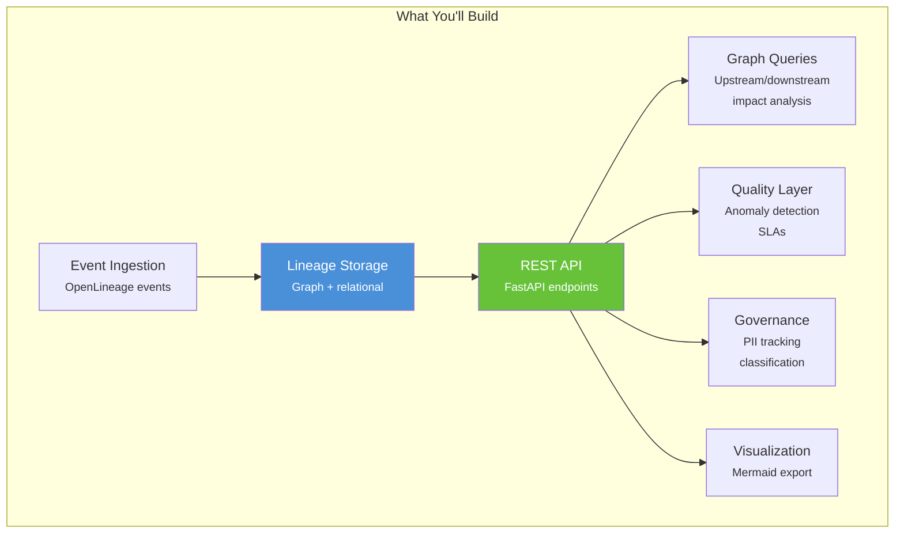
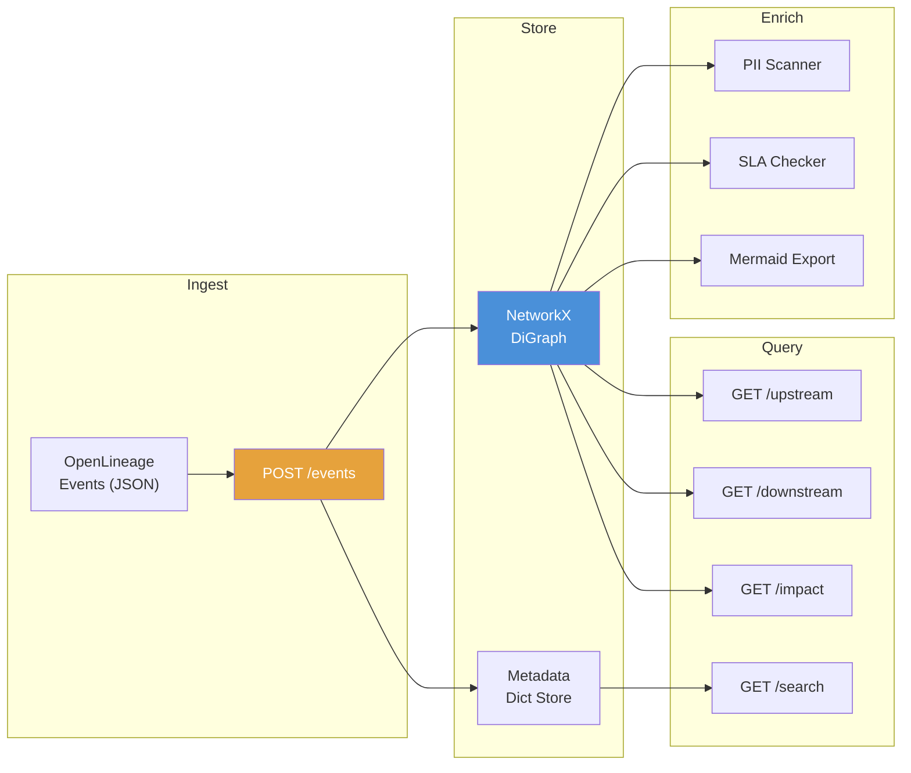
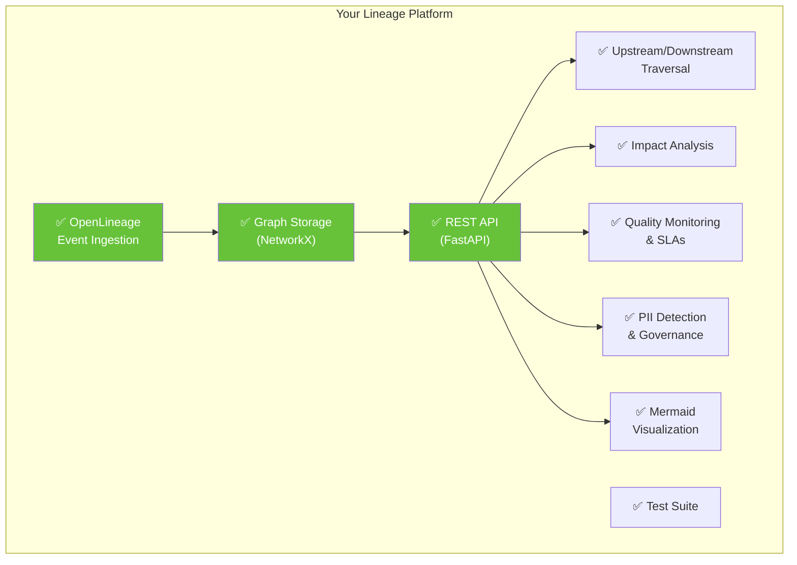

# Chapter 22: Capstone Project: Building a Complete Lineage Platform

[&larr; Back to Index](../index.md) | [Previous: Chapter 21](21-lineage-at-scale.md)

---

## Chapter Contents

- [22.1 Project Overview](#221-project-overview)
- [22.2 Architecture Design](#222-architecture-design)
- [22.3 Phase 1: Data Model and Storage](#223-phase-1-data-model-and-storage)
- [22.4 Phase 2: Event Ingestion](#224-phase-2-event-ingestion)
- [22.5 Phase 3: Graph Queries and API](#225-phase-3-graph-queries-and-api)
- [22.6 Phase 4: Quality and Observability](#226-phase-4-quality-and-observability)
- [22.7 Phase 5: Governance and Classification](#227-phase-5-governance-and-classification)
- [22.8 Phase 6: Visualization](#228-phase-6-visualization)
- [22.9 Testing Strategy](#229-testing-strategy)
- [22.10 Putting It All Together](#2210-putting-it-all-together)
- [22.11 Summary and Next Steps](#2211-summary-and-next-steps)

---

## 22.1 Project Overview

This capstone consolidates every concept from Chapters 1–20 into a working
**mini lineage platform** that you build from scratch.



### Project Structure

```
exercises/ch22_capstone/
├── __init__.py
├── models.py          # Pydantic schemas + data models
├── graph_store.py     # In-memory lineage graph (NetworkX)
├── ingestion.py       # OpenLineage event processor
├── api.py             # FastAPI application
├── queries.py         # Graph traversal queries
├── quality.py         # Quality and observability
├── governance.py      # PII tracking and classification
├── visualization.py   # Mermaid diagram export
├── seed_data.py       # Generate sample lineage data
└── test_capstone.py   # Test suite
```

> **Note:** All bare imports in the code blocks below (e.g., `from models import ...`,
> `from graph_store import GraphStore`) refer to modules within the
> `exercises/ch22_capstone/` package.

---

## 22.2 Architecture Design



---

## 22.3 Phase 1: Data Model and Storage

### `models.py`: Core Data Models

```python
"""Core data models for the lineage platform."""
from __future__ import annotations

from dataclasses import dataclass, field
from datetime import datetime
from enum import Enum


class NodeType(Enum):
    DATASET = "DATASET"
    JOB = "JOB"
    RUN = "RUN"


class Classification(Enum):
    PUBLIC = "PUBLIC"
    INTERNAL = "INTERNAL"
    CONFIDENTIAL = "CONFIDENTIAL"
    RESTRICTED = "RESTRICTED"


@dataclass
class LineageNode:
    """A node in the lineage graph."""
    id: str
    name: str
    namespace: str
    node_type: NodeType
    metadata: dict = field(default_factory=dict)
    classification: Classification = Classification.INTERNAL
    created_at: datetime = field(default_factory=datetime.now)
    updated_at: datetime = field(default_factory=datetime.now)


@dataclass
class LineageEdge:
    """An edge connecting two nodes."""
    source_id: str
    target_id: str
    edge_type: str = "DERIVED_FROM"  # or "PRODUCED_BY", "CONSUMED_BY"
    metadata: dict = field(default_factory=dict)
    created_at: datetime = field(default_factory=datetime.now)


@dataclass
class QualityMetrics:
    """Quality metrics for a dataset."""
    dataset_id: str
    row_count: int = 0
    null_rates: dict[str, float] = field(default_factory=dict)
    freshness_hours: float = 0.0
    measured_at: datetime = field(default_factory=datetime.now)


@dataclass
class DataSLA:
    """SLA for a dataset."""
    dataset_id: str
    freshness_max_hours: float = 24.0
    min_row_count: int = 0
    max_null_rate: float = 0.1
```

### `graph_store.py`: Graph Storage

```python
"""In-memory lineage graph using NetworkX."""
from __future__ import annotations

import networkx as nx
from collections import deque

from models import LineageNode, LineageEdge, NodeType


class GraphStore:
    """In-memory lineage graph store."""

    def __init__(self):
        self.graph = nx.DiGraph()
        self.nodes: dict[str, LineageNode] = {}
        self.edges: list[LineageEdge] = []

    def upsert_node(self, node: LineageNode):
        """Add or update a node in the graph."""
        self.nodes[node.id] = node
        self.graph.add_node(
            node.id,
            name=node.name,
            namespace=node.namespace,
            type=node.node_type.value,
            classification=node.classification.value,
        )

    def add_edge(self, edge: LineageEdge):
        """Add an edge to the graph."""
        self.edges.append(edge)
        self.graph.add_edge(
            edge.source_id,
            edge.target_id,
            type=edge.edge_type,
        )

    def get_node(self, node_id: str) -> LineageNode | None:
        return self.nodes.get(node_id)

    def upstream(self, node_id: str, max_depth: int = 10) -> list[LineageNode]:
        """BFS upstream traversal."""
        if node_id not in self.graph:
            return []

        visited: set[str] = set()
        queue: deque[tuple[str, int]] = deque([(node_id, 0)])
        result: list[LineageNode] = []

        while queue:
            current, depth = queue.popleft()
            if current in visited or depth > max_depth:
                continue
            visited.add(current)
            if current != node_id and current in self.nodes:
                result.append(self.nodes[current])

            for pred in self.graph.predecessors(current):
                if pred not in visited:
                    queue.append((pred, depth + 1))

        return result

    def downstream(self, node_id: str, max_depth: int = 10) -> list[LineageNode]:
        """BFS downstream traversal."""
        if node_id not in self.graph:
            return []

        visited: set[str] = set()
        queue: deque[tuple[str, int]] = deque([(node_id, 0)])
        result: list[LineageNode] = []

        while queue:
            current, depth = queue.popleft()
            if current in visited or depth > max_depth:
                continue
            visited.add(current)
            if current != node_id and current in self.nodes:
                result.append(self.nodes[current])

            for succ in self.graph.successors(current):
                if succ not in visited:
                    queue.append((succ, depth + 1))

        return result

    def impact_analysis(self, node_id: str) -> dict:
        """Analyze the downstream impact of a node."""
        downstream_nodes = self.downstream(node_id)
        datasets = [n for n in downstream_nodes if n.node_type == NodeType.DATASET]
        jobs = [n for n in downstream_nodes if n.node_type == NodeType.JOB]

        return {
            "source": node_id,
            "total_downstream": len(downstream_nodes),
            "affected_datasets": len(datasets),
            "affected_jobs": len(jobs),
            "datasets": [{"id": d.id, "name": d.name} for d in datasets],
            "jobs": [{"id": j.id, "name": j.name} for j in jobs],
        }

    def search(self, query: str) -> list[LineageNode]:
        """Search nodes by name or namespace."""
        q = query.lower()
        return [
            node for node in self.nodes.values()
            if q in node.name.lower() or q in node.namespace.lower()
        ]

    def stats(self) -> dict:
        """Graph statistics."""
        return {
            "total_nodes": self.graph.number_of_nodes(),
            "total_edges": self.graph.number_of_edges(),
            "datasets": sum(1 for n in self.nodes.values() if n.node_type == NodeType.DATASET),
            "jobs": sum(1 for n in self.nodes.values() if n.node_type == NodeType.JOB),
        }
```

---

## 22.4 Phase 2: Event Ingestion

### `ingestion.py`: OpenLineage Event Processor

```python
"""Process OpenLineage events into the graph store."""
from __future__ import annotations

from datetime import datetime

from models import LineageNode, LineageEdge, NodeType
from graph_store import GraphStore


class OpenLineageProcessor:
    """Process OpenLineage events and update the lineage graph."""

    def __init__(self, store: GraphStore):
        self.store = store
        self.events_processed: int = 0
        self.events_failed: int = 0

    def process_event(self, event: dict) -> bool:
        """Process a single OpenLineage event."""
        try:
            job = event.get("job", {})
            job_namespace = job.get("namespace", "default")
            job_name = job.get("name", "unknown")
            job_id = f"{job_namespace}/{job_name}"

            # Upsert job node
            self.store.upsert_node(LineageNode(
                id=job_id,
                name=job_name,
                namespace=job_namespace,
                node_type=NodeType.JOB,
                metadata=job.get("facets", {}),
            ))

            # Process inputs
            for inp in event.get("inputs", []):
                ds_namespace = inp.get("namespace", "default")
                ds_name = inp.get("name", "unknown")
                ds_id = f"{ds_namespace}/{ds_name}"

                self.store.upsert_node(LineageNode(
                    id=ds_id,
                    name=ds_name,
                    namespace=ds_namespace,
                    node_type=NodeType.DATASET,
                    metadata=inp.get("facets", {}),
                ))

                self.store.add_edge(LineageEdge(
                    source_id=ds_id,
                    target_id=job_id,
                    edge_type="CONSUMED_BY",
                ))

            # Process outputs
            for out in event.get("outputs", []):
                ds_namespace = out.get("namespace", "default")
                ds_name = out.get("name", "unknown")
                ds_id = f"{ds_namespace}/{ds_name}"

                self.store.upsert_node(LineageNode(
                    id=ds_id,
                    name=ds_name,
                    namespace=ds_namespace,
                    node_type=NodeType.DATASET,
                    metadata=out.get("facets", {}),
                ))

                self.store.add_edge(LineageEdge(
                    source_id=job_id,
                    target_id=ds_id,
                    edge_type="PRODUCED_BY",
                ))

            self.events_processed += 1
            return True

        except Exception as e:
            self.events_failed += 1
            print(f"Failed to process event: {e}")
            return False

    def process_batch(self, events: list[dict]) -> dict:
        """Process a batch of events."""
        results = {"success": 0, "failed": 0}
        for event in events:
            if self.process_event(event):
                results["success"] += 1
            else:
                results["failed"] += 1
        return results
```

---

## 22.5 Phase 3: Graph Queries and API

### `api.py`: FastAPI Application

```python
"""FastAPI application for the lineage platform."""
from __future__ import annotations

from fastapi import FastAPI, HTTPException, Query
from pydantic import BaseModel

from graph_store import GraphStore
from ingestion import OpenLineageProcessor
from visualization import MermaidExporter
from governance import PIIScanner


# Initialize
app = FastAPI(title="Mini Lineage Platform", version="1.0.0")
store = GraphStore()
processor = OpenLineageProcessor(store)
exporter = MermaidExporter(store)
scanner = PIIScanner()


# --- Pydantic models ---
class NodeResponse(BaseModel):
    id: str
    name: str
    namespace: str
    node_type: str
    classification: str


class ImpactResponse(BaseModel):
    source: str
    total_downstream: int
    affected_datasets: int
    affected_jobs: int
    datasets: list[dict]
    jobs: list[dict]


# --- Endpoints ---
@app.get("/health")
async def health():
    stats = store.stats()
    return {"status": "healthy", "graph": stats}


@app.post("/api/v1/events")
async def ingest_event(event: dict):
    """Ingest an OpenLineage event."""
    success = processor.process_event(event)
    if not success:
        raise HTTPException(status_code=400, detail="Failed to process event")
    return {"status": "accepted", "graph_stats": store.stats()}


@app.post("/api/v1/events/batch")
async def ingest_batch(events: list[dict]):
    """Ingest a batch of OpenLineage events."""
    results = processor.process_batch(events)
    return {"results": results, "graph_stats": store.stats()}


@app.get("/api/v1/datasets")
async def list_datasets():
    """List all datasets in the lineage graph."""
    from models import NodeType
    datasets = [
        NodeResponse(
            id=n.id, name=n.name, namespace=n.namespace,
            node_type=n.node_type.value,
            classification=n.classification.value,
        )
        for n in store.nodes.values()
        if n.node_type == NodeType.DATASET
    ]
    return {"datasets": datasets, "count": len(datasets)}


@app.get("/api/v1/upstream/{node_id:path}")
async def get_upstream(node_id: str,
                       depth: int = Query(default=10, le=50)):
    """Get upstream lineage for a node."""
    nodes = store.upstream(node_id, max_depth=depth)
    return {
        "root": node_id,
        "direction": "upstream",
        "depth": depth,
        "nodes": [
            {"id": n.id, "name": n.name, "type": n.node_type.value}
            for n in nodes
        ],
        "count": len(nodes),
    }


@app.get("/api/v1/downstream/{node_id:path}")
async def get_downstream(node_id: str,
                         depth: int = Query(default=10, le=50)):
    """Get downstream lineage for a node."""
    nodes = store.downstream(node_id, max_depth=depth)
    return {
        "root": node_id,
        "direction": "downstream",
        "depth": depth,
        "nodes": [
            {"id": n.id, "name": n.name, "type": n.node_type.value}
            for n in nodes
        ],
        "count": len(nodes),
    }


@app.get("/api/v1/impact/{node_id:path}")
async def get_impact(node_id: str):
    """Run impact analysis for a node."""
    return store.impact_analysis(node_id)


@app.get("/api/v1/search")
async def search_nodes(q: str = Query(min_length=1)):
    """Search nodes by name or namespace."""
    results = store.search(q)
    return {
        "query": q,
        "results": [
            {"id": n.id, "name": n.name, "type": n.node_type.value}
            for n in results
        ],
        "count": len(results),
    }


@app.get("/api/v1/visualize/{node_id:path}")
async def visualize(node_id: str,
                    direction: str = Query(default="downstream"),
                    depth: int = Query(default=5)):
    """Generate a Mermaid diagram for a lineage subgraph."""
    mermaid = exporter.subgraph_mermaid(node_id, direction, depth)
    return {"node": node_id, "mermaid": mermaid}


@app.get("/api/v1/governance/pii")
async def scan_pii():
    """Scan all datasets for potential PII columns."""
    results = scanner.scan_all_datasets(store)
    return {"pii_datasets": results, "count": len(results)}
```

---

## 22.6 Phase 4: Quality and Observability

### `quality.py`

```python
"""Quality monitoring and SLA checking."""
from __future__ import annotations

import statistics
from datetime import datetime
from dataclasses import dataclass, field

from models import QualityMetrics, DataSLA
from graph_store import GraphStore


@dataclass
class QualityMonitor:
    """Monitor data quality with lineage context."""

    history: dict[str, list[QualityMetrics]] = field(default_factory=dict)
    slas: dict[str, DataSLA] = field(default_factory=dict)

    def record_metrics(self, metrics: QualityMetrics):
        self.history.setdefault(metrics.dataset_id, []).append(metrics)

    def register_sla(self, sla: DataSLA):
        self.slas[sla.dataset_id] = sla

    def check_sla(self, dataset_id: str,
                  current: QualityMetrics) -> list[str]:
        """Check if current metrics violate the SLA."""
        sla = self.slas.get(dataset_id)
        if not sla:
            return []

        violations = []
        if current.freshness_hours > sla.freshness_max_hours:
            violations.append(
                f"Freshness SLA violated: {current.freshness_hours:.1f}h > "
                f"{sla.freshness_max_hours}h"
            )
        if current.row_count < sla.min_row_count:
            violations.append(
                f"Row count below minimum: {current.row_count} < "
                f"{sla.min_row_count}"
            )
        for col, rate in current.null_rates.items():
            if rate > sla.max_null_rate:
                violations.append(
                    f"Null rate for '{col}': {rate:.2%} > {sla.max_null_rate:.2%}"
                )
        return violations

    def is_anomaly(self, dataset_id: str, metric: str,
                   value: float, z_threshold: float = 3.0) -> bool:
        """Detect anomalous metric values using z-score."""
        history = self.history.get(dataset_id, [])
        if len(history) < 5:
            return False

        values = [getattr(m, metric, 0) for m in history if hasattr(m, metric)]
        if len(values) < 5 or statistics.stdev(values) == 0:
            return False

        z = abs(value - statistics.mean(values)) / statistics.stdev(values)
        return z > z_threshold

    def propagate_quality(self, store: GraphStore,
                          failed_dataset: str) -> list[str]:
        """Use lineage to find datasets affected by a quality failure."""
        downstream = store.downstream(failed_dataset)
        return [n.id for n in downstream]
```

---

## 22.7 Phase 5: Governance and Classification

### `governance.py`

```python
"""PII detection and data classification."""
from __future__ import annotations

import re
from dataclasses import dataclass

from models import Classification
from graph_store import GraphStore


PII_PATTERNS = {
    "EMAIL": [r"email", r"e_mail"],
    "PHONE": [r"phone", r"tel", r"mobile"],
    "SSN": [r"ssn", r"social_security"],
    "NAME": [r"first_name", r"last_name", r"full_name"],
    "ADDRESS": [r"address", r"street", r"zip", r"postal"],
    "DOB": [r"dob", r"birth_date", r"date_of_birth"],
}


@dataclass
class PIIFinding:
    dataset_id: str
    column: str
    pii_type: str


class PIIScanner:
    """Scan dataset metadata for PII patterns."""

    def scan_columns(self, dataset_id: str,
                     columns: list[str]) -> list[PIIFinding]:
        findings = []
        for col in columns:
            col_lower = col.lower()
            for pii_type, patterns in PII_PATTERNS.items():
                for pattern in patterns:
                    if re.search(pattern, col_lower):
                        findings.append(PIIFinding(dataset_id, col, pii_type))
                        break
        return findings

    def scan_all_datasets(self, store: GraphStore) -> list[dict]:
        """Scan all datasets in the store for PII."""
        from models import NodeType
        results = []
        for node in store.nodes.values():
            if node.node_type != NodeType.DATASET:
                continue
            columns = node.metadata.get("schema", {}).get("fields", [])
            if not columns:
                continue
            col_names = [c.get("name", "") for c in columns if isinstance(c, dict)]
            findings = self.scan_columns(node.id, col_names)
            if findings:
                results.append({
                    "dataset": node.id,
                    "pii_columns": [
                        {"column": f.column, "type": f.pii_type}
                        for f in findings
                    ],
                })
        return results

    def trace_pii_downstream(self, store: GraphStore,
                              dataset_id: str) -> list[str]:
        """Find all downstream datasets that may contain PII."""
        downstream = store.downstream(dataset_id)
        return [n.id for n in downstream]
```

---

## 22.8 Phase 6: Visualization

### `visualization.py`

```python
"""Export lineage graphs as Mermaid diagrams."""
from __future__ import annotations

from graph_store import GraphStore
from models import NodeType


class MermaidExporter:
    """Generate Mermaid diagrams from the lineage graph."""

    def __init__(self, store: GraphStore):
        self.store = store

    def _safe_id(self, node_id: str) -> str:
        return node_id.replace("/", "_").replace(".", "_").replace("-", "_")

    def _node_shape(self, node_id: str) -> str:
        node = self.store.get_node(node_id)
        safe = self._safe_id(node_id)
        name = node.name if node else node_id
        if node and node.node_type == NodeType.DATASET:
            return f'{safe}[("{name}")]'
        elif node and node.node_type == NodeType.JOB:
            return f'{safe}["{name}"]'
        return f'{safe}["{name}"]'

    def full_graph_mermaid(self) -> str:
        """Export the entire lineage graph as Mermaid."""
        lines = ["graph LR"]
        seen_nodes: set[str] = set()

        for src, dst in self.store.graph.edges():
            if src not in seen_nodes:
                lines.append(f"    {self._node_shape(src)}")
                seen_nodes.add(src)
            if dst not in seen_nodes:
                lines.append(f"    {self._node_shape(dst)}")
                seen_nodes.add(dst)
            lines.append(
                f"    {self._safe_id(src)} --> {self._safe_id(dst)}"
            )

        return "\n".join(lines)

    def subgraph_mermaid(self, root: str, direction: str = "downstream",
                         depth: int = 5) -> str:
        """Export a subgraph rooted at a node."""
        if direction == "downstream":
            nodes = self.store.downstream(root, max_depth=depth)
        else:
            nodes = self.store.upstream(root, max_depth=depth)

        node_ids = {root} | {n.id for n in nodes}
        lines = ["graph LR"]

        for nid in node_ids:
            lines.append(f"    {self._node_shape(nid)}")

        for src, dst in self.store.graph.edges():
            if src in node_ids and dst in node_ids:
                lines.append(
                    f"    {self._safe_id(src)} --> {self._safe_id(dst)}"
                )

        return "\n".join(lines)
```

---

## 22.9 Testing Strategy

### `test_capstone.py`

```python
"""Tests for the capstone lineage platform."""
import pytest
from httpx import AsyncClient, ASGITransport

from api import app, store, processor
from models import LineageNode, NodeType, QualityMetrics, DataSLA
from graph_store import GraphStore
from quality import QualityMonitor
from governance import PIIScanner


# --- Unit Tests ---
class TestGraphStore:
    def setup_method(self):
        self.store = GraphStore()

    def test_upsert_and_retrieve(self):
        node = LineageNode("ds/orders", "orders", "warehouse", NodeType.DATASET)
        self.store.upsert_node(node)
        assert self.store.get_node("ds/orders") is not None

    def test_upstream_downstream(self):
        self.store.upsert_node(LineageNode("a", "a", "ns", NodeType.DATASET))
        self.store.upsert_node(LineageNode("b", "b", "ns", NodeType.JOB))
        self.store.upsert_node(LineageNode("c", "c", "ns", NodeType.DATASET))

        from models import LineageEdge
        self.store.add_edge(LineageEdge("a", "b"))
        self.store.add_edge(LineageEdge("b", "c"))

        upstream = self.store.upstream("c")
        assert len(upstream) == 2

        downstream = self.store.downstream("a")
        assert len(downstream) == 2

    def test_impact_analysis(self):
        self.store.upsert_node(LineageNode("a", "a", "ns", NodeType.DATASET))
        self.store.upsert_node(LineageNode("b", "b", "ns", NodeType.JOB))
        self.store.upsert_node(LineageNode("c", "c", "ns", NodeType.DATASET))
        self.store.upsert_node(LineageNode("d", "d", "ns", NodeType.DATASET))

        from models import LineageEdge
        self.store.add_edge(LineageEdge("a", "b"))
        self.store.add_edge(LineageEdge("b", "c"))
        self.store.add_edge(LineageEdge("b", "d"))

        impact = self.store.impact_analysis("a")
        assert impact["affected_datasets"] == 2


class TestQualityMonitor:
    def test_sla_violation(self):
        monitor = QualityMonitor()
        monitor.register_sla(DataSLA("ds/orders", freshness_max_hours=6))
        metrics = QualityMetrics("ds/orders", freshness_hours=12)
        violations = monitor.check_sla("ds/orders", metrics)
        assert len(violations) == 1
        assert "Freshness" in violations[0]


class TestPIIScanner:
    def test_detect_pii(self):
        scanner = PIIScanner()
        findings = scanner.scan_columns(
            "ds/customers",
            ["customer_id", "email", "first_name", "order_date"],
        )
        pii_types = {f.pii_type for f in findings}
        assert "EMAIL" in pii_types
        assert "NAME" in pii_types


# --- Integration Tests ---
@pytest.mark.anyio
class TestAPI:
    async def test_health(self):
        transport = ASGITransport(app=app)
        async with AsyncClient(transport=transport, base_url="http://test") as client:
            resp = await client.get("/health")
            assert resp.status_code == 200
            assert resp.json()["status"] == "healthy"

    async def test_ingest_and_query(self):
        transport = ASGITransport(app=app)
        async with AsyncClient(transport=transport, base_url="http://test") as client:
            event = {
                "eventType": "COMPLETE",
                "job": {"namespace": "test", "name": "etl_job"},
                "inputs": [{"namespace": "test", "name": "raw_orders"}],
                "outputs": [{"namespace": "test", "name": "fct_orders"}],
            }
            resp = await client.post("/api/v1/events", json=event)
            assert resp.status_code == 200

            resp = await client.get("/api/v1/downstream/test/raw_orders")
            assert resp.status_code == 200
            assert resp.json()["count"] > 0
```

---

## 22.10 Putting It All Together

### `seed_data.py`: Generate Sample Data

```python
"""Seed the lineage platform with sample data."""
from __future__ import annotations

from datetime import datetime


def generate_sample_events() -> list[dict]:
    """Generate a realistic set of OpenLineage events."""
    events = []

    # Ingestion layer
    events.append({
        "eventType": "COMPLETE",
        "eventTime": datetime.now().isoformat(),
        "job": {"namespace": "ingestion", "name": "extract_orders"},
        "inputs": [{"namespace": "source_db", "name": "sales.orders",
                     "facets": {"schema": {"fields": [
                         {"name": "order_id"}, {"name": "customer_email"},
                         {"name": "amount"}, {"name": "order_date"},
                     ]}}}],
        "outputs": [{"namespace": "datalake", "name": "raw.orders"}],
    })

    events.append({
        "eventType": "COMPLETE",
        "eventTime": datetime.now().isoformat(),
        "job": {"namespace": "ingestion", "name": "extract_customers"},
        "inputs": [{"namespace": "source_db", "name": "crm.customers",
                     "facets": {"schema": {"fields": [
                         {"name": "customer_id"}, {"name": "first_name"},
                         {"name": "last_name"}, {"name": "email"},
                         {"name": "phone"}, {"name": "date_of_birth"},
                     ]}}}],
        "outputs": [{"namespace": "datalake", "name": "raw.customers"}],
    })

    # Staging layer
    events.append({
        "eventType": "COMPLETE",
        "eventTime": datetime.now().isoformat(),
        "job": {"namespace": "dbt", "name": "stg_orders"},
        "inputs": [{"namespace": "datalake", "name": "raw.orders"}],
        "outputs": [{"namespace": "warehouse", "name": "stg_orders"}],
    })

    events.append({
        "eventType": "COMPLETE",
        "eventTime": datetime.now().isoformat(),
        "job": {"namespace": "dbt", "name": "stg_customers"},
        "inputs": [{"namespace": "datalake", "name": "raw.customers"}],
        "outputs": [{"namespace": "warehouse", "name": "stg_customers"}],
    })

    # Marts layer
    events.append({
        "eventType": "COMPLETE",
        "eventTime": datetime.now().isoformat(),
        "job": {"namespace": "dbt", "name": "fct_orders"},
        "inputs": [
            {"namespace": "warehouse", "name": "stg_orders"},
            {"namespace": "warehouse", "name": "stg_customers"},
        ],
        "outputs": [{"namespace": "warehouse", "name": "fct_orders"}],
    })

    events.append({
        "eventType": "COMPLETE",
        "eventTime": datetime.now().isoformat(),
        "job": {"namespace": "dbt", "name": "dim_customers"},
        "inputs": [{"namespace": "warehouse", "name": "stg_customers"}],
        "outputs": [{"namespace": "warehouse", "name": "dim_customers"}],
    })

    # Analytics layer
    events.append({
        "eventType": "COMPLETE",
        "eventTime": datetime.now().isoformat(),
        "job": {"namespace": "analytics", "name": "rpt_revenue"},
        "inputs": [{"namespace": "warehouse", "name": "fct_orders"}],
        "outputs": [{"namespace": "analytics", "name": "rpt_daily_revenue"}],
    })

    events.append({
        "eventType": "COMPLETE",
        "eventTime": datetime.now().isoformat(),
        "job": {"namespace": "ml", "name": "churn_features"},
        "inputs": [
            {"namespace": "warehouse", "name": "fct_orders"},
            {"namespace": "warehouse", "name": "dim_customers"},
        ],
        "outputs": [{"namespace": "feature_store", "name": "customer_features"}],
    })

    return events


if __name__ == "__main__":
    from graph_store import GraphStore
    from ingestion import OpenLineageProcessor
    from visualization import MermaidExporter

    store = GraphStore()
    processor = OpenLineageProcessor(store)

    events = generate_sample_events()
    results = processor.process_batch(events)

    print(f"Processed: {results}")
    print(f"Graph stats: {store.stats()}")
    print()

    exporter = MermaidExporter(store)
    print("--- Full Lineage Graph (Mermaid) ---")
    print(exporter.full_graph_mermaid())
    print()

    impact = store.impact_analysis("source_db/crm.customers")
    print(f"Impact of crm.customers change: {impact}")
```

### Running the Platform

```bash
# Terminal 1: Start the API server
pixi run uvicorn exercises.ch22_capstone.api:app --reload --port 8000

# Terminal 2: Seed data
pixi run python exercises/ch22_capstone/seed_data.py

# Terminal 3: Query the API
curl http://localhost:8000/health
curl http://localhost:8000/api/v1/datasets
curl http://localhost:8000/api/v1/downstream/source_db/crm.customers
curl http://localhost:8000/api/v1/impact/source_db/crm.customers
curl http://localhost:8000/api/v1/search?q=orders
curl http://localhost:8000/api/v1/governance/pii
```

---

## 22.11 Summary and Next Steps

### What You Built



### Where to Go Next

1. **Add a real database**: Replace NetworkX with Neo4j for production-grade storage
2. **Add a UI**: Build a React frontend for interactive graph exploration
3. **Add streaming**: Ingest events from Kafka in real-time
4. **Add column-level lineage**: Track field-level data flow
5. **Add LLM narratives**: Use an LLM to generate natural language explanations of lineage (this is what the LENS project aims to do!)
6. **Contribute to LENS**: Apply your knowledge to the [LENS project](../../../README.md)

---

> **Congratulations!** You have completed the Data Lineage Guide, from
> understanding basic concepts to building a working lineage platform.
> You now have the knowledge to design, implement, and operate data
> lineage at any scale.

### Key Takeaway

> The best way to learn lineage is to build a lineage system. This capstone
> proved that the concepts from every prior chapter (graphs, OpenLineage, APIs,
> quality, governance, and scale) fit together into a single, coherent platform.
> Take this foundation and extend it.

---

[&larr; Back to Index](../index.md) | [Previous: Chapter 21](21-lineage-at-scale.md)
