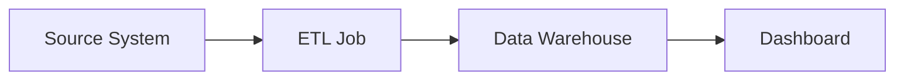

# Data Lineage: From Novice to Expert

A hands-on guide to understanding, implementing, and mastering data lineage, from foundational concepts through production-grade systems, governance, and AI.

---

## About This Guide

This guide is structured as a progressive learning path. It begins with first principles (what data lineage is, why it matters, and the metadata that underpins it) and builds toward expert-level topics like column-level lineage, graph databases, streaming pipelines, regulatory compliance, and lineage in AI/ML systems.

Each chapter is self-contained but builds on prior material. Chapters include explanatory text, architectural diagrams (rendered as Mermaid or ASCII), and references to runnable Python exercises in the [`exercises/`](exercises/) directory.

### Who This Guide Is For

- **Data engineers** who want to instrument pipelines with lineage
- **Analytics engineers** seeking to understand impact analysis and data contracts
- **Platform engineers** building or evaluating lineage infrastructure
- **Governance and compliance professionals** mapping data flows for regulations
- **ML/AI engineers** needing provenance for training data and model outputs
- **Anyone** curious about how data moves through modern systems

### Prerequisites

- Intermediate Python (comfortable with classes, decorators, async)
- Basic SQL knowledge
- Familiarity with at least one data processing tool — [Kedro](https://kedro.org/) is the primary tool used in this book, with additional coverage of Spark, Airflow, and dbt
- [pixi](https://pixi.sh) package manager installed (v0.65 or later)
- Docker installed for exercises requiring Marquez, Neo4j, or Kafka

### How to Use the Exercises

All exercises live in the [`exercises/`](exercises/) directory. See the [exercises README](exercises/README.md) for setup instructions. Each exercise file:

- Is self-contained with a docstring explaining its purpose
- Contains `# TODO:` markers where you write code
- Includes solution hints as comments
- Has a `if __name__ == "__main__":` block for running

---

## Table of Contents

### Part I — Foundations

| Chapter | Title | Description |
|---------|-------|-------------|
| 1 | [What Is Data Lineage?](chapters/01-what-is-data-lineage.md) | Definitions, business value, types of lineage, and real-world analogies |
| 2 | [Metadata Fundamentals](chapters/02-metadata-fundamentals.md) | Technical, business, and operational metadata; standards; relationship to lineage |
| 3 | [Lineage Data Models](chapters/03-lineage-data-models.md) | DAGs, nodes and edges, the OpenLineage data model, entity-relationship patterns |
| 4 | [Your First Lineage Graph](chapters/04-your-first-lineage-graph.md) | Build, visualize, and traverse a lineage graph in pure Python |

### Part II — Open-Source Lineage Tooling

| Chapter | Title | Description |
|---------|-------|-------------|
| 5 | [The OpenLineage Standard](chapters/05-openlineage-standard.md) | Spec deep-dive: RunEvent, Job, Dataset, facets, transports, ecosystem |
| 6 | [SQL Lineage Parsing](chapters/06-sql-lineage-parsing.md) | Extracting lineage from SQL with `sqllineage`, handling CTEs and subqueries |
| 7 | [Kedro Lineage](chapters/07-kedro-lineage.md) | Kedro Data Catalog, pipeline nodes, Kedro-Viz, OpenLineage integration |
| 8 | [Apache Airflow & Marquez](chapters/08-airflow-and-marquez.md) | Airflow's lineage model, OpenLineage integration, Marquez as a lineage server |
| 9 | [Apache Spark Lineage](chapters/09-spark-lineage.md) | Spark query plans as lineage, PySpark + OpenLineage integration |
| 10 | [dbt Lineage](chapters/10-dbt-lineage.md) | manifest.json, catalog.json, sources/models/exposures, OpenLineage dbt integration |

### Part III — Advanced Lineage Techniques

| Chapter | Title | Description |
|---------|-------|-------------|
| 11 | [Column-Level Lineage Deep Dive](chapters/11-column-level-lineage.md) | Why table-level is insufficient, static analysis, runtime instrumentation, tooling |
| 12 | [Graph Databases for Lineage](chapters/12-graph-databases-lineage.md) | Neo4j, Cypher, property graph modeling, cloud graph options |
| 13 | [Building a Lineage API with FastAPI](chapters/13-lineage-api-fastapi.md) | REST API design for lineage queries, traversal, pagination, caching |

### Part IV — Governance, Compliance & Quality

| Chapter | Title | Description |
|---------|-------|-------------|
| 14 | [Data Quality and Lineage](chapters/14-data-quality-lineage.md) | Quality propagation, Great Expectations integration, data contracts, SLA tracking |
| 15 | [Data Observability](chapters/15-data-observability.md) | Freshness, volume, schema drift, anomaly detection, blast-radius alerting |
| 16 | [Streaming & Real-Time Lineage](chapters/16-streaming-lineage.md) | Kafka, Flink, Spark Structured Streaming, OpenLineage streaming facets |
| 17 | [Compliance, Governance & Privacy](chapters/17-compliance-governance-privacy.md) | GDPR, CCPA, SOX, HIPAA: lineage for audit trails and PII tracking |
| 18 | [Data Mesh & Federated Lineage](chapters/18-data-mesh-federated-lineage.md) | Domain-oriented ownership, federated governance, cross-domain lineage |

### Part V — AI & Data Lineage

| Chapter | Title | Description |
|---------|-------|-------------|
| 19 | [ML & MLOps Lineage](chapters/19-ml-lineage.md) | Training data provenance, feature stores, experiment tracking, model cards |
| 20 | [GenAI & LLM Lineage](chapters/20-genai-llm-lineage.md) | RAG pipeline lineage, prompt tracing, fine-tuning provenance, emerging standards |

### Part VI — Putting It All Together

| Chapter | Title | Description |
|---------|-------|-------------|
| 21 | [Lineage at Scale](chapters/21-lineage-at-scale.md) | Performance, incremental lineage, organizational adoption, maturity model |
| 22 | [Capstone Project: Building a Complete Lineage Platform](chapters/22-capstone-project.md) | Build a complete mini lineage platform end-to-end |

---

## Quick Reference: Tools & Libraries Covered

| Tool / Library | Chapters | Purpose |
|---------------|----------|---------|
| [Kedro](https://kedro.org/) | 7 | Python data pipeline framework with built-in lineage |
| [OpenLineage](https://openlineage.io/) | 5, 7, 8, 9, 10, 16, 19 | Open standard for lineage event collection |
| [Marquez](https://marquezproject.ai/) | 8 | Open-source lineage metadata server |
| [SQLLineage](https://github.com/reata/sqllineage) | 6, 11 | SQL parsing for table and column lineage |
| [Apache Airflow](https://airflow.apache.org/) | 8 | Workflow orchestration with lineage integration |
| [Apache Spark / PySpark](https://spark.apache.org/) | 9, 16 | Distributed data processing with lineage capture |
| [dbt](https://www.getdbt.com/) | 10 | Analytics engineering with built-in lineage graphs |
| [Great Expectations](https://greatexpectations.io/) | 14 | Data quality validation with lineage awareness |
| [Neo4j](https://neo4j.com/) | 12 | Graph database for lineage storage and querying |
| [NetworkX](https://networkx.org/) | 4, 7, 13 | Python graph library for building lineage models |
| [MLflow](https://mlflow.org/) | 19 | ML experiment tracking and model registry |
| [FastAPI](https://fastapi.tiangolo.com/) | 13 | Building lineage query APIs |

---

## Conventions Used in This Guide

Throughout this guide, you will encounter the following conventions:

- **Bold text** introduces new terms or important concepts
- `Monospace text` refers to code, commands, file names, or configuration keys
- Code blocks with a language identifier are meant to be runnable:

```python
# This is a runnable example
print("Hello, lineage!")
```

- Mermaid diagrams illustrate data flows and architectures:



- Callout boxes highlight important information:

> **Note**: Notes provide additional context or tips.

> **Warning**: Warnings highlight common pitfalls or destructive operations.

> **Exercise**: Exercise callouts point you to the corresponding Python file in `exercises/`.

---

## License

**Book content** (all `.md` files) is licensed under the [Creative Commons Attribution 4.0 International License (CC BY 4.0)](https://creativecommons.org/licenses/by/4.0/). See [LICENSE](LICENSE) for the full legal text.

**Exercise code** (all files under `exercises/`) is licensed under the [MIT License](LICENSE-CODE).

You are free to share and adapt this material for any purpose, including commercially, as long as you give appropriate credit.

---

*Ready to begin? Start with [Chapter 1: What Is Data Lineage?](chapters/01-what-is-data-lineage.md)*
